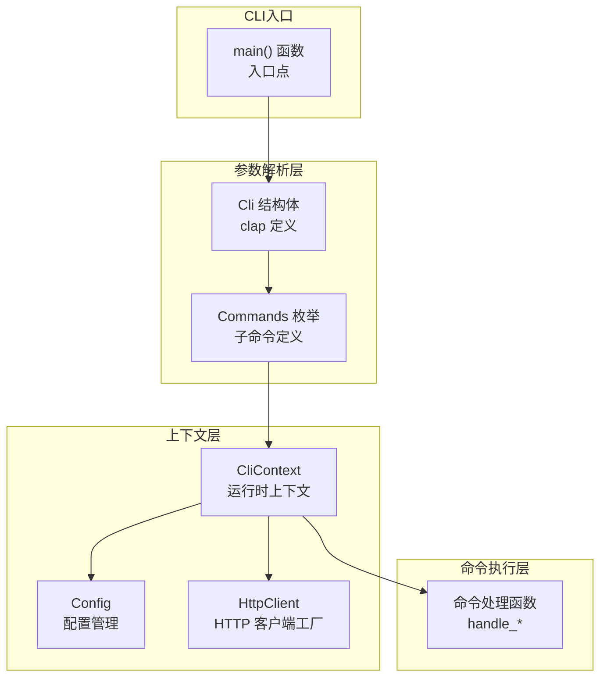

# cli_bootstrap_and_runtime_context 模块技术深度解析

## 概述

`cli_bootstrap_and_runtime_context` 模块是 OpenViking CLI 的**启动入口和运行时上下文管理层**。你可以把它想象成一家餐厅的前台接待处——它负责迎接客人（解析命令行参数）、确认客人身份（加载配置）、然后将客人分配到相应的包间（命令处理器）。

具体来说，这个模块解决了三个核心问题：**如何将用户输入转化为程序行为**、**如何在多个命令之间共享配置和状态**、以及**如何优雅地处理启动失败**。没有这个模块，CLI 将是一盘散沙，每个命令都需要重复处理配置加载、HTTP 客户端初始化等样板代码。

## 架构概览



从图中可以看到数据流：**main()** 首先调用 **Cli::parse()** 解析命令行参数，生成 **Commands** 枚举；然后创建 **CliContext**，其中包含已加载的 **Config** 和用于创建 **HttpClient** 的参数；最后将上下文传递给相应的命令处理函数。

## 核心组件

### Cli 结构体 —— 命令行参数的声明式定义

`Cli` 结构体使用 `clap` 库的 `#[derive(Parser)]` 宏来定义整个 CLI 的接口。这是一种**声明式**的配置方式——你只需描述"参数应该是什么样"，clap 自动为你生成了解析逻辑。

```rust
#[derive(Parser)]
#[command(name = "openviking")]
#[command(about = "OpenViking - An Agent-native context database")]
struct Cli {
    /// Output format
    #[arg(short, long, value_enum, default_value = "table", global = true)]
    output: OutputFormat,

    /// Compact representation
    #[arg(short, long, global = true, default_value = "true")]
    compact: bool,

    #[command(subcommand)]
    command: Commands,
}
```

这里有一个设计亮点：**global = true** 意味着 `--output` 和 `--compact` 这两个参数可以出现在主命令位置，也可以出现在任何子命令位置（如 `ov ls --output json` 或 `ov --output json ls`）。这是一个很实用的用户体验优化，允许用户设置全局偏好而不必每次都重复指定。

### Commands 枚举 —— 命令的层次结构

`Commands` 枚举定义了所有可用的子命令。值得注意的是，这个枚举采用了**嵌套结构**——某些命令本身又是子命令的容器：

```rust
enum Commands {
    System { action: SystemCommands },
    Observer { action: ObserverCommands },
    Session { action: SessionCommands },
    Admin { action: AdminCommands },
    // ... 其他扁平命令
}
```

这种设计被称为**命令树模式**。它的好处是将相关命令组织在一起（所有系统相关命令都在 `SystemCommands` 下，所有会话相关命令都在 `SessionCommands` 下），同时保持了命令行接口的简洁性。用户输入 `ov system status` 或 `ov session list`，语义清晰明了。

### CliContext —— 运行时共享状态

`CliContext` 是贯穿整个命令执行周期的共享上下文：

```rust
#[derive(Debug, Clone)]
pub struct CliContext {
    pub config: Config,
    pub output_format: OutputFormat,
    pub compact: bool,
}
```

为什么选择这三个字段？

- **config**: 包含服务器 URL、API 密钥、超时设置等连接参数——每个命令都需要知道如何与服务器通信
- **output_format**: 决定输出是表格还是 JSON——每个命令都需要知道如何格式化结果
- **compact**: 控制输出的"紧凑程度"——这影响表格列的筛选和 JSON 的格式

这里有一个重要的设计决策：**CliContext 是可 clone 的**。这意味着命令处理函数可以按值获取上下文，而不必担心生命周期问题。同时，由于 `Config` 本身也被设计为 Cloneable，复制上下文的成本很低。

### Config —— 配置管理

`Config` 结构体采用了**约定优于配置**的设计原则：

```rust
impl Config {
    pub fn load_default() -> Result<Self> {
        let config_path = default_config_path()?;  // ~/.openviking/ovcli.conf
        if config_path.exists() {
            Self::from_file(&config_path.to_string_lossy())
        } else {
            Ok(Self::default())  // 使用内建默认值
        }
    }
}
```

这种设计有三重含义：首先，默认配置被硬编码在代码中（URL 是 `http://localhost:1933`，超时是 60 秒），这意味着即使用户没有任何配置文件，CLI 也能正常工作；其次，配置文件是可选的，不是强制的；第三，配置文件路径遵循平台约定（POSIX 系统用 `~/.openviking/ovcli.conf`，Windows 会走不同的路径）。

配置管理的另一个细节是**零依赖**：Config 使用 `serde` 进行序列化，不依赖任何外部配置文件格式库。这使得配置既可以是 JSON，也可以轻松扩展为 YAML 或 TOML（只要实现对应的 serde 反序列化）。

## 数据流分析

让我们追踪一个典型的命令执行流程：`ov find "query" -n 5`

### 第一阶段：参数解析

```rust
let cli = Cli::parse();
```

这一行代码完成了大量工作：
1. 读取 `argv`
2. 识别子命令 `find`
3. 提取位置参数 `"query"` 和 `-n 5`
4. 查找全局参数（可能在命令前或命令后）
5. 验证参数类型和约束
6. 生成结构化的 `Cli` 实例

如果用户输入非法参数（如 `ov find` 不带查询字符串），clap 会自动显示帮助信息并以错误码退出——无需手动编写参数验证代码。

### 第二阶段：上下文初始化

```rust
let ctx = match CliContext::new(output_format, compact) {
    Ok(ctx) => ctx,
    Err(e) => {
        eprintln!("Error: {}", e);
        std::process::exit(2);  // 配置错误使用专用退出码
    }
};
```

注意这里有一个**细心的错误处理**：配置加载失败会导致程序以退出码 2 终止，而不是通用的 1。这为脚本调用提供了更精确的错误区分能力。

`CliContext::new()` 内部调用 `Config::load()`，这可能会触发文件系统操作。如果配置文件损坏或权限不足，错误会沿着调用链向上传播，最终打印友好的错误信息而非 Rust 的 panic。

### 第三阶段：命令分发

```rust
match cli.command {
    Commands::Find { query, uri, limit, threshold } => {
        handle_find(query, uri, limit, threshold, ctx).await
    }
    // ... 其他命令
}
```

这是一个典型的**模式匹配分发**。每个命令变体（variant）都包含其特定的参数，这些参数被解构并传递给对应的处理函数。这种设计的优势在于：编译器会确保你处理了所有可能的命令；如果将来添加新命令，编译器会提醒你补充分支。

### 第四阶段：HTTP 调用

在命令处理函数内部：

```rust
let client = ctx.get_client();
let response: serde_json::Value = client.get("/api/v1/search/find", &[]).await?;
```

注意到 `HttpClient` 是**按需创建**的，而不是在 `CliContext` 创建时就创建好。这是一种**延迟初始化**策略：不是每个命令都需要网络调用（如 `ov config show` 只读本地文件），所以无需每次都建立连接。

### 第五阶段：输出格式化

```rust
output_success(&response, ctx.output_format, ctx.compact);
```

所有命令都通过统一的输出函数返回结果，这保证了**一致的输出体验**。无论你是执行 `ov ls`、`ov find` 还是 `ov status`，输出格式都由 `output_format` 和 `compact` 这两个全局参数控制。

## 设计决策与权衡

### 1. 同步配置加载 vs 异步配置加载

当前实现中，`Config::load()` 是同步的。这意味着 CLI 启动时会阻塞等待文件系统操作完成。

**为什么这样做？**
- 简单：同步代码比异步更容易推理和调试
- 快速：配置文件通常很小，读取是毫秒级操作
- 一次性：配置只在启动时加载一次，不需要异步的收益

**潜在问题：**
- 如果配置存储在网络文件系统（如 NFS）上，可能会导致启动延迟
- 未来如果需要动态重载配置，同步代码需要改写

这是一个典型的**简单性优先**决策——先实现最简单的方案，只有当需求逼过来时才考虑复杂化。

### 2. 集中式上下文 vs 依赖注入

`CliContext` 是一种**集中式**的状态管理方式。所有命令都接收同一个上下文对象，并在其中查找所需的服务。

**替代方案：依赖注入（DI）**
- 为每个命令实现一个 trait
- 在 main 中构造具体的依赖图
- 将依赖"注入"到命令中

**为什么选择集中式？**
- 代码量少：不需要定义 trait，不需要构造复杂的依赖图
- 解耦适度：虽然集中，但 Config、HttpClient、OutputFormat 是不同的关注点
- 易于测试：可以轻松创建测试用的 Config 或 mock HttpClient

**权衡点：**
- 随着功能增长，Context 可能变得臃肿（当前只有 3 个字段，暂时没问题）
- 命令之间的状态隔离不明显——如果一个命令修改了 context 的字段，可能影响后续命令

### 3. 错误处理策略

CLI 使用了**分层错误处理**：

```rust
// 底层错误类型
pub enum Error {
    Config(String),
    Network(String),
    Api(String),
    // ...
}

// CLI 专用错误（带退出码）
pub struct CliError {
    pub message: String,
    pub code: String,
    pub exit_code: i32,
}
```

这种分离的好处是：
- `Error` 枚举描述"出了什么错"
- `CliError` 描述"如何向用户报告这个错"

退出码的设计也很精细：
- 0：成功
- 1：一般错误
- 2：配置错误
- 3：网络连接错误

这样，脚本调用者可以根据退出码精确判断失败原因。

### 4. 命令模式的选择：枚举分发 vs 动态注册

当前使用**枚举 + 模式匹配**分发命令，这是 Rust 中最常用的方式。

**枚举分发的优势：**
- 编译时检查所有分支
- 性能好（静态分发，无运行时查找）
- 重构友好（rename 变体会触发编译器错误）

**动态注册的优势：**
- 支持插件式扩展
- 可以在运行时加载新命令
- 代码分割更自然

当前场景下，OpenViking CLI 的命令集相对稳定，不需要动态扩展能力，所以静态分发是合适的选择。

## 依赖关系分析

### 上游依赖

这个模块依赖于：

| 依赖 | 用途 | 关键设计点 |
|------|------|-----------|
| `clap` | CLI 参数解析 | 声明式宏，零运行时开销 |
| `serde` | 配置序列化 | 零拷贝反序列化支持 |
| `reqwest` | HTTP 客户端 | 异步 Runtime 集成 |
| `tokio` | 异步运行时 | 单线程、多线程皆可配置 |
| `dirs` | 路径解析 | 跨平台 home 目录获取 |

### 下游消费者

模块的输出（主要是 `CliContext`）被以下模块消费：

- **[cli_command_structure](rust_cli_interface-cli_bootstrap_and_runtime_context-cli_command_structure.md)**：`Commands` 枚举定义在此模块中，定义了所有可用命令
- **[cli_runtime_context](rust_cli_interface-cli_bootstrap_and_runtime_context-cli_runtime_context.md)**：`CliContext` 的具体实现和扩展
- **[cli_configuration_management](rust_cli_interface-cli_bootstrap_and_runtime_context-cli_configuration_management.md)**：`Config` 的加载、验证和持久化逻辑
- **http_api_and_tabular_output**：`HttpClient` 和 `OutputFormat` 的实现在那里定义

### 数据契约

CLI 与后端服务器之间的接口是**约定式**的：

```rust
// 客户端侧
client.get("/api/v1/system/status", &[]).await?;

// 服务器侧（假设）
GET /api/v1/system/status -> { "components": {...}, "is_healthy": true }
```

这意味着 CLI **隐式依赖**服务器端点的存在和响应格式。如果服务器端改变了 API，CLI 会失败。这种紧耦合在内部工具中是可以接受的，但如果 CLI 要面向更广泛的用户，可能需要考虑版本协商或更健壮的错误处理。

## 扩展点与自定义

### 添加新命令

添加新命令需要修改三个地方：

1. **Commands 枚举** —— 定义命令名称和参数
2. **命令处理函数** —— 实现业务逻辑
3. **main 中的分发match** —— 连接前两者

例如，添加一个 `ov stats` 命令：

```rust
// 1. 在 Commands 枚举中添加
enum Commands {
    // ... existing
    Stats {
        /// Time range to analyze
        #[arg(long, default_value = "24h")]
        range: String,
    },
}

// 2. 实现处理函数
async fn handle_stats(range: String, ctx: CliContext) -> Result<()> {
    let client = ctx.get_client();
    let response: serde_json::Value = client
        .get(&format!("/api/v1/stats?range={}", range), &[])
        .await?;
    output_success(&response, ctx.output_format, ctx.compact);
    Ok(())
}

// 3. 在 main 分发中添加
Commands::Stats { range } => handle_stats(range, ctx).await,
```

### 添加新配置项

在 `Config` 结构体中添加字段，然后更新默认值函数：

```rust
#[derive(Debug, Clone, Serialize, Deserialize)]
pub struct Config {
    // ... existing
    pub retry_count: u32,  // 新增字段
}

fn default_retry_count() -> u32 { 3 }  // 新增默认值
```

配置会自动持久化为 JSON（如果用户调用 `config show`），新字段会获得默认值。

### 自定义输出格式

如果需要添加新的输出格式（如 XML、YAML），修改 `OutputFormat` 枚举并更新 `output_success` 函数：

```rust
pub enum OutputFormat {
    Table,
    Json,
    Yaml,  // 新增
}
```

## 边缘情况与陷阱

### 1. 路径中的空格

这是一个经典的 CLI 陷阱：

```bash
$ ov add-resource My Documents
# 会被解析为两个参数：path="My", to="Documents"
```

代码中有处理这个问题：

```rust
// handle_add_resource 中
let unescaped_path = path.replace("\\ ", " ");
```

用户应该用引号包裹路径：`ov add-resource "My Documents"`。但更好的 UX 是检测空格并给出友好的提示——代码已经实现了这个优化！

### 2. 配置文件的权限

如果用户手动创建了配置文件但权限设置不当（如 600），`Config::from_file` 会失败。错误信息是：

```
Error: Config(Failed to read config file: Permission denied (os error 13))
```

这个错误来自标准库，比较技术化。对普通用户来说，可能不如"配置文件权限不正确，请运行 chmod 644"友好。

### 3. 全局参数的位置

由于 `global = true`，以下两种写法等价：

```bash
ov --output json find "query"
ov find --output json "query"
```

但如果用户写：

```bash
ov find "query" --output json
```

clap 也能正确处理（因为支持乱序参数）。这种灵活性是好的，但也可能让脚本解析变得复杂。

### 4. 紧凑模式的隐式行为

`compact` 参数影响多个方面：

- Table 输出：过滤掉空列
- JSON 输出：使用单行格式 vs 格式化

这种"一个参数，多种效果"的设计虽然简洁，但也意味着用户不能独立控制每个维度的紧凑程度。将来如果需要更细粒度的控制，可能需要拆分这个参数。

### 5. 异步入口的选择

`main` 函数标注了 `#[tokio::main]`：

```rust
#[tokio::main]
async fn main() { ... }
```

这意味着整个 CLI 运行在 tokio 运行时之上。对于纯同步的 `Config::load()` 调用，这引入了不必要的运行时开销。但由于所有命令处理函数都是 `async` 的，这个设计保证了代码风格的一致性。

## 参考资料

- [cli_command_structure](cli_bootstrap_and_runtime_context-cli_command_structure.md) - 命令结构定义详解
- [cli_runtime_context](cli_bootstrap_and_runtime_context-cli_runtime_context.md) - 运行时上下文深度分析
- [cli_configuration_management](cli_bootstrap_and_runtime_context-cli_configuration_management.md) - 配置管理设计
- [http_api_and_tabular_output](http_api_and_tabular_output.md) - HTTP 客户端和输出格式化模块详解