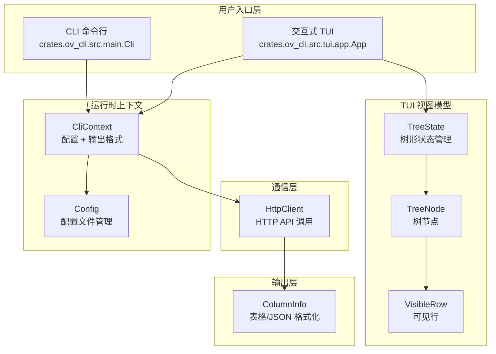

# rust_cli_interface — OpenViking Rust CLI 客户端

> **一句话概括**：这是 OpenViking 系统的命令行客户端（CLI）和交互式文本用户界面（TUI），为开发者提供了一个可直接操作 OpenViking 上下文数据库的终端入口。无论是自动化脚本还是交互式浏览，都通过这个模块与后端服务进行通信。

## 模块定位与问题空间

### 解决什么问题？

OpenViking 作为一个"面向 Agent 的上下文数据库"，需要一种方式让人类用户和自动化工具能够：

1. **管理资源** — 上传、删除、移动文件；导入/导出上下文包（.ovpack）
2. **查询数据** — 语义搜索、grep、glob 模式匹配、目录列表
3. **关系管理** — 建立资源之间的关联链接
4. **会话管理** — 创建会话、添加消息、提交以提取记忆
5. **交互式浏览** — 可视化探索 viking:// 路径空间中的资源层级

传统的 API 调用方式不够友好，而一个完善的 CLI 加上可选的 TUI 则能同时满足**脚本自动化**和**人机交互**两种需求。

### 为什么用 Rust 实现？

选择 Rust 有几个关键原因：

- **二进制分发简便** — 无需 Python 环境即可运行，适合部署到各类服务器
- **性能** — HTTP 客户端和数据处理速度快，启动时间短
- **类型安全** — 与 OpenViking 服务端（FastAPI）交互时，编译期检查能捕获大部分契约不匹配问题

## 架构概览



### 数据流动

当用户执行一条命令时（例如 `ov ls viking://resources`）：

1. **解析** — `Cli` 使用 `clap` 解析命令行参数
2. **初始化上下文** — `CliContext` 加载配置文件，创建 `HttpClient`
3. **发送请求** — `HttpClient` 构造 HTTP 请求（GET/POST/PUT/DELETE）发送到后端 API
4. **处理响应** — 后端返回 JSON，HttpClient 进行反序列化
5. **格式化输出** — `ColumnInfo` 相关的输出函数将 JSON 转换为表格或 JSON 字符串
6. **显示** — 结果打印到终端

对于 TUI 模式，流程类似，但增加了交互循环：
- 用户按键 → `App` 处理事件 → 更新 `TreeState` → 重新渲染 → 等待下一个输入

## 核心设计决策

### 1. 为什么用 clap 而非手动解析？

代码使用了 `clap` 库（带 `derive` 特性）来定义命令结构。这比手写 `Vec<String>` 解析有显著优势：

- **自动生成帮助信息** — `ov --help` 即时可用
- **子命令支持** — `ov add-resource`, `ov search`, `ov session new` 等层次结构自然表达
- **类型检查** — `bool`, `i32`, `Option<T>` 自动转换
- **默认值** — `default_value` 属性减少用户的冗余输入

> ** tradeoff**：依赖 clap 增加了编译时间和二进制体积，但换取的开发效率和用户体验提升是值得的。CLI 工具的定位使得这些成本可接受。

### 2. 输出格式的双重支持：Table vs JSON

`OutputFormat` 枚举只有两种变体：`Table` 和 `Json`。这种极简设计背后有考量：

- **Table** — 面向人类用户，优化了列对齐、URI 截断、布尔值呈现
- **Json** — 面向脚本和自动化，便于解析

关键的设计细节在 `output.rs` 中：

```rust
// 列宽分析：URI 列不截断，数字列右对齐
struct ColumnInfo {
    max_width: usize,
    is_numeric: bool,
    is_uri_column: bool,  // 关键：URI 列特殊处理
}
```

这种设计避免了"万能格式"导致的复杂性——既想要人类友好，又想要机器可解析，结果往往是两边都不讨好。

### 3. TUI 采用延迟加载策略

`TreeState` 在展开目录时才去获取子节点：

```rust
pub async fn toggle_expand(&mut self, client: &HttpClient) {
    // 仅在展开未加载的节点时才请求 API
    if !node.children_loaded {
        node.children = Self::fetch_children(client, &node.entry.uri).await?;
        node.children_loaded = true;
    }
}
```

这样设计的好处：
- **减少网络开销** — 用户可能只浏览根目录，无需加载全部深层数据
- **更快启动** — 初始数据量小，界面响应迅速
- **内存友好** — 大型目录树不会一次性载入内存

> **潜在问题**：如果网络不稳定，展开操作可能失败。代码中只是静默将 `children_loaded` 设为 `true`（即使加载失败），这意味着用户可能看到空目录而不知原因。这是一个可改进之处。

### 4. 配置管理的"默认优先"原则

`Config` 结构体使用默认值模式：

```rust
fn default_url() -> String {
    "http://localhost:1933".to_string()
}

impl Default for Config {
    fn default() -> Self {
        Self {
            url: "http://localhost:1933".to_string(),
            api_key: None,
            agent_id: None,
            timeout: 60.0,
            output: "table".to_string(),
            echo_command: true,
        }
    }
}
```

配置文件路径约定为 `~/.openviking/ovcli.conf`。如果文件不存在，就用内置默认值。这种"渐进式配置"降低了使用门槛——用户无需任何配置即可连接到本地服务。

### 5. 大目录上传的特殊处理

`HttpClient` 对本地目录上传做了特殊优化：

```rust
// 检测是否是本地目录且非本地服务器
if path_obj.exists() && path_obj.is_dir() && !self.is_local_server() {
    // 1. 压缩目录为临时 ZIP 文件
    let zip_file = self.zip_directory(path_obj)?;
    // 2. 上传到服务器获取 temp_path
    let temp_path = self.upload_temp_file(zip_file.path()).await?;
    // 3. 用 temp_path 发起资源添加请求
}
```

这样处理的原因：
- **避免大请求体** — 直接 POST 整个目录内容可能超出 HTTP 限制
- **支持断点续传** — 服务器可以单独处理 temp_path 指向的临时文件
- **本地服务器跳过** — 如果服务器就在本地（localhost/127.0.0.1），直接传路径更高效

## 子模块概览

| 子模块 | 核心组件 | 职责 |
|--------|----------|------|
| **cli_bootstrap_and_runtime_context** | `Cli`, `CliContext`, `Config` | 命令行参数解析、运行时上下文初始化、配置管理 |
| **http_api_and_tabular_output** | `HttpClient`, `ColumnInfo` | HTTP 通信、响应格式化、输出控制 |
| **tui_application_orchestration** | `App` | 交互式 TUI 的主循环、焦点管理、内容加载 |
| **tui_tree_navigation_and_view_model** | `TreeState`, `TreeNode`, `VisibleRow`, `FsEntry` | 树形视图的状态管理、懒加载、可见行计算 |

详细文档请参阅各子模块页面：

- [cli_bootstrap_and_runtime_context](rust_cli_interface-cli_bootstrap_and_runtime_context.md) — 命令行启动、参数解析、运行时上下文、配置管理
- [http_api_and_tabular_output](http_api_and_tabular_output.md) — HTTP 客户端实现、响应格式化
- [tui_application_orchestration](tui_application_orchestration.md) — 交互式 TUI 主循环
- [tui_tree_navigation_and_view_model](tui_tree_navigation_and_view_model.md) — 树形视图状态管理

## 与其他模块的关系

### 上游依赖

这个模块**不依赖** OpenViking 的 Python 核心库（`openviking.*`），它是一个**独立的 Rust 二进制**。这意味着：

- 部署时无需 Python 环境
- 故障域隔离 — CLI 问题不会影响核心服务

### 下游交互

CLI 通过 HTTP API 与 OpenViking 后端交互。API 路由定义在 `server_api_contracts` 模块中，主要包括：

- `/api/v1/fs/*` — 文件系统操作（ls, tree, mkdir, rm, mv, stat）
- `/api/v1/search/*` — 搜索操作（find, search, grep, glob）
- `/api/v1/resources` — 资源管理
- `/api/v1/relations` — 关系管理
- `/api/v1/sessions` — 会话管理
- `/api/v1/observer/*` — 系统监控
- `/api/v1/admin/*` — 多租户管理

详细 API 契约请参阅 [server_api_contracts](server_api_contracts.md)。

### 类似的 Python 实现

项目中还存在一个 Python 实现：`python_client_and_cli_utils` 模块提供了类似的客户端功能。如果你的工作流程基于 Python，这个模块可能更合适。两者功能大致对等，但：

- **Rust 版本**：单二进制、分发简便
- **Python 版本**：更易扩展、可直接导入核心库的数据结构

## 给新贡献者的提示

### 常见陷阱

1. **路径空格问题** — CLI 会检测带空格的路径并给出友好提示：
   ```rust
   // 用户可能输入: ov add-resource My Documents
   // CLI 会提示: 建议使用引号: ov add-resource "My Documents"
   ```

2. **本地服务器检测** — 上传目录时，代码会检查 base_url 是否为 localhost/127.0.0.1，如果是则跳过压缩上传。这可能导致行为不一致（本地快，生产慢），需要注意。

3. **输出格式与 compact 模式** — `--output json --compact` 组合时会输出 `{ok: true, result: ...}` 包装格式，而非原始 JSON。这是为了脚本解析方便，但可能与某些期望不符。

4. **TUI 根作用域处理** — 当浏览 `viking://` 根路径时，会显示预定义的四个作用域（agent, resources, session, user），而不是真正去 API 请求。这是为了让用户快速看到顶层结构。

### 扩展点

如果你需要添加新命令：

1. 在 `main.rs` 的 `Commands` 枚举中添加变体
2. 实现对应的 handler 函数
3. 在 `main()` 的 match 分支中调用 handler
4. Handler 函数接收 `CliContext`，可获取 `client` 和 `output_format`

示例结构：
```rust
Commands::MyCommand { arg1, arg2 } => {
    handle_my_command(arg1, arg2, ctx).await
}
```

### 测试建议

- 单元测试主要在 `output.rs` 中，针对各种 JSON 结构的表格渲染
- 集成测试需要启动 OpenViking 服务端（可使用 mock server）
- TUI 交互测试较难自动化，建议依赖人工回归测试

## 设计哲学总结

这个模块的设计体现了几个核心原则：

1. **正交分解** — 配置、HTTP、输出、TUI 各自独立，便于单独测试和维护
2. **约定优于配置** — 默认值覆盖大多数场景，减少用户心智负担
3. **渐进式复杂度** — CLI 满足基本需求，TUI 提供更丰富的交互
4. **容错性** — 网络错误不会导致崩溃，而是转换为友好的错误消息

理解这些原则，有助于你在扩展功能时保持与现有代码的一致性。