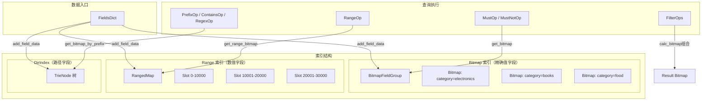
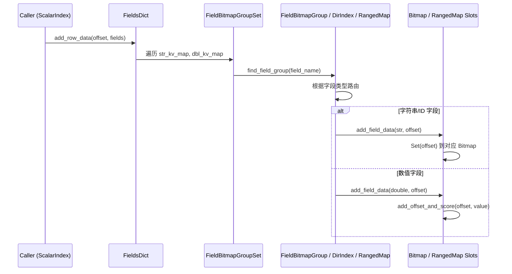
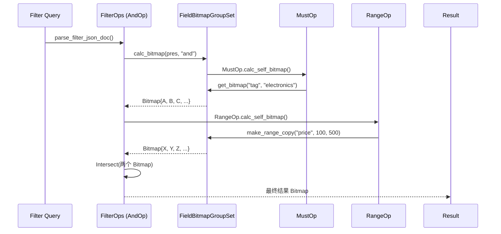

# scalar_bitmap_and_field_dictionary_structures 模块详解

> **阅读提示**：本模块是向量数据库索引引擎的核心组成部分，负责**标量字段（scalar field）的索引与过滤**。如果你刚加入团队并需要修改搜索过滤逻辑、理解数据如何被筛选，或者扩展新的字段类型，这篇文档将帮助你建立完整的上下文。

## 一、问题空间：为什么需要这个模块？

### 1.1 向量搜索的"二次过滤"难题

当你使用向量数据库进行相似性搜索时，通常的流程是：
1. **向量检索**：ANN 算法找到 Top-K 个最相似的向量
2. **标量过滤**：根据业务规则（如"category=electronics AND price < 1000"）进一步筛选结果

问题来了：如果第一步返回了 10000 个候选结果，而过滤后只剩下 10 个，这意味着 **99.9% 的计算被浪费了**。理想的方案是**在检索阶段就利用索引跳过不满足条件的候选集**，而不是事后过滤。

### 1.2 本模块的使命

`scalar_bitmap_and_field_dictionary_structures` 模块提供了一套**以位图（Bitmap）为核心的索引数据结构**，能够在向量检索之前完成高效的条件过滤。其核心价值：

| 需求 | 传统方案 | 本模块方案 |
|------|----------|------------|
| 精确匹配过滤 | 逐条遍历 O(n) | 位图交集 O(∩) |
| 数值范围查询 | 逐条比较 | Slot 分桶 + 位图裁剪 |
| 路径前缀匹配 | 字符串遍历 | Trie 树路径合并 |
| 多条件组合 | 嵌套循环 | 位图 AND/OR/Xor 操作 |

### 1.3 核心抽象：把"满足条件的行号集合"当成位图

把每一个字段的每一个取值，都想象成**一盏灯**——如果第 N 行记录满足这个取值，灯就亮（bit=1），否则灭（bit=0）。这样：
- 一个字段的**所有取值** → 一组位图（倒排索引）
- 一个范围查询 → 从多个位图中组合出结果
- 多个条件的组合 → 位图的 AND/OR 运算

这正是信息检索领域经典的**倒排索引**模式在本系统的落地。

## 二、架构概览



### 2.1 核心组件职责

| 组件 | 文件 | 职责 |
|------|------|------|
| **FieldsDict** | `fields_dict.h` | 存储单条记录的字段元数据（字符串键值对 + 数值键值对），负责 JSON 解析 |
| **Bitmap** | `bitmap.h` / `bitmap.cpp` | 基于 Roaring Bitmap 的位图实现，支持 Union/Intersect/Exclude/Xor 操作 |
| **RangedMap** | `ranged_map.h` | 数值型字段的范围索引，按值域分桶，每个桶维护位图 + 排序向量 |
| **SlotMeta** | `ranged_map.h` | RangedMap 的桶元数据，包含值域范围 [left, right]、位图和排序数组 |
| **DirIndex** | `dir_index.h` | 路径字段的前缀索引，基于 Trie 树，支持路径前缀/正则匹配 |
| **FieldBitmapGroup** | `bitmap_field_group.h` | 单个字段的位图组合容器，封装 add/delete/query 逻辑 |
| **FieldBitmapGroupSet** | `bitmap_field_group.h` | 所有字段的位图集合，提供跨字段的组合过滤能力 |

## 三、关键设计决策分析

### 3.1 为什么选择 Roaring Bitmap？

**替代方案考察**：
- `std::vector<bool>`：位操作简单但无法高效执行集合运算
- `std::unordered_set<uint32_t>`：单点查询 O(1)，但集合运算需遍历
- `std::bitset<N>`：固定大小，不适合动态数据集
- `EWAHBoolBitmap`：压缩位图的一种，但不如 Roaring 对稀疏/密集场景自适应

**本模块的选择**：使用 [Roaring Bitmap](https://roaringbitmap.org/)，它在以下方面取得平衡：
- **稀疏数据**（大多数位为 0）：使用 `std::set` 存储，避免位图开销
- **密集数据**：自动切换到 Roaring 格式，位图压缩 + SIMD 优化
- **集合运算**：原生支持 OR/AND/XOR，且有 lazy or 优化

```cpp
// 见 bitmap.h:75-84，阈值触发自动转换
inline void Set(uint32_t id) {
    if (is_roaring_) {
        roaring_.add(id);  // 直接添加
    } else {
        set_.insert(id);   // 稀疏集合
        if (set_.size() > kSetThreshold) {  // 超过32个元素
            to_roaring();  // 转换为 Roaring
        }
    }
}
```

### 3.2 RangedMap 的分桶策略：为什么是 10000？

```cpp
// ranged_map.h:10
static int kRangedMapSlotSize = 10000;
```

这个数字是**经验值**，反映了一个权衡：
- **桶越小**：查询精确定位快，但桶数量多导致管理开销大
- **桶越大**：查询需要扫描更多数据，但桶数量少

10000 这个值意味着：对于 100 万条记录，只需要约 100 个桶，每次范围查询最多扫描 2 个边界桶 + 若干完整桶。

### 3.3 Trie 树 vs 排序数组：为什么 DirIndex 用 Trie？

对于路径字段（如文件系统路径 `/home/user/docs/readme.md`），常见需求是：
- **前缀匹配**：查询 `/home/user/*` 下的所有文件
- **通配符**：查询 `/home/*/docs/*`
- **精确匹配**：查询完整路径

Trie 树的优势：
- 前缀查询 O(m)，m 为路径深度
- 空间共享公共前缀
- 支持前缀合并位图（`get_merged_bitmap`）

** Trade-off**：如果查询模式主要是精确匹配而非前缀，HashMap 更快。但系统设计时假设路径查询需要前缀匹配场景（如文件树遍历），因此选择了 Trie。

### 3.4 FieldsDict 的双映射设计

```cpp
struct FieldsDict {
    std::unordered_map<std::string, std::string> str_kv_map_;  // 字符串字段
    std::unordered_map<std::string, double> dbl_kv_map_;       // 数值字段
};
```

**设计意图**：避免类型歧义。"123" 可能是字符串也可能解析为数字，因此分开存储而不是统一为 string 再按需转换。

**潜在问题**：这增加了字段注册时的复杂度——你必须提前知道字段类型。不过这是有意的设计，将类型信息从运行时提前到了 schema 定义阶段。

## 四、数据流追踪

### 4.1 数据写入流程



**关键路径**：数据写入时，系统根据 `ScalarIndexMeta` 中定义的字段类型，自动选择走 Bitmap（精确值）还是 RangedMap（数值）。

### 4.2 查询执行流程

以 `filter: {"tag": "electronics", "price": {"gte": 100, "lt": 500}}` 为例：



## 五、子模块详解

本模块包含 3 个核心子模块，它们通过 `bitmap_field_group.h` 整合在一起：

### 5.1 [fields_dict — 字段元数据容器](native-engine-and-python-bindings-scalar_bitmap_and_field_dictionary_structures-fields-dict.md)

负责单条记录的字段存储与 JSON 解析。

- **核心类型**：`FieldsDict` 结构体
- **功能**：解析 JSON → 填充 `str_kv_map_` 和 `dbl_kv_map_`
- **特点**：自动处理 int64 → double 的隐式转换（见 `parse_from_json` 第 47 行）

### 5.2 [dir_index — 路径前缀索引](src-index-detail-scalar-bitmap-holder-dir_index.md)

基于 Trie 树的目录/路径索引。

- **核心类型**：`TrieNode` 结构体、`DirIndex` 类
- **功能**：支持路径前缀匹配、路径深度查询、前缀位图合并
- **特点**：与 BitmapFieldGroup 联动，字符串字段也支持路径模式

### 5.3 [ranged_map — 数值范围索引](native-engine-and-python-bindings-scalar_bitmap_and_field_dictionary_structures-ranged-map.md)

带分桶位图的数值范围索引。

- **核心类型**：`RangedMap` 类、`SlotMeta` 结构体
- **功能**：数值字段的范围查询（`>` `<` `>=` `<=`）、Top-K 排序、带条件过滤
- **特点**：每个 Slot 内部保持 value 排序，支持二分查找定位

## 六、扩展点与注意事项

### 6.1 新增字段类型的扩展路径

如果你需要支持新的字段类型（如布尔字段、JSON 字段），扩展步骤：

1. **ScalarIndexMeta**：在 `scalar_index_meta.h` 添加新的 `field_type`
2. **FieldBitmapGroup**：在 `bitmap_field_group.h` 添加对应的 `add_field_data` 重载
3. **FilterOps**：在 `filter_ops.h` 添加对应的过滤操作类

### 6.2 序列化兼容性

所有核心结构都实现了 `SerializeToStream` / `ParseFromStream` 方法。**注意**：版本演进时需关注字段顺序和类型兼容性。

### 6.3 常见陷阱

| 陷阱 | 描述 | 规避方式 |
|------|------|----------|
| 空字段处理 | `FieldsDict::parse_from_json("")` 返回 1 表示失败 | 调用方需检查返回值 |
| 范围边界 | `get_range_bitmap` 的 include_le / include_ge 语义容易混淆 | 使用命名参数风格，测试覆盖边界 |
| 线程安全 | RangedMap 和 Bitmap 本身**非线程安全** | 上层需加锁或使用 Copy-on-Write |
| 内存放大 | 大量小值域的 RangedMap 会产生大量小 Bitmap | 调整 `kRangedMapSlotSize` 或合并小桶 |

## 七、与相邻模块的关系

| 关系方向 | 模块名 | 说明 |
|----------|--------|------|
| **上游** | `storage_core_and_runtime_primitives` | 提供存储层抽象，本模块的位图会持久化 |
| **上游** | `scalar_index.h` | 调用本模块构建索引，是本模块的直接消费者 |
| **下游** | `vector_recall_and_sparse_ann_primitives` | 向量召回模块，召回前会用本模块的位图过滤候选集 |
| **下游** | `filter_ops.h` | 将 DSL 过滤表达式解析为位图运算，是本模块的主要调用方 |

## 八、总结

本模块通过**位图 + 分桶 + Trie** 三种核心数据结构，为向量数据库提供了高效的**标量过滤能力**。其设计哲学是：

1. **空间换时间**：用额外的索引结构（位图、倒排表）换取查询时的快速跳过
2. **自适应**：Roaring Bitmap 自动在稀疏/密集格式间切换，无需手动调优
3. **可组合**：所有过滤条件最终都归约为位图运算，支持任意复杂的 AND/OR 组合

当你需要优化过滤性能、添加新字段类型、或修改查询逻辑时，记住这个核心心智模型：**把"满足条件的行号集合"当成位图**，一切都会变得清晰。