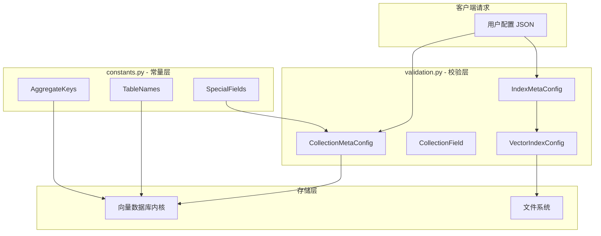
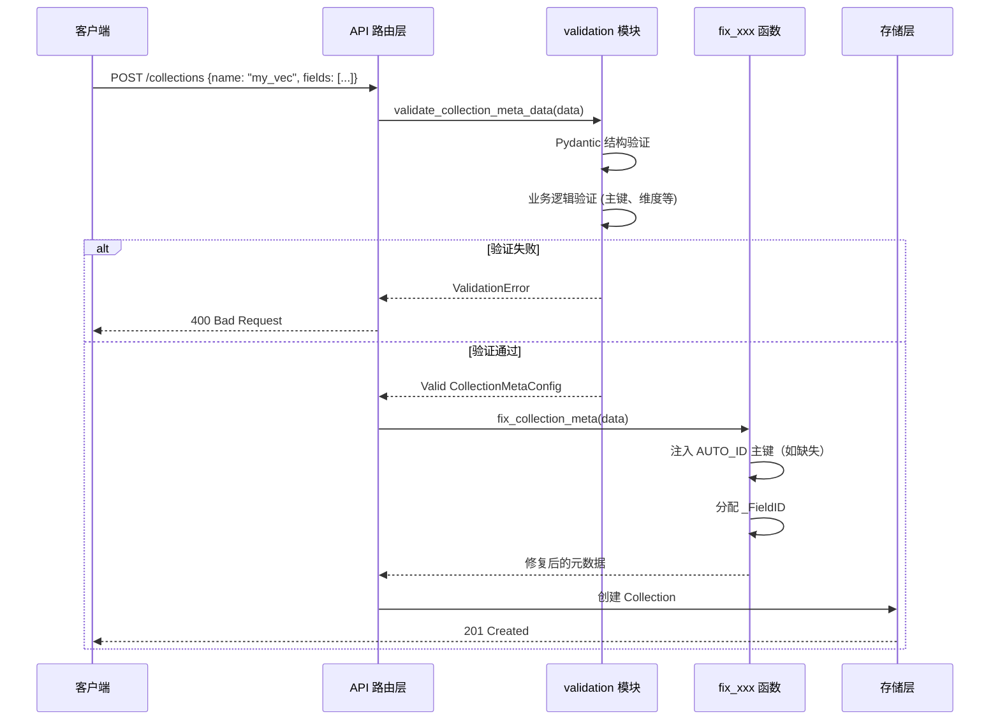
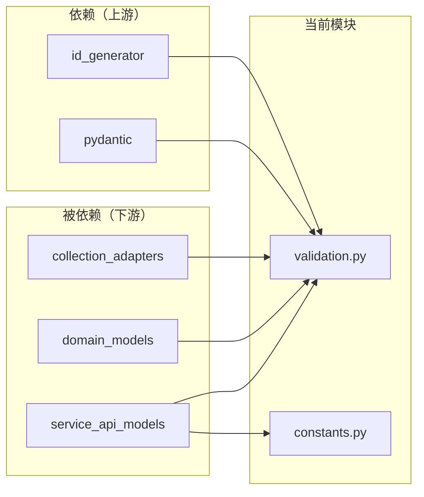

# schema_validation_and_constants 模块

> **模块职责**：作为 VikingVectorIndex 向量数据库的"守门人"，在数据进入存储层之前对所有元数据和数据字段进行结构校验与业务规则验证，并提供全系统共享的常量定义，消除魔法字符串。

## 一、问题空间：为什么需要这个模块？

向量数据库系统面临一个核心挑战：**如何在数据到达底层存储之前，拦截无效配置，防止垃圾数据污染系统？**

想象一个场景：如果用户创建一个 `Collection`（向量集合），但忘记指定主键字段，或者向 `int64` 类型的字段写入了一段文本，或者向量维度（1024）与模型输出的维度（768）不匹配——如果没有验证层，这些错误会在写入磁盘时引发难以追踪的异常，甚至导致数据损坏。

`schema_validation_and_constants` 模块正是为解决这些问题而设计：

1. **配置校验**：确保 `CollectionMetaConfig`、`IndexMetaConfig` 等元数据在创建和更新时符合业务规则
2. **数据校验**：确保写入的字段值类型与定义的字段类型一致
3. **常量统一定义**：将分散在各处的魔法字符串（如表名 `"C"`、`"D"`、字段名 `"AUTO_ID"`）集中管理，降低维护成本和拼写错误风险

## 二、架构概览



### 核心设计理念

**1. 防御式编程（Defense in Depth）**

模块采用多层验证策略：
- **第一层：Pydantic 结构验证** — 检查字段是否存在、类型是否匹配、必填参数是否提供
- **第二层：业务逻辑验证** — 通过 `model_validator` 和 `field_validator` 实现跨字段规则（如"向量字段必须指定 Dim"、"主键类型只能是 int64 或 string"）
- **第三层：修复与默认值注入** — `fix_collection_meta` 和 `fix_fields_data` 在验证通过后自动补充缺失的主键和默认值

**2. 验证即文档（Validation as Documentation）**

每个 Pydantic 模型的字段定义本身就是一个微型规范。例如阅读 `VectorIndexConfig` 即可知道支持的索引类型（`flat`、`flat_hybird`）和距离度量（`l2`、`ip`、`cosine`）。

## 三、核心组件详解

### 3.1 校验模型（validation.py）

#### FieldTypeEnum —— 字段类型的原子枚举

```python
class FieldTypeEnum(str, Enum):
    INT64 = "int64"
    FLOAT32 = "float32"
    STRING = "string"
    BOOL = "bool"
    LIST_STRING = "list<string>"
    LIST_INT64 = "list<int64>"
    VECTOR = "vector"
    SPARSE_VECTOR = "sparse_vector"
    TEXT = "text"
    PATH = "path"
    IMAGE = "image"
    VIDEO = "video"
    DATE_TIME = "date_time"
    GEO_POINT = "geo_point"
```

**设计意图**：类型系统是向量数据库的基石。此枚举覆盖了标量类型（`INT64`、`FLOAT32`）、向量类型（`VECTOR`、`SPARSE_VECTOR`）和多媒体类型（`IMAGE`、`VIDEO`），为后续的多模态检索奠定类型基础。

#### CollectionField —— 字段定义的最小单元

```python
class CollectionField(BaseModel):
    FieldName: str
    FieldType: FieldTypeEnum
    Dim: Optional[int] = Field(None, ge=4, le=4096)
    IsPrimaryKey: Optional[bool] = False
    DefaultValue: Optional[Any] = None
```

**关键验证规则**：
- `Dim` 必须在 4 到 4096 之间，且**必须是 4 的倍数**（底层向量索引库的要求）
- 若 `FieldType` 为 `VECTOR`，则 `Dim` 必填
- 主键字段只能是 `INT64` 或 `STRING` 类型

> **为什么要求维度是 4 的倍数？** 这与底层 SIMD 优化有关。许多向量索引算法（如 FAISS）使用 AVX2/SSE 指令进行批量计算，这些指令操作 128 位（16 字节）或 256 位寄存器，4 字节浮点数的批量处理效率最高。

#### CollectionMetaConfig —— 集合元数据的完整定义

```python
class CollectionMetaConfig(BaseModel):
    CollectionName: str
    Fields: List[CollectionField]
    ProjectName: Optional[str] = None
    Description: Optional[str] = Field(None, max_length=65535)
    Vectorize: Optional[VectorizeConfig] = None
```

**验证逻辑**：
- 字段名不能重复
- **必须有且仅有一个主键字段**（若用户未指定，系统会在 `fix_collection_meta` 中自动注入 `AUTO_ID` 字段）
- 字段名和集合名必须符合命名规范（以字母开头，仅包含字母、数字、下划线，长度 1-128）

#### VectorIndexConfig —— 向量索引配置

```python
class VectorIndexConfig(BaseModel):
    IndexType: Literal["flat", "flat_hybrid", "FLAT", "FLAT_HYBRID"]
    Distance: Optional[Literal["l2", "ip", "cosine", "L2", "IP", "COSINE"]] = None
    Quant: Optional[Literal["int8", "float", "fix16", "pq", ...]] = None
    ...
```

**设计权衡**：
- 支持大小写混合输入（`"flat"` 或 `"FLAT"`），通过 `case_insensitive` 验证器自动规范化，提升用户体验
- 索引类型目前仅支持 `flat` 和 `flat_hybrid`，这是**有意收敛**——系统选择聚焦于这两种经过充分测试的索引类型，而非铺开过多选项增加运维复杂度

### 3.2 常量定义（constants.py）

#### TableNames —— 存储表命名

```python
class TableNames(str, Enum):
    CANDIDATES = "C"    # 候选数据表
    DELTA = "D"         # 增量数据表
    TTL = "T"           # TTL 过期时间表
```

**架构意义**：这些单字母表名不是随意的简写，而是为了**最小化存储开销**。在向量数据库的存储层，表名会写入每一条数据的元数据中，缩短表名可直接减少磁盘空间占用。这是一个经典的**空间换可读性**的权衡。

#### SpecialFields —— 特殊字段名

```python
class SpecialFields(str, Enum):
    AUTO_ID = "AUTO_ID"  # 自动生成的主键字段名
```

此常量用于标记系统自动生成的主键字段名。在 `fix_collection_meta` 中可以看到：

```python
if not has_pk:
    fields.append({
        "FieldName": "AUTO_ID",
        "FieldType": "int64",
        "IsPrimaryKey": True,
    })
```

### 3.3 辅助函数

| 函数 | 作用 | 典型调用场景 |
|------|------|-------------|
| `validate_collection_meta_data` | 验证集合创建请求 | API 入口层 |
| `is_valid_collection_meta_data` | 布尔形式返回验证结果 | 需要快速判断而不抛异常的场 |
| `fix_collection_meta` | 自动修复缺失的主键 | 验证通过后、写入前 |
| `validate_fields_data` | 验证数据写入请求 | 数据写入前 |
| `fix_fields_data` | 为缺失字段填充默认值 | 数据修复 |

## 四、数据流：从请求到存储的完整路径

以创建一个 Collection 为例：



关键点：
1. **验证在写入前完成** — 存储层假定收到的数据已经过验证，不重复检查
2. **修复与验证分离** — `validate_xxx` 仅检查，`fix_xxx` 仅修复，各司其职
3. **异常统一封装** — 所有 Pydantic 验证错误被转换为自定义 `ValidationError`，提供更友好的错误消息和字段路径

## 五、设计决策与权衡

### 5.1 为什么选择 Pydantic 而非手写验证？

**替代方案**：手写 `if-else` 验证逻辑，单独维护 `is_valid` 函数

**选择 Pydantic 的理由**：
- **声明式语义** — 字段类型约束直接写在模型定义中，新成员阅读代码即理解约束
- **自动错误消息** — Pydantic 自动生成字段路径（如 `"Fields[0].Dim"`），便于调试
- **生态集成** —— FastAPI 原生支持，可自动生成 OpenAPI 文档

**代价**：引入 Pydantic 依赖，且在高频写入场景下验证有轻微性能开销（经评估可接受）

### 5.2 维度为什么必须是 4 的倍数？

这并非武断的限制，而是**底层向量索引库的约束**。主流的向量检索库（如 FAISS、Milvus）使用 SIMD 指令进行批量计算，4 字节浮点数的向量化处理效率最高。若维度为非 4 倍数，会导致：
- 内存对齐失败
- 索引构建失败或性能急剧下降

因此在入口层直接拦截，比让错误传递到底层再失败更友好。

### 5.3 主键自动注入：是宽容还是纵容？

**设计选择**：允许用户省略主键字段，系统自动注入 `AUTO_ID`

**权衡分析**：
- **优点**：降低用户心智负担，无需理解"为什么必须有一个主键"
- **缺点**：隐式行为可能让用户困惑——"我没定义主键，怎么突然多了一个字段？"

**缓解措施**：
- 在 `fix_collection_meta` 中显式添加 `_FieldsCount` 标记，供后续审计
- API 响应中返回实际创建的所有字段，用户可看到自动注入的主键

### 5.4 单字母表名的代价

`TableNames` 使用 `"C"`、`"D"`、`"T"` 而非 `"candidates"`、`"delta"`、`"ttl"`：

| 维度 | 短名称 | 长名称 |
|------|--------|--------|
| 存储空间 | 每条记录节省 ~20 字节 | 额外开销 |
| 可读性 | 差 | 好 |
| 调试难度 | 高（需查表） | 低 |

这是面向**超大规模数据存储**的优化选择 —— 在百亿条向量数据的场景下，20 字节/条的节省意味着数十TB的存储成本降低。

## 六、给新贡献者的提示

### 6.1 常见陷阱

**1. 维度验证的"隐式依赖"**

```python
# 这会通过验证吗？
field = CollectionField(
    FieldName="embedding",
    FieldType=FieldTypeEnum.VECTOR,
    Dim=1023  # ❌ 非 4 的倍数
)
```
**答案**：不会。`validate_dim` 会抛出 `ValueError: dimension must be a multiple of 4, got 1023`

**2. 主键类型限制**

```python
# 这会通过验证吗？
field = CollectionField(
    FieldName="pk",
    FieldType=FieldTypeEnum.VECTOR,  # ❌ 向量不能作为主键
    IsPrimaryKey=True
)
```
**答案**：不会。`validate_field_logic` 检查主键必须是 `INT64` 或 `STRING`。

**3. 字段数据的类型校验**

写入数据时，即使元数据验证通过，**数据本身**也需要校验：

```python
# 元数据定义
field_meta = {"score": {"FieldType": "float32", "Dim": None}}

# 写入数据
field_data = {"score": "not_a_number"}  # ❌ 类型不匹配
validate_fields_data(field_data, field_meta)  # 抛出 ValidationError
```

### 6.2 扩展点

- **新增字段类型**：在 `FieldTypeEnum` 中添加新类型后，还需在 `REQUIRED_COLLECTION_FIELD_TYPE_CHECK` 中补充该类型的校验规则
- **新增索引类型**：在 `VectorIndexConfig.IndexType` 的 Literal 中添加新值（需同步修改底层存储实现）
- **自定义验证规则**：在对应的 `model_validator` 中添加新的业务逻辑

### 6.3 测试建议

修改此模块的代码后，需覆盖以下场景：

| 测试类别 | 示例 |
|----------|------|
| 边界值测试 | 维度 = 4, 4096, 3, 4097 |
| 类型组合测试 | 主键 + 向量字段、稀疏向量 + 密集向量 |
| 修复逻辑测试 | 缺少主键时的自动注入、缺失字段的默认值填充 |
| 错误消息测试 | 确保错误路径包含正确的字段定位信息 |

## 七、依赖关系图



**关键依赖**：
- **Pydantic**：所有验证模型的基座
- **id_generator**：用于 `fix_fields_data` 中生成 `AUTO_ID`

**被依赖模块**：
- `service_api_models_collection_and_index_management` —— API 层调用验证入口
- `domain_models_and_contracts` —— 内部模型使用常量定义表名
- `collection_adapters_abstraction_and_backends` —— 适配器层读取表名常量

---

**总结**：`schema_validation_and_constants` 是 VikingVectorIndex 系统的入口哨兵。它用 Pydantic 声明式地定义业务规则，用常量消除魔法字符串，用自动修复提升容错性。理解它的最佳方式是把它想象成一家高级餐厅的预订系统——不仅检查客人（数据）的穿着是否得体（结构验证），还会根据客人口味推荐菜品（自动修复），确保每一位进入大厅的客人都是经过筛选的。