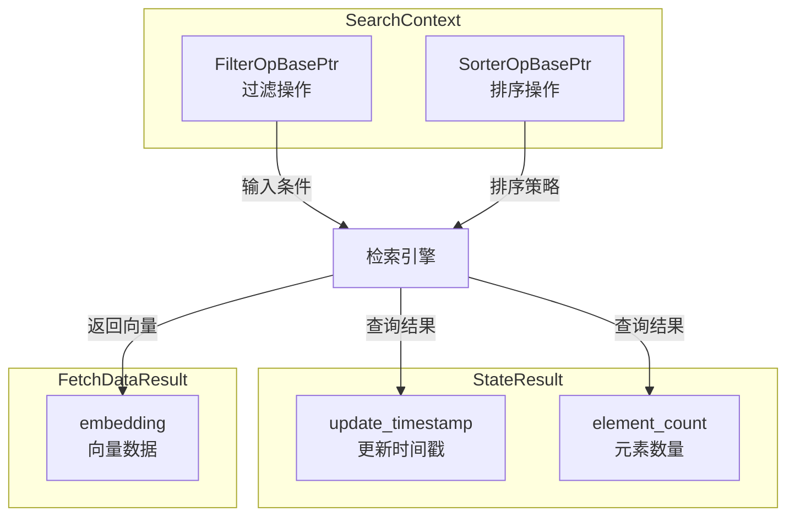
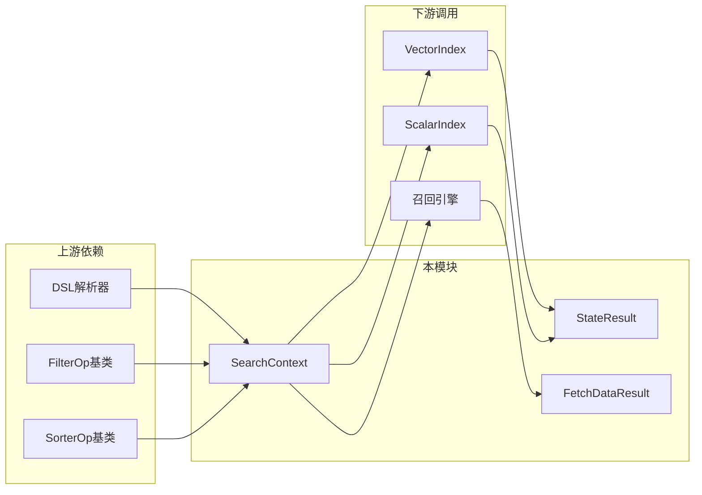

# search_context_and_fetch_state_models 模块

## 概述

`search_context_and_fetch_state_models` 模块是 OpenViking 向量数据库引擎的**核心数据结构层**，位于原生 C++ 引擎的核心位置。这个模块虽然代码量不大，但它承担着三个关键职责：

1. **搜索上下文封装** (`SearchContext`)：将过滤条件和排序规则封装为可复用的执行单元
2. **索引状态查询** (`StateResult`)：提供索引的元数据信息（更新时间、元素数量）
3. **数据获取结果** (`FetchDataResult`)：返回检索到的向量嵌入数据

如果你把整个向量检索系统想象成一家餐厅，那么：
- **SearchContext** 就像是点菜单——告诉厨师（检索引擎）顾客要什么口味（过滤条件）、怎么排序上菜（排序规则）
- **StateResult** 像是厨房的状态白板——显示今天做了多少道菜、最近一次出菜是什么时候
- **FetchDataResult** 则是端上桌的菜品——具体的向量数据

---

## 架构设计

### 核心组件



### 数据流分析

当用户发起一次向量检索请求时，数据流经以下路径：

```
用户请求 (Python/API)
    ↓
SearchRequest (query, topk, dsl)
    ↓
SearchContext::parse (解析DSL中的filter和sorter)
    ↓
FilterOpBase::calc_bitmap (计算过滤位图)
    ↓
SorterOpBase::calc_topk_result (计算排序结果)
    ↓
VectorRecall (向量召回)
    ↓
StateResult (可选：返回索引状态)
    ↓
FetchDataResult (返回向量数据)
```

---

## 核心组件详解

### 1. SearchContext — 搜索上下文

**代码位置**: `src/index/detail/search_context.h`

```cpp
struct SearchContext {
  FilterOpBasePtr filter_op;   // 过滤操作：筛选符合条件的向量
  SorterOpBasePtr sorter_op;   // 排序操作：对结果进行排序
};
```

#### 设计意图

SearchContext 是一个**轻量级的上下文持有者**（Context Holder）。它的设计遵循了**策略模式**（Strategy Pattern）：

- **filter_op** 是过滤策略的抽象——可以是 `AndOp`（与）、`OrOp`（或）、`MustOp`（必须包含）、`RangeOp`（范围）、`PrefixOp`（前缀）等
- **sorter_op** 是排序策略的抽象——可以是 `SorterOp`（自定义排序）、`CounterOp`（计数统计）

这种设计的优势在于：
- **可组合性**：过滤器和排序器可以独立定义，然后组合成完整的搜索策略
- **可扩展性**：新增过滤/排序类型只需实现对应的接口，无需修改 SearchContext 本身
- **延迟执行**：过滤和排序操作在 SearchContext 中只是持有引用，实际执行在检索时进行

#### 过滤 DSL 示例

```json
{
  "tag": ["Sport", "Game"],
  "op": "and",
  "conds": [
    {
      "op": "or",
      "conds": [
        {"op": "must", "field": "music_id", "conds": [1,2,3,5,6]},
        {"op": "must_not", "field": "color", "conds": ["red"]}
      ]
    },
    {"op": "range", "field": "price", "gte": 1.414, "lt": 3.142}
  ]
}
```

#### 排序 DSL 示例

```json
{
  "op": "sort",
  "field": "score",
  "order": "desc",
  "topk": 100
}
```

---

### 2. StateResult — 索引状态

**代码位置**: `src/index/common_structs.h`

```cpp
struct StateResult {
  uint64_t update_timestamp = 0;  // 最后更新时间戳
  uint64_t element_count = 0;     // 索引中的元素数量
};
```

#### 设计意图

StateResult 是一个**极简的状态返回结构**。它解决的问题是：在进行向量检索时，调用方经常需要知道索引的当前状态——比如数据是否最新、有多少数据可供检索。

这种设计的权衡：
- **极简主义**：只暴露最核心的两个指标，避免过度设计
- **无锁读取**：状态信息通过原子操作或快照获取，不阻塞读写
- **用途限定**：主要用于监控和健康检查，不包含复杂的元数据

---

### 3. FetchDataResult — 数据获取结果

**代码位置**: `src/index/common_structs.h`

```cpp
struct FetchDataResult {
  std::vector<float> embedding;  // 向量嵌入数据
};
```

#### 设计意图

FetchDataResult 是**检索结果的数据载体**。在向量检索中，最常见的操作是：
1. 根据向量相似度找到最相似的 Top-K 结果
2. 获取这些结果的向量数据做后续处理

这个结构的设计特点：
- **单一职责**：只负责承载向量数据，不包含元信息（如 ID、分数等）
- **内存布局优化**：`std::vector<float>` 保证连续的内存布局，有利于 SIMD 优化
- **移动语义友好**：支持高效的向量数据转移

---

## 设计决策与权衡

### 1. 为什么 SearchContext 使用原始指针而非智能指针？

**观察**：虽然 C++ 代码中大量使用 `std::shared_ptr`，但 SearchContext 中的 `FilterOpBasePtr` 和 `SorterOpBasePtr` 本质上是 `std::shared_ptr` 的别名（见 `op_base.h`）。

**决策解读**：
- 使用共享指针是**正确的选择**，因为过滤和排序操作可能被多次复用
- 这避免了复杂的生命周期管理，让调用方无需关心资源释放
- 权衡是引入了一点额外的引用计数开销，但在检索场景下这点开销可以忽略

### 2. 为什么 StateResult 和 FetchDataResult 如此简单？

**替代方案考虑**：
- 方案 A：像 `SearchResult` 一样包含更丰富的信息（labels, scores, extra_json）
- 方案 B：使用更复杂的元类系统

**选择理由**：
- StateResult 和 FetchDataResult 是**结果而非请求**，不需要复杂的控制信息
- 简单的结构意味着更快的序列化/反序列化，这在 Python 绑定层尤其重要
- 符合 Unix 哲学："只做一件事，做好它"

### 3. 为什么过滤和排序是独立的两个操作？

**设计选择**：将过滤（Filter）和排序（Sorter）作为两个独立的可插拔组件。

**权衡分析**：
- **优点**：
  - 职责清晰——过滤器负责"筛选"，排序器负责"排序"
  - 可以灵活组合——比如先按价格过滤，再按评分排序
  - 便于优化——过滤器可以提前剪枝，排序器可以渐进式计算
- **缺点**：
  - 增加了组件间的协调复杂度
  - 需要额外的 DSL 解析逻辑

---

## 依赖关系与集成

### 模块依赖图



### 关键依赖

| 依赖模块 | 依赖类型 | 说明 |
|---------|---------|------|
| `filter_ops.h` | 硬依赖 | 提供 FilterOpBase 及其实现类 |
| `sort_ops.h` | 硬依赖 | 提供 SorterOpBase 及其实现类 |
| `op_base.h` | 硬依赖 | 定义基类和智能指针类型 |
| `VectorRecallRequest/Result` | 协作接口 | 与召回模块交换数据 |

---

## 注意事项与常见陷阱

### 1. SearchContext 的生命周期管理

**陷阱**：SearchContext 中的 filter_op 和 sorter_op 是通过 `shared_ptr` 管理的，但在某些场景下可能导致循环引用。

**建议**：
- 在 Python 绑定层，确保及时释放不再使用的 SearchContext
- 避免在 filter_op 中存储指向外部对象的原始指针

### 2. DSL 解析的错误处理

**陷阱**：`parse_filter_json_str` 和 `parse_sorter_json_str` 在解析失败时可能返回空指针。

**建议**：
```cpp
auto filter = parse_sorter_json_str(dsl);
if (!filter || !filter->is_valid()) {
    // 处理解析失败的情况
    return ErrorCode::INVALID_DSL;
}
```

### 3. StateResult 的时间戳含义

**陷阱**：`update_timestamp` 是 Unix 时间戳（毫秒），但不同平台可能有时区差异。

**建议**：在 Python 侧使用时，统一转换为 UTC 时间进行展示。

### 4. FetchDataResult 的内存拷贝

**陷阱**：返回 `std::vector<float>` 意味着 Python 绑定层会发生一次内存拷贝。

**优化建议**：对于大规模数据，考虑使用 `numpy` 的直接内存视图来避免拷贝。

---

## 相关文档

- [native_engine_and_python_bindings](./native_engine_and_python_bindings.md) — 原生引擎与 Python 绑定的整体架构
- [scalar_bitmap_and_field_dictionary_structures](./scalar_bitmap_and_field_dictionary_structures.md) — 标量索引和字段字典结构
- [vector_recall_and_sparse_ann_primitives](./vector_recall_and_sparse_ann_primitives.md) — 向量召回与稀疏检索原语