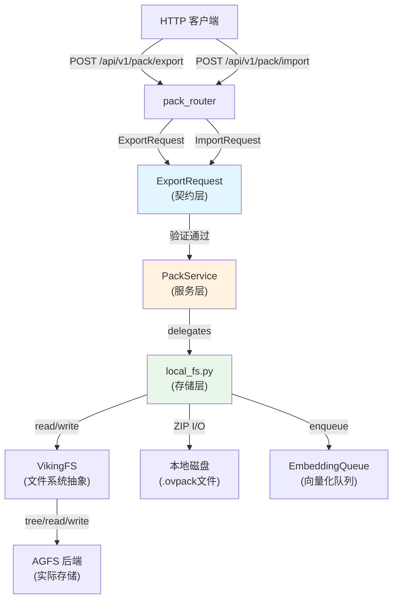

# pack_import_export_contracts 模块技术深度解析

## 概述

`pack_import_export_contracts` 模块是 OpenViking HTTP Server 中的一个关键组件，它定义了导入和导出 `.ovpack` 文件的 API 契约。简单来说，这个模块解决的问题是：**如何在不同的 OpenViking 实例之间，或者在本地与服务器之间迁移完整的上下文（Context）数据**。

把这个模块想象成**"物流中心"的调度窗口**。当用户说"把我的研究笔记打包寄给同事"时，这个窗口负责：检查收件人有没有权限（身份验证）、确认寄件地址和收件地址格式是否正确（请求验证）、给物流系统下达指令（委托给服务层）、最后给用户一个"已寄出"的回执（响应格式化）。它不关心货物具体怎么打包、用什么车运输——那是下游服务的职责。

想象一下这样的场景：一位研究人员在本地开发环境中构建了一个包含大量文档、代码和笔记的知识库，现在他希望将这个知识库分享给团队成员，或者备份到生产环境。传统的做法是手动复制每一个文件，但这种方法无法保留 OpenViking 特有的元数据（如语义摘要、关系图谱、向量索引等）。`.ovpack` 格式应运而生——它将整个上下文树打包成一个 ZIP 文件，同时保留所有必要的元数据，使得导入方可以立即使用这个知识库，无需重新构建。

这个模块处于系统的边界位置，是外部世界与内部存储层交互的 gateway。它的设计理念是**轻量级契约定义**——只负责请求验证和响应格式化，真正的业务逻辑由下游的 PackService 承担。

## 架构定位与数据流



从数据流的角度来看，这个模块扮演的是**API Gateway**的角色。当客户端发送请求时，请求首先到达 FastAPI 路由器，路由器根据路径分发到对应的端点。`ExportRequest` 和 `ImportRequest` 作为 Pydantic 模型，承担了**请求验证**的职责——它们确保传入的参数类型正确、必填字段存在、默认值合理。只有通过验证的请求才会被传递给 `PackService` 进行后续处理。

值得注意的是，这个模块采用了**依赖注入**模式来获取服务实例。通过 `get_service()` 函数从全局容器中获取 `OpenVikingService`，然后访问其内部的 `pack` 属性。这种设计使得服务层可以延迟初始化，同时也便于测试时替换为 mock 对象。

## 核心组件详解

### ExportRequest

```python
class ExportRequest(BaseModel):
    """Request model for export."""
    uri: str
    to: str
```

`ExportRequest` 是导出操作的契约模型，包含两个字段：`uri` 和 `to`。

`uri` 参数指定要导出的 Viking 资源路径。VikingURI 是 OpenViking 特有的 URI 方案，格式为 `viking://<scope>/<path>`，其中 scope 可以是 `resources`、`user`、`agent`、`session` 等。例如，`viking://user/alice/research/papers` 表示导出用户 Alice 的研究论文目录。

`to` 参数指定导出文件的目标路径。这里的设计有一个贴心的小细节：如果传入的是一个已存在的目录路径，代码会自动在该目录下生成以资源名命名的 `.ovpack` 文件；如果传入的是文件路径，则会确保它以 `.ovpack` 结尾。

**设计决策分析**：为什么将 `uri` 和 `to` 都设为必填参数，而不是让系统自动生成目标路径？答案是**明确性**。在企业级应用中，导出的文件往往需要存放到特定的目录、遵循特定的命名规范。让调用者显式指定目标路径，可以避免意外的文件覆盖，同时也便于与工作流系统集成。

### ImportRequest

```python
class ImportRequest(BaseModel):
    """Request model for import."""
    file_path: Optional[str] = None
    temp_path: Optional[str] = None
    parent: str
    force: bool = False
    vectorize: bool = True
```

`ImportRequest` 是导入操作的契约模型，字段更多，也更复杂。

`file_path` 和 `temp_path` 是两个互斥的选项，用来指定要导入的 `.ovpack` 文件来源。`file_path` 用于指定本地文件系统上的常规路径，而 `temp_path` 则用于处理上传场景——当文件通过 HTTP multipart 方式上传时，服务器会将其保存到临时目录，此时使用 `temp_path` 指向该临时文件。这种设计使得导入端点可以同时支持这两种使用场景。

`parent` 参数指定导入目标在 VikingFS 中的父路径。例如，如果要将一个名为 `research` 的包导入到用户 Alice 的资源目录下，parent 应该是 `viking://user/alice/resources`。导入后，资源的完整 URI 将是 `viking://user/alice/resources/research`。

`force` 是一个重要的安全开关。当目标路径已存在资源时，默认行为是抛出 `FileExistsError` 错误，以防止意外覆盖已有数据。如果调用者确实希望覆盖，则需要显式设置 `force=True`。这种**默认拒绝**的设计是一种防御性编程实践，它可以避免因参数误用而导致的数据丢失。

`vectorize` 控制导入后是否触发向量化处理。默认值为 `True`，意味着导入的资源会自动进入语义搜索的索引。如果导入的是一个超大的知识库，或者导入后立即会进行批量向量化，可以将此参数设为 `False` 以节省时间。

**设计决策分析**：为什么向量化是可选的而不是强制默认行为？这里存在一个权衡。自动向量化使得导入后的资源可以立即被搜索，提升了用户体验；但向量化是一个耗时操作，特别是在导入大量文件时。将其设为可选参数，让调用者根据实际情况选择，这是一种**延迟计算**的策略——只有在真正需要语义搜索时才付出计算成本。

### 路由端点

模块定义了两个 HTTP 端点：

```python
@router.post("/export")
async def export_ovpack(...)

@router.post("/import")
async def import_ovpack(...)
```

两者都采用 POST 方法，这是因为它们都涉及请求体的传递。返回统一使用 `Response` 模型，遵循 OpenViking 的 API 响应规范。

## 数据流全程追踪

让我们以导出操作为例，追踪数据从请求到结果的完整旅程。

**第一步：请求验证**。客户端发送 POST 请求到 `/api/v1/pack/export`，请求体为 JSON 格式的 `ExportRequest`。FastAPI 使用 Pydantic 自动验证请求体——如果 `uri` 为空或 `to` 缺失，框架会直接返回 422 错误，不会到达业务逻辑。

**第二步：权限检查**。通过 `Depends(get_request_context)` 注入 `RequestContext`，这其中包含了从 API Key 解析出来的用户身份和角色。认证中间件（在 `auth.py` 中定义）已经在请求到达路由之前完成了身份验证。

**第三步：服务调用**。验证和权限检查都通过后，路由处理函数调用 `service.pack.export_ovpack()`。这里使用了依赖注入获取的 `OpenVikingService` 实例，其内部的 `pack` 属性是 `PackService` 的实例。

**第四步：委托执行**。在 [PackService](../service-pack-service.md) 中，我们看到它只是简单地将请求委托给 `local_fs.export_ovpack()`。这种**委托模式**使得业务逻辑与 HTTP 协议解耦——如果将来需要添加 gRPC 接口，只需要复用同一套业务逻辑。

**第五步：实际执行**。在 `local_fs.py` 中，导出操作执行以下步骤：

1. 解析 URI 获取基础名称（最后一个路径组件）
2. 确定目标文件路径，确保目录存在
3. 调用 `viking_fs.tree()` 获取指定 URI 下的完整文件树
4. 创建一个 ZIP 文件，遍历文件树，读取每个文件的内容并写入 ZIP
5. 返回生成的 `.ovpack` 文件路径

**特殊处理：隐藏文件**。注意代码中对隐藏文件（以 `.` 开头的文件）的特殊处理。由于 ZIP 格式内部无法直接存储以 `.` 开头的文件名（这类文件在许多文件系统中是隐藏的），代码将 `.filename` 转换为 `._.filename` 存入 ZIP，在读取时再转换回来。这是一个**透明转换**的例子——调用者无需关心底层细节。

## 依赖分析与契约关系

这个模块的依赖关系相对简单，但它处于关键的数据流转位置：

**上游调用者**：
- HTTP 客户端（浏览器、CLI 工具、其他服务）
- 它们期望：标准的 RESTful 响应格式、清晰的错误消息、规范的状态码

**下游依赖**：
- [PackService](../service-pack-service.md)：实际的业务逻辑入口
- [local_fs.py](../storage-local-fs.md)：底层的 ZIP 操作和 VikingFS 调用
- [VikingFS](../storage-viking-fs.md)：统一的文件系统抽象层
- [RequestContext](../server-identity.md)：传递用户身份和权限信息

**被依赖**：
- 其他需要导入/导出功能的模块，如 CLI 工具、工作流系统
- 它们依赖：稳定的 API 契约、可靠的错误处理、规范的返回值

## 设计决策与权衡

### 1. 薄层架构 vs 业务内聚

这个模块选择了**薄层架构**——它只负责 HTTP 层面的事情（请求验证、参数提取、响应格式化），真正的业务逻辑完全在 service 层和 storage 层实现。这与一些"胖 Router"（将业务逻辑放在路由处理函数中）的做法不同。

**优势**：
- 关注点分离清晰，单元测试更容易
- 业务逻辑可以复用（CLI、gRPC 都能调用同一套逻辑）
- 路由层保持简洁，修改 HTTP 接口不影响业务

**代价**：
- 多了一层委托调用，性能略有损失
- 调试时需要跨越多个文件

### 2. Pydantic 模型作为契约边界

使用 Pydantic `BaseModel` 不仅是为了自动验证，更重要的是它定义了**显式的契约**。当 API 演进时（比如需要添加新字段），Pydantic 模型成为文档和契约的锚点。

### 3. 向量化的延迟计算

如前所述，`vectorize` 参数的设计体现了**延迟计算**的哲学——不在导入时立即进行可能昂贵的向量化操作，而是将资源本身的导入与后续的语义索引分离。这允许：
- 批量导入多个文件，然后统一触发向量化
- 跳过向量化步骤，用于临时导入或测试
- 将来可以扩展为后台异步向量化

### 4. 错误处理策略

模块采用了**防御性编程**策略：
- 非 force 模式下，导入目标已存在会报错
- 导出时单个文件失败会记录 warning 但继续执行（部分成功）
- 导入时单个文件失败在 force 模式下会继续，在非 force 模式下会中断

这是一个**容错 vs 一致性**的权衡。完全失败很简单（原子性），但部分成功更实用——用户可能只想导入能导入的文件，而忽略那些有问题的。

## 使用示例与扩展点

### 从 CLI 使用导出功能

```bash
# 导出用户的笔记到本地文件
curl -X POST http://localhost:8000/api/v1/pack/export \
  -H "Content-Type: application/json" \
  -H "Authorization: Bearer YOUR_API_KEY" \
  -d '{"uri": "viking://user/alice/notes", "to": "/tmp/alice_notes.ovpack"}'
```

### 从 CLI 使用导入功能

```bash
# 导入 ovpack 文件到资源目录
curl -X POST http://localhost:8000/api/v1/pack/import \
  -H "Content-Type: application/json" \
  -H "Authorization: Bearer YOUR_API_KEY" \
  -d '{
    "file_path": "/tmp/shared_knowledge.ovpack",
    "parent": "viking://user/bob/resources",
    "force": false,
    "vectorize": true
  }'
```

### 扩展点

如果你需要修改导入/导出行为，主要的扩展点包括：

1. **添加新的元数据字段**：修改 `ExportRequest` 或 `ImportRequest`，同时修改 `local_fs.py` 中的 JSON 元数据处理逻辑

2. **更改包格式**：当前使用 ZIP，可以替换为 tar、7z 或自定义格式，只需修改 `local_fs.py` 中的压缩/解压缩逻辑

3. **自定义向量策略**：修改 `_enqueue_direct_vectorization` 函数，可以添加批量向量化、异步向量化等策略

4. **添加预处理/后处理钩子**：在导入导出的关键步骤添加 hook，例如在导出前对敏感内容进行脱敏处理

## 边缘情况与注意事项

1. **URI 路径规范化**：代码中多处对 URI 进行 `strip()` 和 `rstrip('/')` 处理，以确保一致性。调用方应注意传入规范化的 URI。

2. **隐藏文件处理**：代码假设 `.` 开头的文件名需要转换为 `._.` 前缀。这是一个特定的选择，如果要支持其他特殊字符，可能需要修改 `get_ovpack_zip_path` 和 `get_viking_rel_path_from_zip` 函数。

3. **空包检测**：导入时如果 ZIP 文件为空，会抛出 `ValueError("Empty ovpack file")`。

4. **元数据验证**：导入时会读取 `._.meta.json` 文件进行验证，但验证失败只是 warning，不会阻止导入。这是**宽容模式**的设计——即使元数据损坏，文件本身仍然可以导入。

5. **并发限制**：当前实现是同步遍历文件树的，对于超大型导出可能需要考虑流式处理或分片。

6. **路径长度限制**：ZIP 格式对内部路径长度有限制（通常为 260 字节以内），在导出深层嵌套的目录时可能遇到问题。

## 新贡献者特别注意事项

如果你刚加入团队并准备修改这个模块，以下是一些**隐式契约**和**非显而易见的陷阱**：

### 1. 请求模型与业务模型的分离

这个模块的 `ExportRequest` 和 `ImportRequest` **只做输入验证，不做业务决策**。如果你试图在这里添加"导入前检查目标是否存在"这样的逻辑——不要这么做，那是 `PackService` 或 `local_fs.py` 的职责。保持契约层的"愚蠢"：它只验证格式，不验证业务规则。

### 2. 向量化是异步的，不是导入的一部分

当你阅读 `import_ovpack` 端点时，你会看到它调用 `local_import_ovpack` 后就返回了。向量化（`vectorize=True`）是通过将消息放入队列**异步执行**的。这意味着：
- 导入请求返回成功并不意味着向量索引已经更新完成
- 如果向量化失败，导入本身不会回滚
- 这是有意的设计——导入是可接受的，向量化是"锦上添花"

### 3. file_path 与 temp_path 的互斥逻辑

```python
file_path = request.file_path
if request.temp_path:
    file_path = request.temp_path
```

这段代码看似简单，但隐藏了一个问题：**两者都为空时会传递 `None`**。下游服务需要有处理这种情况的能力。如果你要修改这段逻辑，确保考虑到空值情况。

### 4. 响应格式的一致性压力

这个模块返回 `Response(status="ok", result={"file": result})` 和 `Response(status="ok", result={"uri": result})`。注意**返回的字段名不一样**——导出用 `file`，导入用 `uri`。这是一个历史遗留的微妙差异。如果你要修改返回值结构，考虑是否需要保持向后兼容性。

### 5. 错误处理的两个层次

- **FastAPI 层面**：Pydantic 验证失败会返回 422 状态码
- **业务层面**：实际导入/导出失败会通过 `Response` 的 `error` 字段返回（状态码仍为 200）

这意味着即使导入失败，HTTP 状态码也可能是 200——客户端需要检查 `response.status` 字段。这是一个需要文档化的行为，修改时务必保持一致。

## 相关文档

- [PackService 实现](./service-pack-service.md) - 业务逻辑层实现（注：若文件不存在，请参考 `openviking/service/pack_service.py` 源码）
- [local_fs 存储层](./storage-local-fs.md) - 底层存储操作（注：若文件不存在，请参考 `openviking/storage/local_fs.py` 源码）
- [VikingFS 文件系统抽象](./storage-viking-fs.md) - 虚拟文件系统层（注：若文件不存在，请参考 `openviking/storage/viking_fs.py` 源码）
- [RequestContext 请求上下文](./server-identity.md) - 请求上下文与身份验证
- [Response 模型](./server-api-contracts-system-and-usage-contracts-response-and-usage-models.md) - API 响应格式