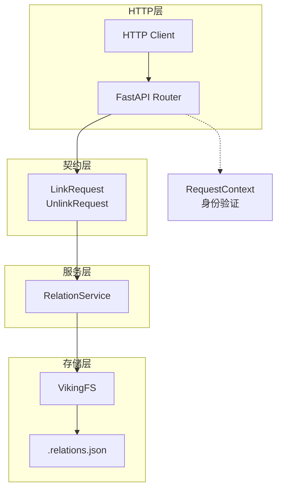

# relation_request_contracts 模块技术深度解析

## 概述：问题空间与设计意图

`relation_request_contracts` 模块是 OpenViking 系统中最"薄"的 API 层——它只负责一件事：**定义关系管理操作的 HTTP 请求格式，并将请求委托给下游服务层执行**。如果你把整个系统想象成一个医院，那么这个模块就是挂号窗口：它不治病，只负责验证患者信息、登记挂号码，然后把人分配给对应的科室。

这个模块解决的核心问题是：**如何在 HTTP API 层表达"资源之间的关联关系"这一抽象概念**。在知识管理场景中，用户需要一种方式来建立文档之间的引用关系——比如将某份设计文档"链接"到相关的代码仓库，将会议纪要"关联"到项目计划。OpenViking 将这种关联抽象为**有向关系**：`from_uri → to_uri`，并支持为每条关系附加解释性文本（`reason` 字段）。

## 架构角色：API 契约的定义者

从模块树的位置来看，`relation_request_contracts` 位于 `server_api_contracts` 层级，这是 FastAPI 应用的**最外层**。它的角色是**输入校验与请求转发**——接收客户端的 HTTP 请求，验证请求体是否符合 Pydantic 模型定义，然后调用 `RelationService` 执行实际业务逻辑。



这种分层设计遵循了**关注点分离**原则：路由层只关心 HTTP 协议的细节（路径、HTTP 方法、查询参数），业务逻辑层关心关系的增删改查，存储层关心数据如何在磁盘上持久化。每一层的边界都很清晰，修改某一层不会波及其他层。

## 核心组件：请求模型的设计意图

### LinkRequest：为何支持单值和列表两种形式？

```python
class LinkRequest(BaseModel):
    from_uri: str
    to_uris: Union[str, List[str]]  # 允许单值或列表
    reason: str = ""
```

`LinkRequest` 有一个微妙的设计决策：`to_uris` 字段被定义为 `Union[str, List[str]]`，即**既可以是单个字符串，也可以是字符串列表**。这看起来是一个convenience API（便捷接口），但它实际上反映了一个重要的使用模式：**资源关系往往成群出现**。

考虑一个具体场景：产品经理创建了一份PRD文档，他可能需要同时将它关联到多个相关文档——技术规格、测试计划、用户调研报告。如果 API 要求每次只能关联一个，那就意味着需要发送三次 HTTP 请求。通过支持批量关联，客户端可以一次性建立多个关系，减少网络往返次数。

这种设计在 API 客户端（`openviking/async_client.py`）中得到了体现：

```python
async def link(self, from_uri: str, uris: Any, reason: str = "") -> None:
    """Create link (single or multiple)."""
    await self._client.link(from_uri, uris, reason)
```

注意 `uris` 参数的类型标注是 `Any`，这在 Python 中并不是最佳实践，但它允许客户端将任意可迭代对象传递给底层实现。

### UnlinkRequest：为何是单值而非批量？

与 `LinkRequest` 的批量设计形成对比的是，`UnlinkRequest` 只能解绑**单个**目标 URI：

```python
class UnlinkRequest(BaseModel):
    from_uri: str
    to_uri: str  # 只能是单个 URI
```

这不是技术限制（存储层完全支持从同一个 `from_uri` 移除多个 `to_uri`），而是一个**故意的设计选择**。解绑操作通常需要更精确的控制——用户可能只想移除其中一条关联，而不是全部。批量删除在误操作时代价更高，因此 API 设计上倾向于保守。如果需要批量解绑，客户端可以循环调用多次。

### 三个端点的职责边界

| 端点 | 方法 | 职责 |
|------|------|------|
| `/api/v1/relations` | GET | 查询：获取指定资源的所有关联关系 |
| `/api/v1/relations/link` | POST | 创建：建立新的关联关系 |
| `/api/v1/relations/link` | DELETE | 删除：移除指定的关联关系 |

这里有一个**命名上的不对称**：查询端点没有后缀（`/relations`），而链接和解链接都使用 `/link` 路径，只是通过 HTTP 方法区分（POST vs DELETE）。这种设计的意图可能是强调"查询"是读取操作，而"链接/解链接"是同一个资源（link）的不同状态转换。

## 数据流向：从请求到持久化

理解数据流动的最佳方式是跟踪一个完整的请求生命周期。

**第一步：HTTP 请求到达路由器**

当客户端发送 POST 请求到 `/api/v1/relations/link` 时，FastAPI 首先将请求体反序列化为 `LinkRequest` 对象。此时，Pydantic 会自动验证：
- `from_uri` 是否为非空字符串
- `to_uris` 是否为字符串或字符串列表
- `reason` 是否为字符串（默认值空字符串）

如果验证失败，FastAPI 会自动返回 422 Unprocessable Entity 错误，**不需要业务代码介入**。

**第二步：身份验证注入**

每个端点都声明了 `RequestContext` 作为依赖项：

```python
async def link(
    request: LinkRequest,
    _ctx: RequestContext = Depends(get_request_context),
):
```

`get_request_context` 是认证层的入口点，它将 HTTP 请求中的身份信息（如 API Key、JWT Token）解析为 `RequestContext` 对象。这个对象包含用户的 `account_id` 和 `role`，后续的存储层会用它来实现**租户隔离**——每个账户只能操作自己空间内的资源关系。

**第三步：服务层委托**

路由器本身**不执行业务逻辑**，它只是调用服务层：

```python
service = get_service()
await service.relations.link(request.from_uri, request.to_uris, ctx=_ctx, reason=request.reason)
return Response(status="ok", result={...})
```

这是典型的**薄控制器（Thin Controller）**模式：路由器做三件事——解析请求、校验权限、调用服务。业务逻辑的复杂性被隐藏在服务层。

**第四步：存储层持久化**

服务层进一步委托给 `VikingFS`，后者负责实际的关系持久化。关系数据存储在每个资源目录下的 `.relations.json` 文件中：

```python
async def link(self, from_uri: str, uris: Union[str, List[str]], reason: str = "", ctx=None):
    """Create relation (maintained in .relations.json)."""
    # ...
    entries.append(RelationEntry(id=link_id, uris=uris, reason=reason))
    await self._write_relation_table(from_path, entries)
```

这种**文件级存储**的选择意味着一件事：**关系数据与资源本身紧耦合**。当你移动（mv）一个资源目录时，它的关系会随同移动；当你删除资源时，关系文件也会被删除。没有独立的关系数据库，没有外键约束，一切依赖于文件系统的原子性。

## 设计权衡：为什么这样做？

### 权衡一：薄 API 层 vs 胖服务层

这个模块只有约 50 行代码（包含路由定义和请求模型），大部分逻辑都在服务层和存储层。这是一种**刻意选择**，它的好处是：

- **测试友好**：路由层只需要测试请求解析和参数传递，不需要模拟复杂的业务逻辑
- **变更隔离**：修改关系存储格式（例如从 JSON 改为 SQLite）不需要触碰 HTTP 层
- **职责单一**：路由器成为系统的一扇"玻璃门"，外部只能看到请求格式，看不到内部复杂性

但代价是：**调试时需要在多个层级之间跳转**，对于不熟悉架构的开发者来说，可能不太直观"一条链路"是怎么工作的。

### 权衡二：Pydantic 验证 vs 自定义校验

模块完全依赖 Pydantic 的自动验证，没有自定义校验器。这在大多数情况下是合理的——`from_uri` 只需要是非空字符串即可，具体它是否指向一个存在的资源，那是存储层的职责。

但有一个边界情况值得关注：**URI 格式本身不被校验**。代码接受任意字符串作为 URI，不验证它是否以 `viking://` 开头。这意味着客户端可能传入格式错误的 URI，而错误只能在存储层才被发现。这可能是一个潜在的**一致性漏洞**——如果将来有其他客户端（不是 Python SDK）接入，它们可能传入不同格式的 URI。

### 权衡三：同步返回 vs 异步处理

所有端点都声明为 `async`，这意味着它们是 FastAPI 的异步处理函数。但注意到 **link 和 unlink 操作并没有返回有意义的业务数据**，它们只返回状态：

```python
return Response(status="ok", result={"from": request.from_uri, "to": request.to_uris})
```

这是一个务实的选择：对于关联操作，客户端通常只需要知道"成功还是失败"。如果要返回更新后的关系列表，客户端可以再调用一次 GET 端点。这种设计避免了**"读取你写入"（Read-Your-Writes）**的一致性问题——在分布式系统中，写入后立即读取可能看到旧数据，因为副本同步需要时间。

## 新贡献者需要注意的陷阱

### 陷阱一：`to_uris` 的类型转换

在路由层，`LinkRequest.to_uris` 的类型是 `Union[str, List[str]]`，但传递给服务层时，它**可能被转换为列表**：

```python
# 在 relation_service.py 中
async def link(self, from_uri: str, uris: Union[str, List[str]], ctx, reason: str = ""):
    # service 层没有再次规范化类型
    await viking_fs.link(from_uri, uris, reason, ctx=ctx)
```

而 VikingFS 的 `link` 方法会做类型检查：

```python
async def link(self, from_uri: str, uris: Union[str, List[str]], ...):
    if isinstance(uris, str):
        uris = [uris]  # 单值会被转为列表
```

这种**在存储层做类型规范化**的模式是可行的，但它意味着类型约定没有在 API 边界被强制执行，而是被"拖延"到了实现深处。如果将来有其他调用者直接使用 VikingFS（而不是通过 HTTP API），他们需要知道这个约定。

### 陷阱二：批量操作的部分失败

考虑这样的场景：客户端尝试将 `from_uri=A` 关联到 `to_uris=[B, C, D]`，但 `C` 并不存在。会发生什么？

根据当前的实现，存储层会这样处理：

```python
for uri in uris:
    self._ensure_access(uri, ctx)  # 验证每个 URI 的访问权限
```

`_ensure_access` 可能会抛出异常。如果异常是"资源不存在"，整个操作都会失败——`B` 和 `D` 也不会被关联。这是一个**全有或全无（All-or-Nothing）**的语义。对于批量操作，这可能不是用户期望的行为：他们可能希望"尽可能多地关联，能关联多少是多少"。

如果你要修改这段逻辑，需要决定：是保持当前的严格模式（有任何失败就全部回滚），还是改为"尽力而为"模式（部分成功）？

### 陷阱三：空关系与孤立关系

当你解绑最后一个关联时，当前的实现会**删除整个关系条目**：

```python
if not entry_to_modify.uris:
    entries.remove(entry_to_modify)
```

这意味着 `.relations.json` 文件中的空关系会被清理。但反过来，**如果你解绑一个从未被关联的 URI，会发生什么？**

```python
if not entry_to_modify:
    logger.warning(f"[VikingFS] URI not found in relations: {uri}")
    return  # 只是记录警告，不报错
```

这是一个**幂等（Idempotent）**的设计：即使重复解绑同一个关系，也不会报错。对于 HTTP DELETE 操作来说，这是合理的——因为 HTTP 语义上"删除一个不存在的资源"应该返回 200 而不是 404。

### 陷阱四：请求上下文的作用域

`RequestContext` 被注入到每个端点，但它实际上在两个地方被使用：

1. **身份验证**：通过 `get_request_context` 依赖注入，确保请求来自合法用户
2. **权限检查**：通过 `_ensure_access` 方法，确保用户有权限操作指定的 URI

但注意：`RequestContext` 中的 `account_id` 是从认证信息中提取的，而不是从 URI 中推断的。这意味着如果系统将来支持"跨账户分享"功能，当前架构可能需要修改——因为 URI 本身不包含账户信息（`viking://resources/doc.md` 没有账户前缀），权限检查完全依赖于请求上下文。

## 相关的模块与扩展阅读

如果你想深入理解关系管理在 OpenViking 系统中的位置，以下模块值得一读：

- **[resource_and_relation_contracts](resource_and_relation_contracts.md)**：同一个父模块下的兄弟模块，定义了资源管理（上传、删除、列表）的 HTTP API
- **[relation_service](relation_service.md)**：服务层的实现，承上启下，将 API 请求转换为存储操作
- **[viking_fs](viking_fs.md)**：存储层的核心，理解关系如何被持久化为 `.relations.json` 文件
- **[search_request_contracts](search_request_contracts.md)**：如果你的任务涉及"根据关系进行搜索"，这个模块定义了搜索 API

## 小结

`relation_request_contracts` 模块是 OpenViking 系统中一个教科书式的**薄 API 层**实现。它没有复杂的业务逻辑，只有干净的请求模型定义和直接的委托转发。选择这种设计意味着系统可以在不影响客户端的情况下自由修改业务逻辑实现——只要服务层的接口不变，HTTP 层可以随时"换芯"。

对于新加入的开发者，最重要的是理解：**这不是关系业务的全部，而是业务暴露给外部世界的"窗口"**。当你需要修改关系的行为时（比如增加新的关系类型、增加验证规则），先问自己：这是 API 层面的变化，还是业务层面的变化？如果是前者，改这个模块；如果是后者，去找 `relation_service` 或 `viking_fs`。