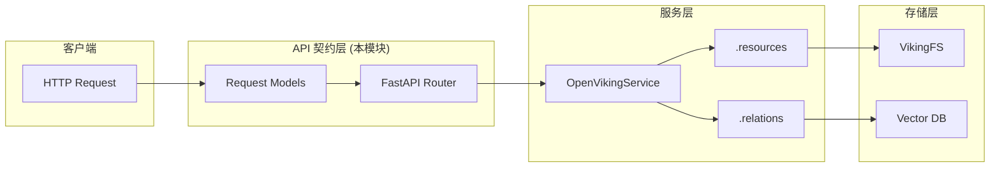

# resource_and_relation_contracts 模块详解

## 概述

`resource_and_relation_contracts` 模块是 OpenViking HTTP Server 的核心 API 契约层，负责定义**资源管理**与**关系管理**两大事务的请求模型。这个模块解决的问题是：**如何让客户端以结构化、类型安全的方式向系统注入内容，并建立内容之间的语义关联**。

在 OpenViking 的架构中，资源（Resources）是系统管理的核心对象——可以是用户上传的文档、代码文件、PDF，或者是需要被索引和检索的任何内容。技能（Skills）是可复用的提示词模板或指令集。关系（Relations）则将独立的资源编织成网状结构，支持知识图谱式的关联查询。

本模块包含四个核心请求模型和对应的 HTTP 端点，是客户端与服务层之间的**第一道契约边界**。

## 架构概览



### 数据流向说明

1. **资源添加流程**：
   - 客户端发送 `POST /api/v1/resources` 或 `POST /api/v1/resources/temp_upload`
   - 请求体被 `AddResourceRequest` Pydantic 模型验证
   - 验证通过后传递给 `service.resources.add_resource()`
   - 服务层处理文件存储、索引创建、向量生成

2. **技能添加流程**：
   - 客户端发送 `POST /api/v1/skills`
   - 请求体被 `AddSkillRequest` 模型验证
   - 传递给 `service.resources.add_skill()`

3. **关系管理流程**：
   - 客户端发送 `GET /api/v1/relations` 查询关联
   - 客户端发送 `POST /api/v1/relations/link` 创建关联
   - 客户端发送 `DELETE /api/v1/relations/link` 移除关联

## 核心设计决策

### 1. 为什么要用 Pydantic 作为契约层？

FastAPI 基于 Pydantic 构建，选择它作为请求模型的基类有几个关键原因：

- **运行时验证**：请求进入 API 层时，Pydantic 自动进行类型检查和业务规则验证（如 `model_validator` 检查 `path` 和 `temp_path` 的互斥性）
- **自动 OpenAPI 文档**：Pydantic 模型自动生成 API 文档中的请求体_schema，客户端可以据此生成 SDK
- **序列化/反序列化**：模型自动处理 JSON 到 Python 对象的转换

这是**正确性优先**的选择。虽然有更轻量的方案（如直接解析 dict），但缺乏类型安全性和自动验证会增加服务层的心智负担。

### 2. 为什么 `path` 和 `temp_path` 是互斥的？

在 `AddResourceRequest` 中有这样一个验证器：

```python
@model_validator(mode="after")
def check_path_or_temp_path(self):
    if not self.path and not self.temp_path:
        raise ValueError("Either 'path' or 'temp_path' must be provided")
    return self
```

这个设计背后的意图是：客户端**必须**选择一种资源来源方式，不能两者都缺。这不是技术限制，而是**业务约束**——系统需要明确知道资源从哪里来（是已有文件路径，还是刚上传的临时文件）。

** tradeoff 分析**：这种互斥设计简化了服务层的实现逻辑（不需要处理"两个都有"的分支），但代价是未来如果需要支持"同时提供"的需求，需要修改契约。**这是典型的"显式优于隐式"设计哲学**——让调用方必须做出明确选择，而不是猜测系统会如何处理模糊情况。

### 3. 临时文件自动清理机制

`temp_upload` 端点包含一个后台清理逻辑：

```python
def _cleanup_temp_files(temp_dir: Path, max_age_hours: int = 1):
    """Clean up temporary files older than max_age_hours."""
    # ... 遍历并删除超过 1 小时的临时文件
```

这个设计解决了一个实际运维问题：**用户上传的文件如果未被处理，会占用存储空间**。通过在每次上传时触发自动清理，系统实现了一种"懒清理"策略——不依赖独立的定时任务，而是在流量发生时顺便做清理。

**权衡**：这种方式的优点是简单、无需额外的基础设施；缺点是如果长时间没有请求，临时文件会持续堆积。设计中选择了 `max_age_hours=1`，意味着最多积累 1 小时的文件，对于大多数场景是合理的。

### 4. 关系设计中单双向的处理

看 `LinkRequest` 和 `UnlinkRequest` 的区别：

```python
class LinkRequest(BaseModel):
    from_uri: str
    to_uris: Union[str, List[str]]  # 支持多目标
    reason: str = ""

class UnlinkRequest(BaseModel):
    from_uri: str
    to_uri: str  # 只能单目标
```

这里有一个不对称：`link` 支持批量操作（一个资源可以同时链接到多个资源），而 `unlink` 只能一对一操作。

**设计意图**：批量创建关系是高频操作（用户一次性建立多个关联很常见），而批量删除相对危险——误删多条关系的后果更严重。**这是"便利性 vs 安全性"权衡的典型案例**。

### 5. 为什么 `to_uris` 用 `Union[str, List[str]]` 而不是强制 List？

这种"灵活签名"允许客户端简化调用：

```python
# 两者都合法
link(from_uri="A", to_uris="B")           # 单目标
link(from_uri="A", to_uris=["B", "C", "D"])  # 多目标
```

**tradeoff**：这减少了客户端的代码（不需要手动包装成 list），但增加了模型内部的复杂度（需要判断类型并统一处理）。OpenViking 选择优先降低客户端复杂度，因为 API 调用频率远高于 API 实现频率。

## 组件详解

### AddResourceRequest

```python
class AddResourceRequest(BaseModel):
    path: Optional[str] = None           # 已有文件路径
    temp_path: Optional[str] = None      # 刚上传的临时文件
    target: Optional[str] = None         # 目标存储位置
    reason: str = ""                     # 添加理由（用于上下文）
    instruction: str = ""                # 处理指令
    wait: bool = False                   # 是否同步等待完成
    timeout: Optional[float] = None      # 等待超时
    strict: bool = True                  # 是否严格模式
    ignore_dirs: Optional[str] = None    # 忽略的目录
    include: Optional[str] = None        # 包含规则
    exclude: Optional[str] = None        # 排除规则
    directly_upload_media: bool = True   # 是否直接上传媒体
```

**字段分类**：
- **来源定位**：`path`、`temp_path` 二选一
- **目标定位**：`target` 指定资源存放位置
- **处理控制**：`wait`、`timeout`、`strict` 控制执行行为
- **过滤规则**：`ignore_dirs`、`include`、`exclude` 用于递归添加时的筛选
- **媒体处理**：`directly_upload_media` 控制媒体上传策略

### AddSkillRequest

```python
class AddSkillRequest(BaseModel):
    data: Any = None           # 技能数据（可以是多种格式）
    temp_path: Optional[str] = None  # 或者从临时文件加载
    wait: bool = False         # 是否等待完成
    timeout: Optional[float] = None  # 超时时间
```

**与 AddResourceRequest 的对比**：技能添加的模型更简洁，因为技能的来源和处理方式相对固定，不需要复杂的过滤规则和媒体处理选项。

### LinkRequest

```python
class LinkRequest(BaseModel):
    from_uri: str                      # 源资源 URI
    to_uris: Union[str, List[str]]     # 目标资源 URI（支持批量）
    reason: str = ""                   # 建立关联的理由
```

### UnlinkRequest

```python
class UnlinkRequest(BaseModel):
    from_uri: str    # 源资源 URI
    to_uri: str      # 目标资源 URI（单条）
```

## 与其他模块的关系

| 依赖模块 | 关系说明 |
|---------|---------|
| [server-api-contracts](server-api-contracts.md) | 父模块，提供基础路由和响应模型 |
| [server-api-contracts-search-request-contracts](server-api-contracts-search-request-contracts.md) | 搜索模块依赖本模块添加的资源 |
| [server-api-contracts-session-message-contracts](server-api-contracts-session-message-contracts.md) | Session 模块引用资源 URI |
| [core-context-prompts-and-sessions](core-context-prompts-and-sessions.md) | Skills 与 Context/Session 深度集成 |
| [parsing-and-resource-detection](parsing-and-resource-detection.md) | 资源添加后由解析模块处理 |

## 使用警示

### 1. 路径处理的隐式假设

`path` 和 `temp_path` 都是字符串类型，服务层会将其解释为文件系统路径。**注意**：没有显式的路径验证，恶意路径（如 `../../etc/passwd`）可能需要服务层或 VikingFS 层面拦截。

### 2. `wait=False` 的异步行为

当 `wait=False` 时，端点会立即返回，资源处理在后台进行。**这意味着客户端不能假设资源已就绪**——需要通过轮询或其他机制确认处理完成。

### 3. `directly_upload_media` 的影响

当设为 `True` 时，媒体文件直接上传到存储后端；当设为 `False` 时，可能会先经过向量化处理再存储。这个选项影响存储成本和检索性能，具体行为需要参考服务层实现。

### 4. 关系查询的图遍历成本

`GET /api/v1/relations?uri=xxx` 返回指定资源的所有关联。**在大规模图数据中，这可能是昂贵的操作**——关系数据通常存储在向量数据库中，全量返回可能导致大量数据传输。

### 5. temp 文件清理的时间窗口

清理逻辑只在 `temp_upload` 调用时触发。如果系统流量很低，临时文件可能存在超过 1 小时。**对于高可用要求的系统，应考虑独立的清理定时任务**。

## 扩展点与修改建议

1. **添加新资源类型**：如果需要支持新的资源来源（如远程 URL），可以扩展 `AddResourceRequest`，添加 `url` 字段并更新 `model_validator`。

2. **批量关系操作**：如需支持批量删除，可以添加新的端点 `/api/v1/relations/batch_unlink`。

3. **关系类型扩展**：当前关系是"扁平"的，只有 URI 对应关系。如果需要区分关系类型（如 "depends_on"、"references"），可以在 `LinkRequest` 中添加 `relation_type` 字段。

4. **技能格式扩展**：`AddSkillRequest.data` 是 `Any` 类型，扩展性强但缺乏约束。可以通过引入 `skill_type` 字段和对应的子模型来增强类型安全。