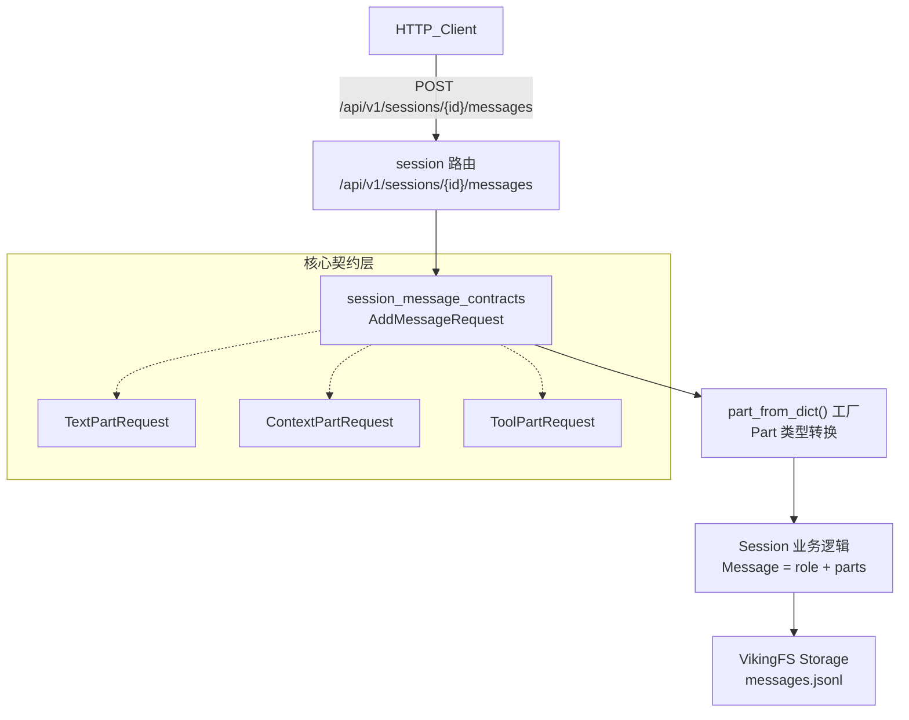

# session_message_contracts 模块技术深度解析

## 概述

`session_message_contracts` 模块是 OpenViking HTTP Server 中负责会话消息处理的 API 契约层。把它想象成**餐厅的前台接待处**——它是外部世界（HTTP 客户端）与内部厨房（Session 业务逻辑）之间的桥梁，负责接收订单（AddMessageRequest）、验证格式、把订单转交给厨房处理，然后返回结果。

这个模块解决的核心问题是：**如何让外部客户端以灵活且向后兼容的方式向会话中添加消息，同时支持超越纯文本的丰富消息结构**。

在早期版本中，消息只是简单的字符串内容。但随着系统演进，消息需要携带更多信息——比如引用了哪些记忆、哪些资源、调用了哪些工具。直接在 API 层面破坏性变更会导致现有客户端不可用。这个模块通过支持两种模式巧妙地解决了这个问题：简单的 `content` 字符串模式（保持兼容）和新的 `parts` 数组模式（支持丰富结构）。

---

## 架构定位



这个模块在系统中的角色是**HTTP API 契约层**。它位于 `server_api_contracts` 之下的 `session_message_contracts` 子模块。它的上游是 HTTP 客户端（通过 FastAPI 路由），下游是 [Session 运行时](session-runtime-and-skill-discovery-session-runtime.md) 和 [Message/Part 核心模型](python_client_and_cli_utils.md)。

---

## 核心组件解析

### 1. AddMessageRequest — 双重模式的请求模型

```python
class AddMessageRequest(BaseModel):
    role: str
    content: Optional[str] = None
    parts: Optional[List[Dict[str, Any]]] = None

    @model_validator(mode="after")
    def validate_content_or_parts(self) -> "AddMessageRequest":
        if self.content is None and self.parts is None:
            raise ValueError("Either 'content' or 'parts' must be provided")
        return self
```

**设计意图**：这个模型是整个模块的门面，它实现了**渐进式增强**的设计模式。

想象一个图书馆系统：早期只能借阅纸质书（只需要书名），后来可以借阅电子书、有声书（需要格式、时长、章节等元数据）。如果直接用新格式替换旧格式，老系统就会崩溃。正确的做法是让新系统同时支持两种请求——要么只提供书名（兼容旧系统），要么提供完整的元数据（新系统功能）。

`AddMessageRequest` 就是这个思想：`content` 字段对应"书名"（简单的字符串），`parts` 字段对应"完整的元数据"（丰富的 Part 数组）。Pydantic 的 `model_validator` 确保了至少提供其中之一，防止空消息。

### 2. TextPartRequest / ContextPartRequest / ToolPartRequest — 三种消息片段

这三个类是对内部 [Part 系统](python_client_and_cli_utils.md) 的 HTTP 契约映射：

- **TextPartRequest**：最基础的文本内容，携带 `type: "text"` 和 `text` 字符串。
- **ContextPartRequest**：消息中引用的上下文引用，包含：
  - `uri`：资源的 Viking URI（如 `viking://resources/doc.md`）
  - `context_type`：上下文类型（`memory`、`resource`、`skill` 三选一）
  - `abstract`：L0 层抽象摘要，用于快速判断相关性
- **ToolPartRequest**：工具调用请求，包含：
  - `tool_id` / `tool_name` / `tool_uri`：工具标识
  - `skill_uri`：技能 URI（如果工具来自某个 Skill）
  - `tool_input`：工具输入参数
  - `tool_output`：工具执行结果
  - `tool_status`：工具状态（`pending` | `running` | `completed` | `error`）

**设计洞察**：这些请求模型与内部的 `TextPart`、`ContextPart`、`ToolPart` 数据类是一一对应的，但使用了 Pydantic 的 `Literal` 类型来约束枚举值。这是一种**契约优先（Contract-First）**的设计——先定义 HTTP 层面可以接受的数据格式，然后再转换成内部领域模型。

### 3. part_from_dict() — 工厂函数

```python
def part_from_dict(data: dict) -> Part:
    """Convert a dict to a Part object."""
    part_type = data.get("type", "text")
    if part_type == "text":
        return TextPart(text=data.get("text", ""))
    elif part_type == "context":
        return ContextPart(...)
    elif part_type == "tool":
        return ToolPart(...)
```

这个函数是**数据转换的守门人**。它接收来自 HTTP 请求的字典结构，根据 `type` 字段创建对应的 Part 对象。它的存在使得 HTTP 层不需要了解内部 Part 类的具体实现细节，实现了**解耦**。

---

## 数据流追踪

### 添加消息的完整路径

当客户端调用 `POST /api/v1/sessions/{session_id}/messages` 时，数据经历如下旅程：

1. **HTTP 请求入站**：客户端发送 JSON 请求体，如 `{"role": "user", "parts": [{"type": "text", "text": "你好"}]}`。

2. **FastAPI 路由接收**：FastAPI 将 JSON 反序列化为 `AddMessageRequest` Pydantic 模型，自动执行验证。

3. **双重模式处理**（在 `add_message` 端点中）：
   ```python
   if request.parts is not None:
       parts = [part_from_dict(p) for p in request.parts]
   else:
       parts = [TextPart(text=request.content or "")]
   ```
   如果 `parts` 存在，遍历每个字典并调用 `part_from_dict()` 转换为内部 Part 对象；否则退回到简单的 `content` 模式，创建一个默认的 `TextPart`。

4. **Session 处理**：调用 `session.add_message(request.role, parts)`，Session 内部创建 `Message(id=..., role=..., parts=..., created_at=...)` 并追加到消息列表，同时持久化到 `messages.jsonl`。

5. **响应返回**：返回 `{"status": "ok", "result": {"session_id": ..., "message_count": ...}}`。

**关键观察**：整个数据流中，HTTP 契约层（Pydantic 模型）负责与外部世界交互，内部 Session 层（Message/Part 类）负责业务逻辑。两者通过 `part_from_dict()` 工厂函数和 `TextPart` 默认构造进行桥接。

---

## 设计决策与权衡

### 1. 向后兼容 vs 向前支持

**决策**：通过双重模式（`content` 或 `parts`）实现向后兼容。

**权衡分析**：
- **优点**：现有客户端无需修改即可继续使用，新增客户端可以利用 Parts 的丰富功能。
- **缺点**：代码中需要处理两种模式的分支逻辑，增加了维护成本。幸运的是，逻辑非常简洁（只有一个 if-else），且通过 `model_validator` 确保了语义一致性。

### 2. Pydantic BaseModel vs 数据类

**决策**：HTTP 契约层使用 Pydantic，内部领域模型使用 `@dataclass`。

**权衡分析**：
- **Pydantic** 提供了开箱即用的字段验证、类型转换、JSON 序列化，非常适合处理不可信的外部输入。
- **dataclass** 更轻量，适合高性能的内部业务逻辑。
- 这是典型的**分层解耦**策略：边界处使用"重型"验证（Pydantic），内部使用"轻量"数据结构。

### 3. 联合类型 PartRequest

```python
PartRequest = TextPartRequest | ContextPartRequest | ToolPartRequest
```

**决策**：使用 Python 3.10+ 的联合类型（Union）而非泛型或基类继承。

**权衡分析**：
- **优点**：类型安全、IDE 支持好、无需额外的运行时类型检查开销。
- **缺点**：目前代码中 `PartRequest` 类型声明存在但未被直接使用（实际使用 `Dict[str, Any]` + `part_from_dict` 动态解析），这是一种**声明与实现脱节**的代码异味。不过，考虑到未来的扩展性（比如考虑使用 FastAPI 的 `Body` 联合类型），保留此类型声明是合理的。

### 4. 工具状态机的显式建模

`ToolPartRequest` 中显式包含了 `tool_status` 字段，取值范围为 `pending | running | completed | error`。

**设计洞察**：这反映了系统对**工具执行生命周期**的显式建模。在 AI Agent 场景中，工具调用不是原子操作——它们需要经历"创建（pending）→ 执行中（running）→ 完成或错误（completed/error）"的状态迁移。通过在消息契约中携带状态，系统可以支持：
- 实时流式输出（状态从 pending 变为 running）
- 错误处理和重试（状态变为 error）
- 审计和回溯（完整的状态历史）

---

## 依赖分析

### 上游依赖（谁调用这个模块）

| 上游模块 | 交互方式 | 期望的契约 |
|----------|----------|------------|
| FastAPI 路由层 | `AddMessageRequest` 作为请求体 | 有效的 role 字段 + content 或 parts 之一 |
| HTTP 客户端 | JSON 序列化请求 | 符合上述结构的 JSON |

### 下游依赖（这个模块调用谁）

| 下游模块 | 交互方式 | 接口契约 |
|----------|----------|----------|
| [Message/Part 核心模型](python_client_and_cli_utils.md) | `part_from_dict()` 工厂函数 | 输入 dict 带 `type` 字段，输出 `Part` 对象 |
| [Session 运行时](session-runtime-and-skill-discovery-session-runtime.md) | `session.add_message(role, parts)` | role 字符串 + List[Part] |
| VikingFS 存储 | Session 内部持久化 | 通过 Session 间接调用 |

### 依赖方向解读

这个模块位于**依赖链的中间层**——它既不生产原始数据，也不执行核心业务逻辑，而是充当**协议转换器**。它的价值在于：
- 对上游（HTTP 客户端）提供清晰的 API 契约
- 对下游（Session 业务逻辑）隐藏 HTTP 序列化细节

---

## 使用指南与示例

### 简单模式（向后兼容）

适用于已有的简单客户端：

```bash
curl -X POST "http://localhost:8000/api/v1/sessions/session-123/messages" \
  -H "Content-Type: application/json" \
  -d '{"role": "user", "content": "帮我查找最近的会议记录"}'
```

### Parts 模式（推荐用于新客户端）

适用于需要传递上下文件引用或工具调用的场景：

```bash
curl -X POST "http://localhost:8000/api/v1/sessions/session-123/messages" \
  -H "Content-Type: application/json" \
  -d '{
    "role": "assistant",
    "parts": [
      {"type": "text", "text": "以下是您上周的会议总结："},
      {"type": "context", "uri": "viking://memory/weekly-meeting-2024-W01", "context_type": "memory", "abstract": "周一产品评审会议"},
      {"type": "tool", "tool_id": "tool-001", "tool_name": "search_docs", "tool_uri": "viking://session/session-123/tools/tool-001", "tool_input": {"query": "Q1目标"}, "tool_status": "completed", "tool_output": "..."}
    ]
  }'
```

---

## 边界情况与注意事项

### 1. 空内容校验

```python
@model_validator(mode="after")
def validate_content_or_parts(self) -> "AddMessageRequest":
    if self.content is None and self.parts is None:
        raise ValueError("Either 'content' or 'parts' must be provided")
    return self
```

**注意**：如果客户端同时提供 `content` 和 `parts`，`parts` 会优先生效（代码逻辑如此）。这是**显式设计**而非 bug，因为 Parts 模式是更丰富的表达。

### 2. 空字符串处理

```python
parts = [TextPart(text=request.content or "")]
```

当使用简单模式时，如果 `content` 是 `None` 或空字符串，会创建一个**空文本 Part**。这在某些边界情况下可能导致消息看起来是空的。Session 层面的 `add_message` 会生成唯一的消息 ID，所以即使内容为空，消息本身仍然存在（只是 `content` 属性返回空字符串）。

### 3. Parts 类型与内部模型的映射

`part_from_dict()` 函数对未知类型默认返回 `TextPart`：

```python
else:
    return TextPart(text=str(data))
```

这意味着如果客户端发送了不支持的 Part 类型（如 `"type": "image"`），它会被静默转换为文本。这是一种**宽容的降级策略**，但也可能隐藏配置错误。在生产环境中，你可能希望对未知类型抛出明确的错误。

### 4. 响应中的隐藏转换

在 `sessions.py` 中有一个容易被忽视的辅助函数 `_to_jsonable()`，它负责将内部对象（如 Context 实例）转换为 JSON 可序列化的值。这个函数在 `extract_session` 端点中使用，但不会影响消息添加的流程。了解它的存在有助于调试响应序列化相关的问题。

### 5. tool_input 的类型安全

```python
tool_input: Optional[Dict[str, Any]] = None
```

`tool_input` 被定义为 `Dict[str, Any]`，这允许任意 JSON 对象作为工具输入。这意味着工具调用的输入模式完全由发送方和接收方约定，HTTP 层面不做约束。这种设计提供了最大的灵活性，但代价是**失去了静态类型检查**。如果工具输入有固定的 schema，建议在更上层的业务逻辑中进行验证。

### 6. Session 状态依赖

`add_message` 端点依赖于 Session 已经被加载：

```python
session = service.sessions.session(_ctx, session_id)
await session.load()
```

如果 Session 不存在或未加载，会触发隐式的加载行为。这意味着每次添加消息都会触发一次 `load()` 调用。对于高频写入场景，这可能带来性能问题。值得关注的优化方向包括：实现 Session 的懒加载缓存、或在 Session 创建时预热。

---

## 相关模块参考

- **[Session 运行时与技能发现](session-runtime-and-skill-discovery-session-runtime.md)**：消息的存储和持久化逻辑
- **[Python 客户端与工具类](python_client_and_cli_utils.md)**：Message 和 Part 核心数据类的定义
- **[检索追踪与评分类型](python_client_and_cli_utils.md)**：与消息关联的追踪数据模型
- **[上下文类型与级别](core-context-prompts-and-sessions.md)**：ContextType 和 ContextLevel 的定义

---

## 总结

`session_message_contracts` 模块是 OpenViking 系统中一个典型的**协议适配层**。它通过以下设计解决了实际问题：

1. **渐进式增强**：通过双重模式（content/parts）实现向后兼容，同时支持向前演进
2. **类型约束**：使用 Pydantic 的 Literal 类型和验证器，确保输入数据的语义正确
3. **清晰的分层**：HTTP 层的 Pydantic 模型与内部领域的 dataclass 分离，各司其职

作为新加入的开发者，你需要特别注意：
- Parts 模式的优先级高于简单模式
- `part_from_dict()` 是数据进入系统的守门人，它对未知类型宽容降级
- 消息的持久化是异步的（通过 `run_async`），这意味着添加消息后立即查询可能看到轻微的复制延迟