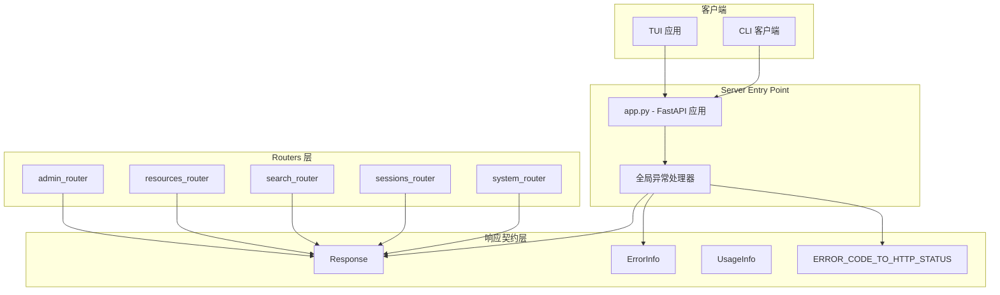

# response_and_usage_models 模块技术深度解析

## 概述

`response_and_usage_models` 模块是 OpenViking HTTP Server 的**响应契约层**——它定义了所有 API 端点返回数据的标准结构。想象一下邮政系统的信封：无论信件内容是什么（查询结果、错误信息、状态更新），都使用统一的信封格式寄送。这个模块正是扮演着"信封"的角色，确保客户端无论调用哪个端点，都能获得可预测、一致的响应格式。

这个模块解决的核心问题有三个：第一，**响应格式统一性**——避免不同端点返回不同结构的 JSON，导致客户端需要为每个 API 编写不同的解析逻辑；第二，**错误处理一致性**——当系统内部发生各种异常时，客户端能够以统一的方式感知和处理错误；第三，**使用量追踪**——为付费或配额限制提供计量数据（tokens 消耗、向量扫描量）。

## 架构角色

从模块树的结构来看，`response_and_usage_models` 位于 `server_api_contracts` 的子模块 `system_and_usage_contracts` 中。这意味着它是服务器对外契约的核心组成部分——所有的路由器（routers）都依赖这个模块来格式化响应。



**数据流向说明**：客户端的请求首先到达 FastAPI 应用（`app.py`），然后被路由到具体的端点处理器（如 `system_router` 中的 `/api/v1/system/status`）。端点处理器执行业务逻辑后，构造 `Response` 对象返回给客户端。如果处理过程中抛出 `OpenVikingError` 异常，全局异常处理器会捕获该异常，查阅 `ERROR_CODE_TO_HTTP_STATUS` 映射表确定 HTTP 状态码，然后构造包含 `ErrorInfo` 的 `Response` 返回。

## 核心组件详解

### Response — 标准 API 响应包装器

```python
class Response(BaseModel):
    """Standard API response."""
    status: str  # "ok" | "error"
    result: Optional[Any] = None
    error: Optional[ErrorInfo] = None
    time: float = 0.0
    usage: Optional[UsageInfo] = None
```

**设计意图**：`Response` 是一个**信封模型**——它将所有可能返回的内容（成功结果、错误信息、执行耗时、资源消耗）打包进一个统一的结构。选择 `Any` 作为 `result` 的类型是经过权衡的：虽然损失了静态类型检查的精确性，但换来了极大的灵活性，使得每个路由器可以返回任意结构的数据，无需为每种响应类型定义专门的模型类。

**使用模式**：在所有路由器中，成功的响应通常这样构造：

```python
# 来自 openviking/server/routers/system.py
return Response(
    status="ok",
    result={
        "initialized": service._initialized,
        "user": service.user._user_id,
    },
)
```

```python
# 来自 openviking/server/routers/search.py
return Response(status="ok", result=result)
```

注意 `result` 可以是字典、列表或任何可 JSON 序列化的对象——这是有意为之的设计，允许业务逻辑自由决定返回什么。

**隐式契约**：当 `status` 为 `"ok"` 时，`result` 必须有值而 `error` 必须为 `None`；当 `status` 为 `"error"` 时则相反。这不是一个运行时强制约束（代码中没有 `model_validator`），而是一个需要开发者遵守的约定。

### ErrorInfo — 错误信息载体

```python
class ErrorInfo(BaseModel):
    """Error information."""
    code: str
    message: str
    details: Optional[dict] = None
```

**设计意图**：`ErrorInfo` 提供了**结构化的错误报告**。`code` 字段采用 gRPC 风格的状态码（如 `NOT_FOUND`、`INVALID_ARGUMENT`、`INTERNAL`），这并非偶然——它使得服务端内部的错误码体系与标准 gRPC 生态兼容。`message` 供人类阅读，`details` 则承载机器可解析的额外上下文。

**典型使用场景**：错误信息不是由路由器直接构造的，而是通过全局异常处理器统一处理的：

```python
# 来自 openviking/server/app.py
@app.exception_handler(OpenVikingError)
async def openviking_error_handler(request: Request, exc: OpenVikingError):
    http_status = ERROR_CODE_TO_HTTP_STATUS.get(exc.code, 500)
    return JSONResponse(
        status_code=http_status,
        content=Response(
            status="error",
            error=ErrorInfo(
                code=exc.code,
                message=exc.message,
                details=exc.details,
            ),
        ).model_dump(),
    )
```

这种设计的优势在于：**业务代码只需要抛出异常**，无需在每个端点中手动构造错误响应。异常处理器会自动完成错误码到 HTTP 状态的映射和响应格式化。

### UsageInfo — 资源消耗计量

```python
class UsageInfo(BaseModel):
    """Usage information."""
    tokens: Optional[int] = None
    vectors_scanned: Optional[int] = None
```

**设计意图**：`UsageInfo` 追踪 API 调用的资源消耗。在商业化场景中，这用于：
- **配额控制**：限制用户每分钟/每天的 token 消耗量
- **成本分析**：统计不同用户的资源使用情况
- **性能监控**：了解向量检索的效率（扫描量与返回结果数的比例）

**当前状态**：查看代码可知，`UsageInfo` 在当前的路由器实现中**几乎没有被使用**。这表明该模块是为未来功能预留的——当系统需要支持按量计费或更精细的配额管理时，会逐步填充这个字段。

### ERROR_CODE_TO_HTTP_STATUS — 错误码映射表

```python
ERROR_CODE_TO_HTTP_STATUS = {
    "OK": 200,
    "INVALID_ARGUMENT": 400,
    "INVALID_URI": 400,
    "NOT_FOUND": 404,
    "ALREADY_EXISTS": 409,
    "PERMISSION_DENIED": 403,
    "UNAUTHENTICATED": 401,
    "RESOURCE_EXHAUSTED": 429,
    "FAILED_PRECONDITION": 412,
    "ABORTED": 409,
    "DEADLINE_EXCEEDED": 504,
    "UNAVAILABLE": 503,
    "INTERNAL": 500,
    "UNIMPLEMENTED": 501,
    "NOT_INITIALIZED": 500,
    "PROCESSING_ERROR": 500,
    "EMBEDDING_FAILED": 500,
    "VLM_FAILED": 500,
    "SESSION_EXPIRED": 410,
    "UNKNOWN": 500,
}
```

**设计意图**：这张映射表是**架构层面的一个关键决策**——它将内部错误码（gRPC 风格）与 HTTP 状态码连接起来。选择 gRPC 错误码体系的原因可能是：

1. **标准化**：gRPC 状态码是业界广泛认可的错误分类方式
2. **可扩展性**：新增错误码只需在映射表中添加一行
3. **跨语言兼容**：如果未来需要支持 gRPC 客户端，错误码可以直接复用

值得注意的映射选择：
- `SESSION_EXPIRED` 映射到 **410 Gone** 而非 401——这是一个有意为之的语义选择，表示资源已永久不可用
- `RESOURCE_EXHAUSTED` 映射到 **429 Too Many Requests**——正确对应速率限制场景

## 依赖关系分析

### 上游依赖 — 谁调用这个模块

| 模块 | 调用方式 |
|------|---------|
| `app.py` (FastAPI 应用) | 导入 `Response`, `ErrorInfo`, `ERROR_CODE_TO_HTTP_STATUS` 用于全局异常处理 |
| `system_router` | 直接构造 `Response` 对象返回 |
| `sessions_router` | 直接构造 `Response` 对象返回 |
| `search_router` | 直接构造 `Response` 对象返回 |
| `resources_router` | 直接构造 `Response` 对象返回 |
| `filesystem_router` | 直接构造 `Response` 对象返回 |
| `admin_router` | 直接构造 `Response` 对象返回 |
| `pack_router` | 直接构造 `Response` 对象返回 |
| `relations_router` | 直接构造 `Response` 对象返回 |

几乎**所有的服务器路由器**都依赖这个模块——这是该模块如此重要的原因。

### 下游依赖 — 这个模块依赖什么

该模块本身**几乎没有任何外部依赖**。它只依赖 Pydantic 的 `BaseModel`，这是一个非常轻量级的依赖。这意味着：

- **稳定性高**：其他模块的变化不太可能影响到这个模块
- **可测试性强**：单元测试不需要 mock 复杂的依赖
- **迁移成本低**：如果未来需要替换 Pydantic，改动范围有限

### 数据契约

**输入契约（对路由器）**：
- 路由器应构造 `status="ok"` 且包含 `result` 的 Response，或 `status="error"` 且包含 `error` 的 Response
- `time` 字段当前未在路由器中填充，由中间件处理

**输出契约（对客户端）**：
- 客户端应检查 `status` 字段判断请求是否成功
- 失败时，`error.code` 包含错误码，`error.message` 包含人类可读的错误描述
- `error.details`（如果存在）包含额外的上下文信息

## 设计决策与权衡

### 决策一：使用 Pydantic 而非 dataclasses 或 dict

**选择**：使用 Pydantic 的 `BaseModel`

**权衡分析**：
- **优点**：自动验证、序列化支持、IDE 类型提示、OpenAPI schema 生成
- **缺点**：轻量级场景下略显重了一点

对于 HTTP API 服务器而言，Pydantic 的这些优点非常关键——它能与 FastAPI 的自动文档生成完美配合，减少类型相关的 bug。

### 决策二：result 字段使用 `Any` 类型

**选择**：`result: Optional[Any] = None`

**权衡分析**：
- **优点**：极大的灵活性，每个端点可以返回自己需要的结构
- **缺点**：失去静态类型检查，客户端无法通过类型推断知道返回结构

这是一个典型的 **灵活性 vs 类型安全** 的权衡。选择灵活性是因为 OpenViking 面向多种客户端（CLI、TUI、外部集成），每种客户端对响应结构的需求不同，强制统一结构反而会增加复杂度。

### 决策三：gRPC 风格错误码

**选择**：错误码采用 gRPC 状态码体系（`NOT_FOUND`, `INVALID_ARGUMENT` 等）

**权衡分析**：
- **优点**：标准化、与 gRPC 生态兼容、语义清晰
- **缺点**：团队需要学习这套编码体系

这个决策反映了系统设计者对**可扩展性**的重视——预留了与更广泛生态系统对接的可能性。

### 决策四：UsageInfo 设计为可选字段

**选择**：`tokens` 和 `vectors_scanned` 都是 `Optional[int]`

**权衡分析**：
- **优点**：不需要每个端点都计算和填充使用量数据，未使用时更节省带宽
- **缺点**：客户端无法假设这些字段一定存在，需要做空值处理

当前实现显示使用量追踪功能**尚未被广泛采用**，这证实了这个设计的前瞻性——模块已经就绪，等业务需求到来时可以直接使用。

## 使用指南与最佳实践

### 在路由器中返回响应

```python
from openviking.server.models import Response

@router.post("/search")
async def search(request: SearchRequest, ctx: RequestContext = Depends(get_request_context)):
    service = get_service()
    result = await service.search.find(...)
    
    # 正确：明确指定 status="ok"
    return Response(status="ok", result=result)
```

### 正确处理错误

**不要**在路由器中手动构造错误响应：

```python
# 错误做法 ❌
if not found:
    return Response(
        status="error",
        error=ErrorInfo(code="NOT_FOUND", message="Resource not found")
    )
```

**应该**抛出异常，让全局处理器处理：

```python
# 正确做法 ✅
from openviking_cli.exceptions import NotFoundError

if not found:
    raise NotFoundError(resource_id, resource_type="document")
```

这种做法确保了：
- 错误处理逻辑集中在一处
- 错误码到 HTTP 状态的映射自动应用
- 相同的错误在所有端点上一致地呈现

### 使用 UsageInfo（未来）

当需要追踪资源消耗时：

```python
return Response(
    status="ok",
    result=search_results,
    usage=UsageInfo(
        tokens=prompt_tokens + completion_tokens,
        vectors_scanned=total_scanned,
    ),
)
```

## 边缘情况与注意事项

### 1. Response 状态互斥规则

`status`、`result`、`error` 字段之间存在隐式约束，但 Pydantic 不会强制检查：

```python
# 这不会报错，但可能导致客户端困惑
Response(status="ok", error=ErrorInfo(code="...", message="..."))
```

**注意**：确保在代码中遵守约定——成功时只填充 `result`，失败时只填充 `error`。

### 2. time 字段需要手动填充吗？

查看路由器代码发现，`time` 字段通常**不填充**（使用默认值 0.0）。这是因为请求耗时由 `app.py` 中的中间件自动计算并写入 HTTP 响应头 `X-Process-Time`，而非放入响应体。

如果需要在响应体中返回耗时，路由器需要自行计算：

```python
import time
start = time.time()
# ... 业务逻辑 ...
return Response(status="ok", result=result, time=time.time() - start)
```

### 3. ERROR_CODE_TO_HTTP_STATUS 的 fallback 行为

当遇到映射表中不存在的错误码时，默认返回 HTTP 500：

```python
http_status = ERROR_CODE_TO_HTTP_STATUS.get(exc.code, 500)
```

这意味着**未预见的错误会善意地暴露为服务器内部错误**，而非客户端错误（如 400）。这是合理的安全实践——将未知错误暴露为 500 可以避免泄露内部实现细节。

### 4. OpenVikingError 异常层次

所有自定义异常都继承自 `OpenVikingError`（定义在 `openviking_cli/exceptions.py`）：

```
OpenVikingError
├── InvalidArgumentError
│   ├── InvalidURIError
│   └── UnsupportedDirectoryFilesError
├── NotFoundError
├── AlreadyExistsError
├── UnauthenticatedError
├── PermissionDeniedError
├── UnavailableError
├── InternalError
├── DeadlineExceededError
├── ProcessingError
│   ├── EmbeddingFailedError
│   └── VLMFailedError
├── SessionExpiredError
└── NotInitializedError
```

**任何继承自 `OpenVikingError` 的异常都会被全局异常处理器捕获并格式化为标准响应**。

### 5. 未使用的 UsageInfo

截至当前代码版本，所有路由器都**没有填充 `UsageInfo`** 字段。这意味着：
- 响应中的 `usage` 始终为 `None`
- 如果你需要这个功能，需要在相关服务层添加计量逻辑

## 相关模块参考

- **[server-api-contracts-system-endpoint-contracts](server-api-contracts-system-and-usage-contracts-system-endpoint-contracts.md)** — 系统端点的请求/响应模型，如 `WaitRequest`
- **[python-client-and-cli-utils-client-session-and-transport](python-client-and-cli-utils-client-session-and-transport.md)** — Python 客户端如何解析和消费 Response
- **[server-api-contracts-search-request-contracts](server-api-contracts-search-request-contracts.md)** — 搜索相关请求模型
- **[server-api-contracts-session-message-contracts](server-api-contracts-session-message-contracts.md)** — 会话消息相关请求模型