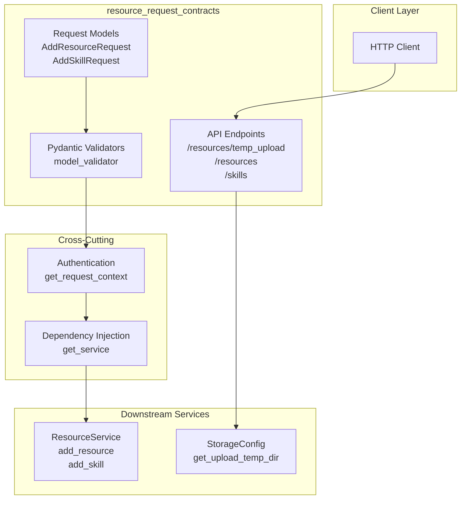

# resource_request_contracts 模块技术深度解析

## 模块概述

`resource_request_contracts` 是 OpenViking HTTP Server 中的资源请求契约模块，位于 `server_api_contracts` 层级下的 `resource_and_relation_contracts` 子模块中。该模块的核心职责是为外部客户端提供添加资源和技能的 HTTP API 端点，同时处理文件上传、请求验证、身份认证等横切关注点。

从架构角色来看，这个模块扮演着**API 网关**的角色——它是外部世界进入 OpenViking 核心服务的入口通道。所有的资源添加请求都必须通过这个模块进行请求格式验证、身份上下文注入，然后转发到后端的 [ResourceService](service-resource_service.md) 进行实际处理。这种设计遵循了经典的分层架构模式，将 HTTP 协议层面的 concerns（请求解析、认证、响应格式化）与业务逻辑清晰分离。

**解决的问题空间**：在分布式 agent 系统中，客户端需要一种标准化的方式来向知识库添加内容。这些内容可能是本地文件、远程 URL、压缩包，或者是自定义的技能定义。问题在于：(1) 大文件无法通过简单的 JSON 请求体传输；(2) 不同类型的资源需要不同的处理流程；(3) 系统需要知道请求来自哪个用户/租户以实现多租户隔离。该模块通过提供临时文件上传机制、标准化的请求模型、以及与认证系统的集成来解决这些实际问题。

## 架构设计

### 核心组件与职责



### 请求模型设计

该模块定义了两个核心的 Pydantic 请求模型，它们是 API 契约的核心载体：

**AddResourceRequest** 是添加资源的主要请求载体。它的字段设计反映了资源添加操作的复杂性：`path` 和 `temp_path` 提供了两种输入源——前者用于直接引用本地文件或远程 URL，后者用于引用通过临时上传机制预先上传的文件。这种双源设计是一个重要的架构决策，它解决了大文件无法直接放入 HTTP 请求体的问题，同时保持了 API 的简洁性。

`target` 参数指定资源的目标 URI（使用 `viking://` 协议），这允许客户端精确控制资源在系统中的存储位置。`reason` 和 `instruction` 两个字段则提供了元数据能力——前者记录添加资源的业务原因，后者向处理管道传递特殊的处理指令（例如指定特定的解析器或提取策略）。

`wait` 和 `timeout` 参数体现了异步处理的设计哲学：当 `wait=true` 时，HTTP 请求会阻塞直到后端的向量化处理完成，这为同步使用场景提供了便利；而 `timeout` 则防止无限等待。`strict`、`ignore_dirs`、`include`、`exclude` 等参数则是目录解析场景下的细粒度控制选项，透传给了 [ResourceService](service-resource_service.md) 中的目录解析器。

**AddSkillRequest** 相比之下是一个更简单的模型，因为技能（Skill）在 OpenViking 中的处理流程相对标准化。`data` 字段可以是多种形式——目录路径、文件路径、字符串内容或字典结构——这反映了技能定义的灵活性。类似地，`temp_path` 提供了间接引用能力。

### 请求验证逻辑

模块使用 Pydantic 的 `model_validator` 实现了请求级别的业务规则验证。对于 AddResourceRequest，验证规则要求**必须**提供 `path` 或 `temp_path` 之一：

```python
@model_validator(mode="after")
def check_path_or_temp_path(self):
    if not self.path and not self.temp_path:
        raise ValueError("Either 'path' or 'temp_path' must be provided")
    return self
```

这个验证体现了"至少需要一个输入源"的不变式。与其在多个地方进行空值检查，不如在入口处强制要求，这符合"快速失败"（fail-fast）的设计原则。

### 数据流分析

**端到端请求流程**：

1. **请求接收**：客户端发送 HTTP 请求到 `/api/v1/resources` 或 `/api/v1/skills`
2. **认证注入**：FastAPI 的 `Depends(get_request_context)` 触发认证流程，从请求头中提取 API Key 或使用开发模式下的默认身份，生成 [RequestContext](server-identity.md#requestcontext)
3. **请求验证**：Pydantic 自动进行字段类型验证，然后调用 `model_validator` 进行业务规则验证
4. **服务调用**：`get_service()` 通过依赖注入获取全局 [OpenVikingService](service-core.md) 实例，调用相应的 `resources.add_resource()` 或 `resources.add_skill()` 方法
5. **业务处理**：ResourceService 内部调度 [ResourceProcessor](utils-resource_processor.md) 和 [SkillProcessor](utils-skill_processor.md) 执行实际的解析、向量化、存储流程
6. **等待完成**（可选）：如果 `wait=true`，则调用队列管理器的 `wait_complete()` 阻塞等待处理完成
7. **响应返回**：构造标准的 [Response](server-models.md#response) 对象，包含状态、结果、错误信息等

**临时文件上传流程**：

1. 客户端向 `/api/v1/resources/temp_upload` 发送 `multipart/form-data` 请求
2. 服务端从配置中获取临时上传目录（`{workspace}/temp/upload`）
3. 清理超过 1 小时的旧临时文件（`_cleanup_temp_files`）
4. 生成唯一的文件名（`upload_{uuid}{ext}`）并保存文件
5. 返回 `temp_path` 给客户端，客户端后续可在 AddResourceRequest 中引用此路径

## 依赖分析

### 上游依赖（调用方）

该模块被以下组件调用：

- **FastAPI 应用主入口**（`server/app.py`）：通过 `app.include_router(resources_router)` 将路由注册到主应用。这是典型的适配器模式——app.py 不知道具体路由的实现细节，只知道有一个符合 FastAPI Router 接口的组件。
- **外部 HTTP 客户端**：任何调用 OpenViking API 的客户端都是隐式的上游依赖，它们期望稳定的 API 契约。

### 下游依赖（被调用方）

该模块依赖以下服务和组件：

| 依赖组件 | 用途 | 关键接口 |
|---------|------|----------|
| [get_service()](server-dependencies.md#get_service) | 获取全局 OpenVikingService 实例 | `service.resources.add_resource()`, `service.resources.add_skill()` |
| [get_request_context()](server-auth.md#get_request_context) | 认证与身份解析 | 返回 RequestContext（含 user、role） |
| [get_openviking_config()](../python_client_and_cli_utils/configuration_models_and_singleton-open_viking_config.md) | 获取配置 | `config.storage.get_upload_temp_dir()` |
| [Response](server-models.md#response) | 标准化响应格式 | `Response(status="ok", result=...)` |

### 与后端服务的契约

模块与 [ResourceService](service-resource_service.md) 的交互遵循以下隐式契约：

- **RequestContext 必须有效**：传递给 service 的 ctx 参数不能为 None，这是由 FastAPI 的依赖注入保证的
- **path 参数语义**：service 期望收到的是有效的文件路径或 URL 字符串，空值由 router 层处理
- **返回 Dict[str, Any]**：service 返回的处理结果是字典形式，router 将其包装在 Response.result 中
- **异常传播**：service 抛出的业务异常（如 InvalidArgumentError、DeadlineExceededError）会被上层的全局异常处理器捕获并转换为标准错误响应

## 设计决策与权衡

### 决策一：临时文件上传机制

**选择**：实现 `/temp_upload` 端点 + 临时文件清理机制

**替代方案考虑**：
- **直接 base64 编码**：将文件内容直接放入 JSON 请求体。问题是：(1) 大文件会导致请求体巨大，违反 HTTP 最佳实践；(2) base64 编码增加 33% 带宽开销；(3) 某些代理服务器会限制请求体大小
- **流式分块上传**：实现复杂的分块协议。这对客户端有更高的实现要求
- **外部 S3/OSS 集成**：让客户端自己上传到对象存储，然后传递 URL。这增加了客户端的复杂性

**当前选择的理由**：临时文件方案是一个务实的折中——它不需要客户端引入额外的存储服务，只需要实现标准的 `multipart/form-data` 上传即可。服务端自动清理旧文件也避免了存储泄漏问题。对于中小型文件（几 MB 到几十 MB），这种方案工作良好。

### 决策二：wait 参数的同步/异步混合设计

**选择**：在异步 HTTP 处理器中支持可选的同步等待模式

**设计考量**：
- 默认情况下（`wait=false`），HTTP 请求快速返回，资源处理在后台异步进行。这种非阻塞模式有利于高并发场景
- 当 `wait=true` 时，HTTP 连接会保持打开直到向量化完成。这简化了同步调用场景的客户端逻辑，无需轮询
- `timeout` 参数防止无限等待，这是分布式系统中防止资源泄漏的基本实践

**权衡**：这种设计在简单性和灵活性之间取得了平衡。代价是可能产生长时间的 HTTP 连接，但这对于内部服务间通信是可以接受的。

### 决策三：RequestContext 的依赖注入

**选择**：通过 FastAPI 的 `Depends()` 机制注入认证上下文

**优点**：
- 声明式——路由处理器明确声明自己需要认证
- 可测试——可以轻松 mock RequestContext
- 关注点分离——认证逻辑与业务逻辑解耦

**潜在问题**：如果未来需要支持多种认证方式（比如 OAuth、JWT），当前的实现需要较大改动。但对于当前以内置 API Key 为主的场景，这是合适的。

### 决策四：路径参数 vs 请求体

**选择**：使用 POST 请求体而非路径参数

**理由**：资源添加操作的参数较多（path、target、reason、instruction 等），不适合放在 URL 路径中。POST + JSON 请求体是更自然的选择，也便于未来扩展参数而不破坏 API 兼容性。

## 使用指南与示例

### 添加本地资源

```python
import requests

response = requests.post(
    "http://localhost:8000/api/v1/resources",
    json={
        "path": "/data/docs/manual.pdf",
        "reason": "User manual for Q4",
        "instruction": "Use PDF parser with OCR",
        "wait": True,
        "timeout": 30.0
    },
    headers={"X-API-Key": "your-api-key"}
)
print(response.json())
```

### 先上传大文件，再添加资源

```python
import requests

# Step 1: Upload large file
with open("large_dataset.csv", "rb") as f:
    upload_response = requests.post(
        "http://localhost:8000/api/v1/resources/temp_upload",
        files={"file": ("dataset.csv", f, "text/csv")},
        headers={"X-API-Key": "your-api-key"}
    )
temp_path = upload_response.json()["result"]["temp_path"]

# Step 2: Add resource using temp_path
response = requests.post(
    "http://localhost:8000/api/v1/resources",
    json={
        "temp_path": temp_path,
        "reason": "Q4 training data"
    },
    headers={"X-API-Key": "your-api-key"}
)
```

### 添加技能

```python
import requests

response = requests.post(
    "http://localhost:8000/api/v1/skills",
    json={
        "data": {
            "name": "code_reviewer",
            "description": "Reviews Python code for common issues",
            "prompt": "You are a code reviewer..."
        },
        "wait": True
    },
    headers={"X-API-Key": "your-api-key"}
)
```

## 边界情况与注意事项

### 路径验证的边界

模块本身不验证 `path` 是否实际存在或可访问。这个责任下放给了后端的 [ResourceService](service-resource_service.md) 和 VikingFS 层。这意味着：
- 如果 path 指向不存在的文件，HTTP 200 会返回，但结果中会包含错误信息
- 如果 path 指向无法读取的文件（如权限问题），同样会返回处理错误

### temp_path 的生命周期

临时文件在上传后**不会自动删除**，而是由后续的 `/temp_upload` 请求触发清理（超过 1 小时的文件会被删除）。这意味着：
- 客户端应在完成资源添加后自行处理临时文件路径
- 长期运行的服务需要定期调用 `/temp_upload` 以触发清理逻辑
- 如果没有新的上传请求，旧临时文件可能长期存在

### target URI 的作用域限制

在 `add_resource` 中，代码会验证 target URI 的作用域：

```python
if target and target.startswith("viking://"):
    parsed = VikingURI(target)
    if parsed.scope != "resources":
        raise InvalidArgumentError(...)
```

这个设计确保了 `add_resource` 端点只用于添加 resources 作用域的内容。如果需要添加其他类型的内容（如 sessions、relations），必须使用专门的其他接口。这是一种防止误用的防御性编程。

### 多租户隔离

[RequestContext](server-identity.md#requestcontext) 承载了 account_id、user_id、agent_id 信息，这些信息会一路传递到 VikingFS 层，确保不同租户的数据正确隔离。开发者需要注意的是：
- 在开发模式下（未配置 API Key），系统使用 "default" 账户
- 所有资源操作都应通过 ctx 参数传递租户信息，不要在业务逻辑中硬编码账户 ID

### 超时处理

当 `wait=True` 且队列处理超时（`TimeoutError`）时，系统抛出 [DeadlineExceededError](../python_client_and_cli_utils/exceptions.md)，该异常被全局异常处理器捕获并转换为 HTTP 504 Gateway Timeout 响应。客户端应准备好处理这种错误情况。

## 相关模块参考

- [ResourceService](service-resource_service.md) - 资源处理的业务逻辑层
- [RequestContext](server-identity.md#requestcontext) - 请求级身份与上下文
- [Response 模型](server-models.md#response) - 标准 API 响应格式
- [认证与授权](server-auth.md) - API Key 解析与角色验证
- [依赖注入](server-dependencies.md) - Service 单例管理
- [配置系统 - StorageConfig](../python_client_and_cli_utils/configuration_models_and_singleton-storage_config.md) - 临时文件存储配置