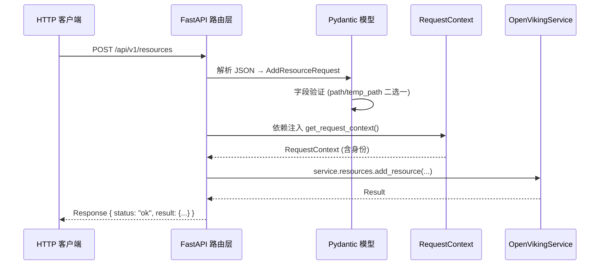

# server_api_contracts 模块技术深度解析

> 本文档面向刚加入团队的高级工程师，旨在帮助你理解这个模块的设计意图、架构角色以及关键设计决策背后的"为什么"。

## 1. 这个模块解决了什么问题？

想象一下：你在经营一家餐厅。顾客（HTTP 客户端）通过菜单（API 文档）点餐，厨房（Service 层）负责烹饪，但介于两者之间需要一个**接待员**——他负责接收订单、验证菜单项是否有效、确保厨房收到的订单格式正确。

`server_api_contracts` 模块就是这样的"接待员"。它是 OpenViking HTTP 服务器的**请求-响应契约层**，定义了：

1. **客户端可以发送什么** — 所有的请求模型（CreateAccountRequest、SearchRequest、AddMessageRequest 等）
2. **客户端会收到什么** — 标准的响应格式（Response、UsageInfo、ErrorInfo）
3. **每个 API 端点的路径和参数** — FastAPI 路由定义

没有这个模块，服务器将无法理解客户端发送的 JSON 数据；客户端也无法知道服务器期望什么格式。这个模块用**声明式的 Pydantic 模型**把"什么是合法的请求"这件事固定下来，让 API 成为一份**类型安全的契约**。

## 2. 核心抽象与心智模型

### 2.1 统一响应包装器

整个模块使用一个统一的响应格式，就像所有的快递都使用相同的包装盒：

```python
class Response(BaseModel):
    status: str          # "ok" | "error"
    result: Optional[Any] = None   # 成功时的数据
    error: Optional[ErrorInfo] = None  # 失败时的错误信息
    time: float = 0.0     # 处理耗时（毫秒）
    usage: Optional[UsageInfo] = None  # 资源使用统计
```

**为什么需要统一包装？** 这让客户端可以用统一的方式处理所有响应——无论是搜索结果还是文件列表，都从 `response.result` 获取数据。错误处理也统一走 `response.error` 路径。

### 2.2 错误码到 HTTP 状态的映射

```python
ERROR_CODE_TO_HTTP_STATUS = {
    "OK": 200,
    "INVALID_ARGUMENT": 400,
    "NOT_FOUND": 404,
    "PERMISSION_DENIED": 403,
    "UNAUTHENTICATED": 401,
    ...
}
```

这类似于航空公司的**登机口分配系统**：不同的错误码（航班号）被映射到不同的 HTTP 状态码（登机口），让负载均衡器、网关和客户端都能快速理解响应性质。

### 2.3 路由模块的分组

模块按照功能域划分为多个子模块，每个子模块对应一组相关的 API 端点：

| 子模块 | 端点前缀 | 职责 |
|--------|----------|------|
| [admin_user_and_role_contracts](server-api-contracts-admin-user-and-role-contracts.md) | `/api/v1/admin` | 账户和用户管理 |
| [filesystem_mutation_contracts](server-api-contracts-filesystem-mutation-contracts.md) | `/api/v1/fs` | 文件系统操作 |
| [pack_import_export_contracts](server-api-contracts-pack-import-export-contracts.md) | `/api/v1/pack` | 上下文导入导出 |
| [resource_and_relation_contracts](resource_and_relation_contracts.md) | `/api/v1/resources`, `/api/v1/relations` | 资源和关系管理 |
| [search_request_contracts](server-api-contracts-search-request-contracts.md) | `/api/v1/search` | 搜索功能 |
| [session_message_contracts](server-api-contracts-session-message-contracts.md) | `/api/v1/sessions` | 会话和消息管理 |
| [system_and_usage_contracts](system_and_usage_contracts.md) | `/api/v1/system` | 系统状态和健康检查 |

### 2.4 请求上下文（RequestContext）

每个需要认证的端点都会通过依赖注入获取一个 `RequestContext`，它像一张"工作证"：

```python
@dataclass
class RequestContext:
    user: UserIdentifier      # 谁：账户ID + 用户ID + 代理ID
    role: Role               # 权限级别：ROOT / ADMIN / USER
```

**为什么需要这个？** 它把"谁在请求"和"请求什么"分开。服务层不需要知道 HTTP 头里的 API Key长什么样，只需要处理这个上下文对象。

## 3. 架构概览与数据流

### 3.1 模块在系统中的位置

```
┌─────────────────────────────────────────────────────────────────────────┐
│                          HTTP 客户端                                     │
│   (Web 前端 / CLI 工具 / 第三方集成)                                      │
└─────────────────────────────────┬───────────────────────────────────────┘
                                  │ HTTP/1.1 请求
                                  ▼
┌─────────────────────────────────────────────────────────────────────────┐
│                     server_api_contracts (当前模块)                      │
│  ┌─────────────────────────────────────────────────────────────────┐   │
│  │  FastAPI Router 层                                              │   │
│  │  • 路由定义 (@router.post / @router.get)                        │   │
│  │  • 依赖注入 (get_request_context, get_service)                  │   │
│  └─────────────────────────────────────────────────────────────────┘   │
│  ┌─────────────────────────────────────────────────────────────────┐   │
│  │  Pydantic 请求/响应模型                                          │   │
│  │  • 请求验证 (MkdirRequest, SearchRequest, ...)                  │   │
│  │  • 响应包装 (Response, ErrorInfo, UsageInfo)                    │   │
│  └─────────────────────────────────────────────────────────────────┘   │
└─────────────────────────────────┬───────────────────────────────────────┘
                                  │
                                  ▼
┌─────────────────────────────────────────────────────────────────────────┐
│                        OpenVikingService                                │
│   (业务逻辑编排层：sessions / search / fs / resources / relations)      │
└─────────────────────────────────┬───────────────────────────────────────┘
                                  │
        ┌─────────────────────────┼─────────────────────────┐
        ▼                         ▼                         ▼
┌──────────────┐        ┌──────────────┐        ┌──────────────┐
│    VikingFS  │        │  VectorDB    │        │   存储层     │
│  (虚拟文件系统)│        │  (向量检索)   │        │ (持久化)     │
└──────────────┘        └──────────────┘        └──────────────┘
```

### 3.2 典型的请求处理流程

以"添加资源"为例，数据流经的路径如下：



### 3.3 关键依赖关系

这个模块依赖于以下基础设施：

| 依赖模块 | 作用 |
|----------|------|
| `openviking.server.auth` | API Key 解析和身份验证 |
| `openviking.server.identity` | Role 枚举和 RequestContext 定义 |
| `openviking.server.dependencies` | 全局服务单例获取 |
| `openviking.storage.viking_fs` | AGFS 虚拟文件系统 |
| `openviking.session.session` | 会话管理 |
| `openviking.message.part` | 消息部件（TextPart、ContextPart、ToolPart） |

## 4. 设计决策与权衡

### 决策一：为什么用 Pydantic 而不是手动验证？

**选择**：使用 Pydantic BaseModel 定义所有请求/响应模型。

```python
class AddResourceRequest(BaseModel):
    path: Optional[str] = None
    temp_path: Optional[str] = None
    target: Optional[str] = None
    # ...
    
    @model_validator(mode="after")
    def check_path_or_temp_path(self):
        if not self.path and not self.temp_path:
            raise ValueError("Either 'path' or 'temp_path' must be provided")
        return self
```

**理由**：
- **声明式验证**：字段类型、必填/可选、默认值都在模型定义中一目了然
- **自动文档**：FastAPI 利用 Pydantic 模型自动生成 OpenAPI 文档
- **自定义验证**：`model_validator` 允许跨字段的复杂验证逻辑

**Tradeoff**：引入 Pydantic 依赖，但这是现代 Python API 的标准选择，收益远大于成本。

### 决策二：为什么每个域都有独立的路由文件？

**选择**：按功能域拆分路由（admin.py、filesystem.py、sessions.py 等），而非把所有端点放在一个文件。

**理由**：
- **关注点分离**：每个路由文件只负责一组相关的端点
- **代码可读性**：按文件名就能找到对应的 API 域
- **团队分工**：不同开发者可以独立负责不同域的 API

**Tradeoff**：需要在主应用中进行路由注册，但这是可接受的组织成本。

### 决策三：Parts 模式 vs 简单 Content 模式

**选择**：在 AddMessageRequest 中同时支持两种模式：

```python
class AddMessageRequest(BaseModel):
    role: str
    content: Optional[str] = None  # 简单模式
    parts: Optional[List[Dict[str, Any]]] = None  # Parts 模式
    
    @model_validator(mode="after")
    def validate_content_or_parts(self):
        if self.content is None and self.parts is None:
            raise ValueError("Either 'content' or 'parts' must be provided")
        return self
```

**理由**：
- **向后兼容**：老的客户端可以用简单的 `content` 字段
- **功能演进**：新的客户端可以用 `parts` 来传递 Context、Tool 等复杂消息部件
- **如果只选一个**：`parts` 模式更强大但对老客户端不友好；`content` 模式简单但功能受限

### 决策四：为什么有些端点用 Query 参数而有些用 Request Body？

**选择**：
- GET 请求倾向用 Query 参数（如 `GET /fs/ls?uri=xxx&recursive=true`）
- POST 请求倾向用 Request Body（如 `POST /fs/mkdir` 用 JSON body）

**理由**：
- **语义一致性**：GET 是"获取"，查询参数天然适合；POST 是"创建/修改"，请求体适合复杂数据
- **HTTP 语义**：GET 请求不应有请求体（虽然技术上有时允许），这是规范层面的共识
- **缓存友好**：Query 参数的 GET 请求更容易被 HTTP 缓存

### 决策五：WaitRequest 的超时处理

```python
class WaitRequest(BaseModel):
    timeout: Optional[float] = None
```

**理由**：某些操作（如资源添加、向量生成）是异步的。`wait_processed` 端点允许客户端"等待"这些后台任务完成。`timeout` 字段允许客户端指定最长等待时间，避免无限阻塞。

## 5. 新贡献者需要注意的陷阱

### 5.1 路由顺序与路径匹配

FastAPI 按照路由定义的顺序进行匹配。如果你在一个具体路径之前定义了一个通配路径，具体路径将永远不会被匹配到：

```python
# 错误示例：/sessions/create 会被 /{session_id} 捕获
@router.post("/{session_id}")
async def get_session(...): ...

@router.post("/sessions/create")  # 永远不会到达
async def create_session(...): ...
```

### 5.2 异步上下文中的身份构建

在创建新账户时，你会看到这样的代码：

```python
account_ctx = RequestContext(
    user=UserIdentifier(body.account_id, body.admin_user_id, "default"),
    role=Role.ADMIN,
)
```

**注意**：这里构建了一个**全新的** RequestContext，而不是从请求中继承。这是因为新用户还不存在，无法从请求中获取身份。在初始化类操作中要牢记这一点。

### 5.3 错误处理与异常映射

所有错误都应该通过抛出异常来处理，最终会被映射到 HTTP 状态码：

```python
# 在路由中不需要这样写：
if not found:
    return Response(status="error", error=ErrorInfo(...))  # 错误：返回 200!

# 而应该这样：
if not found:
    raise NotFoundError(uri, "file")  # 正确：触发异常处理器，返回 404
```

### 5.4 Parts 模式的类型安全

`parts: Optional[List[Dict[str, Any]]]` 使用 `Dict[str, Any]` 是因为 Parts 可以是多种类型（TextPart、ContextPart、ToolPart）。这损失了静态类型检查，但保持了最大的灵活性。

### 5.5 会话加载的错误处理

```python
if request.session_id:
    session = service.sessions.session(_ctx, request.session_id)
    await session.load()  # 如果会话不存在会抛出异常
```

这个异常会直接返回 500 错误给客户端。如果你想让"会话不存在"返回 404，需要在路由层捕获处理。

### 5.6 路径参数的描述

路径参数应该总是用 Path 显式标记：

```python
account_id: str = Path(..., description="Account ID")
```

`...` 表示该参数是必填的（Ellipsis）。这不仅生成更好的 API 文档，也避免了参数默认值问题。

## 6. 扩展点与未来演进

### 6.1 如何添加新的 API 端点

1. 在对应的路由文件中定义 Request Model（Pydantic）
2. 使用 `@router.post()` 或 `@router.get()` 注册端点
3. 在依赖注入中获取 RequestContext 和 Service
4. 调用服务层方法并返回 Response

### 6.2 如何添加新的消息部件类型

如果要支持新的 Parts 类型（如 ImagePart）：

1. 在 `openviking.message.part` 中定义新的 Part 类
2. 更新 `PartRequest` 的类型联合
3. 更新 `part_from_dict` 函数的分发逻辑

### 6.3 版本演进策略

当前 API 没有版本号在路径中（如 `/api/v2/...`）。如果需要重大变更，可能需要：

1. 在路径中添加版本前缀
2. 或使用 Header 进行版本协商

## 7. 参考文档

### 子模块文档

| 子模块 | 文档文件 | 核心职责 |
|--------|----------|----------|
| 账户和用户管理 | [admin_user_and_role_contracts](server-api-contracts-admin-user-and-role-contracts.md) | 账户创建、用户注册、角色管理、API Key 轮换 |
| 文件系统操作 | [filesystem_mutation_contracts](server-api-contracts-filesystem-mutation-contracts.md) | 目录创建 (mkdir)、文件移动 (mv)、文件删除 (rm)、列表查询 (ls/tree) |
| 导入导出 | [pack_import_export_contracts](server-api-contracts-pack-import-export-contracts.md) | .ovpack 文件的导入导出 |
| 资源和关系 | [resource_and_relation_contracts](resource_and_relation_contracts.md) | 资源添加、技能加载、资源链接/取消链接 |
| 搜索功能 | [search_request_contracts](server-api-contracts-search-request-contracts.md) | 语义搜索 (search/find)、正则匹配 (grep)、路径匹配 (glob) |
| 会话消息 | [session_message_contracts](server-api-contracts-session-message-contracts.md) | 会话创建、消息添加 (支持简单 content 和丰富 parts 模式)、会话提交/提取 |
| 系统和用量 | [system_and_usage_contracts](system_and_usage_contracts.md) | 健康检查 (health/ready)、系统状态、等待处理完成、统一响应格式 |

### 系统级文档

- [core_context_prompts_and_sessions](core_context_prompts_and_sessions.md) — Session 运行时实现，理解会话如何在后端工作
- [client_session_and_transport](client_session_and_transport.md) — 客户端会话管理，了解 SDK 端如何与 API 交互
- [python_client_and_cli_utils](python_client_and_cli_utils.md) — Python 客户端工具库，包括配置管理和 LLM 客户端