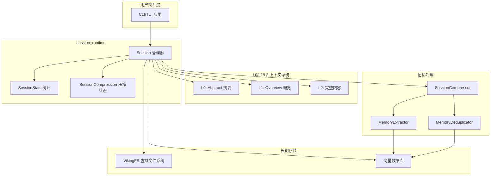
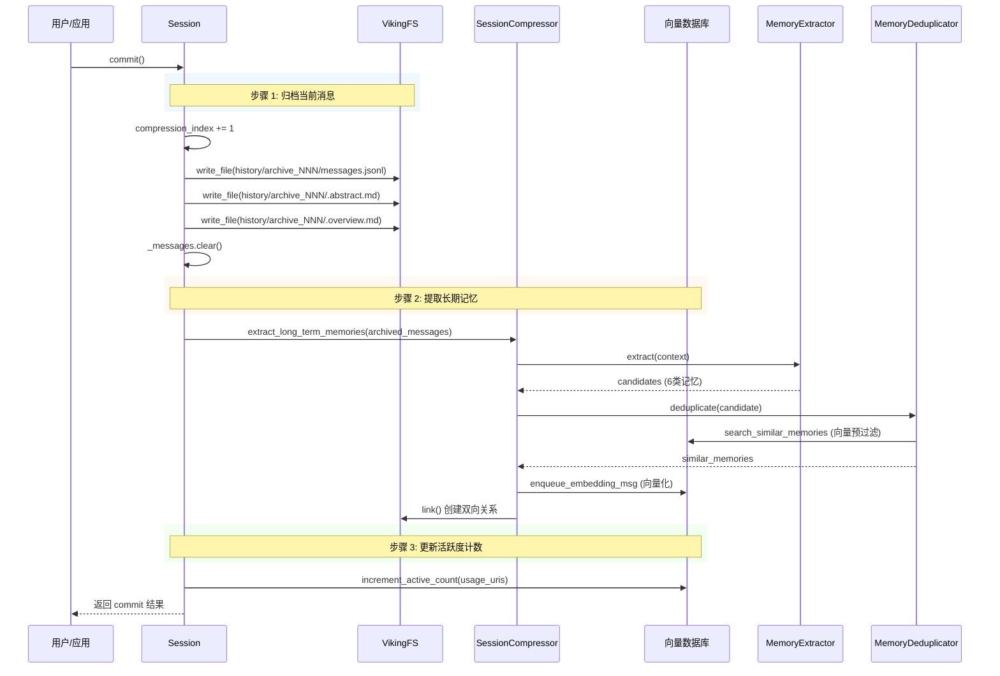

# session_runtime 模块技术深度解析

## 模块概述

`session_runtime` 是 OpenViking 系统的会话运行时核心模块，负责管理用户与 AI 助手之间的对话生命周期。将其理解为一座“记忆宫殿”的管理员——它不仅记录每一轮对话（消息），还能在对话积累到一定程度时，将旧对话压缩归档、从中提取长期记忆，并与上下文资源建立关联。

这个模块解决的核心问题是：**如何让 AI 在长期多轮交互中保持“记忆”，既不丢失重要信息，又不会因为历史数据无限膨胀而影响性能。**

## 架构角色与定位



在 OpenViking 的 L0/L1/L2 上下文分层体系中，Session 扮演着承上启下的枢纽角色：

- **L0（Abstract）**：会话的一句话摘要，如"5 轮对话，从用户询问 Python 异步编程开始"
- **L1（Overview）**：会话的目录结构描述，包含消息文件、历史归档、工具调用记录等
- **L2（Content）**：具体的消息内容、工具输出、上下文引用

Session 模块向上对接检索系统（通过 `get_context_for_search` 提供历史摘要），向下连接存储层（VikingFS 持久化消息，VikingDBManager 管理向量索引），同时与技能加载器（SkillLoader）协同追踪技能使用情况。

## 核心组件

### Session 类

Session 是整个模块的核心类，采用数据类与业务逻辑混合的设计模式。其核心职责包括：

**消息生命周期管理**

```python
class Session:
    def __init__(self, viking_fs, vikingdb_manager, session_compressor, ...):
        self._messages: List[Message] = []           # 内存中的消息列表
        self._session_uri = f"viking://session/{user_space}/{session_id}"
```

Session 在内存中维护一个消息列表，通过 `add_message` 增量添加到内存，同时实时写入 JSONL 文件实现持久化。这种"内存缓冲 + 追加写入"的策略平衡了读写性能——读取时直接读内存（最新消息）或文件（历史消息），写入时仅追加而非全量重写。

**归档与压缩机制**

Session 实现了类似于日志轮转（log rotation）的压缩策略：

1. **触发条件**：`commit()` 方法被调用时（通常由外部调度器在对话积累到一定轮数后触发）
2. **归档操作**：将当前消息复制到 `history/archive_NNN/` 目录
3. **摘要生成**：调用 VLM（视觉语言模型）或使用模板生成结构化摘要
4. **内存提取**：通过 `SessionCompressor` 从归档中提取长期记忆
5. **关系建立**：记录本次会话使用的上下文和技能

```python
def commit(self) -> Dict[str, Any]:
    # 1. 归档当前消息
    self._compression.compression_index += 1
    messages_to_archive = self._messages.copy()
    self._write_archive(...)
    
    # 2. 提取长期记忆
    if self._session_compressor:
        memories = run_async(self._session_compressor.extract_long_term_memories(...))
    
    # 3. 写入当前消息到 AGFS
    self._write_to_agfs(self._messages)
    
    # 4. 创建关联关系
    self._write_relations()
    
    # 5. 更新活跃计数
    self._update_active_counts()
```

### 数据结构

**SessionCompression**：记录压缩状态

```python
@dataclass
class SessionCompression:
    summary: str = ""                    # 当前压缩版本的摘要
    original_count: int = 0              # 归档的原始消息数
    compressed_count: int = 0            # 压缩后的消息数
    compression_index: int = 0           # 归档序号，用于命名 archive_001, archive_002...
```

**SessionStats**：会话统计信息

```python
@dataclass
class SessionStats:
    total_turns: int = 0                 # 用户提问轮数
    total_tokens: int = 0                # 累计 token 消耗（估算）
    compression_count: int = 0           # 压缩次数
    contexts_used: int = 0               # 使用的上下文数量
    skills_used: int = 0                 # 调用的技能数量
    memories_extracted: int = 0          # 提取的记忆数量
```

**Usage**：资源使用记录，用于追踪会话过程中引用的上下文和技能

```python
@dataclass
class Usage:
    uri: str                             # 资源 URI
    type: str                            # "context" | "skill"
    contribution: float = 0.0            # 贡献度评分
    input: str = ""                      # 调用输入
    output: str = ""                     # 调用输出
    success: bool = True                 # 是否成功
```

## 数据流分析

### 消息流转路径

```
用户输入 → add_message() → _append_to_jsonl() 
                              ↓
                     VikingFS.write_file (持久化)
                              ↓
                     messages.jsonl (当前会话)
```

消息的生命周期遵循"写入放大"的写策略优化：每条消息产生时，先写入内存列表，再追加到 JSONL 文件。这种设计使得：
- **读取当前会话**：直接从内存 `_messages` 读取，O(1) 复杂度
- **读取历史归档**：从 `history/archive_NNN/messages.jsonl` 按需加载
- **写入操作**：仅追加而非重写整个文件，I/O 成本最小化

### 提交与归档流程



### 检索上下文流程

当需要为新查询提供会话历史上下文时，调用 `get_context_for_search()`：

```python
async def get_context_for_search(self, query, max_archives=3, max_messages=20):
    # 1. 加载最近的 N 条消息
    recent_messages = self._messages[-max_messages:]
    
    # 2. 从历史归档中检索与 query 相关的内容
    #    - 遍历 history/ 目录
    #    - 读取每个 archive 的 .overview.md
    #    - 计算 keyword 匹配得分
    #    - 按相关度排序，返回 top N
    summaries = self._find_relevant_archives(query, max_archives)
    
    return {"summaries": summaries, "recent_messages": recent_messages}
```

这里有一个**设计权衡**：检索采用简单的关键词匹配而非向量相似度搜索，是出于性能和实现复杂度的考量。完整向量检索需要额外的 embedding 计算和向量存储查询，在这个场景下 overkill——用户会话的历史归档数量通常有限，关键词匹配已足够有效。

## 依赖关系分析

### 依赖注入

Session 采用了依赖注入模式，核心依赖通过构造函数传入：

```python
def __init__(
    self,
    viking_fs: "VikingFS",                    # 文件系统抽象
    vikingdb_manager: Optional["VikingDBManager"] = None,  # 向量数据库
    session_compressor: Optional["SessionCompressor"] = None,  # 记忆提取器
    user: Optional["UserIdentifier"] = None,
    ctx: Optional[RequestContext"] = None,
    ...
):
```

这种设计带来的好处：
1. **可测试性**：可以注入 mock 的 VikingFS 进行单元测试
2. **可组合性**：VikingDBManager 和 SessionCompressor 是可选的，Session 可以工作在"最小模式"下
3. **解耦**：Session 不需要知道存储实现的细节

### 被依赖关系

以下模块依赖 Session：

- **检索系统**（HierarchicalRetriever）：通过 `get_context_for_search` 获取会话历史
- **调度器**（可能外部调用）：触发 `commit()` 进行归档
- **API 层**（Server Routers）：`/sessions` 路由创建和管理会话

### 关键契约

**VikingFS 接口约定**：Session 假设以下方法可用且行为符合预期：

- `read_file(uri)` → 返回文件内容字符串
- `write_file(uri, content)` → 写入文件
- `append_file(uri, content)` → 追加内容
- `ls(uri)` → 返回目录条目列表
- `mkdir(uri, exist_ok)` → 创建目录
- `stat(uri)` → 获取文件/目录元信息
- `link(from_uri, to_uri)` → 创建关联关系

**Message 格式约定**：Session 依赖 Message 类提供：
- `to_jsonl()` → 序列化为 JSONL 格式
- `from_dict()` → 从字典反序列化
- `find_tool_part(tool_id)` → 查找特定工具调用

## 设计决策与权衡

### 1. 同步 I/O 包装 vs 异步实现

Session 内部大量使用 `run_async()` 包装异步调用：

```python
run_async(self._viking_fs.write_file(...))
```

这是因为 Session 的公共接口设计为同步方法（便于同步调用方使用），但底层 VikingFS 是异步实现。这种"同步外壳"模式是一种实用主义妥协：

- **权衡**：牺牲了一些性能（线程上下文切换），换取 API 的简洁性
- **替代方案**：如果性能成为瓶颈，可以考虑将 Session 改为完全异步设计

### 2. 内存缓冲策略

Session 在内存中维护完整消息列表 `_messages`，直到 `commit()` 才清空：

```python
def commit(self):
    # ... 归档操作 ...
    self._messages.clear()  # 提交后清空内存
```

这意味着：
- **优点**：最新消息读取极快（O(1) 内存访问）
- **缺点**：长时间运行的会话可能导致内存占用增长

**潜在的改进方向**：引入基于 token 数量的内存阈值，而非固定轮数

### 3. 摘要生成的两种路径

```python
def _generate_archive_summary(self, messages):
    vlm = get_openviking_config().vlm
    if vlm and vlm.is_available():
        # 路径1: 使用 VLM 生成结构化摘要
        prompt = render_prompt("compression.structured_summary", {"messages": formatted})
        return run_async(vlm.get_completion_async(prompt))
    else:
        # 路径2: 降级为模板摘要
        turn_count = len([m for m in messages if m.role == "user"])
        return f"# Session Summary\n\n**Overview**: {turn_count} turns, {len(messages)} messages"
```

这是一个**优雅降级**的设计：有 VLM 时生成高质量摘要，没有时使用简单模板保证功能可用。

### 4. 关系创建的副作用

```python
def _write_relations(self):
    for usage in self._usage_records:
        run_async(viking_fs.link(self._session_uri, usage.uri, ctx=self.ctx))
```

每次 `commit()` 都会为本次会话使用的资源创建关系链接。这使得：
- 可以追溯"哪些会话使用了这个上下文"
- 但也意味着 commit 操作有副作用（修改关联表）

## 使用指南

### 创建会话

```python
session = Session(
    viking_fs=viking_fs,                    # 必须：VikingFS 实例
    vikingdb_manager=vikingdb_manager,      # 可选：用于记忆提取
    session_compressor=session_compressor,  # 可选：用于长期记忆提取
    user=UserIdentifier("my_account", "user1", "agent1"),
    auto_commit_threshold=8000,             # 可选：自动提交阈值（token 数）
)
```

### 添加消息

```python
# 用户消息
user_msg = session.add_message(
    role="user",
    parts=[TextPart(text="帮我解释一下 Python 的异步编程")]
)

# AI 助手消息（可能包含上下文引用和工具调用）
assistant_msg = session.add_message(
    role="assistant",
    parts=[
        TextPart(text="好的，让我来解释..."),
        ContextPart(uri="viking://.../memories/async", context_type="memory"),
        ToolPart(tool_id="tool_123", tool_name="python_executor", tool_input="..."),
    ]
)
```

### 记录资源使用

```python
# 记录本次对话使用的上下文
session.used(
    contexts=["viking://agent/xxx/memories/async-pattern", 
              "viking://resources/python/docs"],
    skill={"uri": "viking://skills/python-executor", "input": "...", "output": "..."}
)
```

### 提交归档

```python
result = session.commit()
# {
#     "session_id": "abc123",
#     "status": "committed",
#     "memories_extracted": 3,
#     "active_count_updated": 5,
#     "archived": True,
#     "stats": {...}
# }
```

### 检索会话上下文

```python
context = await session.get_context_for_search(
    query="如何处理并发请求",
    max_archives=3,
    max_messages=20
)
# context["summaries"]      → 相关归档的概述列表
# context["recent_messages"] → 最近 20 条消息
```

## 常见陷阱与注意事项

### 1. 异步方法的同步调用

Session 内部使用 `run_async` 包装异步 I/O，这在大多数场景下工作正常，但如果在已经运行于异步上下文的地方调用（如 FastAPI 的 `async def` 端点），可能导致警告或死锁。建议：

- 在异步上下文中直接调用 VikingFS 的异步方法
- 或确保 `run_async` 使用的是正确的 event loop

### 2. 消息 ID 的唯一性

每条消息通过 `uuid4()` 生成唯一 ID：

```python
msg = Message(id=f"msg_{uuid4().hex}", ...)
```

但在分布式环境下，如果多个实例同时为同一会话添加消息，仍有 ID 冲突的理论风险。当前实现假设单实例或协调机制（如分布式锁）已处理好这个问题。

### 3. 归档文件的累积

`compression_index` 持续递增，历史归档文件不会被自动清理：

```
history/
├── archive_001/
├── archive_002/
...
└── archive_999/
```

长期运行的服务需要配套的归档清理策略（如基于时间或数量的 TTL）。

### 4. 工具状态更新的延迟写入

```python
def update_tool_part(self, message_id, tool_id, output, status):
    # 1. 更新内存中的消息对象
    tool_part.tool_output = output
    tool_part.tool_status = status
    
    # 2. 保存工具结果到单独文件
    self._save_tool_result(...)
    
    # 3. 重写整个 messages.jsonl
    self._update_message_in_jsonl()
```

第3步会重写整个消息文件，在消息数量较多时可能有一定 I/O 开销。

### 5. 活跃度计数的失败容忍

```python
def _update_active_counts(self) -> int:
    try:
        updated = run_async(self._vikingdb_manager.increment_active_count(...))
    except Exception as e:
        logger.debug(f"Could not update active_count: {e}")
        updated = 0
```

这里对 VikingDB 操作失败进行了静默处理——不会导致整个 commit 失败，但可能导致统计数据不准确。调用方需要注意这个"可能不准确"的特点。

## 相关模块参考

### 上游依赖（Session 依赖这些模块）

- [session-compressor](session-compressor.md) — SessionCompressor 负责从归档消息中提取长期记忆
- [session-memory-deduplication](session-memory-deduplication.md) — MemoryDeduplicator 实现记忆去重的双层过滤策略
- [storage-viking-fs](storage-viking-fs.md) — VikingFS 是所有持久化操作的底层能力
- [message](message.md) — Message 是会话消息的数据模型定义
- [storage-vectordb](storage-vectordb.md) — 向量数据库管理活跃度计数和记忆向量化

### 下游依赖（依赖 Session 的模块）

- [retrieval-hierarchical-retriever](retrieval-hierarchical-retriever.md) — 通过 `get_context_for_search` 获取历史上下文
- [cli-bootstrap-and-runtime-context](cli-bootstrap-and-runtime-context.md) — CLI 层调用 Session 进行会话管理

### 重要接口契约

- `RequestContext`（位于 [server-api-contracts](server-api-contracts.md)）— Session 的每个文件操作都需要携带此上下文进行权限验证
- `UserIdentifier`（位于 [client-session-and-transport](client-session-and-transport.md)）— 用户身份标识，用于构建 URI 路径
- `OpenVikingConfig`（位于 [configuration-models-and-singleton](configuration-models-and-singleton.md)）— 提供 VLM 配置，用于生成归档摘要