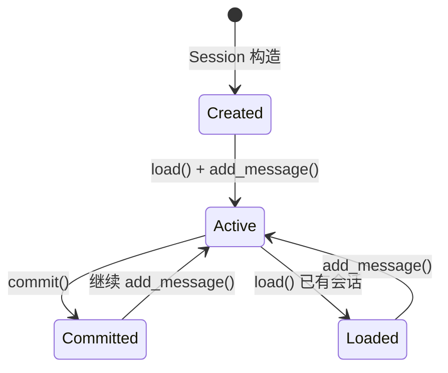
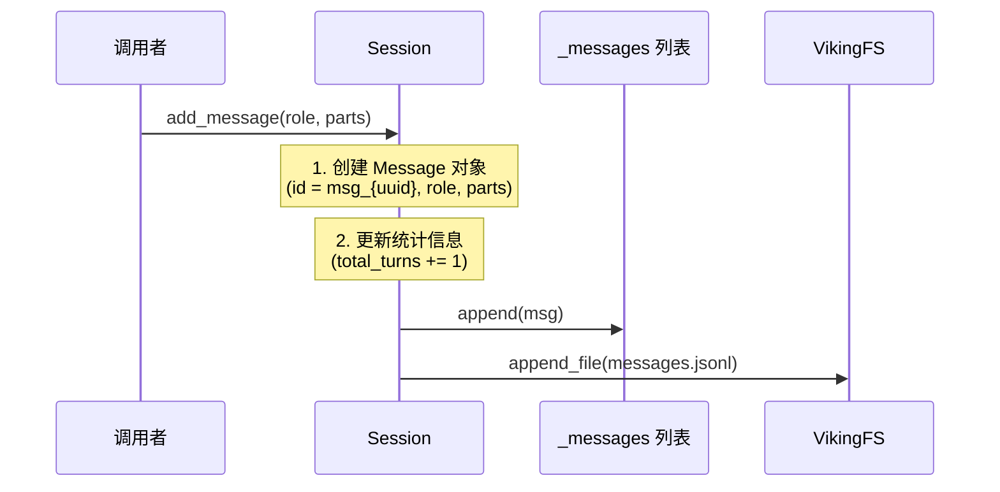
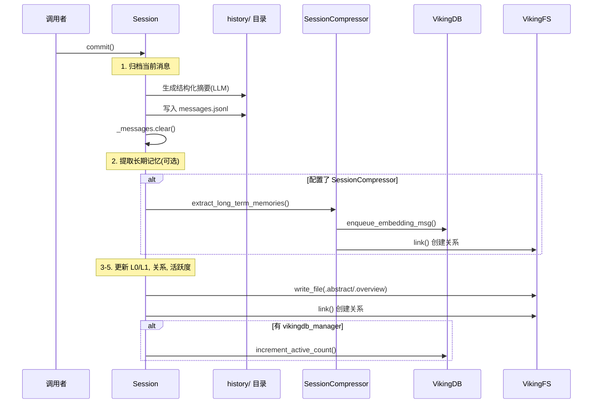

# session_runtime 模块技术深度解析

## 模块概述

`session_runtime` 模块是 OpenViking 系统中最核心的会话管理层，负责管理用户与 AI 助手之间的对话生命周期。想象一下，如果你把一次对话看作一个人从进入咖啡馆到离开的全过程——那么 Session 就是这个咖啡馆的"记忆系统"：它记录每一轮对话（消息），追踪用户使用了哪些参考资料和工具，在对话积累到一定程度后"打包"旧对话（归档），并从归档中提取有价值的"长期记忆"供未来使用。

这个模块解决的核心问题是：**如何在有限上下文窗口下维持一个持续、有状态的对话体验，同时将对话中的有价值信息沉淀为可检索的长期记忆**。一个朴素的方案是把所有消息都塞进上下文，但这样会导致 token 爆炸；另一个朴素方案是直接丢弃旧消息，但这会丧失上下文连贯性。Session 模块的设计 insight 在于采用"滚动窗口"策略——保留最近的活跃消息，将历史消息归档为结构化摘要，并在归档内容上运行 LLM 提取长期记忆（memory），从而实现上下文连续性与信息沉淀的平衡。

## 架构与数据流

### 核心抽象：会话作为状态机

Session 类本身可以理解为一个有限状态机，其生命周期包含三个主要状态：

1. **活跃态（Active）**：会话正在接收新消息，消息存储在内存中，同时实时追加到 `messages.jsonl` 文件
2. **已提交态（Committed）**：当调用 `commit()` 方法时，当前活跃消息被归档到 `history/` 目录，触发内存提取流程
3. **已加载态（Loaded）**：通过 `load()` 方法从持久化存储恢复会话历史



### 数据存储结构

Session 使用 VikingFS 作为存储后端，每个会话在虚拟文件系统中有如下结构：

```
viking://session/{user_space}/{session_id}/
├── messages.jsonl          # 当前活跃消息（JSONL 格式，每行一个 Message）
├── .abstract.md            # 会话一句话摘要
├── .overview.md            # 会话目录结构描述
├── history/
│   ├── archive_001/
│   │   ├── messages.jsonl  # 归档的消息
│   │   ├── .abstract.md    # 归档摘要
│   │   └── .overview.md    # 归档概览
│   ├── archive_002/
│   │   └── ...
│   └── archive_003/
│       └── ...
└── tools/
    └── {tool_id}/
        └── tool.json       # 工具调用结果
```

### 关键数据流

**消息添加流程（add_message）**：



**会话提交流程（commit）**：



## 核心组件解析

### Session 类

Session 是整个模块的核心类，其设计体现了几个关键决策：

**构造参数设计**：

```python
def __init__(
    self,
    viking_fs: "VikingFS",                    # 文件系统抽象（必需）
    vikingdb_manager: Optional["VikingDBManager"] = None,  # 向量数据库（可选）
    session_compressor: Optional["SessionCompressor"] = None,  # 内存压缩器（可选）
    user: Optional["UserIdentifier"] = None,   # 用户标识
    ctx: Optional[RequestContext] = None,      # 请求上下文
    session_id: Optional[str] = None,          # 会话 ID（可选，自动生成）
    auto_commit_threshold: int = 8000,         # 自动提交阈值（当前未使用）
)
```

这里有一个重要的设计选择：**VikingDBManager 和 SessionCompressor 是可选的**。这意味着 Session 可以以"轻量模式"运行——仅做消息存储和检索，不做向量化索引和内存提取。这种设计使得模块可以在不同场景下复用：完整的 AI Agent 场景需要全功能，而简单的聊天场景只需基本的消息持久化。

**消息模型（Message = role + parts）**：

Session 内部的消息模型采用"角色+部件"的结构，这比传统的"字符串消息"更灵活：

- **TextPart**：纯文本内容
- **ContextPart**：引用的上下文（memory/resource/skill），包含 URI 和摘要
- **ToolPart**：工具调用，包含 tool_id、tool_name、tool_input、tool_output、tool_status

这种设计使得会话不仅存储文本，还可以追踪"这个回答参考了哪篇文档"、"调用了哪个工具"。这对于后续的检索和记忆提取至关重要。

**核心方法详解**：

1. **`add_message(role, parts)`** — 添加消息的入口方法。它同步更新内存状态，异步持久化到 JSONL。选择异步写入是因为每次消息都等待磁盘 IO 会严重影响交互延迟，但这种设计也意味着如果在异步写入完成前进程崩溃，消息会丢失。这是一个典型的**性能 vs 持久化一致性**的 tradeoff。

2. **`commit()`** — 会话提交的完整流程。如前所述，它执行归档、内存提取、关系创建、活跃度更新等步骤。这个方法是**幂等的**——连续多次调用 commit 会递增 compression_index，每次都创建新的归档。

3. **`get_context_for_search(query, max_archives, max_messages)`** — 为搜索提供上下文的工具方法。它返回两类内容：
   - `recent_messages`：最近 N 条消息（直接从内存获取）
   - `summaries`：最相关且最新的 N 个归档的 overview（通过查询匹配）

   这个方法是**懒加载的**——它不读取完整的归档消息，而是只读取预生成的 `.overview.md`，这大大减少了检索延迟。

### 辅助数据类

**SessionStats** — 会话统计信息容器，包含 total_turns（用户轮次）、total_tokens（估算）、compression_count（归档次数）、contexts_used、skills_used、memories_extracted。这些统计数据在 commit 时汇总，可用于分析用户行为和系统性能。

**SessionCompression** — 压缩状态记录，包含当前归档索引、原始消息数、压缩后消息数。compression_index 是恢复会话状态的关键——load 时通过扫描 history 目录找到最大索引来恢复。

**Usage** — 使用记录，用于追踪会话期间使用了哪些 context 和 skill。每个 Usage 记录包含 uri、type（context/skill）、input、output、success 标志。这些数据在 commit 时用于创建关系和更新活跃计数。

## 依赖分析

### 上游依赖（Session 调用什么）

Session 的运行依赖三个核心外部组件：

1. **VikingFS** — 虚拟文件系统抽象
   - `read_file()` / `write_file()` / `append_file()`：消息持久化
   - `mkdir()`：创建会话目录结构
   - `ls()`：扫描历史归档
   - `link()`：创建关系
   - `stat()`：检查会话是否存在

2. **VikingDBManager**（可选）— 向量数据库管理器
   - `increment_active_count()`：更新 context/skill 的活跃度计数
   - `enqueue_embedding_msg()`：将提取的记忆入队向量化

3. **SessionCompressor**（可选）— 内存提取器
   - `extract_long_term_memories()`：从归档消息中提取长期记忆

**依赖契约**：Session 对 VikingFS 是强依赖（如果没有文件系统，会话无法持久化），但对 VikingDBManager 和 SessionCompressor 是弱依赖（缺失时跳过相应功能）。

### 下游调用者（什么调用 Session）

1. **SessionService** — 会话管理的服务层入口
   - `session(ctx, session_id)`：工厂方法，创建 Session 实例
   - `create(ctx)`：创建新会话
   - `get(session_id, ctx)`：获取并加载现有会话
   - `commit(session_id, ctx)`：提交会话

2. **HTTP Router 层** — 通过 SessionService 间接调用
   - 接收 API 请求，转换为 Session 操作

3. **TUI/CLI 客户端** — 直接实例化 Session（较少见）

### 数据契约

Session 与 VikingFS 之间的数据契约以 URI 为中心：

- 会话根 URI：`viking://session/{user_space}/{session_id}`
- 归档 URI：`viking://session/{user_space}/{session_id}/history/archive_{index}`
- 工具结果 URI：`viking://session/{user_space}/{session_id}/tools/{tool_id}/tool.json`

Session 期望 VikingFS 返回的 `ls()` 结果包含 `name` 字段，返回的 `read_file()` 结果是字符串。这些是脆弱的隐式契约——如果 VikingFS 改变返回格式，Session 会出错。

## 设计决策与权衡

### 1. 同步内存 vs 异步持久化

`add_message()` 采用"同步更新内存 + 异步写入磁盘"的模式。这是一个**最终一致性**的设计选择：

- **优点**：低延迟——用户感知不到磁盘 IO
- **缺点**：如果在异步写入完成前崩溃，消息丢失

**备选方案**：同步写入（每次 add_message 都等待磁盘返回）。这会显著增加响应延迟，特别是在网络文件系统上。

**当前选择的原因**：对于交互式对话应用，响应速度优先级更高；而且 Session 会定期 commit，即使丢失也只是最近几分钟的消息，风险可控。

### 2. JSONL 作为消息存储格式

消息存储在 `messages.jsonl` 文件中，每行一个 JSON 对象。

**为什么不用 JSON 文件**：
- JSONL 支持流式追加（append），无需读取整个文件
- 并发写入时不易损坏（虽然当前实现不是并发的）
- 便于日志系统集成

**缺点**：
- 更新和删除消息需要重写整个文件（`_update_message_in_jsonl` 的实现就是这样）
- 随着消息增多，文件会越来越大

**当前选择的原因**：对话日志是追加型写入远多于更新删除的场景，JSONL 是最简洁的方案。

### 3. LLM 摘要作为归档格式

归档时，Session 会尝试用 LLM 生成结构化摘要（`_generate_archive_summary`），如果 LLM 不可用则回退到简单统计。

**为什么需要 LLM**：
- 简单统计（如"10 轮对话，15 条消息"）无法捕捉语义信息
- 检索时需要的是"这次会话讨论了什么主题"，而不是"有多少条消息"

**为什么是可选的**：
- 并非所有部署都有 LLM 可用
- LLM 调用有延迟和成本

**设计权衡**：这是一种优雅降级——有 LLM 时生成语义丰富的归档，没有时至少保留消息副本供后续处理。

### 4. 记忆提取的六类分类

`MemoryExtractor` 将记忆分为六类：
- **PROFILE**：用户画像（姓名、角色、背景）
- **PREFERENCES**：用户偏好（格式、语气、工具习惯）
- **ENTITIES**：实体知识（项目名、代码结构、业务概念）
- **EVENTS**：事件记录（已完成的操作、达成的决策）
- **CASES**：案例模式（问题-解决方案对）
- **PATTERNS**：行为模式（重复的工作流程）

这个分类的设计依据是**记忆的时效性和归属**：PROFILE/PREFERENCES/ENTITIES/EVENTS 属于用户空间（user_space），因为它们描述的是用户个人；CASES/PATTERNS 属于 agent_space，因为它们是 Agent 学到的解决问题的方法。

### 5. 延迟加载 vs 预加载

Session 的 `load()` 方法是懒加载的——只有在首次访问会话数据时才从磁盘读取。

**优点**：
- 启动快——不需要每次都扫描文件系统
- 按需加载——如果只创建 Session 但不操作，可以跳过 IO

**缺点**：
- 第一个操作有额外延迟
- 如果忘记调用 load()，会操作空会话

**这是一个典型的空间换时间的 tradeoff**，当前选择是偏向轻量启动。

## 使用指南

### 基本用法

```python
from openviking.session.session import Session
from openviking.storage.viking_fs import VikingFS
from openviking.server.identity import RequestContext, Role
from openviking_cli.session.user_id import UserIdentifier

# 1. 创建请求上下文
ctx = RequestContext(
    user=UserIdentifier.the_default_user(),
    role=Role.ROOT
)

# 2. 创建会话（假设 viking_fs 已初始化）
session = Session(
    viking_fs=viking_fs,
    vikingdb_manager=vikingdb_manager,
    session_compressor=session_compressor,
    ctx=ctx
)

# 3. 确保会话目录存在
await session.ensure_exists()

# 4. 添加消息
from openviking.message import Message, TextPart

session.add_message(
    role="user",
    parts=[TextPart(text="帮我看看这个项目的结构")]
)

session.add_message(
    role="assistant",
    parts=[TextPart(text="好的，这是一个 Python 项目，包含以下模块...")]
)

# 5. 提交会话（归档 + 提取记忆）
result = session.commit()
# result = {
#     "session_id": "...",
#     "status": "committed",
#     "memories_extracted": 3,
#     "active_count_updated": 5,
#     "archived": True,
#     "stats": {...}
# }
```

### 检索会话上下文

```python
# 为搜索准备上下文
context = await session.get_context_for_search(
    query="用户关于 API 设计的偏好",
    max_archives=3,
    max_messages=20
)

# context = {
#     "summaries": ["归档1的概述", "归档2的概述", ...],
#     "recent_messages": [Message, Message, ...]
# }
```

### 追踪上下文和工具使用

```python
# 在消息中引用 context
from openviking.message import ContextPart

session.add_message(
    role="assistant",
    parts=[
        TextPart(text="根据之前讨论的架构，我建议..."),
        ContextPart(
            uri="viking://user/default/memories/architecture.md",
            context_type="memory",
            abstract="用户偏好分层架构"
        )
    ]
)

# 显式记录使用的 contexts 和 skills
session.used(
    contexts=["viking://user/default/resources/api_design.md"],
    skill={"uri": "viking://agent/default/skills/code_review", "success": True}
)
```

## 边缘情况与陷阱

### 1. 并发写入问题

当前 Session 实现**不是线程安全的**。如果在多个协程/线程中同时调用 `add_message()`，可能导致：

- 消息顺序错乱
- JSONL 文件损坏（两条消息的 JSON 混在一起）

**缓解措施**：
- 在 SessionService 层面加锁
- 使用 `asyncio.Lock` 保护 Session 实例

### 2. commit() 的幂等性

连续调用两次 `commit()` 会创建两个归档，而不是覆盖。这意味着：

- 如果业务逻辑需要"检查是否有未提交消息再提交"，需要在调用前检查 `len(self._messages) > 0`
- 归档会持续增长，需要外部清理机制

### 3. 消息更新后 JSONL 不同步

`update_tool_part()` 方法会更新内存中的 Message 对象，并尝试更新 JSONL，但如果在写入过程中发生异常，内存和磁盘会不一致。

### 4. LLM 摘要失败静默回退

当 LLM 不可用时，`_generate_archive_summary()` 会静默回退到简单统计。这可能导致归档的检索质量下降，但不会抛出错误。开发者需要通过日志监控这种情况。

### 5. 路径编码问题

Session 使用 URI 路径存储，如果 session_id 包含特殊字符（如 `/`），可能导致路径解析错误。当前实现没有对 session_id 做严格校验。

### 6. 内存泄漏风险

Session 维护了 `_messages` 列表在内存中，如果会话生命周期很长且消息很多，可能导致内存占用持续增长。建议在 `commit()` 后考虑清理策略。

### 7. load() 的隐式调用

`exists()` 和 `ensure_exists()` 不自动调用 `load()`，这意味着一个"存在但未加载"的 Session 在调用 `commit()` 时会提交空消息列表。如果要操作现有会话，务必先调用 `await session.load()`。

### 8. 活跃计数更新的失败容忍

在 `commit()` 过程中，`_update_active_counts()` 方法负责更新使用的 context 和 skill 的活跃度计数。这个操作失败时不会阻止归档流程：

```python
def _update_active_counts(self) -> int:
    if not self._vikingdb_manager:
        return 0
    
    uris = [usage.uri for usage in self._usage_records if usage.uri]
    try:
        updated = run_async(self._vikingdb_manager.increment_active_count(self.ctx, uris))
    except Exception as e:
        logger.debug(f"Could not update active_count: {e}")
        updated = 0
    
    return updated
```

这意味着即使 VikingDB 操作失败，用户的会话归档仍然成功，但相关资源的"活跃度"指标不会更新。这可能导致推荐系统低估某些常用资源的价值。

### 9. 会话不存在时的空提交

如果调用 `session.commit()` 时 `_messages` 列表为空，方法会直接返回而不执行任何归档操作：

```python
def commit(self) -> Dict[str, Any]:
    if not self._messages:
        return result  # 提前返回，不创建空归档
```

这本身是合理的行为，但调用者需要注意：如果业务逻辑期望每次 commit 都创建一个归档（例如用于时间戳记录），需要预先检查消息数量。

## 相关模块参考

### 父模块
- [session_runtime_and_skill_discovery](./session_runtime_and_skill_discovery.md) — 模块总览，了解 Session、SkillLoader、DirectoryDefinition 如何协同工作

### 核心依赖
- [session_memory_deduplication](./session_memory_deduplication.md) — 记忆去重逻辑，commit 时如何避免重复记忆
- [viking_fs](./viking_fs.md) — VikingFS 虚拟文件系统，Session 的存储后端
- [message](./message.md) — Message 和 Part 的类型定义
- [session_service](./session_service.md) — SessionService 服务层，HTTP 路由如何调用 Session

### 配合模块
- [openviking-core-skill_loader](./openviking-core-skill_loader.md) — SkillLoader 技能加载器
- [core-context-directories](./core-context-directories.md) — DirectoryDefinition 目录定义与初始化