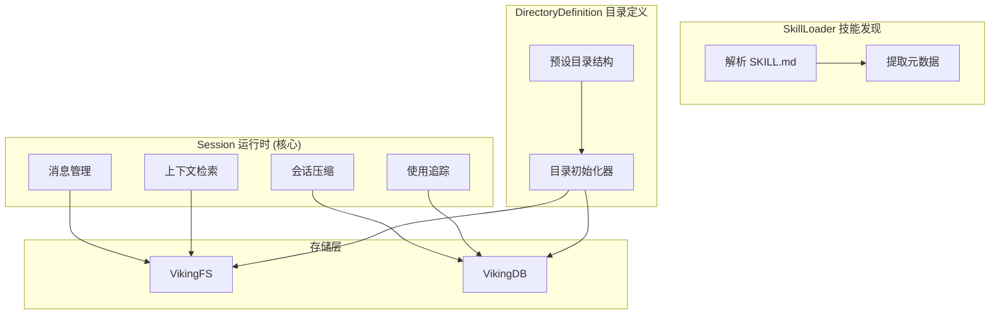

# session_runtime_and_skill_discovery

## 模块概述

想象一下，你正在经营一家高端餐厅。顾客（用户）每次来访都会产生对话、点餐记录、特殊偏好等信息。**session_runtime_and_skill_discovery** 模块就像是这家餐厅的"前台管理系统"——它负责：

1. **接待顾客**（Session）：管理每一桌顾客的完整用餐体验，从入座到离开的全程记录
2. **发现厨艺**（SkillLoader）：当顾客需要特定菜品时，快速找到对应的厨师技能
3. **规划座位**（DirectoryDefinition）：预先设计好餐厅的座位区域（用户区、厨师区、食材区等），让每个人都清楚该坐在哪里

这个模块是 OpenViking 系统的"营业大厅"——所有交互都从这里开始，所有资源都围绕它组织。

## 架构概览



**数据流动**：

1. **会话生命周期**：用户发送消息 → Session.add_message() → 写入 messages.jsonl → 累积到阈值 → Session.commit() 触发压缩归档
2. **技能发现**：调用 SkillLoader.load(path) → 解析 YAML frontmatter → 返回结构化 skill dict
3. **目录初始化**：DirectoryInitializer.initialize_account_directories() → 创建 preset 目录 → 同时写入 VikingFS 和 VikingDB

## 核心设计决策

### 1. 会话压缩而非删除

**决策**：当会话消息累积到阈值时，不直接删除旧消息，而是归档到 `history/archive_XXX/` 目录。

**为什么这样做**：
- 机器学习系统需要历史数据来提取长期记忆
- 用户可能需要回溯之前的对话
- LLM 可以基于历史归档生成更个性化的摘要

** tradeoff 分析**：
- 优点：保留了完整的会话历史，支持内存提取
- 缺点：存储空间会持续增长（但可通过清理旧归档解决）

### 2. 三层上下文抽象 (L0/L1/L2)

OpenViking 使用分层抽象来组织上下文：

| 层级 | 文件 | 用途 | 示例 |
|------|------|------|------|
| L0 | `.abstract.md` | 一句话摘要 | "用户偏好使用 Python，倾向简洁代码风格" |
| L1 | `.overview.md` | 详细描述 | 完整的项目背景、技术栈、约束条件 |
| L2 | `content.md` | 完整内容 | 实际的代码、文档、对话记录 |

**为什么这样设计**：这种"摘要优先"的架构让语义搜索可以先快速筛选大量候选，再用 L1/L2 进行精排——就像先读目录再读章节。

### 3. 虚拟 URI 体系

所有资源通过 `viking://{scope}/{space}/...` 格式的 URI 访问：

- `viking://session/{session_id}` - 会话级临时存储
- `viking://user/{user_space}/memories` - 用户长期记忆
- `viking://agent/{agent_space}/skills` - Agent 技能注册表
- `viking://resources/{project}` - 共享知识库

**这种设计的好处**：
- 统一的资源定位方式
- 作用域隔离保证数据安全
- URI 直接映射到存储路径

## 子模块说明

> ⚡ **详细文档请参阅各子模块专页**，以下为摘要导航。

### 1. Session (openviking.session.session)

→ 完整文档：[session_runtime.md](./session_runtime.md)

会话运行时核心类，管理单个对话会话的完整生命周期。

**核心职责**：
- 消息的添加、修改、持久化
- 会话压缩（归档历史消息）
- 长期记忆提取
- 上下文检索（为搜索提供会话上下文）

**关键方法**：

| 方法 | 作用 |
|------|------|
| `add_message()` | 添加新消息到会话 |
| `commit()` | 触发会话压缩，提取记忆，写入关系 |
| `get_context_for_search()` | 为语义搜索提供会话上下文（相关归档 + 最近消息） |
| `used()` | 记录本次会话使用的上下文和技能 |

**设计亮点**：Session 采用"滚动窗口"策略——保留最近的活跃消息，将历史消息归档为结构化摘要，并在归档内容上运行 LLM 提取长期记忆。这解决了有限上下文窗口下维持持续对话体验的核心问题。

### 2. SkillLoader (openviking.core.skill_loader)

→ 完整文档：[openviking-core-skill_loader.md](./openviking-core-skill_loader.md)

解析 SKILL.md 文件的轻量级工具。

**核心逻辑**：使用正则表达式分离 YAML frontmatter 和 body：

```
---
name: 代码审查
description: 执行高效代码审查
allowed-tools: [read_file, grep]
tags: [code, review, quality]
---

## 技能内容
这里是技能的详细描述...
```

**为什么用 frontmatter**：结构化元数据（name、tags）便于索引和搜索，非结构化内容（body）保留灵活性。

**设计亮点**：纯同步、无状态的轻量级解析器，使用 `yaml.safe_load` 防止安全风险，提供双向转换能力（`parse()` + `to_skill_md()`）。

### 3. DirectoryDefinition (openviking.core.directories)

→ 完整文档：[core-context-directories.md](./core-context-directories.md)

定义虚拟文件系统的预设目录结构。

**预设作用域**：

| 作用域 | 用途 | 预设子目录 |
|--------|------|------------|
| `session` | 会话临时存储 | - |
| `user` | 用户长期记忆 | memories/{preferences, entities, events} |
| `agent` | Agent 能力 | {memories, instructions, skills} |
| `resources` | 共享资源 | 用户自定义 |

**初始化策略**：惰性初始化（lazy initialization）—— 只有在实际访问时才创建目录结构，避免冷启动开销。

**设计亮点**：每个目录都是一条带有语义信息的数据记录（L0 摘要 + L1 概述），被同时写入文件系统（AGFS）和向量数据库（VikingDB），支持语义检索。

## 外部依赖

| 依赖模块 | 依赖关系 | 说明 |
|----------|----------|------|
| [VikingFS](storage_core_and_runtime_primitives.md) | Session 写入消息和归档 | 虚拟文件系统抽象 |
| [VikingDBManager](vectordb_domain_models_and_service_schemas.md) | Session 存储上下文向量 | 向量数据库管理 |
| [Message/Part](python_client_and_cli_utils.md) | Session 消息结构 | 消息类型定义 |
| [RequestContext](server_api_contracts.md) | 权限和用户上下文 | 请求级别上下文 |
| [Context](core_context_prompts_and_sessions.md) | DirectoryDefinition 创建记录 | 统一上下文类 |

## 关键扩展点

### 1. 自定义会话压缩器

```python
class MyCompressor(SessionCompressor):
    async def extract_long_term_memories(self, messages, user, session_id, ctx):
        # 自定义记忆提取逻辑
        return memories
```

通过注入 `session_compressor` 参数，可以自定义记忆提取策略。

### 2. 技能发现扩展

SkillLoader 目前只支持本地文件加载。如果需要从远程注册表发现技能，可以实现：

```python
class RemoteSkillLoader(SkillLoader):
    @classmethod
    def load(cls, uri: str) -> Dict:
        # 从远程服务加载 skill
        pass
```

### 3. 目录结构扩展

通过在 `PRESET_DIRECTORIES` 中添加新的作用域或子目录，可以扩展虚拟文件系统的组织方式。

## 注意事项和陷阱

### 1. 异步与同步混用

Session 的内部方法大量使用 `run_async()` 包装异步调用（通过 `openviking_cli.utils.async_utils`）。在修改或扩展时要注意：
- 公开接口（如 `commit()`）是同步的
- 内部存储操作是异步的
- 混用可能导致死锁或性能问题

### 2. URI 命名空间污染

虚拟 URI 必须遵循 `viking://{scope}/{space}/...` 格式。错误的 URI（如缺少 space segment）会导致：
- 权限检查失败
- 路径映射错误
- 数据写入到错误位置

### 3. 压缩索引一致性

`SessionCompression.compression_index` 同时存在于内存和文件系统（`history/archive_XXX/` 目录名）。两者必须保持一致，否则会出现归档覆盖或丢失。建议通过 `load()` 方法恢复索引状态。

### 4. 关系写入的幂等性

`_write_relations()` 方法在每次 commit 时都会创建关系。如果不进行去重检查，可能产生重复关系记录。

---

## 相关文档

### 同模块子文档
- [session_runtime.md](./session_runtime.md) — Session 会话运行时的完整技术解析
- [openviking-core-skill_loader.md](./openviking-core-skill_loader.md) — SkillLoader 技能加载器的深度分析
- [core-context-directories.md](./core-context-directories.md) — DirectoryDefinition 目录定义与初始化机制

### 核心依赖模块
- [core_context_prompts_and_sessions](./core_context_prompts_and_sessions.md) — 上下文类型定义（ContextType、ContextLevel）
- [session_memory_deduplication](./session_memory_deduplication.md) — 记忆去重逻辑，commit 时如何避免重复记忆
- [VikingFS 存储层](./storage_core_and_runtime_primitives.md) — 虚拟文件系统实现
- [检索和评估](./retrieval_and_evaluation.md) — 上下文检索系统

### 配合使用的模块
- [message 模块](./python_client_and_cli_utils.md) — Message 和 Part 的类型定义
- [SessionService 服务层](./session_service.md) — HTTP 路由如何调用 Session
- [hierarchical_retriever 模块](./retrieve-hierarchical-retriever.md) — 如何利用目录层级进行语义检索