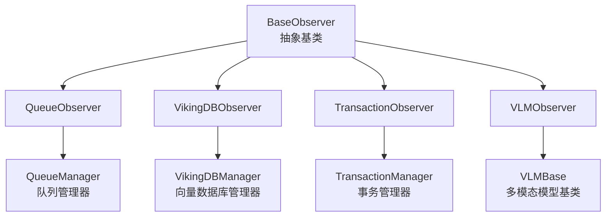

# BaseObserver 模块技术深度解析

## 概述

`BaseObserver` 是 OpenViking 存储系统中的观察者模式基础抽象类。它定义了所有存储组件观察者必须实现的统一接口，使得系统能够以一致的方式监控队列、数据库、事务等关键存储组件的健康状态和运行状况。

想象一下汽车的仪表盘：它不直接控制引擎、刹车或油箱，而是通过统一的接口从各个子系统收集状态信息，以统一的方式展示给驾驶员。`BaseObserver` 就是这个"仪表盘接口"——它定义了如何向系统报告各类存储组件的健康状态。

## 架构定位

`BaseObserver` 位于 `storage_core_and_runtime_primitives` 模块的 `observer_and_queue_processing_primitives` 子模块中。它是整个观察者体系的抽象基类，下游有四个具体实现：



从依赖关系来看，这个模块处于**监控与可观测性层**——它不参与核心存储逻辑的执行，而是作为系统的"观察窗口"，为运维人员和调试工具提供状态查询能力。

## 核心抽象与设计意图

### 观察者模式的轻量级实现

`BaseObserver` 采用了一种极简的观察者模式实现。传统的观察者模式通常涉及主题（Subject）、观察者（Observer）以及订阅/通知机制，但这里的实现更加直接——观察者持有被观察对象的引用，按需查询状态，而非等待被动通知。

这种设计的核心理念是：**状态是拉取的，不是推送的**。对于存储系统这种对一致性要求较高的场景，主动拉取状态比被动等待通知更加可控，也更容易调试。

### 统一的契约接口

`BaseObserver` 定义了三个抽象方法，构成了一个最小但完备的状态监控接口：

1. **`get_status_table() -> str`**：以人类可读的表格形式返回状态信息
2. **`is_healthy() -> bool`**：判断系统是否处于健康状态
3. **`has_errors() -> bool`**：判断系统是否存在错误

这三个方法回答了监控的三个基本问题："现在怎么样？"、"出问题了么？"、"有什么错误？"。任何存储组件的观察者实现都需要能够回答这些问题。

### 设计选择：为什么只有这三个方法？

初看这个接口，你可能会觉得过于简单——没有详细的指标采集、没有时间序列数据、没有告警阈值配置。但这正是设计的选择：

- **最小化接口复杂度**：存储系统已经有足够的复杂性，监控接口应该保持简单明了
- **关注点分离**：详细的指标采集由各存储子系统的管理器负责，Observer 只是包装层
- **灵活的实现空间**：具体的"健康"定义由实现类自行决定，比如 QueueObserver 将"有错误队列"视为不健康，而 VLMObserver 则始终返回健康（因为 token 追踪没有健康状态概念）

## 数据流分析

### 调用链路

以 `QueueObserver` 为例，数据流向如下：

```
用户/CLI 调用 client.observer.queue
    │
    ▼
QueueObserver.__str__() / get_status_table()
    │
    ├── 同步版本直接调用 run_async()
    │
    ▼
get_status_table_async()
    │
    ▼
queue_manager.check_status() ──→ 获取各队列状态
    │
    ▼
_get_semantic_dag_stats() ──→ 获取语义 DAG 统计
    │
    ▼
_format_status_as_table() ──→ 使用 tabulate 格式化
    │
    ▼
返回格式化的表格字符串
```

### 健康检查链路

```
is_healthy() 
    │
    ▼
has_errors()
    │
    ▼
queue_manager.has_errors() ──→ 遍历所有队列检查 error_count
    │
    ▼
返回 True/False
```

注意 `is_healthy()` 和 `has_errors()` 之间的关系：当前所有实现中，`is_healthy()` 等价于 `not has_errors()`。这是一个有趣的设计选择——健康状态完全由是否存在错误来定义。这种简化在大多数场景下是合理的，但对于 VLMObserver 这样的组件（token 使用追踪本身没有"健康"概念），就略显生硬——它只能永远返回 True。

## 具体实现分析

### QueueObserver（队列观察者）

`QueueObserver` 监控三类队列：Embedding 队列、Semantic 队列和自定义队列。它的状态表格包含以下列：

| 列名 | 含义 |
|------|------|
| Queue | 队列名称 |
| Pending | 等待处理的消息数 |
| In Progress | 正在处理的消息数 |
| Processed | 已处理完成的消息数 |
| Errors | 出错的消息数 |
| Total | 总计 |

健康判断逻辑很简单：只要没有任何队列包含错误计数，就认为系统健康。

### VikingDBObserver（向量数据库观察者）

`VikingDBObserver` 监控 VikingDB 集合的状态，包括索引数量和向量数量。它与队列观察者有一个关键区别：它的 `has_errors()` 方法包含实际的健康检查调用（调用 `vikingdb_manager.health_check()`），而不仅仅是检查内存中的计数器。这意味着它会真正探测数据库连接，而不仅仅是报告内部状态。

### TransactionObserver（事务观察者）

`TransactionObserver` 追踪活动事务的状态，包括事务 ID、状态（INIT/AQUIRE/EXEC/COMMIT/FAIL 等）、持有的锁数量、运行时长。它是唯一一个实现了额外诊断方法的观察者——`get_failed_transactions()` 和 `get_hanging_transactions(timeout_threshold)`，这表明事务系统需要更细粒度的故障诊断能力。

### VLMObserver（多模态模型观察者）

`VLMObserver` 监控 VLM 模型的 token 使用情况。有趣的是，它的 `is_healthy()` 始终返回 True，`has_errors()` 始终返回 False——这反映了一个设计判断：token 使用追踪本身没有"健康"或"错误"的概念，它只是一个计量工具。这种情况暴露了当前抽象的一个局限：并非所有被观察对象都有"健康/错误"这个维度。

## 设计权衡与trade-offs

### 1. 抽象基类 vs 协议（Protocol）

选择使用 `abc.ABC` 而非 `typing.Protocol` 意味着：
- **优点**：强制子类实现所有方法，接口更加明确
- **缺点**：引入了继承耦合，子类必须继承自 `BaseObserver`

如果使用 Protocol，可以实现更灵活的组合，但会失去强制约束。在当前场景下，由于 observer 是作为统一入口被使用的（`client.observer.queue`），继承模式更合适。

### 2. 同步 vs 异步

所有具体实现都提供了 `get_status_table_async()` 方法用于异步获取状态，但基类只定义了同步的 `get_status_table()`。这是因为：
- CLI 和简单工具通常以同步方式调用
- 底层管理器可能是异步的，所以需要 `run_async()` 包装
- 如果未来需要全面异步化，只需在基类添加抽象的 async 方法即可

### 3. 健康判断的简化

所有实现都采用 `is_healthy() = not has_errors()` 的等式，这意味着健康状态完全由是否存在错误来决定。这种简化适合大多数场景，但确实无法表达更复杂的健康状态（如"队列堆积但未出错"这种情况）。如果要表达更丰富的状态，需要扩展接口或引入枚举类型。

### 4. 表格输出的耦合

所有观察者都使用 `tabulate` 库来格式化输出。这虽然提供了统一的视觉风格，但也引入了对外部库的依赖。从设计角度看，表格输出是 CLI 的需求，不应该放在核心观察者中——更好的做法是将观察者与格式化逻辑分离。

## 扩展点与注意事项

### 如何添加新的观察者

1. 继承 `BaseObserver`
2. 实现三个抽象方法
3. 在 `__init__.py` 中导出
4. 在客户端的 observer 入口中注册

```python
class MyObserver(BaseObserver):
    def __init__(self, my_manager):
        self._manager = my_manager
    
    def get_status_table(self) -> str:
        # 格式化状态为表格
        ...
    
    def is_healthy(self) -> bool:
        return not self.has_errors()
    
    def has_errors(self) -> bool:
        # 检查是否有错误
        ...
```

### 潜在陷阱

1. **run_async 的使用**：在同步方法中调用异步方法时使用 `run_async()`，这在 Jupyter Notebook 等异步环境中可能出问题
2. **健康检查的副作用**：`VikingDBObserver.has_errors()` 实际上会执行健康检查调用，这意味着它不是纯粹的无副作用查询
3. **空状态处理**：各观察者对"没有数据"的处理方式不一致——有的返回空表格，有的返回提示文本
4. **状态一致性**：`get_status_table()` 和 `is_healthy() / has_errors()` 之间可能存在状态不一致——例如在调用 `get_status_table()` 和 `has_errors()` 之间，底层状态可能发生变化

### 与其他模块的关系

- **依赖**：每个观察者都依赖对应的 Manager 类（QueueManager、VikingDBManager 等）
- **被依赖**：被 `OpenViking` 客户端的 `observer` 属性使用，为 CLI 和调试工具提供监控入口
- **外部依赖**：使用 `tabulate` 库进行表格格式化

## 总结

`BaseObserver` 是 OpenViking 存储系统可观测性基础设施的核心抽象。它通过定义最小化的接口（状态输出、健康检查、错误检测），为各类存储组件提供了统一的监控视图。

这个模块的设计体现了"简单优于复杂"的哲学——三个抽象方法足够满足当前需求，同时为未来的扩展留有空间。然而，这种简化也带来了一些局限，特别是在表达复杂健康状态方面。如果你计划扩展这个系统，建议先评估是否需要更丰富的状态模型（如引入健康状态的枚举类型），还是当前的二元健康/错误模型已经足够。

**参考资料**：
- [队列系统模块文档](storage-core-and-runtime-primitives-observer-and-queue-processing-primitives-named-queue-and-handlers.md)
- [VikingDB 存储适配器文档](vectorization-and-storage-adapters-collection-adapters-abstraction-and-backends-provider-specific-managed-collection-backends.md)
- [VLM 模型抽象文档](model-providers-embeddings-and-vlm-vlm-abstractions-factory-and-structured-interface.md)