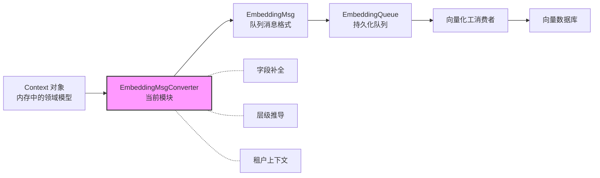

# embedding_msg_converter 模块技术深潜

## 一句话概述

`embedding_msg_converter` 是 OpenViking 存储层的「桥接器」——它将内存中的 `Context` 对象转换为用于异步向量化处理的 `EmbeddingMsg` 消息格式。这个转换看似简单，实则承担着字段补全、层级推导、租户上下文管理等关键职责，是整个分层检索（hierarchical retrieval）架构的数据入口。

## 问题空间：为什么需要这个模块

在深入代码之前，我们需要理解这个模块解决的问题背景。

OpenViking 的向量检索系统采用**分层索引**策略：每个目录不仅索引其自身的摘要（`.abstract.md`，L0 层级）和概览（`.overview.md`，L1 层级），还索引其中的文件内容（L2 层级）。这种设计使得系统可以在不同粒度上进行语义搜索——你可以检索「这个项目是做什么的」（L0/L1），也可以检索「某个具体函数的实现」（L2）。

**问题来了**：负责生成这些内容的 `SemanticProcessor` 操作的是 `Context` 对象——这是一个内存中的领域模型，包含了 URI、摘要、用户信息、所有权空间等完整上下文。而负责实际向量化的 `EmbeddingQueue`（一个基于文件队列的异步消息队列）需要的却是 `EmbeddingMsg`——一个更简单的、可以序列化为 JSON 的数据结构。

这两个对象不是「恰好不同」，而是**设计意图不同**：

| 特性 | Context | EmbeddingMsg |
|------|---------|--------------|
| 存在位置 | 内存，Java/Python 进程 | 持久化队列（queuefs），可能跨进程 |
| 生命周期 | 随请求创建和销毁 | 写入队列后独立于生产者 |
| 关注点 | 完整的业务语义 | 向量化所需的最小数据 |

因此，我们需要一个转换层来完成这个「翻译」工作。这，就是 `EmbeddingMsgConverter` 存在的理由。

## 架构角色与数据流

从模块树来看，`embedding_msg_converter` 位于存储子系统的**队列处理层**：

```
storage_core_and_runtime_primitives
  └── observer_and_queue_processing_primitives
       ├── base_observer
       ├── named_queue_and_handlers
       └── embedding_msg_converter ← 当前模块
```

它的上下游关系清晰：

- **上游调用者**：`SemanticProcessor`（`semantic_processor.py`）在完成目录或文件的语义生成后，调用此模块将 `Context` 转换为 `EmbeddingMsg`，然后入队到 `EmbeddingQueue`
- **下游消费者**：`EmbeddingQueue` 的消费者（向量化工消费者）从队列中取出 `EmbeddingMsg`，提取 `message` 字段进行向量化，存储到向量数据库



### 关键数据变换

一个典型的转换过程如下：

```python
# 输入：SemanticProcessor 中构建的 Context
context = Context(
    uri="viking://agent/abc123/workspaces/project/src/main.py",
    abstract="这是一个用户认证模块",
    context_type="resource",
    user=UserIdentifier("companyA", "user123", "agent456"),
    account_id="companyA",
    owner_space="abc123"  # 可能未设置
)

# 中间：Context.to_dict() 产生的字典
# 输出：EmbeddingMsg
embedding_msg = EmbeddingMsgConverter.from_context(context)
# {
#   "message": "这是一个用户认证模块",  # 来自 vectorization_text
#   "context_data": {
#     "uri": "...",
#     "account_id": "companyA",
#     "owner_space": "abc123",        # 被推导并回填
#     "level": ContextLevel.DETAIL,   # 根据 URI 推断
#     ...
#   }
# }
```

## 核心组件：`EmbeddingMsgConverter` 类

### 类设计

```python
class EmbeddingMsgConverter:
    """Converter for Context objects to EmbeddingMsg."""

    @staticmethod
    def from_context(context: Context, **kwargs) -> EmbeddingMsg:
        ...
```

这是一个**静态工具类**——设计者有意将它设计为无状态的转换函数。这种选择有几个考量：

1. **简洁性**：转换是一个纯函数行为，不需要维护实例状态
2. **可测试性**：可以单独测试每个转换逻辑，不需要 mock 依赖
3. **线程安全**：无状态意味着天然线程安全，可以被并发调用

### 方法详解：`from_context`

这个方法是整个模块的核心。让我逐段分析其逻辑：

#### 第一步：提取向量化文本

```python
vectorization_text = context.get_vectorization_text()
if not vectorization_text:
    return None
```

**为什么需要这步？** `Context` 对象可能包含空的 `abstract`（摘要内容），特别是在某些边界情况下（如文件无法读取）。向量化空文本没有意义，直接返回 `None` 让调用者决定如何处理（通常是跳过入队）。

#### 第二步：转换为字典并回填租户字段

```python
context_data = context.to_dict()

# Backfill tenant fields for legacy writers that only set user/uri.
if not context_data.get("account_id"):
    user = context_data.get("user") or {}
    context_data["account_id"] = user.get("account_id", "default")
```

**这里发生了什么？** 历史原因——早期的 `Context` 写入者可能只设置了 `user` 字段（一个嵌套的字典），而没有在顶层设置 `account_id`。这个模块承担了「向后兼容」的职责：它检测顶层 `account_id` 是否缺失，如果缺失则从 `user` 对象中提取。

**设计洞察**：这种「回填」（backfill）模式是一种常见的防御性编程实践——它允许系统平滑演进，新老代码可以共存，而不需要一次性迁移所有写入点。

#### 第三步：推导 owner_space

```python
if not context_data.get("owner_space"):
    user = context_data.get("user") or {}
    uri = context_data.get("uri", "")
    account = user.get("account_id", "default")
    user_id = user.get("user_id", "default")
    agent_id = user.get("agent_id", "default")

    owner_user = UserIdentifier(account, user_id, agent_id)
    if uri.startswith("viking://agent/"):
        context_data["owner_space"] = owner_user.agent_space_name()
    elif uri.startswith("viking://user/") or uri.startswith("viking://session/"):
        context_data["owner_space"] = owner_user.user_space_name()
    else:
        context_data["owner_space"] = ""
```

**这是做什么的？** `owner_space` 是向量数据库中的**多租户隔离字段**。简单来说，它决定了「谁能搜索到这个内容」：

- `viking://agent/xxx` → 属于特定 Agent 空间（由 `user_id + agent_id` 的 MD5 哈希前 12 位组成）
- `viking://user/xxx` 或 `viking://session/xxx` → 属于特定 User 空间（就是 `user_id`）
- 其他 URI（如 `viking://resources/xxx`）→ 全局共享空间（空字符串）

**为什么在转换层做这个？** 因为这是数据「进入」向量数据库之前的最后一道关卡。在这里统一处理，可以确保所有入队的内容都携带正确的租户隔离信息，无需在每个写入点重复逻辑。

#### 第四步：推导层级（Level）

```python
uri = context_data.get("uri", "")
if uri.endswith("/.abstract.md"):
    context_data["level"] = ContextLevel.ABSTRACT
elif uri.endswith("/.overview.md"):
    context_data["level"] = ContextLevel.OVERVIEW
else:
    context_data["level"] = ContextLevel.DETAIL
```

**为什么需要这个？** 这正是分层检索的核心——`ContextLevel` 是一个 L0/L1/L2 的枚举：

- `ABSTRACT = 0`：目录的摘要文件（`.abstract.md`），最抽象
- `OVERVIEW = 1`：目录的概览文件（`.overview.md`），中等粒度
- `DETAIL = 2`：具体文件内容，最细粒度

**设计洞察**：这个层级信息是根据 **URI 命名约定** 推导的，而不是存储在 `Context` 对象中。这种「约定优于配置」的方式简化了数据模型——`Context` 不需要关心它将用于哪种层级的检索。

#### 第五步：构建 EmbeddingMsg 并合并额外字段

```python
embedding_msg = EmbeddingMsg(
    message=vectorization_text,
    context_data=context_data,
)

# Set any additional fields from kwargs
for key, value in kwargs.items():
    if value is not None:
        embedding_msg.context_data[key] = value
return embedding_msg
```

**为什么需要 `**kwargs`？** 这是一个**扩展点**——调用者可能需要传入一些上下文相关的额外信息，而不需要修改 `Context` 类本身。例如，某些特殊处理流程可能需要标记来源、优先级或额外的元数据。

## 设计决策与权衡

### 决策一：静态方法 vs 实例方法

选择静态方法 `from_context` 而不是实例方法，有以下考量：

- **无状态转换**：转换逻辑是确定性的，不依赖外部状态
- **简化调用**：调用者不需要先实例化 converter，直接 `EmbeddingMsgConverter.from_context(...)` 即可
- **组合性**：可以在任何地方使用，不与特定的生命周期绑定

### 决策二：返回 `None` vs 抛出异常

当 `vectorization_text` 为空时，方法返回 `None` 而不是抛出异常。这是**宽容的设计**——调用者（`SemanticProcessor._vectorize_single_file`）在收到 `None` 后可以选择静默跳过，而不是因异常导致整个处理流程中断。

### 决策三：字段推导在转换层而非模型层

层级（level）和 owner_space 的推导放在 `EmbeddingMsgConverter` 而不是 `Context` 类中，这是一个有趣的**关注点分离**决策：

- `Context` 是「领域模型」，关注业务语义
- `EmbeddingMsgConverter` 是「适配层」，关注存储和检索契约

这样做的好处是 `Context` 类保持简洁，不需要知道「向量化」这回事。

## 依赖分析与契约

### 上游依赖：谁调用这个模块

从 `semantic_processor.py` 可以看到，主要有两个调用点：

1. **`_vectorize_directory_simple`**：对目录的 `.abstract.md` 和 `.overview.md` 进行向量化
2. **`_vectorize_single_file`**：对单个文件进行向量化

```python
# 典型的调用模式
embedding_msg = EmbeddingMsgConverter.from_context(context)
if not embedding_msg:
    return
await embedding_queue.enqueue(embedding_msg)
```

### 下游依赖：被谁使用

`EmbeddingMsgConverter` 产生 `EmbeddingMsg` 对象，该对象随后被：

1. **`EmbeddingQueue.enqueue()`** → 序列化为 JSON，写入文件队列
2. **向量化消费者** → 从队列取出，提取 `message` 进行 embedding 生成

### 数据契约

**输入**：`Context` 对象（需包含 `uri`、`abstract`、`user` 字段）

**输出**：`EmbeddingMsg` 对象，其中：

- `message`：向量化文本（来自 `context.get_vectorization_text()`）
- `context_data`：包含完整元数据的字典（uri, account_id, owner_space, level, ...）

**边界情况**：

- 如果 `vectorization_text` 为空，返回 `None`
- 如果 `owner_space` 未设置且无法从 URI 推导，设为空字符串（全局共享）

## 扩展点与注意事项

### 扩展点

1. **`**kwargs`**：调用者可以通过 kwargs 传入额外的上下文字段，这些字段会被合并到 `embedding_msg.context_data` 中

2. **新增层级类型**：如果未来需要支持更多层级（如 L3 细粒度索引），只需在 `ContextLevel` 枚举中添加新值，并在这里的 `if-elif-else` 链中添加对应的 URI 匹配规则

### 需要注意的「坑」

1. **Legacy 字段回填是隐式的**：如果上游系统修复了 `account_id` 的设置问题，这段回填逻辑可能变成冗余代码。建议定期审计，确认是否仍需兼容

2. **URI 命名约定的强耦合**：层级推导依赖特定的 URI 格式（`/.abstract.md`、`/.overview.md`）。如果未来更改这些文件名，需要同步修改这里的逻辑

3. **owner_space 的安全敏感**：错误的 `owner_space` 可能导致数据泄露（不该看到的向量被搜索到）或访问 denied（该看到的看不到）。这里的推导逻辑必须与向量数据库的查询逻辑保持一致

## 与其他模块的关系

- **[Context](./context_typing_and_levels.md)**：输入的领域模型，定义在 `openviking.core.context`
- **[EmbeddingMsg](./storage-core-and-runtime-primitives-observer-and-queue-processing-primitives-embedding-msg.md)**：输出的消息格式，定义在 `openviking.storage.queuefs.embedding_msg`
- **[UserIdentifier](./python_client_and_cli_utils-client_session_and_transport-base_client.md)**：用于推导 owner_space，定义在 `openviking_cli.session.user_id`
- **[EmbeddingQueue](./storage-core-and-runtime-primitives-observer-and-queue-processing-primitives-embedding-queue.md)**：消费 `EmbeddingMsg` 的队列，定义在 `openviking.storage.queuefs.embedding_queue`
- **[SemanticProcessor](./storage-core-and-runtime-primitives-observer-and-queue-processing-primitives-semantic-processor.md)**：主要调用者，定义在 `openviking.storage.queuefs.semantic_processor`

## 总结

`embedding_msg_converter` 看似只是一个简单的「对象转换器」，但它承担着关键的数据契约职责：它确保进入向量检索系统的数据具有正确的租户隔离、层级标注和最小必要字段。对于新加入的开发者，需要理解的核心概念是：

1. **它是什么**：Context → EmbeddingMsg 的适配层
2. **它为什么存在**：解决领域模型与队列消息格式的 impedance mismatch
3. **它做了什么**：提取向量化文本、回填租户字段、推导 owner_space 和 level
4. **要注意什么**：URI 命名约定的隐式依赖、legacy 字段的回填逻辑

理解了这些，你就能在需要修改层级推导规则、添加新的租户隔离逻辑、或处理新的 URI 类型时，准确把握修改点在哪里，以及可能带来的影响。