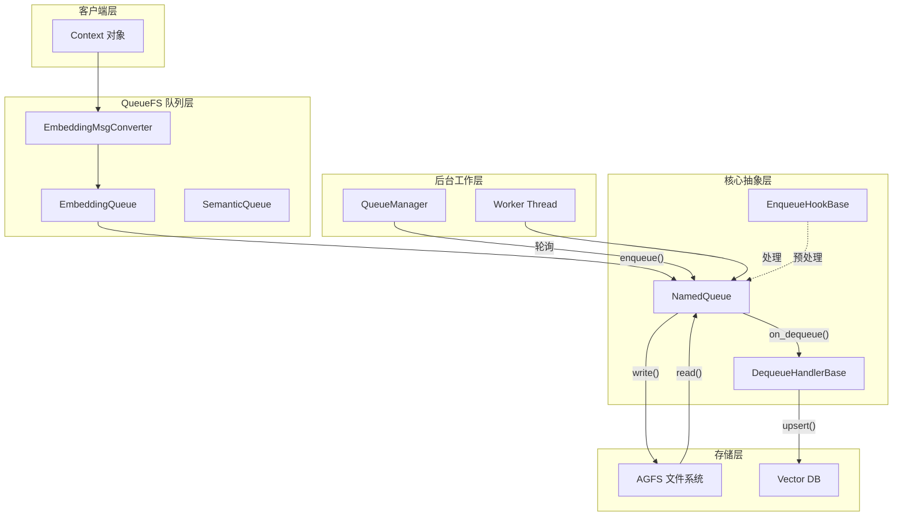

# NamedQueue 与处理器模块技术深度解析

## 概述

`named_queue_and_handlers` 模块是 OpenViking 存储层的核心组件之一，它构建了一个**基于 AGFS 文件系统的命名队列抽象**。想象一座城市的邮件分拣中心：每个队列（如 "Embedding"、"Semantic"）就像一个专门的邮件分类窗口，消息进入队列前可以进行预处理（EnqueueHook），取出后可以进行自定义处理（DequeueHandler），整个过程全程可追踪状态。

这个模块解决的问题是：**如何在分布式文件系统中实现可靠的消息队列，并提供可插拔的预处理和后处理能力**。传统的消息队列（如 RabbitMQ、Kafka）往往需要独立的中间件服务，而 OpenViking 利用 AGFS（一个自定义的分布式文件系统）提供的队列语义，直接在现有存储基础设施上构建轻量级队列系统。

---

## 架构设计与数据流



### 核心组件角色

**NamedQueue** 是整个模块的核心，它封装了对 AGFS 文件系统的队列操作。简单来说，它把文件系统的一个目录变成了一个队列——写入文件相当于入队，读取并删除文件相当于出队。NamedQueue 的设计采用了**懒初始化**策略，只有在第一次操作时才会创建队列目录，这避免了对不使用队列的应用造成不必要的文件系统开销。

**EnqueueHookBase** 提供了一个插入点，允许在消息入队前进行预处理。这类似于机场安检——所有行李（消息）在正式进入系统前都要经过检查。常见的用例包括：消息格式验证、敏感信息脱敏、消息 enrichment（补充额外元数据）等。

**DequeueHandlerBase** 则是消息出队后的处理器，提供了一个强大的**回调机制**来报告处理结果。当处理成功时调用 `report_success()`，失败时调用 `report_error(error_msg, data)`。这种设计使得 NamedQueue 可以自动追踪处理状态，而处理器只需关注业务逻辑。

**QueueStatus** 是一个数据类，承载了队列的实时状态：pending（待处理数量）、in_progress（正在处理数量）、processed（已处理完成数量）、error_count（错误总数）以及最近的错误列表。这些指标对于监控队列健康状况至关重要。

---

## 核心组件深度解析

### EnqueueHookBase：入队拦截器

```python
class EnqueueHookBase(abc.ABC):
    @abc.abstractmethod
    async def on_enqueue(self, data: Union[str, Dict[str, Any]]) -> Union[str, Dict[str, Any]]:
        """在消息入队前调用，可修改数据或执行验证"""
        return data
```

这个抽象类的设计意图非常清晰：**在消息进入队列前给予最后一次修改的机会**。设计决策采用了异步接口（async），这意味着 hook 可以执行 IO 密集型操作（如调用外部服务验证数据），而不会阻塞队列的入队操作。

一个典型的使用场景是消息签名验证：

```python
class SignatureValidationHook(EnqueueHookBase):
    async def on_enqueue(self, data: Dict[str, Any]) -> Dict[str, Any]:
        # 验证消息签名
        if not verify_signature(data):
            raise ValueError("Invalid signature")
        # 添加时间戳
        data["enqueued_at"] = datetime.now().isoformat()
        return data
```

### DequeueHandlerBase：出队处理器与回调机制

```python
class DequeueHandlerBase(abc.ABC):
    _success_callback: Optional[Callable[[], None]] = None
    _error_callback: Optional[Callable[[str, Optional[Dict[str, Any]]], None]] = None

    def set_callbacks(self, on_success, on_error) -> None:
        self._success_callback = on_success
        self._error_callback = on_error

    def report_success(self) -> None:
        if self._success_callback:
            self._success_callback()

    def report_error(self, error_msg: str, data: Optional[Dict[str, Any]] = None) -> None:
        if self._error_callback:
            self._error_callback(error_msg, data)
```

这个设计采用了**观察者模式的变体**。回调函数不是由处理器自己设置，而是由 NamedQueue 在初始化时注入。这种依赖注入的方式使得处理器和队列状态的追踪完全解耦——处理器只负责"报成功"或"报失败"，至于谁接收这个报告、如何更新计数器，都与处理器无关。

这种设计的一个重要后果是：**处理器必须显式调用 report_success() 或 report_error()**，否则 NamedQueue 无法正确更新状态计数。这是一种有意为之的设计——如果处理器忘记调用回调，状态就会不准确，这会被立即发现。

### NamedQueue：队列操作的核心类

NamedQueue 的实现揭示了几个重要的设计决策：

**1. 线程安全的状态追踪**

```python
self._lock = threading.Lock()
self._in_progress = 0
self._processed = 0
self._error_count = 0
self._errors: List[QueueError] = []
```

虽然队列的主要操作是异步的（async/await），但状态追踪却使用了线程锁。这是因为 QueueManager 可能会启动多个工作线程来并发处理队列消息（参见 `_worker_async_concurrent` 方法），不同线程可能同时更新计数器。使用 `threading.Lock` 而不是 `asyncio.Lock` 是因为工作线程本身是独立的，不共享同一个事件循环。

**2. 消息格式的兼容性处理**

```python
def _read_queue_message(self) -> Optional[Dict[str, Any]]:
    content = self._agfs.read(f"{self.path}/dequeue")
    # 处理 bytes、str、甚至带 .content 属性的响应对象
    if isinstance(content, bytes):
        raw = content
    elif isinstance(content, str):
        raw = content.encode("utf-8")
    elif hasattr(content, "content") and content.content is not None:
        raw = content.content
    # ...
    return json.loads(raw.decode("utf-8"))
```

AGFS 客户端可能返回不同类型的内容，这反映了底层存储后端的多样性（可能是 HTTP API、本地绑定、或其他实现）。这种防御性编程确保了队列在不同的 AGFS 实现下都能正常工作。

**3. 并发处理的状态管理陷阱**

```python
async def process_dequeued(self, data: Dict[str, Any]) -> Optional[Dict[str, Any]]:
    """NOTE: 调用者必须在调用此方法前调用 _on_dequeue_start()
    以便原子性地增加 in_progress 计数"""
    if self._dequeue_handler:
        return await self._dequeue_handler.on_dequeue(data)
    return data
```

这是代码中最重要的注释之一。在并发模式下，消息是预先取出（dequeue_raw），然后交给 asyncio 任务并行处理。关键在于：**必须在创建异步任务之前增加 in_progress 计数**，否则会出现"队列为空但显示正在处理"的Race Condition（竞态条件）。QueueManager 的实现正确地处理了这一点：

```python
# 在创建任务前增加计数
queue._on_dequeue_start()
task = asyncio.create_task(process_one(data))
```

---

## 依赖分析与数据契约

### 上游调用者

**QueueManager** 是 NamedQueue 的主要消费者。QueueManager 是一个单例模式的管理器，负责：
1. 维护多个命名队列的实例（Embedding、Semantic 等）
2. 启动后台工作线程轮询队列并处理消息
3. 提供统一的状态查询和等待完成的接口

QueueManager 与 NamedQueue 的契约是：它负责创建队列、注入处理器、启动工作线程，并在需要时查询状态。NamedQueue 本身不关心是谁在消费它，只关心提供可靠的队列语义。

**TextEmbeddingHandler**（定义于 `collection_schemas.py`）是 DequeueHandlerBase 的具体实现，它：
1. 从队列中取出 EmbeddingMsg
2. 调用 embedder 生成向量
3. 将向量写入向量数据库
4. 调用 `report_success()` 或 `report_error()` 反馈处理结果

### 下游依赖

NamedQueue 依赖 **AGFS 客户端**（`AGFSClient`）来执行实际的队列操作。AGFS 是一个抽象的文件系统接口，它可能连接到本地文件系统、网络存储或其他分布式存储系统。NamedQueue 使用以下操作：
- `mkdir(path)` - 创建队列目录
- `write(path, data)` - 写入消息（入队）
- `read(path)` - 读取消息（出队/查看）

这种依赖意味着 NamedQueue 的行为受限于 AGFS 的语义。如果 AGFS 的队列操作不是原子的，那么 NamedQueue 也无法保证精确一次的语义。

### EmbeddingMsgConverter

这是连接 Context 对象和 EmbeddingQueue 的桥梁。它将领域模型（Context）转换为队列消息（EmbeddingMsg），并自动填充一些派生字段（如 `level` 根据 URI 推断、租户信息等）。这个转换器的存在使得队列的使用者无需关心消息的具体格式。

---

## 设计决策与权衡

### 1. 单例 QueueManager vs 依赖注入

QueueManager 采用了**单例模式**（通过全局 `_instance` 变量和 `init_queue_manager`/`get_queue_manager` 函数对）。这简化了应用启动流程——只需初始化一次，随后在任何地方都能获取队列管理器。

**权衡**：单例模式虽然方便，但使得单元测试变得困难，因为无法轻易替换为 mock 对象。另一个选择是使用依赖注入框架（如 pytest 的 fixture），但会增加框架复杂度。团队选择了简单性，假设应用生命周期内只有一个 QueueManager 实例。

### 2. 同步锁 vs 异步锁

如前所述，状态追踪使用了 `threading.Lock` 而非 `asyncio.Lock`。这是因为：
- 队列操作本身是 async（与 AGFS 交互）
- 但并发处理使用的是多线程（每个队列一个工作线程）

**另一种设计**是纯异步方案：使用单一事件循环和 `asyncio.gather()` 处理所有队列消息。这样可以使用 `asyncio.Lock`，并且更容易避免线程安全问题。但代价是 Python 的 GIL 会限制 CPU 密集型任务的真正并行。

当前设计允许 Embedding 队列配置 `max_concurrent_embedding` 参数，实现真正的多线程并发，这在处理 CPU 密集型的 embedding 计算时非常重要。

### 3. 错误列表的滑动窗口

```python
if len(self._errors) > self.MAX_ERRORS:
    self._errors = self._errors[-self.MAX_ERRORS:]
```

错误列表维护了一个**滑动窗口**，只保留最近的 100 条错误。这是一种内存保护机制，防止长时间运行的队列积累过多错误对象导致内存溢出。代价是古老的错误信息会丢失，但在大多数场景下，近期的错误已经足够调试使用。

### 4. 队列目录的懒创建

```python
async def _ensure_initialized(self):
    if not self._initialized:
        try:
            self._agfs.mkdir(self.path)
        except Exception as e:
            if "exist" not in str(e).lower():
                logger.warning(...)
        self._initialized = True
```

队列目录只在第一次操作时创建，并且对"已存在"的错误进行了静默处理。这种设计避免了启动时创建大量空队列，也避免了因目录已存在而导致的失败。但它也意味着**第一次入队操作会稍慢**，因为包含了目录创建的开销。

---

## 使用指南与扩展点

### 创建自定义队列

```python
# 通过 QueueManager 创建
qm = get_queue_manager()
queue = qm.get_queue(
    "MyCustomQueue",
    enqueue_hook=MyCustomHook(),
    dequeue_handler=MyCustomHandler(),
    allow_create=True
)

# 直接使用 NamedQueue
queue = NamedQueue(
    agfs=agfs_client,
    mount_point="/queue",
    name="MyQueue",
    enqueue_hook=MyCustomHook(),
    dequeue_handler=MyCustomHandler()
)
```

### 实现自定义 EnqueueHook

```python
class DataEnrichmentHook(EnqueueHookBase):
    async def on_enqueue(self, data: Union[str, Dict[str, Any]]) -> Union[str, Dict[str, Any]]:
        if isinstance(data, dict):
            # 添加来源标记
            data["source"] = "custom_queue"
            data["enqueued_at"] = datetime.now().isoformat()
        return data
```

### 实现自定义 DequeueHandler

```python
class LoggingHandler(DequeueHandlerBase):
    async def on_dequeue(self, data: Optional[Dict[str, Any]]) -> Optional[Dict[str, Any]]:
        try:
            logger.info(f"Processing: {data}")
            # 业务处理逻辑
            result = await self._process(data)
            self.report_success()  # 重要：必须调用
            return result
        except Exception as e:
            self.report_error(str(e), data)  # 重要：失败也要报告
            return None
```

### 状态监控与等待完成

```python
# 查询所有队列状态
statuses = await qm.check_status()

# 检查是否有错误
if qm.has_errors("Embedding"):
    print("Embedding queue has errors!")

# 等待所有处理完成
final_statuses = await qm.wait_complete(timeout=60.0)
```

---

## 边缘情况与注意事项

### 1. 回调必须显式调用

DequeueHandlerBase 的处理器**必须**显式调用 `report_success()` 或 `report_error()`。如果忘记调用：
- `in_progress` 计数会一直保持正值
- `is_complete` 永远返回 False
- `wait_complete()` 会超时

这是一个容易犯的错误，代码中通过文档和注释反复强调。

### 2. 并发模式下的计数时机

在使用 `dequeue_raw()` + `process_dequeued()` 的并发模式时，**必须在创建异步任务前调用 `_on_dequeue_start()`**。这是因为：
- `dequeue_raw()` 会从队列中移除消息
- 如果此时 in_progress 未增加，可能出现"队列空但显示无进行中任务"的状态
- 正确的顺序确保了状态的一致性

### 3. 错误处理的静默策略

```python
except Exception as e:
    logger.debug(f"[NamedQueue] Dequeue failed for {self.name}: {e}")
    return None
```

队列的读取操作使用了静默错误处理——异常只记录 debug 级别日志，然后返回 None。这符合队列的"尽力而为"语义：一次出队失败不算致命错误，下一次轮询会重试。但这也意味着**错误可能会悄悄流失**，生产环境需要配合监控告警。

### 4. 消息格式的隐式假设

代码假设消息是 JSON 格式的字典。如果入队的是字符串，会被 JSON 序列化：

```python
if isinstance(data, dict):
    data = json.dumps(data)
```

但如果原始数据本身是 JSON 字符串，这会导致双重编码。这是一个隐式假设，使用者需要确保传入正确格式的数据。

### 5. 清理时机的延迟

队列的清理（clear）操作是对 AGFS 写入一个空消息，这依赖于 AGFS 实现来执行实际的清理逻辑。如果 AGFS 的 clear 操作不是原子的，可能出现部分清理的情况。在生产环境中使用 clear 功能时需要留意这一点。

---

## 相关模块参考

- **[queue_manager](./storage-core-and-runtime-primitives-observer-and-queue-processing-primitives-queue_manager.md)**：队列管理器，负责多队列的协调和工作线程的生命周期
- **[embedding_queue](./storage-core-and-runtime-primitives-observer-and-queue-processing-primitives-embedding_queue.md)**：Embedding 专用队列，扩展了 NamedQueue 以支持 EmbeddingMsg 的序列化
- **[embedding_msg_converter](./storage-core-and-runtime-primitives-observer-and-queue-processing-primitives-embedding_msg_converter.md)**：Context 到 EmbeddingMsg 的转换器
- **[collection_schemas](./storage-core-and-runtime-primitives-storage_schema_and_query_ranges-collection_schemas.md)**：包含 TextEmbeddingHandler 的实现示例
- **[base_observer](./storage-core-and-runtime-primitives-observer-and-queue-processing-primitives-base_observer.md)**：存储系统的观察者基类，定义了健康检查接口