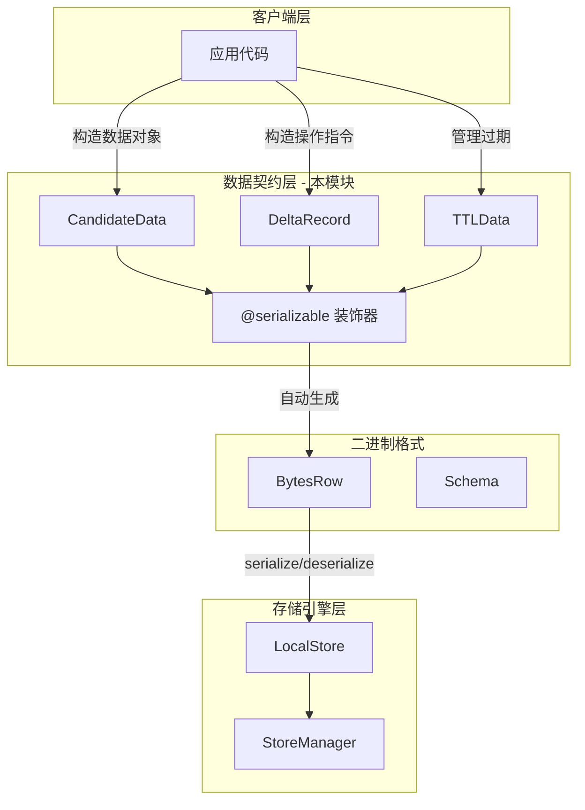

# store_value_typing_and_ttl 模块技术深度解析

## 模块概述

`store_value_typing_and_ttl` 模块是向量存储系统的**数据契约层**，它定义了数据在存储管道中流转时的结构化形态。想象一下物流系统中的"集装箱"——它们不关心货物是什么，但定义了货物的打包方式、标签格式和有效期限。这个模块正是扮演着类似的角色：它定义了向量、稀疏特征、元数据和过期时间如何被序列化和传输，而不涉及具体的存储引擎实现。

本模块解决了三个核心问题：第一，如何统一表示可包含密集向量、稀疏向量和元数据的复合数据对象；第二，如何描述存储层的原子操作（插入/更新/删除）；第三，如何携带时间戳信息以支持数据的自动过期（TTL）管理。

## 架构定位与数据流



在整体架构中，本模块位于**客户端业务逻辑与底层存储引擎之间**。上游的业务代码使用这些数据类型来描述要存储或检索的数据；下游的存储引擎（见 `local_store` 和 `store_manager` 模块）接收序列化的字节流。关键设计洞察是：**数据类型的定义与存储引擎的实现解耦**——你可以在不修改存储引擎的情况下改变数据结构，只要保持序列化格式兼容。

数据流的关键路径如下：当用户执行一次向量upsert操作时，业务层构造一个 `DeltaRecord` 对象，设置 `type=DeltaRecord.Type.UPSERT`，填充 `vector`、`sparse_raw_terms`、`sparse_values` 和 `fields` 字段，然后调用 `.serialize()` 方法将其转换为字节序列。这个字节序列随后传递给 `StoreEngineProxy.exec_sequence()` 方法，最终写入存储。当执行搜索查询时，结果以 `CandidateData` 的形式返回，包含向量、标签、稀疏特征和过期时间戳。

## 核心数据类型详解

### CandidateData：搜索结果的载体

```python
@dataclass
class CandidateData:
    label: int = 0                          # 分类标签，用于过滤或排序
    vector: List[float] = field(default_factory=list)  # 密集向量表示
    sparse_raw_terms: List[str] = field(default_factory=list)  # 稀疏特征词项
    sparse_values: List[float] = field(default_factory=list)   # 稀疏特征权重
    fields: str = ""                        # JSON序列化的元数据
    expire_ns_ts: int = 0                   # 过期时间（纳秒级时间戳）
```

**设计意图**：这个类模拟了搜索引擎返回的"候选结果"概念。在向量检索场景中，一个数据点不仅仅是向量，还可能包含分类标签、稀疏关键词匹配信息以及任意自定义元数据。`CandidateData` 将这些异构信息打包成统一的结果对象。

**稀疏向量的表示设计**：`sparse_raw_terms` 和 `sparse_values` 使用平行列表而非字典，这并非随意选择。在实际的机器学习稀疏向量表示中（如 BM25、splade），词项和权重需要精确的一一对应关系，且按特定顺序排列以支持批量计算。如果使用字典，顺序不确定性会引入微妙的bug；而平行列表通过索引对齐保证了确定性，同时便于直接传递给底层的 C++ 向量计算库。

**时间戳精度选择**：`expire_ns_ts` 使用纳秒而不是秒，是考虑到系统可能需要支持毫秒甚至更细粒度的过期控制。纳秒级别的时间戳提供了足够的精度空间，同时也避免了浮点数的时间比较问题。

### DeltaRecord：存储操作的原子单元

```python
@dataclass
class DeltaRecord:
    class Type:
        UPSERT = 0   # 插入或更新（存在则覆盖，不存在则新增）
        DELETE = 1   # 删除操作
    
    type: int = 0
    label: int = 0
    vector: List[float] = field(default_factory=list)
    sparse_raw_terms: List[str] = field(default_factory=list)
    sparse_values: List[float] = field(default_factory=list)
    fields: str = ""        # 当前/新的元数据
    old_fields: str = ""    # 旧元数据（用于比较和回滚）
```

**设计意图**：`DeltaRecord` 是存储系统的"操作指令"。每个 `DeltaRecord` 描述了一个原子操作——要么是 upsert（插入或更新），要么是 delete（删除）。这种设计将"数据"与"操作"解耦，使得批量处理成为可能。

**新旧字段的双重表示**：`fields` 和 `old_fields` 的设计支持**增量更新**场景。在某些业务场景下，你可能只想更新元数据的一部分而不影响其他字段。通过同时提供新旧值，存储引擎可以执行合并策略（如 JSON merge patch），或者记录变更历史用于审计。

**与 OpType 的关系**：注意 `DeltaRecord.Type` 与 `store.py` 中定义的 `OpType` 存在概念重叠但用途不同。`OpType` 是存储引擎层面的通用操作抽象（PUT/DEL），而 `DeltaRecord.Type` 是业务层面的语义操作（UPSERT/DELETE）。Upsert 在引擎层面可能被实现为"先读后写"的原子操作，或者直接覆盖，这取决于存储引擎的实现。

### TTLData：轻量级的过期标记

```python
@dataclass
class TTLData:
    label: int = 0   # 关联数据的标签
```

**设计意图**：`TTLData` 的简洁设计可能会让初见者困惑——为什么只有一个 label 字段？这其实是一种**关注点分离**的设计。TTL 管理的核心问题是"判断数据是否过期"，而数据本身（向量、元数据）可能非常庞大。将过期判断抽离成轻量级的 `TTLData` 对象，意味着：

1. **内存效率**：检查过期时无需加载完整的数据对象
2. **计算效率**：过期清理可以在后台异步进行，只读取 TTL 索引
3. **职责清晰**：TTL 策略（如何判断过期、过期后如何清理）可以独立演进

在实际实现中，`TTLData` 通常与主数据分开索引和存储。主数据表存储完整的 `CandidateData` 或 `DeltaRecord`，而 TTL 表仅存储 `label -> expire_ns_ts` 的映射。

## 序列化机制：@serializable 装饰器

本模块的所有数据类都使用 `@serializable` 装饰器（定义于 `serializable.py`）。这是整个系统的**桥接层**，将 Python 的 dataclass 语法与底层的 C++ 存储引擎连接起来。

装饰器的工作流程如下：首先，它检查被装饰的类必须是 dataclass；然后，它遍历所有字段，根据类型注解自动推断对应的 `FieldType`（如 `List[float]` 映射到 `FieldType.list_float32`）；接着，它创建一个 `Schema` 对象描述数据结构，并创建一个 `BytesRow` 实例用于实际的序列化；最后，它向类注入 `serialize()`、`deserialize()`、`from_bytes()` 和 `serialize_list()` 四个方法。

这种设计的核心优势是**消除样板代码**。如果不使用装饰器，开发者需要手动为每个字段编写序列化/反序列化逻辑，这在字段较多时极易出错。装饰器将这一过程自动化，同时通过 `metadata` 参数保留了自定义类型的能力——例如，如果你需要将 Python 的 `int` 序列化为带符号的 `int64` 而非无符号的 `uint64`，可以在字段定义时指定 `field(default=0, metadata={"field_type": FieldType.int64})`。

## 依赖关系分析

### 上游依赖者（谁调用这个模块）

本模块被以下模块使用：

- **Index.upsert_data() 和 Index.delete_data()**：`Index` 类的这两个方法接收 `List[DeltaRecord]` 参数，用于更新或删除索引中的数据
- **Collection.upsert_data()**：`Collection` 类接收数据列表和 TTL 参数，内部转换为 `CandidateData` 对象
- **store.py 的 Op 类**：`Op` 类的 `data` 字段可以接受 `DeltaRecord` 序列化的字节数据
- **local_store.py 的 StoreEngineProxy**：接收序列化后的数据进行实际的存储操作
- **业务层代码**：构造 `CandidateData` 接收搜索结果，构造 `DeltaRecord` 执行数据修改

### 下游依赖者（这个模块依赖谁）

本模块依赖以下组件：

- **`serializable.py`**：提供自动序列化和反序列化能力
- **`bytes_row.py`**：底层 C++ 绑定的二进制序列化实现，包含 `Schema`、`BytesRow`、`FieldType` 等核心类型
- **Python 标准库**：`dataclasses`、`json`、`typing`

### 完整的依赖链路

```
┌────────────────────────────────────────────────────────────────────────────┐
│                          上游调用层                                          │
│  Collection.upsert_data() → Index.upsert_data() → DeltaRecord           │
│  Collection.search_by_vector() → CandidateData                           │
└────────────────────────────────┬───────────────────────────────────────────┘
                                 │ 使用 DeltaRecord / CandidateData
                                 ▼
┌────────────────────────────────────────────────────────────────────────────┐
│                      store_value_typing_and_ttl                            │
│  ┌──────────────────────────────────────────────────────────────────────┐  │
│  │  @serializable 装饰器 ──→ 自动注入 serialize/deserialize 方法       │  │
│  └──────────────────────────────────────────────────────────────────────┘  │
└────────────────────────────────┬───────────────────────────────────────────┘
                                 │ 序列化后的 bytes
                                 ▼
┌────────────────────────────────────────────────────────────────────────────┐
│                     序列化基础设施层                                         │
│  serializable.py → bytes_row.py → C++ native engine                       │
└────────────────────────────────┬───────────────────────────────────────────┘
                                 │ 
                                 ▼
┌────────────────────────────────────────────────────────────────────────────┐
│                      C++ 原生存储层                                         │
│  VolatileStore / PersistStore                                             │
└────────────────────────────────────────────────────────────────────────────┘
```

### 数据契约

本模块与其他模块之间存在清晰的数据契约：

| 契约方 | 输入 | 输出 |
|--------|------|------|
| 业务代码 → 本模块 | Python 对象（未序列化） | 具备序列化能力的 Python 对象 |
| 本模块 → 存储引擎 | 字节序列（`.serialize()` 的输出） | 无（存储引擎的副作用） |
| 存储引擎 → 本模块 | 字节序列 | Python 对象（通过 `.from_bytes()` 还原） |

### 类型系统契约

本模块中的三个数据类型形成了清晰的使用场景分工：

| 类型 | 用途 | 关键字段 |
|------|------|----------|
| `CandidateData` | 存储/检索的数据载体 | `label`, `vector`, `expire_ns_ts` |
| `DeltaRecord` | 变更操作指令 | `type` (UPSERT/DELETE), `old_fields` |
| `TTLData` | 轻量级过期管理 | 仅有 `label` |

这种分工的设计原则是：**按需加载最小数据集**。TTL 清理时只需知道 label，无需加载完整的向量数据。

## 设计决策与权衡

### 决策一：使用 dataclass 而非 Pydantic

**选择**：使用 Python 标准库的 `@dataclass` 而非 Pydantic 的 `BaseModel`。

**理由**：这是一个注重性能的存储模块，dataclass 提供了最基础的不可变数据容器，没有 Pydantic 的验证开销。考虑到这些数据类会在批量操作中频繁创建（一次查询可能返回数千个 `CandidateData`），每一点的性能节省都有意义。此外，存储层的数据在进入系统前通常已经过验证，业务层的验证职责不在这里。

**权衡**：缺少运行时类型验证意味着错误可能直到序列化时才会被发现。但这是可以接受的风险，因为存储层错误通常会导致明确的异常，而非静默的数据损坏。

### 决策二：稀疏向量的并行列表表示

**选择**：`sparse_raw_terms: List[str]` 和 `sparse_values: List[float]` 作为两个独立的列表。

**理由**：如前所述，这种表示方式与底层 C++ 稀疏向量计算库的数据布局一致，可以实现零拷贝的批量传输。字典表示虽然对 Python 开发者更友好，但会带来序列化和内存的开销。

**权衡**：开发者需要手动保证两个列表长度一致，且索引对应。长度不匹配或顺序错位可能在查询时导致微妙的错误。代码审查时需要特别注意这一点。

### 决策三：纳秒级时间戳

**选择**：`expire_ns_ts` 使用纳秒而非秒或毫秒。

**理由**：提供最细粒度的时间控制能力，支持精确到纳秒的过期判断。同时，整数形式的纳秒时间戳可以直接比较，无需处理浮点数的精度问题。

**权衡**：需要与系统的时钟源保持一致。如果系统的其他部分使用毫秒或秒作为时间单位，这里可能需要转换。文档和代码注释中明确标注了时间单位的重要性。

## 常见使用模式与示例

### 构造一条待存储的向量数据

```python
from openviking.storage.vectordb.store.data import DeltaRecord

# 构造一个 upsert 操作
record = DeltaRecord(
    type=DeltaRecord.Type.UPSERT,
    label=42,
    vector=[0.1, 0.3, 0.5, ...],  # 密集向量
    sparse_raw_terms=["python", "vector", "search"],
    sparse_values=[1.0, 0.8, 0.6],  # 与词项一一对应
    fields='{"source": "user_upload", "version": 1}',
    old_fields=""  # 新增记录，没有旧值
)

# 序列化为字节，存入存储引擎
binary_data = record.serialize()
```

### 从存储中读取并解析搜索结果

```python
from openviking.storage.vectordb.store.data import CandidateData

# 假设从存储引擎读取了原始字节数据
raw_bytes = ...  

# 反序列化为 CandidateData 对象
result = CandidateData.from_bytes(raw_bytes)

# 检查是否过期
import time
current_ns = int(time.time() * 1e9)
if result.expire_ns_ts > 0 and current_ns > result.expire_ns_ts:
    print("该数据已过期")
else:
    print(f"标签: {result.label}, 向量维度: {len(result.vector)}")
```

### 使用 TTLData 进行过期管理

```python
from openviking.storage.vectordb.store.data import TTLData
import time

# 创建一个 24 小时后过期的 TTL 标记
expire_ns = int(time.time() * 1e9) + 24 * 60 * 60 * 1000000000

ttl_entry = TTLData(label=42)
ttl_data = ttl_entry.serialize()
# 将 ttl_data 存入专用的 TTL 索引表
```

## 潜在陷阱与注意事项

**稀疏向量索引错位**：最常见的 bug 来源是 `sparse_raw_terms` 和 `sparse_values` 长度不一致或顺序错位。建议在构造数据时进行校验：

```python
assert len(sparse_raw_terms) == len(sparse_values), "稀疏向量词项与权重长度必须一致"
```

**时间戳单位混淆**：`expire_ns_ts` 明确表示纳秒，但有时开发者会习惯性地传入秒级时间戳。系统不会自动转换，这会导致数据在遥远的未来才过期（或立即过期，取决于具体数值）。建议使用明确的常量或函数进行转换：

```python
# 正确：纳秒转换
expire_ns = int(time.time() * 1e9) + ttl_seconds * 1e9

# 错误：传入秒级时间戳
expire_ns = int(time.time()) + ttl_seconds  # 这会创建数十年后才过期的数据
```

**DeltaRecord 的 old_fields 语义**：`old_fields` 在 upsert 操作时的行为取决于存储引擎的实现策略。某些引擎会执行完整覆盖（忽略旧值），某些会执行合并。依赖增量更新逻辑时，请确认存储引擎的行为。

**序列化后的对象不可变错觉**：虽然 dataclass 默认可以修改，但序列化/反序列化循环可能引入微妙的状态问题。如果需要不可变语义，考虑使用 `@dataclass(frozen=True)`，但注意这会阻止默认的反序列化（需要自定义 `__setattr__`）。

## 扩展点与未来演进

本模块的设计预留了以下扩展方向：

1. **新的向量类型支持**：如果系统需要支持二进制向量或量化向量，只需在 `CandidateData` 和 `DeltaRecord` 中添加新字段，并确保 `@serializable` 装饰器正确推断类型。

2. **更丰富的元数据**：当前的 `fields` 是 JSON 字符串，如果需要结构化的元数据查询能力，可以考虑将其升级为独立的子结构（同样使用 `@serializable` 装饰的嵌套 dataclass）。

3. **TTL 策略扩展**：当前的 `TTLData` 仅包含 label 和时间戳。如果需要更复杂的过期策略（如基于访问频率的动态 TTL），可以扩展该类的字段。

## 相关文档

- [KV Store 接口定义](storage-core-and-runtime-primitives-kv-store-interfaces-and-operation-model.md)：了解 `IKVStore` 和 `IMutiTableStore` 接口
- [本地存储实现](vectorization-and-storage-adapters-collection-adapters-abstraction-and-backends.md)：了解 `LocalStore` 如何使用本模块的数据类型
- [存储核心与运行时原语](storage_core_and_runtime_primitives.md)：包含 `@serializable` 装饰器的使用方式
- [Collection 适配器](vectorization-and-storage-adapters-collection-adapters-abstraction-and-backends.md)：了解数据如何在更高层抽象中被使用