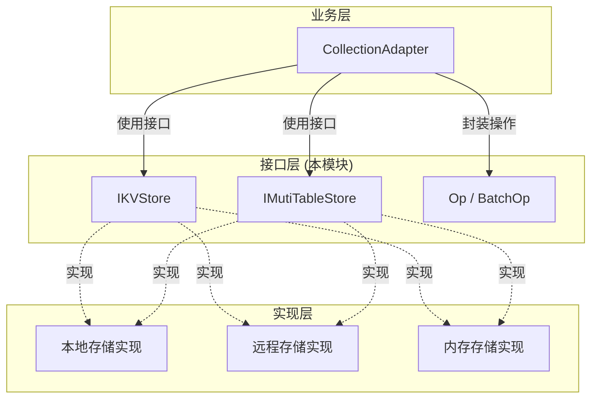

# KV 存储接口与操作模型

## 模块概述

在向量数据库系统中，数据最终需要持久化到某种存储介质中。然而，存储技术的选择往往取决于部署环境、成本考虑和性能需求——有时是本地文件系统，有时是云端托管的分布式数据库，有时甚至是内存缓存。**kv_store_interfaces_and_operation_model** 模块的核心使命，就是在这一多样化场景与上层业务逻辑之间架起一座桥梁：它定义了一组抽象接口（contracts），使业务代码能够以统一的方式与不同的存储后端交互，而无需关心底层实现细节。

这个模块解决的问题可以类比为「插头与插座」的关系。在日常生活中，电器（业务逻辑）只需要知道插座提供 220V 交流电（统一的存储接口），而不需要关心电能来自火力发电厂、风力发电机还是太阳能板。类似地，当上层组件需要存储或检索数据时，它们只需要调用 `IKVStore` 或 `IMutiTableStore` 定义的抽象方法，而具体的实现（可能是内存哈希表、LevelDB、RocksDB，甚至是远程的 VikingDB）可以在部署时灵活配置，甚至在运行时切换。

从架构角度看，这个模块处于整个存储层次的最底层抽象层。它的上方是 `CollectionAdapter`（集合适配器）——负责将向量数据库的语义（如向量搜索、标量过滤）映射到这些基础的键值操作；它的下方则是各种具体的存储实现。这个「承上启下」的位置意味着：一旦接口定义不当，错误将向上辐射到整个查询路径，向下则限制存储后端的选择灵活性。

---

## 架构概览与数据流



这个模块定义了两类核心接口和两个操作封装类。`IKVStore` 是最基础的键值存储抽象，仅提供 `get`、`put`、`delete` 三个方法——这就像一个简单的文件柜，每份文件（value）通过一个唯一的文件夹名称（key）来标识。而 `IMutiTableStore` 则在此基础上增加了「多表」的概念，允许在同一个存储系统中管理多个逻辑上隔离的数据集合，并支持批量操作和范围查询。

数据流的关键路径是这样的：上层组件（如 `LocalCollectionAdapter` 或 `VikingDBPrivateCollectionAdapter`）接收用户的查询请求，将请求翻译为向量搜索和标量过滤操作，然后这些操作进一步被翻译为一系列基础的 `get`/`put`/`delete` 调用，或者更高效的 `BatchOp` 批量操作，最终由具体的存储实现执行。值得注意的是，这个模块本身不执行业务逻辑，它只是一个「协议层」——定义各方必须遵守的契约。

---

## 核心组件详解

### IKVStore：最基础的存储契约

`IKVStore` 是整个模块中最简单的接口，它定义了一个最小化的键值存储所需的方法集合。选择这三个方法（`get`、`put`、`delete`）并非偶然，而是经过深思熟虑的设计：任何持久化存储系统，无论其底层是 B+ 树、LSM 树还是分布式表，最终都可以抽象为「根据键查找值」「根据键存储值」「根据键删除值」这三种操作。这是一种「最小公分母」的设计理念——确保接口足够通用，能够覆盖最广泛的存储技术。

```python
class IKVStore(ABC):
    @abstractmethod
    def get(self, key):
        """根据键检索值。如果键不存在，返回 None。"""
        raise NotImplementedError

    @abstractmethod
    def put(self, key, value):
        """存储或更新键值对。如果键已存在，则覆盖旧值。"""
        raise NotImplementedError

    @abstractmethod
    def delete(self, key):
        """删除指定的键值对。如果键不存在，通常是静默成功（幂等性）。"""
        raise NotImplementedError
```

这个接口的设计遵循了「接口隔离原则」——如果某个实现不需要某些方法，它可以选择不实现（通过抛出 `NotImplementedError`），或者实现为空操作。这种宽松的约束为实现者提供了最大的自由度。例如，一个只读的实现可以只实现 `get` 方法，而一个内存缓存实现可以忽略 `delete`（依赖过期机制自动清理）。

从调用方的角度看，`IKVStore` 的语义是同步阻塞的——调用 `get` 会阻塞当前线程直到数据返回。这意味着上层组件在调用这些方法时需要考虑线程模型：如果在异步框架（如 asyncio）中使用，可能需要在线程池中执行，以免阻塞事件循环。这是一个隐含的权衡——选择同步接口使得实现简单且易于理解，但如果要支持高并发异步场景，需要在上层额外封装。

### IMutiTableStore：多表与批量操作的扩展

如果说 `IKVStore` 是一个单间文件柜，`IMutiTableStore` 就是一个大型档案室，它将文件按科室（table）分类管理。选择这个设计的原因是：在向量数据库的实际使用中，数据往往需要逻辑隔离——比如为每个用户会话创建独立的表、为不同的知识库创建独立的索引。`IMutiTableStore` 允许这种隔离，同时保持底层存储的统一性。

```python
class IMutiTableStore(ABC):
    @abstractmethod
    def read(self, keys: List[str], table_name: str) -> List[bytes]:
        """从一个表中批量读取多个键的值。"""
        pass

    @abstractmethod
    def write(self, keys: List[str], values: List[bytes], table_name: str):
        """向一个表中批量写入键值对。"""
        pass

    @abstractmethod
    def delete(self, keys: List[str], table_name: str):
        """从一个表中批量删除多个键。"""
        pass

    @abstractmethod
    def read_all(self, table_name: str) -> List[Tuple[str, bytes]]:
        """读取表中的所有数据（用于全量扫描或导出）。"""
        pass
```

这里有一个值得注意的设计选择：所有批量操作的方法签名都接受 `List[str]` 和 `List[bytes]`——而不是更灵活的泛型。这是有意为之的：向量化数据库的核心数据模型是结构化的字段（fields），这些字段在序列化后本质上就是字节流。选择 `bytes` 作为统一的数据格式，意味着任何可以序列化为字节的内容都可以存储——JSON、Protocol Buffers、MessagePack，甚至是原始的二进制向量。这种「一切皆字节」的哲学简化了接口，但也意味着调用方必须自己处理序列化/反序列化。

### Op 与 OpType：操作命令的封装

在分布式系统中，一个常见的优化模式是「批量处理」——将多个独立操作打包成一批，一次网络往返完成所有操作，从而摊薄通信开销。`Op` 和 `OpType` 就是为这种模式设计的：

```python
class OpType(Enum):
    PUT = 0  # 插入或更新
    DEL = 1  # 删除

class Op:
    def __init__(self, op_type: OpType, key: str, data: Any):
        self.op_type = op_type
        self.key = key
        self.data = data
```

`OpType` 是最简单的枚举类型，区分「写入」和「删除」两种操作。而 `Op` 则将一个操作封装为对象，这种「命令模式」的应用使得操作可以被序列化（通过网络传输）、被延迟执行（写入日志后再异步处理）、甚至被重放（在故障恢复时）。

在 `IMutiTableStore` 中，有两个方法专门用于执行批量操作：

```python
@abstractmethod
def exec_sequence(self, op: List[Op], table_name: str):
    """顺序执行一系列操作（原子性保证取决于实现）。"""
    pass

@abstractmethod
def exec_sequence_batch_op(self, op: List[BatchOp]):
    """跨多个表执行批量操作。"""
    pass
```

`exec_sequence` 用于单表场景，它保证操作按顺序执行（但不一定保证原子性——这取决于具体实现）。`exec_sequence_batch_op` 则更进一步，允许一次调用操作多个表。这在需要在多个逻辑数据分区之间保持一致性的场景中非常有用——例如，更新向量索引的同时更新元数据表。

### BatchOp：多表批量的桥梁

`BatchOp` 是对单表批量操作的进一步封装，它的核心创新在于：允许多个键拥有不同的操作类型。

```python
class BatchOp:
    def __init__(
        self,
        table: str,
        op_type: Union[OpType, List[OpType]],  # 可以是单一类型或每个键的类型列表
        keys: List[str],
        data_list: List[Any],
    ):
        self.table = table
        self.op_type = op_type
        self.keys = keys
        self.data_list = data_list
```

这种设计的灵活性体现在：如果所有键都是同一种操作（例如全部是 PUT），`op_type` 可以是一个单一值；如果每个键需要不同的操作（例如第一个键是 PUT，第二个键是 DEL），`op_type` 可以是一个列表，与 `keys` 一一对应。这种「批量中的批量」模式在处理复杂的数据同步场景时非常高效——比如从外部数据源导入数据时，有些记录需要新增，有些需要更新，有些需要删除，一个 `BatchOp` 就能表达全部意图。

---

## 设计决策与权衡

### 抽象层级选择：为何是接口而非基类

这个模块使用了 Python 的 `ABC`（Abstract Base Class）来定义接口，而不是使用普通的基类或纯协议（Protocol）。这是一个有意识的设计选择。

如果采用普通基类，实现者可以选择不重写某些方法，这在短期内看似灵活，但会埋下「未实现方法」的陷阱——代码会在运行时才抛出 `AttributeError`，而不是在类定义时发现。采用 `ABC` 的 `@abstractmethod` 装饰器，可以在类实例化时就强制要求所有抽象方法被实现，否则会抛出 `TypeError`。这种「fail-fast」的原则对于接口定义尤为重要——它将错误发现的时间点从运行时提前到加载时。

另一个选择是使用 Python 3.8+ 的 `Protocol`。Protocol 的优势在于「结构化类型检查」——只要对象有相同的方法签名，即使没有显式继承，也能被类型系统认可。但在这个场景中，显式的接口继承（通过 ABC）有几个优势：首先，代码的可读性更好——一个类明确声明 `class MyStore(IKVStore)` 清楚地表明了它的身份；其次，在需要运行时类型检查时（如 `isinstance(store, IKVStore)`），ABC 更加直接。

### 同步 vs 异步：选择同步接口的隐含成本

如前所述，这个模块定义的接口全部是同步的——`get` 方法会阻塞直到数据返回。在一个高性能的向量数据库系统中，这可能成为瓶颈。当上层组件（如 `CollectionAdapter`）在异步环境中运行时（例如 FastAPI 的 async endpoint），同步的存储调用会阻塞事件循环。

那么为什么不做成异步接口呢？这里有一个深层的权衡。异步接口（返回 `Awaitable`）会使实现复杂度显著增加：每个具体的存储实现都需要是异步的，调用方也需要使用 `await`。这在纯异步系统中是合理的，但如果存储后端本身是同步的（例如本地文件系统），异步封装只会增加开销——线程池切换是有成本的。

当前的架构选择是：将同步/异步的决策留给上层。「同步」的接口并不意味着系统是同步的——上层可以在同步接口之上构建异步缓存层、连接池、或异步批处理队列。这种「底层简单、上层复杂」的策略，本质上是一种「接口最小化」原则的体现。

### 序列化格式：为何选择 bytes

在 `IMutiTableStore` 的方法签名中，数据类型统一使用 `bytes`——`read` 返回 `List[bytes]`，`write` 接受 `List[bytes]`。这意味着所有需要存储的数据都必须先序列化为字节序列。

这种选择有几个考量。首先，它使得接口与具体的序列化格式解耦——无论上层使用 JSON、MessagePack、Protocol Buffers 还是自定义二进制格式，接口都能正常工作。其次，在存储层面，字节是最通用的格式——几乎所有存储系统都能高效处理字节块。

但这也意味着调用方必须承担序列化的责任。如果序列化格式选择不当（例如使用了不支持的字符编码），可能会导致数据损坏。另一个隐含的风险是：如果序列化的数据结构发生了变化（例如字段类型从字符串改为整数），旧数据的反序列化可能会失败。这需要在上层通过版本控制或迁移策略来缓解。

### 范围查询的设计：seek_to_end 与 begin_to_seek

`IMutiTableStore` 提供了两个独特的方法来支持范围查询：`seek_to_end` 和 `begin_to_seek`。

```python
@abstractmethod
def seek_to_end(self, key: str, table_name: str) -> List[Tuple[str, bytes]]:
    """从指定键开始读取到表末尾（包含起始键）。"""
    pass

@abstractmethod
def begin_to_seek(self, key: str, table_name: str) -> List[Tuple[str, bytes]]:
    """从表开头读取到指定键（包含结束键）。"""
    pass
```

这两个方法的名字初看可能有些奇怪——为什么不是 `range_query` 或 `scan`？这是因为它们直接映射到底层存储系统的遍历语义。在许多键值存储系统（如 RocksDB、LevelDB）中，数据按键排序存储，因此「从某一点到末尾」的遍历比「任意范围的随机访问」更高效。而「从开头到某一点」则对应另一种遍历方向。

这种设计选择的背后是对性能的考量：范围扫描是向量数据库中的常见操作——比如按时间范围检索日志、按 ID 范围检索记录。通过暴露底层的有序遍历能力，上层组件可以构建高效的「分页」或「流式读取」功能，而无需在应用层重新实现分页逻辑。

---

## 依赖关系分析

### 上游调用者

这个模块定义的接口被多个上层组件调用，其中最重要的是 `CollectionAdapter` 及其具体实现。`CollectionAdapter` 是整个向量存储适配层的基础抽象，它将高层次的「创建集合」「向量搜索」「数据更新」等操作，翻译为对 `IMutiTableStore` 的底层调用。

以 `LocalCollectionAdapter` 为例，当它执行一次向量查询时，内部逻辑大致是：
1. 调用存储的 `seek_to_end` 或 `read` 方法获取候选数据
2. 在内存中计算向量相似度
3. 过滤掉不符合标量条件的记录
4. 返回排序后的结果

在这个流程中，`IMutiTableStore` 的实现直接决定了查询的数据路径性能。如果存储实现支持良好的范围扫描优化，整个查询路径就会更快。

另一个重要的调用者是评估和录制模块（`openviking.eval.recorder`），它使用这些存储接口来记录和回放向量数据库的操作历史，以便进行离线分析和调优。

### 下游实现者

具体存储实现是接口的「客户」，它们必须实现接口中定义的所有抽象方法。从模块树来看，可能的实现包括：
- 本地文件系统存储（基于某种嵌入式的键值数据库）
- 远程 VikingDB 存储（云托管的向量数据库）
- HTTP 存储适配器（通过 REST API 调用远程服务）
- 内存存储（用于测试或缓存场景）

每种实现都有其特定的优化方向：本地存储可能优化顺序读写，远程存储可能优化网络批处理，内存存储可能优化并发锁。这个模块的接口设计正是为了容纳这些差异。

---

## 使用指南与扩展点

### 实现一个新的存储后端

如果你需要添加一个新的存储后端（例如对接 Redis 集群），你需要创建一个类继承 `IMutiTableStore` 并实现所有抽象方法。以下是实现要点：

```python
class MyRedisStore(IMutiTableStore):
    def __init__(self, redis_client):
        self.redis = redis_client
    
    def read(self, keys: List[str], table_name: str) -> List[bytes]:
        # 使用 Redis 的 mget 批量获取
        full_keys = [f"{table_name}:{k}" for k in keys]
        values = self.redis.mget(full_keys)
        # Redis 返回 None 表示键不存在，转换为字节
        return [v if v else None for v in values]
    
    def write(self, keys: List[str], values: List[bytes], table_name: str):
        # 使用 Redis 的 mset 批量写入
        mapping = {f"{table_name}:{k}": v for k, v in zip(keys, values)}
        self.redis.mset(mapping)
    
    # ... 其他方法实现
```

注意几个关键点：
- 所有键在传入时应该加上 `table_name` 前缀，以确保表之间的隔离
- 返回值需要处理「键不存在」的情况——通常返回 `None` 而不是抛出异常
- 考虑错误处理策略——网络错误如何重试？超时如何配置？

### 批处理操作的正确使用方式

在高性能场景中，应该优先使用批量操作而不是循环调用单条操作：

```python
# 低效：N 次单独操作
for key, value in zip(keys, values):
    store.put(key, value)

# 高效：一次批量操作
store.write(keys, values, table_name)
```

更进一步，如果你的操作混合了写入和删除，应该使用 `BatchOp`：

```python
ops = BatchOp(
    table="my_table",
    op_type=[OpType.PUT, OpType.PUT, OpType.DEL],  # 混合操作类型
    keys=["key1", "key2", "key3_to_delete"],
    data_list=[value1, value2, None]  # 删除操作不需要数据
)
store.exec_sequence_batch_op([ops])
```

这种批量模式特别适合「同步外部数据源」的场景——你可以一次性处理新增、更新和删除，而不需要分多次调用。

---

## 边缘情况与注意事项

### 键不存在时的行为

接口规范对「键不存在」的处理相对宽松：`get` 方法规范说「返回 `None` 如果未找到」，`delete` 方法规范则没有明确说明。这是有意为之的——不同存储系统对「不存在的删除」有不同的语义支持。

一个重要的约定是：实现者应该让 `delete` 是幂等的——对不存在的键执行删除不应该抛出异常。这是因为在分布式系统中，「记录是否已被删除」往往是不确定的——删除操作可能已经成功，但客户端没有收到确认。如果 `delete` 不是幂等的，重试删除操作就会失败，这会迫使调用方编写复杂的「检查-删除」逻辑。

### 并发安全性

这个模块的接口定义本身不包含任何并发控制机制——锁、事务、乐观并发版本等都不在接口层面体现。这意味着：

- 如果你需要事务语义（多个操作必须原子性地全部成功或全部失败），需要在实现层面处理
- 如果你需要读一致性（读取时看到的是某个时间点的完整快照），也需要在实现层面处理
- 如果你需要并发写保护，需要在实现层面添加锁

这种设计的意图是「让接口保持简单」——不同存储系统对并发控制的能力和策略差异很大，如果在接口层面强制要求事务支持，那些不支持事务的存储系统（如简单的内存缓存）将无法实现这个接口。

### 序列化兼容性

由于所有数据都以 `bytes` 形式存储，一个常见的陷阱是假设序列化格式是稳定的。当数据结构发生变化时（如添加新字段、修改字段类型），旧的序列化数据可能无法正确反序列化。

解决这个问题的常见策略包括：
- 在数据中包含版本号，上层根据版本选择反序列化方式
- 使用支持字段跳过的序列化格式（如 JSON）
- 在升级时执行数据迁移脚本

---

## 相关模块与延伸阅读

这个模块是整个存储层次的基础抽象，它的周边模块形成了完整的存储技术栈：

- **[vectorization_and_storage_adapters](./vectorization_and_storage_adapters.md)** - 展示了如何使用这些接口构建具体的集合适配器，包括本地存储、云端 VikingDB 和 HTTP 适配器
- **[storage_schema_and_query_ranges](./storage_schema_and_query_ranges.md)** - 定义了集合的 schema 结构和范围查询的类型系统
- **[store_value_typing_and_ttl](./store_value_typing_and_ttl.md)** - 定义了存储值的类型系统和 TTL 机制
- **[runtime_support_utilities](./runtime_support_utilities.md)** - 提供了 ID 生成器和线程安全字典等运行时支持工具

如果你想深入了解向量数据库的完整架构，建议按以下顺序阅读：首先阅读本模块理解底层抽象，然后阅读 CollectionAdapter 的实现理解上层映射，最后阅读具体的存储后端实现理解端到端的数据流。