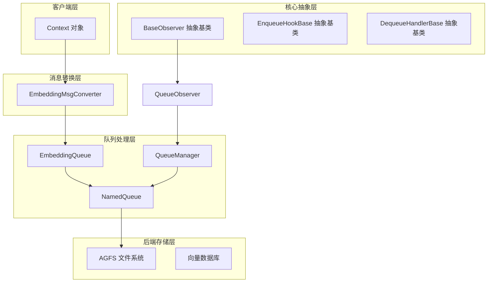

# observer_and_queue_processing_primitives 模块技术深度解析

## 概述

`observer_and_queue_processing_primitives` 模块是 OpenViking 存储层的核心基础设施，扮演着**系统可观测性**与**异步任务队列处理**的双重角色。把它想象成一家大型物流快递公司的「监控中心」和「分拣流水线」：监控中心（Observer）负责实时汇报整个仓储系统的健康状况，包括各个队列堆积了多少货物、处理了多少订单、出现了多少异常；而分拣流水线（NamedQueue）则负责将需要处理的「货物」（Context 对象）从一个地方运送到另一个地方，并在运输过程中记录每件货物的处理状态。

这个模块解决的问题可以归结为两个核心需求：第一，存储系统是一个分布式组件，需要一种标准化的方式来报告自身的运行状态——哪些队列正在工作、是否有错误发生、健康度如何；第二，内容向量化的过程是计算密集型的 IO 阻塞操作，不能同步阻塞主线程，需要一种机制将文本内容异步投递到专门的处理器进行向量化，然后再写入向量数据库。这两个需求看似独立，实际上通过观察者模式和队列模式紧密耦合在一起，形成了一套完整的后台异步处理架构。

## 架构概览



从架构图中可以看出，这个模块处于整个存储系统的枢纽位置：它向上承接来自业务层的 Context 对象（用户文档、工作空间、技能等各种内容），通过 EmbeddingMsgConverter 转换成待处理的 EmbeddingMsg 消息；中间层由 NamedQueue 和 QueueManager 构成，负责消息的持久化投递和异步处理；最底层则依赖 AGFS（一种类似分布式文件系统的高级抽象）作为消息队列的存储后端。

## 组件深度解析

### BaseObserver：系统健康度的统一抽象

`BaseObserver` 是整个模块中最简单的类，却定义了最重要的契约。它是一个抽象基类，任何希望参与系统状态汇报的组件都必须实现这个接口。设计这个抽象层的核心理念是**可观测性的标准化**——不同的后端存储（向量数据库、VLM 模型服务、事务管理器）都有各自的状态需要汇报，但如果每种组件都用自己的方式暴露状态，监控面板将变得难以统一。

```python
class BaseObserver(abc.ABC):
    @abc.abstractmethod
    def get_status_table(self) -> str:
        """将状态信息格式化为表格字符串"""
        pass

    @abc.abstractmethod
    def is_healthy(self) -> bool:
        """检查被观察系统是否健康"""
        pass

    @abc.abstractmethod
    def has_errors(self) -> bool:
        """检查被观察系统是否有错误"""
        pass
```

这个接口的设计非常精妙，它没有要求具体的返回值格式，而是让子类自行决定如何表示状态。`get_status_table()` 返回一个字符串而非结构化数据，看起来似乎不够"现代化"，但考虑到这个模块需要与命令行工具（CLI）集成，这种设计能让观察者直接输出人类可读的表格格式，降低了集成成本。如果未来需要 JSON 格式，可以在子类中添加额外的方法，而不是修改接口契约。

目前有三个具体的 Observer 实现：QueueObserver 监控队列管理器的状态、VLMObserver 监控视觉语言模型服务、VikingDBObserver 监控向量数据库连接。这种"一个接口、多种实现"的模式使得添加新的监控目标变得极为简单——只需要继承 BaseObserver 并实现三个方法即可。

### NamedQueue：基于 AGFS 的持久化队列

`NamedQueue` 是整个模块中最核心的类，它封装了对分布式文件系统 AGFS 的队列操作。理解它的设计需要先理解一个背景：OpenViking 不是一个单体应用，而是一个分布式系统，不同组件可能运行在不同的进程甚至不同的机器上。因此，队列不能简单地使用 Python 的 `queue.Queue`（仅限进程内通信），而需要一个能够跨进程、跨服务通信的持久化队列。

AGFS（Advanced Group File System）就是为此设计的底层存储抽象。你可以把它想象成一个支持特殊队列操作的文件系统——普通的文件系统有 `read` 和 `write`，但 AGFS 额外提供了 `enqueue`、`dequeue`、`peek`、`size`、`clear` 等语义，这些操作封装在 `pyagfs` 客户端库中。NamedQueue 的任务就是把这些底层的文件系统操作封装成易用的队列 API。

```python
class NamedQueue:
    def __init__(
        self,
        agfs: "AGFSClient",
        mount_point: str,
        name: str,
        enqueue_hook: Optional[EnqueueHookBase] = None,
        dequeue_handler: Optional[DequeueHandlerBase] = None,
    ):
        self.name = name
        self.path = f"{mount_point}/{name}"
        self._agfs = agfs
        self._enqueue_hook = enqueue_hook
        self._dequeue_handler = dequeue_handler
        # 状态跟踪
        self._lock = threading.Lock()
        self._in_progress = 0
        self._processed = 0
        self._error_count = 0
```

**设计思考之一：状态跟踪机制**。NamedQueue 不仅是一个队列，它还维护了丰富的运行时状态。`_in_progress` 表示当前正在处理但尚未完成的消息数量，`_processed` 表示已经成功处理的消息总数，`_error_count` 记录失败次数。这些状态通过 `threading.Lock` 保护，确保在多线程环境下计数的准确性。为什么不在队列操作完成后直接删除消息，而要用计数器记录？因为在分布式系统中，"处理完成"的定义可能是模糊的——消息被取出了，但处理失败后是否应该重试？消息是否已经被写入下游系统？通过显式跟踪这些状态，系统可以回答"这个队列是否已经清空"这样的问题，而不仅仅是"队列文件是否为空"。

**设计思考之二：Hook 和 Handler 的分离**。NamedQueue 支持两种扩展机制：`enqueue_hook` 和 `dequeue_handler`。这个设计体现了**管道式处理**的思想——Hook 在消息入队前执行，可以用来做数据验证、格式转换、敏感信息脱敏等"预处理"；Handler 在消息出队后执行，负责真正的业务逻辑处理。二者的分离让队列的使用更加灵活：同一个队列可以配置不同的处理逻辑，而不需要修改队列本身的代码。

### EnqueueHookBase 与 DequeueHandlerBase：扩展点的抽象

这两个基类是 NamedQueue 的扩展机制的核心。先看 EnqueueHookBase：

```python
class EnqueueHookBase(abc.ABC):
    @abc.abstractmethod
    async def on_enqueue(self, data: Union[str, Dict[str, Any]]) -> Union[str, Dict[str, Any]]:
        """在消息入队前调用，可以修改数据或执行验证"""
        return data
```

这个抽象非常简洁，但用途广泛。举例来说，系统可能需要在将 Context 对象写入队列之前，自动补充一些字段（如时间戳、租户信息），或者对内容进行分词、摘要提取。`on_enqueue` 是一个 async 方法，这意味着它可以执行 IO 密集型操作（如调用外部 API 进行数据增强），而不会阻塞队列的入队操作。

DequeueHandlerBase 则更复杂一些，因为它不仅要处理消息，还要报告处理结果：

```python
class DequeueHandlerBase(abc.ABC):
    _success_callback: Optional[Callable[[], None]] = None
    _error_callback: Optional[Callable[[str, Optional[Dict[str, Any]]], None]] = None

    def set_callbacks(
        self,
        on_success: Callable[[], None],
        on_error: Callable[[str, Optional[Dict[str, Any]]], None],
    ) -> None:
        self._success_callback = on_success
        self._error_callback = on_error

    def report_success(self) -> None:
        if self._success_callback:
            self._success_callback()

    def report_error(self, error_msg: str, data: Optional[Dict[str, Any]] = None) -> None:
        if self._error_callback:
            self._error_callback(error_msg, data)

    @abc.abstractmethod
    async def on_dequeue(self, data: Optional[Dict[str, Any]]) -> Optional[Dict[str, Any]]:
        """消息出队后的处理逻辑，返回 None 表示丢弃消息"""
        if not data:
            return None
        return data
```

这里有一个有趣的设计模式：**回调注入**。Handler 本身不知道处理成功或失败后应该做什么，这些行为是由创建它的 NamedQueue 决定的。NamedQueue 在初始化时将自己的 `_on_process_success` 和 `_on_process_error` 方法注入到 Handler 中，这样 Handler 只需要在适当的时机调用 `report_success()` 或 `report_error()`，具体的计数器更新操作都由 NamedQueue 负责。这种**控制反转**的思路让 Handler 和 Queue 的职责清晰分离。

### EmbeddingMsgConverter：Context 到 EmbeddingMsg 的桥梁

`EmbeddingMsgConverter` 的职责是将业务层的 Context 对象转换成适合向量处理的 EmbeddingMsg 对象。这个转换过程并不简单，因为 Context 对象包含了丰富的元数据（URI、用户信息、创建时间等），而向量数据库只需要其中与检索相关的字段。

```python
class EmbeddingMsgConverter:
    @staticmethod
    def from_context(context: Context, **kwargs) -> EmbeddingMsg:
        vectorization_text = context.get_vectorization_text()
        if not vectorization_text:
            return None

        context_data = context.to_dict()

        # 兼容旧版本的写入者，只设置了 user/uri 而没有 account_id
        if not context_data.get("account_id"):
            user = context_data.get("user") or {}
            context_data["account_id"] = user.get("account_id", "default")

        # 根据 URI 派生层级字段，用于分层检索
        uri = context_data.get("uri", "")
        if uri.endswith("/.abstract.md"):
            context_data["level"] = ContextLevel.ABSTRACT
        elif uri.endswith("/.overview.md"):
            context_data["level"] = ContextLevel.OVERVIEW
        else:
            context_data["level"] = ContextLevel.DETAIL
```

这个转换器做了几件重要的事情：第一，它从 Context 中提取用于向量化的文本（`get_vectorization_text()`），这是真正的"内容"所在；第二，它为没有明确设置 account_id 的老数据提供向后兼容性，通过 user 字段推算出来；第三，它根据 URI 的后缀推断内容的层级（ABSTRACT、OVERVIEW、DETAIL），这对于分层检索至关重要——系统可以根据用户查询的粒度在不同层级的向量中搜索。

**设计权衡：为什么不在 Context 类里直接做这些转换？** 这是一个很好的问题。之所以把转换逻辑单独放在 EmbeddingMsgConverter 中，是因为 Context 是一个业务领域对象，它代表了"用户创建的内容"这个概念；而 EmbeddingMsg 是一个技术性的消息对象，用于队列传输和向量存储。二者的关注点不同：将转换逻辑抽离出来意味着 Context 类保持简洁，而转换逻辑可以根据存储需求独立演进。

### QueueManager：队列的中央协调器

`QueueManager` 是整个队列系统的大管家。它的职责包括：管理多个命名队列的生命周期、启动后台工作线程处理队列中的消息、提供统一的查询接口。

```python
class QueueManager:
    EMBEDDING = "Embedding"
    SEMANTIC = "Semantic"

    def setup_standard_queues(self, vector_store: Any) -> None:
        # 初始化 Embedding 队列，绑定 TextEmbeddingHandler
        embedding_handler = TextEmbeddingHandler(vector_store)
        self.get_queue(self.EMBEDDING, dequeue_handler=embedding_handler)

        # 初始化 Semantic 队列，绑定 SemanticProcessor
        semantic_processor = SemanticProcessor(max_concurrent_llm=self._max_concurrent_semantic)
        self.get_queue(self.SEMANTIC, dequeue_handler=semantic_processor)

        self.start()
```

这里的关键设计是**标准队列的自动初始化**。系统预定义了两个标准队列：Embedding 队列用于处理文本向量化，Semantic 队列用于语义处理。当调用 `setup_standard_queues` 时，QueueManager 会自动创建这两个队列，并绑定相应的处理器。这种"约定优于配置"的设计让新部署的系统不需要手动配置队列，生产环境的运维复杂度大大降低。

工作线程的处理逻辑也很有意思。Embedding 队列支持并发处理（通过 `max_concurrent_embedding` 参数控制），而 Semantic 队列默认是串行的。这是因为 Embedding 计算可以并行执行（每个文本独立），但 Semantic 处理可能涉及有状态的 LLM 调用，并发需要更谨慎的控制。

## 数据流分析

让我们追踪一条典型的数据是如何流经整个系统的：

1. **业务层创建 Context**：用户上传了一个文档或创建了一个技能，系统创建了一个 Context 对象，包含 URI、摘要、用户信息等。

2. **转换为 EmbeddingMsg**：调用 `EmbeddingMsgConverter.from_context(context)`，将 Context 转换成包含向量化文本和完整元数据的 EmbeddingMsg 对象。

3. **入队到 EmbeddingQueue**：调用 `await embedding_queue.enqueue(embedding_msg)`，消息被写入 AGFS 文件系统。此时消息只是被持久化，还没有真正开始向量化。

4. **后台工作线程消费**：QueueManager 的工作线程定期检查队列大小，发现有待处理消息时调用 `queue.dequeue()` 获取消息。

5. **Handler 执行向量化**：TextEmbeddingHandler 接收消息，调用 embedder 服务将文本转换成向量，然后调用向量数据库的 upsert 方法写入结果。

6. **状态更新与回调**：处理成功后，Handler 调用 `report_success()`，NamedQueue 更新 `_in_progress` 和 `_processed` 计数器；如果失败则更新 `_error_count` 并记录错误详情。

7. **Observer 汇报状态**：外部监控系统可以通过调用 `QueueObserver.get_status_table()` 获取当前所有队列的状态，包括待处理数量、处理中数量、已完成数量、错误数量等。

这条数据流的设计核心是**解耦**：内容创建者不需要等待向量化完成，向量化过程在后台异步进行；向量化的结果写入数据库后，检索系统就可以通过向量相似度搜索找到相关内容。整个过程是全异步的，不会阻塞用户操作。

## 设计决策与权衡

### 同步调用 vs 异步处理

NamedQueue 的 `enqueue` 和 `dequeue` 方法都是 async 的，但在内部实现中，很多操作实际上是同步的（如文件系统的 read/write）。这是因为底层的 AGFS 客户端库可能还没有完全异步化。这种"外 async 内 sync"的模式在 Python 中很常见，代价是当大量入队操作集中发生时，可能会短暂阻塞事件循环。一个更激进的方案是完全使用线程池来包装同步调用，但那样会引入额外的复杂度。当前的设计在简单性和性能之间取得了合理的平衡。

### 内存状态 vs 持久化状态

NamedQueue 维护了丰富的运行时状态（`_in_progress`、`_processed`、`_error_count`），但这些状态只存在于内存中，进程重启后会丢失。这是一种有意的设计选择：这些计数器主要用于实时监控和短期状态查询，不需要跨进程持久化。如果需要真正的持久化状态（例如历史处理统计），应该在应用层面单独记录。从另一个角度看，如果这些状态也需要持久化，每次状态更新都需要一次额外的 IO 操作，队列的整体吞吐量会大幅下降。

### 错误处理策略

NamedQueue 对错误的处理采用了"记录但不阻塞"的策略。当 `dequeue` 或 `peek` 操作失败时，它只会记录一条 debug 级别的日志，然后返回 `None` 而不是抛出异常。这个设计背后的理念是：在分布式系统中，网络抖动、文件锁冲突、临时不可用是常态，不应该因为一次临时的 IO 错误就导致整个队列崩溃。但错误毕竟发生了，所以错误会被记录在 `_errors` 列表中（最多保留 100 条），监控组件可以通过 `has_errors()` 发现问题。

### 扩展性设计

模块提供了多个扩展点：可以通过继承 EnqueueHookBase 实现自定义的入队逻辑，通过继承 DequeueHandlerBase 实现自定义的处理逻辑，通过继承 BaseObserver 实现对其他组件的状态监控。这种"基类定义接口，具体实现交给子类"的设计模式被称为**模板方法模式**，它在保持接口稳定的同时，为未来的功能扩展预留了充足的空间。

## 使用指南与注意事项

### 使用 NamedQueue

如果你需要创建一个新的队列来处理特定类型的任务，可以参考以下模式：

```python
# 创建队列实例
queue = NamedQueue(
    agfs=agfs_client,
    mount_point="/queue",
    name="my_custom_queue",
    enqueue_hook=MyCustomEnqueueHook(),  # 可选
    dequeue_handler=MyCustomDequeueHandler()  # 可选
)

# 入队
await queue.enqueue({"task": "process_image", "payload": {...}})

# 查询状态
status = await queue.get_status()
print(f"Pending: {status.pending}, Errors: {status.error_count}")
```

### 实现自定义 Handler

自定义 Handler 需要继承 `DequeueHandlerBase` 并实现 `on_dequeue` 方法：

```python
class MyCustomHandler(DequeueHandlerBase):
    async def on_dequeue(self, data: Optional[Dict[str, Any]]) -> Optional[Dict[str, Any]]:
        if not data:
            return None
        
        try:
            # 业务逻辑
            result = await do_something(data)
            self.report_success()  # 重要：必须显式报告成功
            return result
        except Exception as e:
            self.report_error(str(e), data)  # 报告错误
            return None
```

**特别注意**：Handler 必须显式调用 `report_success()` 或 `report_error()`，否则 NamedQueue 无法正确更新计数器。如果业务逻辑处理成功但忘记调用报告方法，`in_progress` 计数器会一直保持正值，队列会被误认为处于"工作中"状态。

### 监控与调试

系统运行过程中，可以通过 `QueueObserver` 查看所有队列的状态：

```python
from openviking.storage.observers.queue_observer import QueueObserver
from openviking.storage.queuefs.queue_manager import QueueManager

observer = QueueObserver(queue_manager)
print(observer.get_status_table())  # 打印表格形式的状态

if not observer.is_healthy():
    print("系统存在错误！")
```

## 相关模块参考

- **[storage_schema_and_query_ranges](storage_core_and_runtime_primitives-storage_schema_and_query_ranges.md)**：定义了 CollectionSchemas 和查询用的 Range/TimeRange 表达式，与本模块的向量写入密切相关
- **[vectorization_and_storage_adapters](vectorization_and_storage_adapters.md)**：向量化和存储适配器层，TextEmbeddingHandler 正是调用了这里的 embedder 进行向量计算
- **[ragas_evaluation_core](retrieval_and_evaluation-ragas_evaluation_core.md)**：RAG 评估模块，虽然不直接依赖本模块，但评估过程可能需要查询向量数据库的结果
- **[context_typing_and_levels](core_context_prompts_and_sessions-context_typing_and_levels.md)**：Context 相关的类型定义，包括 ContextLevel 枚举，本模块的 EmbeddingMsgConverter 使用了这些类型

## 总结

`observer_and_queue_processing_primitives` 模块是 OpenViking 存储层的基石，它用一套统一的抽象解决了两个核心问题：如何监控分布式存储系统的健康状态，如何异步处理计算密集型的向量化任务。通过 Observer 模式，它为不同后端提供了标准化的状态汇报接口；通过 Queue 模式，它实现了后台任务的异步解耦。二者的结合使得系统能够在不影响前端响应的前提下，高效地处理大规模的内容向量化需求。

对于新加入团队的开发者来说，理解这个模块的关键在于把握三个核心概念：**Hook 负责入队前的预处理、Handler 负责出队后的业务处理、Observer 负责汇总状态信息**。记住这个分工，再去看具体的代码实现，就能很快理解每个类的作用和设计意图。