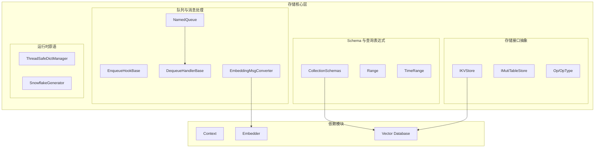
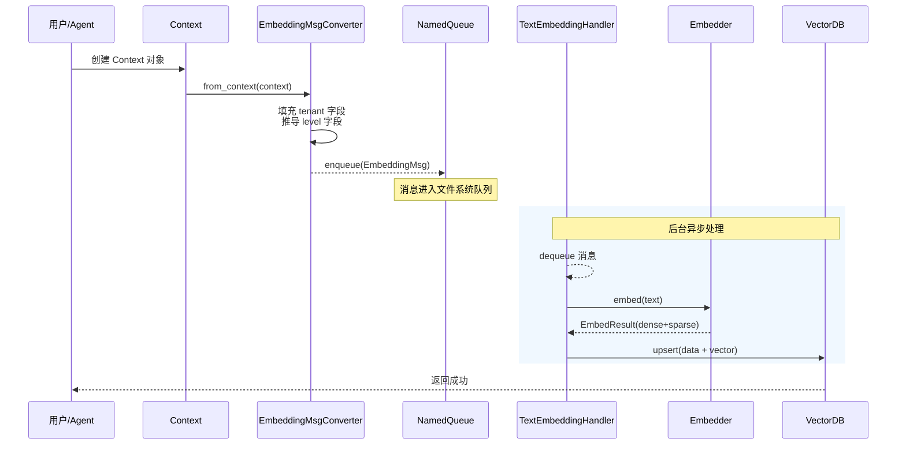

# storage_core_and_runtime_primitives 模块文档

## 模块概述

`storage_core_and_runtime_primitives` 是 OpenViking 系统的核心存储基础设施模块。如果说整个存储系统是一栋建筑，那么这个模块就是它的地基和钢筋骨架——它不直接处理用户数据，但它定义了**数据如何被组织、如何流动、如何被唯一标识**这些最根本的问题。

**这个模块解决什么问题？**

在构建一个支持语义搜索的 AI 助手系统时，开发者面临几个核心挑战：
1. **数据如何结构化？** 各种上下文（资源、记忆、技能）需要存储到向量数据库，但每个 collection 需要定义清晰的字段schema
2. **查询如何表达？** 复杂的过滤条件（时间范围、数值区间、包含关系）需要一个类型安全的抽象
3. **嵌入向量如何异步生成？** 文本到向量的转换是 IO 密集型操作，不能阻塞主流程，需要队列机制解耦
4. **分布式环境下 ID 如何唯一？** 多个服务实例可能同时写入，需要不依赖中心节点的 ID 生成方案

这个模块正是为了解决这些问题而设计的。它是存储层的"最小原语集"——其他所有存储相关模块都依赖这些基础抽象。

---

## 架构概览

**模块核心组件地图：**

| 子模块 | 核心组件 | 职责概述 |
|--------|----------|----------|
| [storage_schema_and_query_ranges](storage_schema_and_query_ranges.md) | `CollectionSchemas`, `Range`, `TimeRange` | 定义向量数据库 collection 的 schema 结构；提供类型安全的查询过滤表达式 AST |
| [observer_and_queue_processing_primitives](storage_core_and_runtime_primitives-observer_and_queue_processing_primitives.md) | `NamedQueue`, `BaseObserver`, `EmbeddingMsgConverter` | 异步队列处理机制，用于将文本转换为嵌入向量的后台任务调度 |
| [kv_store_interfaces_and_operation_model](storage_core_and_runtime_primitives-kv_store_interfaces_and_operation_model.md) | `IKVStore`, `IMutiTableStore`, `Op` | 存储层的接口抽象，定义键值存储和多表存储的操作契约 |
| [store_value_typing_and_ttl](storage-core-and-runtime-primitives-store-value-typing-and-ttl.md) | `Type`, `TTLData` | 存储数据的类型标记和 TTL（元数据过期机制） |
| [runtime_support_utilities](storage_core_and_runtime_primitives-runtime_support_utilities.md) | `ThreadSafeDictManager`, `SnowflakeGenerator` | 运行时支持：线程安全的字典管理、分布式唯一 ID 生成 |

---

## 核心设计决策

### 1. 队列解耦：为什么选择文件系统队列而非内存队列？

**决策：** `NamedQueue` 使用 AGFS（AgentFS）文件系统作为队列底层，而非 in-memory 队列或 Redis/Kafka 等消息中间件。

**分析：**
- **内存队列**的缺点：进程重启后消息丢失，无法支持故障恢复
- **Redis/Kafka**的缺点：引入额外外部依赖，增加部署复杂度
- **文件系统队列**的优点：利用已有的 AGFS 基础设施，实现"恰好一次"的语义，同时支持多进程并发消费

** tradeoff 考量：** 这是一个"基础设施复用"的选择。如果系统后续需要支持更高吞吐，可能需要迁移到专用消息队列，但当前设计保持了简单性。

### 2. Snowflake ID：时钟回拨问题的务实处理

**决策：** `SnowflakeGenerator` 在检测到时钟回拨时，如果偏移小于等于 5 毫秒，则等待时钟恢复；否则抛出异常。

**为什么不完全依赖等待？**
- 长时间的时钟回拨可能是系统配置错误，继续等待不现实
- 抛出异常可以快速暴露配置问题，而不是静默丢失数据

**为什么不是更复杂的解决方案（如定期同步逻辑时钟）？**
- 对于单机部署场景，时钟回拨本身就是异常情况
- 当前实现是一个务实的"fail-fast"策略

### 3. 查询表达式：为什么用 dataclass 而非字符串 DSL？

**决策：** `Range`、`TimeRange` 等过滤表达式使用 Python dataclass 定义，而非自由文本的 DSL（如 MongoDB 的查询语法）。

**分析：**
- **类型安全**：编译器可以在开发时捕获字段名错误
- **IDE 支持**：自动补全、重构、类型检查
- **可测试性**：可以直接比较表达式是否等价

**代价：** 灵活性降低，无法表达复杂的嵌套条件（虽然 `And`/`Or` 组合在一定程度上缓解了这个问题）

---

## 数据流分析

### 场景：上下文对象的向量化存储

当用户添加一个资源（文件、记忆、技能）到系统时，数据流经以下路径：

**关键点：**
1. **生产者视角**：只需将 `Context` 转换为 `EmbeddingMsg` 放入队列，无需等待向量化完成
2. **消费者视角**：`TextEmbeddingHandler` 是 `DequeueHandlerBase` 的实现，它在后台轮询队列并处理消息
3. **解耦效果**：向量化（可能耗时数百毫秒）不会阻塞用户请求

---

## 与其他模块的依赖关系

这个模块是**底层基础设施**，它被以下模块依赖：

| 依赖模块 | 依赖内容 |
|----------|----------|
| `vectordb_domain_models_and_service_schemas` | 使用 `IKVStore`/`IMutiTableStore` 接口实现具体的存储后端 |
| `vectorization_and_storage_adapters` | 使用 `CollectionSchemas` 定义 collection 结构 |
| `core_context_prompts_and_sessions` | `EmbeddingMsgConverter` 依赖 `Context` 类型 |

**被依赖的接口：**
- `CollectionSchemas.context_collection()` — 创建统一的上下文 collection schema
- `Range` / `TimeRange` — 构建向量查询的过滤条件
- `NamedQueue` — 异步任务调度的基础设施

---

## 新贡献者注意事项

### 1. 队列的"恰好一次"语义是尽力而为的

`NamedQueue` 的实现依赖于 AGFS 文件系统的 `read` 操作会自动删除消息。但如果在 `read` 和 `delete` 之间进程崩溃，消息可能被重复消费。**如果你的业务不能容忍重复处理，需要在 handler 层面实现幂等性**。

### 2. SnowflakeGenerator 是进程级别的单例

`_default_generator` 是一个全局单例，但它的 `worker_id` 是基于 PID 生成的。这意味着：
- 同一个进程的多个线程会共享同一个 generator
- 进程重启后会生成不同的 worker_id

如果需要跨进程共享状态（比如 Kubernetes 多副本部署），需要通过配置中心协调 worker_id 分配。

### 3. EmbeddingMsgConverter 会静默跳过非字符串消息

在 `TextEmbeddingHandler.on_dequeue` 中，如果 `embedding_msg.message` 不是字符串类型，会直接跳过并报告成功。**如果你的业务场景确实需要处理非文本输入（如图片），需要扩展这里的处理逻辑**。

### 4. Schema 字段 `type` 和 `context_type` 的区别

这两个字段很容易混淆：
- `type`：资源的具体类型（file、directory、image 等），**当前版本未使用，保留用于未来扩展**
- `context_type`：区分上下文的大类（resource、memory、skill）

向下滑动查看 [collection_schemas](storage_schema_and_query_ranges.md) 的详细文档。

---

## 总结

这个模块的核心价值在于**定义了存储系统的基础契约**。理解它的设计，需要把握几个关键词：

1. **接口抽象** — `IKVStore`、`IMutiTableStore` 定义了"存储是什么"
2. **异步解耦** — `NamedQueue` + `DequeueHandlerBase` 实现了"处理与写入分离"
3. **类型安全** — dataclass 化的查询表达式让过滤条件可验证、可测试
4. **分布式 ID** — Snowflake 算法提供了不依赖中心节点的唯一 ID 生成

当你需要在这个系统中添加新的存储后端、实现新的过滤条件、或修改向量化流程时，这个模块的接口就是你需要遵循的契约。