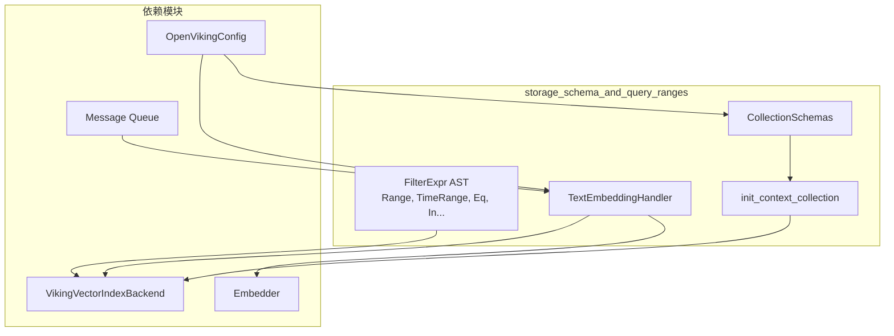

# storage_schema_and_query_ranges 模块

## 模块概述

`storage_schema_and_query_ranges` 是 OpenViking 存储层的核心模块，负责两件至关重要的事情：**定义数据的结构**（Schema）和**构建查询的过滤条件**（Query Ranges）。这个模块就像是数据库的"宪法"——它不直接处理数据的读写，但所有的读写操作都必须遵循它制定的规则。

想象一下：如果把向量数据库比作一个大型图书馆，那么 `CollectionSchemas` 就是图书馆的**分类系统**——它定义了每本书应该放在哪个书架、每本书需要包含哪些信息（标题、作者、分类、摘要等）。而 `expr.py` 中的过滤表达式就是图书馆的**检索系统**——你可以组合各种条件（"作者是 XXX"且"出版年份在 2020-2024 之间"且"分类包含某个关键词"）来精准定位想要的书籍。

### 核心职责

1. **集中化 Schema 定义**：为所有上下文数据提供统一的字段规范，确保存储层与检索层的数据契约一致
2. **查询表达式 DSL**：提供类型安全的、组合式的过滤条件构建器，让复杂的查询逻辑可以用声明式的方式表达
3. **初始化与写入 pipeline**：包含集合初始化逻辑和文本向量化写入的完整流程示例

---

## 架构概览



### 数据流动路径

**路径一：集合初始化**
```
OpenVikingConfig → CollectionSchemas.context_collection() → init_context_collection() → VikingVectorIndexBackend.create_collection()
```

**路径二：查询构建**
```
业务代码 → FilterExpr 组合（Eq + And + Range 等）→ VikingVectorIndexBackend.query() → 底向量化数据库 adapter
```

**路径三：数据写入**
```
MessageQueue → TextEmbeddingHandler.on_dequeue() → Embedder.embed() → VikingVectorIndexBackend.upsert()
```

---

## 核心设计决策

### 1. 冻结的不可变数据结构（Frozen Dataclasses）

`expr.py` 中所有的过滤表达式类都使用了 `frozen=True`：

```python
@dataclass(frozen=True)
class Range:
    field: str
    gte: Any | None = None
    gt: Any | None = None
    lte: Any | None = None
    lt: Any | None = None
```

**为什么这样做？**
- **线程安全**：不可变对象天然线程安全，可以在多线程环境下自由共享而无需加锁
- **可哈希**：可以放入集合（set）中使用，或者作为字典的 key
- **可预期性**：构建后的表达式不会被意外修改，消除了一半的 bug 来源

**tradeoff**：如果业务场景需要动态修改过滤条件，需要创建新的实例而非修改现有实例，这对于构建阶段来说不是问题。

### 2. 联合类型实现的可组合 DSL

```python
FilterExpr = Union[And, Or, Eq, In, Range, Contains, TimeRange, RawDSL]
```

这种设计允许用递归组合的方式构建复杂的查询条件：

```python
# 构建一个复杂的过滤条件
filter_expr = And([
    Eq("context_type", "resource"),
    Or([
        In("level", [0, 1]),  # L0 或 L1
        Eq("parent_uri", "/some/path")  # 或者是某个目录的子节点
    ]),
    Range("created_at", gte="2024-01-01"),
    Contains("name", "important")
])
```

**为什么不用字符串拼接或字典嵌套？**
- **类型安全**：静态类型检查器可以验证表达式的正确性
- **可测试性**：每个表达式类都可以独立单元测试
- **可读性**：代码即文档，结构清晰明了
- **扩展性**：新增过滤类型只需添加新的 dataclass，无需修改现有代码

### 3. Schema 的分层设计

`CollectionSchemas.context_collection()` 返回的 schema 包含了多个逻辑层次：

| 字段类别 | 字段示例 | 用途 |
|---------|---------|------|
| 身份标识 | `id`, `uri` | 唯一标识资源 |
| 类型分类 | `type`, `context_type`, `level` | 三层分类体系 |
| 向量数据 | `vector`, `sparse_vector` | 语义搜索支持 |
| 时间管理 | `created_at`, `updated_at` | 时序相关查询 |
| 内容描述 | `name`, `description`, `abstract`, `tags` | 文本检索 |
| 多租户 | `account_id`, `owner_space` | 租户隔离 |

**关键设计决策：`level` 字段**
- L0 = 摘要（abstract）- 最高层级的概括
- L1 = 概览（overview）- 目录层级的摘要
- L2 = 详情（content）- 原始内容

这种分层设计使得系统可以先用 L0/L1 快速判断相关性，再用 L2 返回详细内容，实现了**分级检索**的策略。

### 4. 混合向量支持

Schema 同时支持 `vector`（稠密向量）和 `sparse_vector`（稀疏向量）：

```python
{"FieldName": "vector", "FieldType": "vector", "Dim": vector_dim},
{"FieldName": "sparse_vector", "FieldType": "sparse_vector"},
```

**为什么需要两种向量？**
- **稠密向量**：捕捉语义相似性，适合"查找相似的文档"
- **稀疏向量**：精确匹配关键词，适合"包含某些术语的文档"
- **混合检索**：结合两者可以获得更好的召回和精度平衡

这对应了现代检索系统中的 **dense-sparse hybrid search** 范式。

### 5. TextEmbeddingHandler 的异步设计

```python
result: EmbedResult = await asyncio.to_thread(
    self._embedder.embed, embedding_msg.message
)
```

**为什么需要 `asyncio.to_thread`？**
- 嵌入模型通常通过 HTTP 调用外部服务，是 **阻塞 I/O** 操作
- 直接 await 会阻塞整个事件循环，降低并发能力
- 放到线程池执行可以让出事件循环，实现真正的并发

---

## 子模块说明

本模块包含以下子模块：

### 1. collection_schemas - 集合 Schema 定义

负责定义所有集合的字段结构、索引配置和数据类型约束。

- **[collection_schemas](./storage-schema-and-query-ranges-collection-schemas.md)** - 集中化的 Schema 定义和初始化逻辑

### 2. expr - 查询表达式 DSL

提供类型安全的过滤条件构建器，是构建复杂查询的核心抽象。

- **[expr](./storage-schema-and-query-ranges-expr.md)** - FilterExpr AST 定义和组合逻辑

---

## 依赖关系与系统集成

### 上游依赖（被哪些模块依赖）

| 模块 | 依赖内容 |
|------|---------|
| `vectordb_domain_models_and_service_schemas` | 使用 `CollectionSchemas` 定义集合结构 |
| `vectorization_and_storage_adapters` | 写入数据时遵循 schema 定义 |
| `storage_core_and_runtime_primitives` | 查询时使用 `FilterExpr` 构建条件 |

### 下游依赖（依赖哪些模块）

| 模块 | 依赖内容 |
|------|---------|
| `python_client_and_cli_utils` 的 `open_viking_config` | 读取配置获取 collection 名称和向量维度 |
| `model_providers_embeddings_and_vlm` | 生成文本嵌入向量 |
| `storage_core_and_runtime_primitives` 的 `VikingVectorIndexBackend` | 执行实际的数据库操作 |

### 关键数据契约

**Schema 定义 → 数据库的契约：**
```python
{
    "CollectionName": str,           # 集合名称
    "Fields": List[FieldDefinition], # 字段定义列表
    "ScalarIndex": List[str]         # 标量索引字段
}
```

**FilterExpr → 查询 API 的契约：**
```python
FilterExpr  # 联合类型：And | Or | Eq | In | Range | Contains | TimeRange | RawDSL
```

---

## 新贡献者注意事项

### ⚠️ 1. Schema 变更需要迁移

添加新字段时，必须考虑：
- 向量数据库是否支持 schema migration
- 已有数据是否需要回填
- 下游代码是否能处理新字段（可能是 None）

### ⚠️ 2. FilterExpr 的递归深度

组合 `And` / `Or` 时可以嵌套多层，但：
- 某些向量数据库对嵌套深度有限制
- 过深的嵌套会影响查询性能
- 建议将复杂条件拆分成多个步骤

### ⚠️ 3. TimeRange 的时区处理

```python
@dataclass(frozen=True)
class TimeRange:
    field: str
    start: datetime | str | None = None
    end: datetime | str | None = None
```

`start` 和 `end` 可以是 `datetime` 对象或字符串：
- 字符串格式需要与数据库时区一致
- 建议始终使用 UTC 时区存储和查询

### ⚠️ 4. RawDSL 的使用场景

`RawDSL` 允许直接传入字典，绕过类型安全的表达式构建器：
```python
RawDSL({"op": "must", "field": "tags", "conds": ["important"]})
```

**谨慎使用**：这会绕过类型检查，仅用于：
- 快速迭代新功能
- 使用 expr.py 尚未支持的查询特性
- 迁移遗留查询代码

### ⚠️ 5. TextEmbeddingHandler 的关闭处理

代码中有关键的关闭检测逻辑：
```python
if getattr(self._vikingdb, "is_closing", False):
    logger.debug(f"Skip embedding write during shutdown: {db_err}")
    self.report_success()
    return None
```

这是因为在服务关闭时，queue worker 可能会处理最后一条消息，但此时集合可能已被删除。需要确保你的 `VikingVectorIndexBackend` 实现正确暴露 `is_closing` 属性。

### ⚠️ 6. 向量维度一致性

```python
if len(result.dense_vector) != self._vector_dim:
    error_msg = f"Dense vector dimension mismatch: expected {self._vector_dim}, got {len(result.dense_vector)}"
```

向量维度必须在写入前验证，否则会写入无效数据或导致后续查询失败。

---

## 扩展点

如果你需要扩展这个模块：

1. **新增过滤表达式类型**：在 `expr.py` 中添加新的 dataclass（如 `Regex`、`Exists` 等），并更新 `FilterExpr` 联合类型
2. **新增 Schema 定义**：在 `CollectionSchemas` 中添加新的静态方法
3. **自定义 EmbeddingHandler**：继承 `DequeueHandlerBase` 实现特定的数据处理逻辑

---

## 相关文档

- [collection_schemas](./storage-schema-and-query-ranges-collection-schemas.md) - 集合 Schema 详解
- [expr](./storage-schema-and-query-ranges-expr.md) - 查询表达式 DSL 详解
- [VikingVectorIndexBackend](../vectordb_domain_models_and_service_schemas/viking_vector_index_backend.md) - 向量索引后端
- [CollectionAdapter](../vectorization_and_storage_adapters/collection_adapters_abstraction_and_backends.md) - 集合适配器抽象