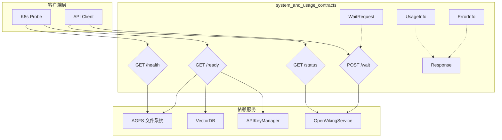

# system_and_usage_contracts

## 模块概述

`system_and_usage_contracts` 模块是 OpenViking HTTP Server 的系统契约层，扮演着**基础设施健康检查与使用量度量**的双重角色。把它想象成飞机的仪表盘——飞行员（调用方）需要知道引擎是否正常运转（健康检查），以及飞了多远、消耗了多少燃料（使用量统计）。

本模块解决两个核心问题：

1. **系统可观测性**：在分布式系统中，服务的健康状态不是"非黑即白"的。AGFS 文件系统、VectorDB 向量数据库、APIKeyManager 密钥管理器——这些组件可能处于不同的工作状态。本模块提供了精细的健康检查机制，让 Kubernetes 的探针和运维系统能够准确判断服务是否"就绪"。
2. **资源使用量追踪**：在大规模 RAG（检索增强生成）场景中，token 消耗和向量扫描是核心成本指标。`UsageInfo` 模型作为标准响应的一部分，为计费、监控和优化提供了数据基础。

## 架构概览



### 核心组件职责

| 组件 | 职责 | 位置 |
|------|------|------|
| `WaitRequest` | 等待资源处理完成的请求模型 | `openviking.server.routers.system` |
| `UsageInfo` | 使用量信息（token 计数、向量扫描数） | `openviking.server.models` |
| `Response` | 统一 API 响应封装器 | `openviking.server.models` |
| `ErrorInfo` | 错误信息结构 | `openviking.server.models` |
| `/health` | 基础存活探针 | `system.py` |
| `/ready` | 就绪探针（三层检查） | `system.py` |
| `/api/v1/system/status` | 系统状态查询 | `system.py` |
| `/api/v1/system/wait` | 等待处理完成 | `system.py` |

### 数据流分析

**场景一：K8s 就绪探针（Readiness Probe）**

```
K8s Pod Lifecycle
    │
    ├─→ GET /health ─→ {"status": "ok"}
    │                    └─→ 简单存活检查，不涉及业务逻辑
    │
    └─→ GET /ready
            │
            ├─→ viking_fs.ls("viking://")  ─→ 检查 AGFS 可访问性
            │
            ├─→ storage.health_check()     ─→ 检查 VectorDB 连接
            │
            └─→ request.app.state.api_key_manager ─→ 检查密钥管理器
```

这个三层检查的设计遵循了**fail-fast 原则**：只要任意一个关键组件不可用，就返回 503，让负载均衡器将流量切换到其他健康的 Pod。

**场景二：客户端调用并获取使用量**

```
Client Request
    │
    ├─→ POST /api/v1/search/search
    │        │
    │        └─→ service.search(...)
    │                  │
    │                  ├─→ 向量检索 ─→ vectors_scanned: 150
    │                  └─→ LLM 调用 ─→ tokens: 3200
    │
    └─← Response {
          status: "ok",
          result: [...],
          usage: {
            tokens: 3200,
            vectors_scanned: 150
          },
          time: 0.245
        }
```

## 设计决策与权衡

### 决策一：为什么 `/health` 和 `/ready` 分开？

这是借鉴了 Kubernetes 的最佳实践：
- `/health`：仅检查进程是否存活（PID 是否存在、能否响应请求）
- `/ready`：检查所有依赖服务是否可用（数据库、文件系统、缓存）

**为什么这样设计？** 在分布式系统中，进程存活不代表服务可用。比如服务启动时可能已经绑定了端口，但 VectorDB 连接池还未初始化完成。如果用单一的 health 端点，流量会过早进入未准备好的实例，导致失败。

### 决策二：为什么 UsageInfo 是可选的？

```python
class UsageInfo(BaseModel):
    tokens: Optional[int] = None
    vectors_scanned: Optional[int] = None
```

**权衡分析：**
- **可选字段**增加了 API 的灵活性——不需要使用量的调用方无需关心这个字段
- **可选类型**意味着后端不必强制计算所有使用量——某些简单查询可能不值得追踪开销
- **代价是**调用方需要处理 `None` 值，增加了防御性编程的复杂度

这是一个典型的**正交性 vs 便利性**权衡：追求 API 的正交性（各部分独立），但牺牲了调用方的便利性。

### 决策三：为什么错误码映射是静态字典？

```python
ERROR_CODE_TO_HTTP_STATUS = {
    "OK": 200,
    "INVALID_ARGUMENT": 400,
    ...
}
```

**选择**：硬编码映射表  
**替代方案**：动态注册、数据库配置、远程服务

**选型理由**：
1. **性能**：字典查找 O(1)，无需网络或数据库开销
2. **简单性**：错误码体系在项目初期就确定，变更频率低
3. **可预测性**：静态代码意味着静态行为，调试时容易定位问题

**潜在风险**：如果错误码体系扩展，需要修改代码。但这与当前项目的迭代速度是匹配的。

## 与其他模块的交互

### 上游依赖

| 模块 | 依赖内容 |
|------|----------|
| `server_api_contracts` | 本模块是 `server_api_contracts` 的子模块，被 `admin_user_and_role_contracts`、`search_request_contracts` 等引用 |
| `parsing_and_resource_detection` | 无直接依赖 |
| `model_providers_embeddings_and_vlm` | 无直接依赖 |

### 下游依赖

| 模块 | 依赖内容 |
|------|----------|
| `server_api_contracts` 父模块 | 本模块为其提供 `Response` 基类，所有 API 路由都使用它 |
| 其他 Router 模块 | `search.py`、`sessions.py`、`resources.py` 等都返回 `Response` 类型 |

### 关键调用链

```
任何 API 端点（如 /api/v1/search/find）
    │
    └─→ 返回 Response(status="ok", result=..., usage=UsageInfo(...))
              │
              └─→ 客户端解析 usage 字段进行计费/监控
```

## 子模块文档

本模块包含以下子模块：

### 1. system_endpoint_contracts

包含系统级端点的请求/响应模型：
- `WaitRequest`：等待资源处理完成的请求模型
- `/health`、`/ready`、`/status`、`/wait` 端点的实现逻辑

**详细文档**：[system_endpoint_contracts](./system_endpoint_contracts.md)

### 2. response_and_usage_models

包含标准响应格式和使用量追踪模型：
- `Response`：统一 API 响应结构
- `UsageInfo`：使用量信息（token、向量扫描数）
- `ErrorInfo`：错误信息结构
- `ERROR_CODE_TO_HTTP_STATUS`：错误码到 HTTP 状态码的映射

**详细文档**：[response_and_usage_models](./server-api-contracts-system-and-usage-contracts-response-and-usage-models.md)

## 新贡献者注意事项

### ⚠️ 潜在陷阱

1. **`/ready` 端点的副作用**
   - `/ready` 端点会实际调用 `viking_fs.ls("viking://")` 来检查文件系统
   - 这不是"只读"操作——如果 AGFS 有副作用（如审计日志），每次探针都会触发
   - 在高频率探针（如每秒一次）下可能产生大量日志

2. **`wait_processed` 的超时行为**
   - `WaitRequest.timeout` 默认为 `None`，意味着可能无限期等待
   - 调用方必须设置合理的超时，避免客户端挂起
   - 服务端没有强制超时限制，完全依赖传入参数

3. **`UsageInfo` 可能为空**
   - 并非所有响应都包含 `usage` 字段
   - 调用方在解析使用量前必须检查 `response.usage` 是否为 `None`
   - 这在计费系统中尤其重要——漏掉检查会导致 `AttributeError`

4. **错误码与 HTTP 状态的不完全映射**
   - 并非所有 gRPC 风格错误码都有对应的 HTTP 状态
   - 如 `SESSION_EXPIRED` 映射到 410，但很多场景下可能返回 200 而在 `error` 字段中携带错误信息
   - 调用方需要同时检查 `status` 字段和 HTTP 状态码

### 🔧 扩展点

1. **添加新的健康检查项**
   在 `/ready` 端点中添加新的检查项：
   ```python
   # 在 readiness_check 函数中添加
   try:
       cache = get_cache()
       await cache.ping()
       checks["cache"] = "ok"
   except Exception as e:
       checks["cache"] = f"error: {e}"
   ```

2. **扩展 UsageInfo 字段**
   添加新的度量指标：
   ```python
   class UsageInfo(BaseModel):
       tokens: Optional[int] = None
       vectors_scanned: Optional[int] = None
       api_calls: Optional[int] = None  # 新增
   ```

3. **自定义错误码**
   在 `ERROR_CODE_TO_HTTP_STATUS` 中添加新的映射：
   ```python
   "RATE_LIMITED": 429,
   ```

### 🔄 关键合约

- 所有返回 `Response` 的端点必须包含 `status` 字段（"ok" 或 "error"）
- 错误响应必须填充 `error` 字段，包含 `code` 和 `message`
- 使用量信息是可选的，但推荐在耗时操作中提供
- `/health` 和 `/ready` 端点不需要认证，适合 K8s 探针
- `/api/v1/system/*` 其他端点需要有效的 `RequestContext`