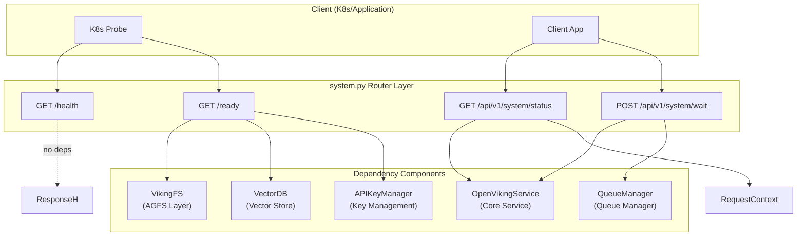

# system_endpoint_contracts 模块技术深度解析

## 概述

`system_endpoint_contracts` 模块是 OpenViking HTTP 服务器的系统级端点集合，位于 `openviking/server/routers/system.py`。这个模块解决的问题看似简单却至关重要：**如何让外部系统（特别是 Kubernetes 等容器编排平台）可靠地探测服务的健康状态和就绪状态，以及如何让客户端能够同步等待异步资源处理完成**。

在分布式系统中，一个服务通常不是孤立运行的。它依赖文件系统、向量数据库、消息队列等多个下游组件。如果仅仅检查进程是否存活就返回 "健康"，往往会误导调用者——服务虽然活着，但它的依赖已经不可用了。`system_endpoint_contracts` 模块通过 `/ready` 端点执行**深度的依赖检查**，确保在返回 "就绪" 之前，AGFS 文件系统、向量数据库和 API 密钥管理器都能正常工作。这种设计避免了 Kubernetes 将流量调度到"半死不活"的实例上，提高了整个系统的可用性。



## 核心组件

### WaitRequest 请求模型

`WaitRequest` 是系统等待端点的输入模型，定义极为精简：

```python
class WaitRequest(BaseModel):
    """Request model for wait."""
    timeout: Optional[float] = None
```

这个设计反映了一个重要的权衡：**简单性 vs 功能性**。为什么不包含更多的参数，比如指定等待哪个队列、或者是否忽略某些错误？答案在于这个端面的使用场景——通常是客户端在执行 `add_resource` 操作时设置 `wait=True` 后的轮询机制。在这种情况下，客户端只是想知道"之前提交的所有资源处理任务是否已经完成"，不需要细粒度的控制。`timeout` 参数的存在是为了防止客户端无限期阻塞：当队列处理卡死时，服务器可以返回明确的超时错误，而不是hang住连接。

### 四个系统端点的职责

**1. `/health` 端点 —— 进程存活探测**

这是最轻量级的检查，只返回 `{"status": "ok"}`，不涉及任何依赖组件的检查。它对应 Kubernetes 的 `livenessProbe`，目的是告诉 Kubernetes"这个进程还在运行"。如果这个端点返回错误，Kubernetes 会重启容器。在设计哲学上，这个端点遵循**快速失败**原则：即使所有下游组件都挂了，只要进程还活着，就返回 200。这看起来有些反直觉，但实际上是有意义的——进程层面的重启比应用层面的自愈更快，而且如果依赖组件全部不可用，重启也解决不了问题。

**2. `/ready` 端点 —— 就绪探测**

这是模块的核心功能，对应 Kubernetes 的 `readinessProbe`。它执行三层检查：

- **AGFS 检查**：尝试列出根目录 `viking://`，验证文件系统层是否可访问。这里使用 `ctx=None` 是关键——健康检查不应该依赖任何用户身份，因为在服务刚启动时可能还没有任何用户上下文。
- **VectorDB 检查**：调用存储后端的 `health_check()` 方法，该方法会尝试执行 `collection_exists()` 来验证集合是否存在且可访问。
- **APIKeyManager 检查**：验证 `request.app.state.api_key_manager` 是否已加载。

返回逻辑值得注意：**"not_configured" 被视为正常状态**。这反映了系统设计的灵活性——在开发环境或某些测试场景中，某些组件可能没有被配置。如果把 "not_configured" 也视为失败，会导致开发体验很差。

**3. `/api/v1/system/status` 端点 —— 运行时状态查询**

这个端点返回更详细的运行时信息：

```python
return Response(
    status="ok",
    result={
        "initialized": service._initialized,
        "user": service.user._user_id,
    },
)
```

注意这里使用了 `_initialized` 和 `_user_id`（带下划线前缀），表明这些是内部属性而非公共 API。返回这些信息的目的是让运维人员或客户端能够诊断问题——如果 `initialized` 为 false，说明服务虽然能响应请求，但还没有完成初始化流程。

**4. `/api/v1/system/wait` 端点 —— 处理完成等待**

这是唯一一个接受请求体的端点（使用 `WaitRequest` 模型）。它的作用是等待 QueueManager 中所有排队的任务处理完成。调用链如下：

```
WaitRequest → service.resources.wait_processed(timeout)
            → qm.wait_complete(timeout)
            → 返回各队列的处理状态
```

这个端面的存在解决了异步处理带来的编程模型问题。当用户调用 `add_resource` 时，默认行为是立即返回，资源处理在后台异步进行。但在某些场景下（例如测试脚本、CI/CD 流水线），用户需要确认资源已经真正被处理完毕才能继续下一步操作。此时客户端可以调用 `/api/v1/system/wait`，服务器会阻塞直到所有队列处理完成（或超时）。

## 数据流与依赖关系

### 请求上下文（RequestContext）的流动

在大多数端点中，你会看到 `RequestContext = Depends(get_request_context)` 这样的依赖注入模式。这条链路是这样的：

1. **认证层**（`auth.py` 中的 `resolve_identity`）：从请求头提取 API Key 或其他身份凭证，解析出用户身份和角色。
2. **上下文构建**（`get_request_context`）：将解析出的身份转换为 `RequestContext` 对象，包含 `user`（UserIdentifier）和 `role`（Role 枚举）。
3. **服务调用**：在端点处理器中，`RequestContext` 被传递给 `OpenVikingService`，进而传递给具体的服务方法。

对于系统端点，值得注意的是：
- `/health` 和 `/ready` **不需要**身份验证（故意设计，因为 K8s probe 无法携带认证信息）
- `/api/v1/system/status` **需要**身份验证（返回用户信息，敏感）
- `/api/v1/system/wait` **需要**身份验证（用户可能需要等待自己的资源处理完成）

### VikingFS 与 VectorDB 的初始化顺序

从代码中可以看到，`/ready` 端点的检查顺序是 AGFS → VectorDB → APIKeyManager。这个顺序不是随意的，而是反映了组件间的依赖关系：

- VikingFS（AGFS）是最底层的文件系统抽象，其他功能都依赖于它
- VectorDB 依赖于 VikingFS（通过 QueueManager 集成）
- APIKeyManager 是最独立的组件，只依赖于 FastAPI 应用状态

如果 AGFS 不可用，检查 VectorDB 是没有意义的——这个顺序确保了检查的效率。

## 设计决策与权衡

### 1. 为什么 `/health` 不检查任何依赖？

这是一个常见的架构决策：**livenessProbe 和 readinessProbe 应该有不同的语义**。LivenessProbe 回答"进程是否需要重启"，ReadinessProbe 回答"是否应该接收流量"。在 OpenViking 的设计中，进程级别的故障（比如死锁）确实需要重启来恢复，但依赖组件的临时不可用不应该触发容器重启——因为重启也解决不了下游故障，反而可能加剧问题（想象所有实例同时重启去争抢一个暂时不可用的数据库）。

### 2. 为什么使用 `ctx=None` 而不是创建虚拟上下文？

在 `/ready` 端点中，调用 `viking_fs.ls("viking://", ctx=None)` 时使用 `ctx=None`。这避免了在服务未完全初始化时创建一个虚假的用户上下文。更深层的考虑是：健康检查应该是**无状态的**——不应该因为某个用户的权限问题而影响整个服务的可用性报告。

### 3. 为什么 `WaitRequest` 如此简单？

如果需要更复杂的功能（比如等待特定队列、指定错误容忍策略），是否应该扩展这个模型？答案倾向于**不应该**。原因是：

- `/api/v1/system/wait` 主要被 `add_resource(..., wait=True)` 的内部实现调用
- 这个端点的契约已经在 `ResourceService.wait_processed()` 中定义好了
- 扩展这个端面会增加复杂度，而收益有限

这种克制是好的 API 设计的体现——**先满足核心需求，后续需要时再扩展**。

### 4. 错误处理策略

模块中的错误处理采用**包容性策略**：捕获异常后记录日志，但继续执行后续检查。最终返回的状态码和响应体反映了所有组件的综合状态。例如：

```python
try:
    viking_fs = get_viking_fs()
    await viking_fs.ls("viking://", ctx=None)
    checks["agfs"] = "ok"
except Exception as e:
    checks["agfs"] = f"error: {e}"
```

这种设计的优点是：即使 AGFS 挂了，VectorDB 和 APIKeyManager 的检查仍然会执行，运维人员可以一次性看到所有组件的状态，而不是需要多次调用才能诊断问题。

## 使用场景与扩展点

### 典型使用场景

**场景 1：Kubernetes 探针配置**

```yaml
livenessProbe:
  httpGet:
    path: /health
    port: 8080
  initialDelaySeconds: 5
  periodSeconds: 10

readinessProbe:
  httpGet:
    path: /ready
    port: 8080
  initialDelaySeconds: 10
  periodSeconds: 5
```

这种配置确保：
- 容器启动 5 秒后开始存活探测，如果失败则重启
- 容器启动 10 秒后开始就绪探测，只有所有依赖都正常时才接收流量

**场景 2：客户端同步等待资源处理**

```python
# 客户端代码
await client.post("/api/v1/resources/add", json={
    "path": "/data/document.pdf",
    "wait": False  # 不等待，立即返回
})
# ... 执行其他操作 ...

# 等待所有处理完成
await client.post("/api/v1/system/wait", json={
    "timeout": 30.0
})
```

### 扩展点

如果未来需要增强功能，以下是潜在的扩展方向：

1. **增加更多健康检查项**：比如检查 QueueManager 的队列长度、Redis 连接状态等
2. **增加监控指标端点**：在 `/api/v1/system/status` 中返回更多运行时指标（内存使用、QPS 等）
3. **增加优雅关闭端点**：在 Kubernetes 终止 Pod 前，允许正在进行的处理完成

## 潜在问题与注意事项

### 1. 并发安全

`get_service()` 使用全局单例模式，没有任何锁保护。在单进程 FastAPI 应用中这不是问题，但如果未来迁移到多进程模式（如 Gunicorn + Uvicorn workers），需要考虑进程间共享状态的问题。

### 2. 循环依赖风险

在 `/ready` 端点中：

```python
viking_fs = get_viking_fs()
storage = viking_fs._get_vector_store()
```

这里直接访问了 `_get_vector_store()` 私有方法。这是一个**脆弱的设计**——如果未来重构了 VikingFS 的内部结构，这个端点可能会 break。更优雅的做法是在 VikingFS 中暴露一个公开的 `health_check()` 方法。

### 3. 超时配置

`/api/v1/system/wait` 端点没有默认超时限制（`timeout` 参数是可选的）。如果 `QueueManager.wait_complete()` 没有实现超时机制，一个挂起的队列可能导致请求永远 hang 住。在生产环境中，建议设置合理的默认超时值（比如 60 秒）。

### 4. 敏感信息泄露

`/api/v1/system/status` 端点返回 `user._user_id`，虽然只是用户 ID 而不是敏感凭证，但在多租户场景中需要注意是否应该对普通用户隐藏这个信息（只对管理员暴露）。

## 相关模块参考

- **[server_api_contracts](./server_api_contracts.md)**：上级模块，包含所有 API 路由契约
- **[response_and_usage_models](./server_api_contracts.md#response_and_usage_models)**：`Response` 模型的定义，所有 API 响应都使用这个格式
- **[session_runtime_and_skill_discovery](./session_runtime_and_skill_discovery.md)**：`OpenVikingService` 的完整定义
- **[storage_core_and_runtime_primitives](./storage_core_and_runtime_primitives.md)**：存储层抽象，包含 VikingFS 和 VectorDB 的底层实现

## 总结

`system_endpoint_contracts` 模块虽然代码量不大，但承担着关键的运维和可靠性职责。它通过分层设计的健康检查机制，让外部系统能够准确感知服务的状态；通过等待机制，解决了异步处理带来的编程复杂性。在设计决策上，这个模块体现了几个核心原则：Liveness 和 Readiness 的语义分离、依赖组件的包容性检查、端面的极简主义。理解这些原则，有助于在后续维护中保持设计的一致性。