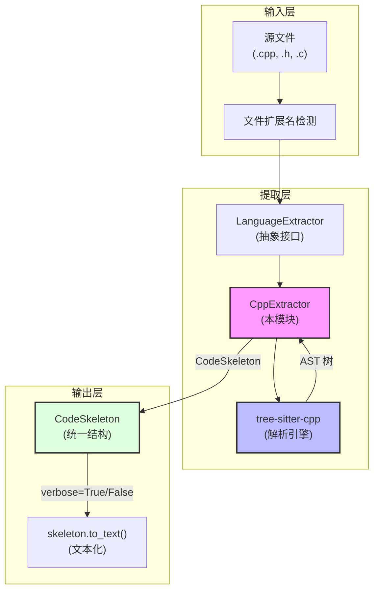

# CppExtractor 模块技术深度解析

## 一句话理解

**`cpp_extractor` 模块是代码库的"X光机"**——它用 tree-sitter 解析 C/C++ 源文件，从复杂的语法结构中提取出清晰的结构骨架（类、函数、导入、文档字符串），供下游的检索和上下文生成系统使用。想象一下你走进一座迷宫，它帮你画出一张只有承重墙和门牌的简化地图，而忽略掉装修细节。

## 问题空间：为什么需要代码结构提取

在大型代码库的智能检索场景中，直接把整个源文件喂给语言模型既浪费 token，又容易让模型迷失在实现细节里。**我们真正需要的是代码的"骨架"**——类的继承结构、函数的签名、模块的依赖关系，以及每个元素的文档说明。

这面临几个挑战：

1. **C/C++ 语法极其复杂**——模板、宏、嵌套命名空间、运算符重载、多重继承，这些特性让简单的正则表达式解析必然失败
2. **代码可能不完整或存在语法错误**——用户可能正在编辑一个尚未保存的文件，或者代码中有编译错误，但检索系统仍需要尽可能提取可用信息
3. **提取结果需要标准化**——不同的源语言（C、C++、Go、Rust、Python）有不同的语法结构，但下游系统期望统一的接口

`cpp_extractor` 正是为解决这些问题而设计的。它基于 `LanguageExtractor` 抽象接口，遵循系统编程语言 AST 提取器的统一模式，将 C/C++ 的复杂性封装成标准化的 `CodeSkeleton` 输出。

---

## 架构角色与数据流

### 在系统中的位置



**数据流的关键路径**如下：

1. **输入**：`file_name`（文件名）和 `content`（源代码字符串）
2. **编码转换**：将字符串编码为 UTF-8 字节序列（tree-sitter 需要字节输入）
3. **AST 解析**：调用 tree-sitter 的 Parser 生成抽象语法树
4. **遍历提取**：从根节点出发，遍历特定类型的节点（`preproc_include`、`class_specifier`、`struct_specifier`、`function_definition`、`namespace_definition`）
5. **结构化输出**：将提取结果封装为 `CodeSkeleton` 对象

```python
# 核心调用链
def extract(self, file_name: str, content: str) -> CodeSkeleton:
    content_bytes = content.encode("utf-8")      # 步骤 1-2: 编码
    tree = self._parser.parse(content_bytes)     # 步骤 3: AST 解析
    root = tree.root_node                        # 步骤 4: 遍历
    
    # 遍历根节点的直接子节点（顶层语法结构）
    siblings = list(root.children)
    for idx, child in enumerate(siblings):
        if child.type == "preproc_include":
            # 提取 #include 语句
        elif child.type in ("class_specifier", "struct_specifier"):
            # 提取类/结构体
        elif child.type == "function_definition":
            # 提取函数
        elif child.type == "namespace_definition":
            # 提取命名空间内的定义
    
    return CodeSkeleton(...)  # 步骤 5: 输出
```

`CppExtractor` 是[ASTExtractor](parsing_and_resource_detection.md#code_ast_extractor)分发器管理的多个语言提取器之一。它通过文件扩展名（.c, .cpp, .cc, .h, .hpp）被选中，然后在 `CodeSkeleton` 这一统一数据模型上输出结果。

### 核心契约

作为 `LanguageExtractor` 抽象基类的具体实现，`CppExtractor` 必须遵守以下契约：

```python
class LanguageExtractor(ABC):
    @abstractmethod
    def extract(self, file_name: str, content: str) -> CodeSkeleton:
        """从源码中提取代码骨架。遇到不可恢复的错误时抛出异常。"""
```

输入是原始源代码字符串，输出是包含 imports、classes、functions 三个列表的 `CodeSkeleton` 对象。这个对象随后会被序列化为文本（通过 `to_text()` 方法），用于两种不同的下游场景：verbose 模式输出完整文档字符串供 LLM 使用，非 verbose 模式只输出首行供嵌入向量化使用。

---

## 内部设计解析

### 解析策略：为什么选择手写树遍历？

理解 `CppExtractor` 的设计思路，需要先理解 C/C++ 语法本身的复杂性。与 Python 或 JavaScript 不同，C++ 的语法树节点类型极其丰富，嵌套层次深，且存在大量语法变体（指针声明、函数指针、模板、命名空间等）。

一种常见的替代方案是使用访问者模式（Visitor Pattern）：为每种感兴趣的节点类型注册回调函数，让遍历器自动分发给定的回调。但这里做了一个有意为之的选择：**手写单次遍历 + 递归提取**。

这种设计背后的考量是：

1. **控制力**：C++ 的嵌套结构（如命名空间内的类、类内的嵌套类型）需要精确控制遍历顺序和上下文，手写遍历可以精确决定何时进入子节点、如何处理兄弟节点关系。

2. **文档字符串提取的便利**：`_preceding_doc` 函数需要访问兄弟节点列表来查找前置注释，手写遍历天然适合这种需要"前瞻"或"回溯"的场景。

3. **实现简洁性**：对于这种规模的解析器，访问者模式引入的间接层和注册机制可能带来额外的认知负担。

### 核心辅助函数：分工明确的"提取小组"

模块定义了一组私有函数，每个函数负责一个具体的提取任务。这种分工体现了**单一职责原则**——每个函数只关心一种类型的结构：

**`_node_text(node, content_bytes)`** — 将 tree-sitter 的字节偏移范围转换为 Python 字符串。使用 `decode("utf-8", errors="replace")` 处理可能的编码问题，这是一个**防御性编程**的典型例子——即使代码文件编码混乱，解析器也不会崩溃。注意它使用 `errors="replace"` 意味着无效的 UTF-8 序列会被替换为 ，这在大多数情况下是安全的，但可能导致提取出的文本包含奇怪字符。

**`_preceding_doc(siblings, idx, content_bytes)`** — 提取前置文档注释。这个函数的逻辑非常直接：检查前一个兄弟节点是否是 `comment` 类型，如果是，则解析 Doxygen 风格的块注释（`/** ... */` 或 `/* ... */`）。它不处理行注释（`//`），这是因为在 C++ 中行注释通常与代码在同一行或紧邻，不适合作为独立的文档字符串提取点。

**`_extract_function_declarator`** — 递归提取函数声明器信息，处理函数名、参数列表以及嵌套的函数声明器（如函数指针）。这是一个典型的**递归下降模式**的应用——函数调用自身来处理层层嵌套的声明器节点。

**`_extract_function`** 和 **`_extract_class`** — 分别从函数定义节点和类/结构体规范节点中提取签名信息。这两个函数都遍历节点的直接子节点，根据类型匹配并提取相应的属性。

### C++ 特异性处理：拥抱复杂性

C++ 语言的复杂性使得 Extractor 需要处理多个 Python 或 JavaScript 提取器不需要面对的问题。这里体现了**针对领域特点做优化**的设计思想：

1. **class_specifier 与 struct_specifier 的统一**：C++ 中 `class` 和 `struct` 本质上相同（只是默认成员可见性不同），在提取骨架时这种区别通常不重要。代码选择将两者都视为"类"来处理，简化了后续的表示。

2. **命名空间嵌套**：`namespace_definition` 节点可能包含 `declaration_list`，其中嵌套了类定义和函数定义。提取器需要递归处理这种情况，将命名空间内部的内容"提升"到顶层列表中。**但注意**：当前实现**只处理一层嵌套**，这意味着 `namespace A { namespace B { class C {} } }` 这种深层嵌套只能提取到 B 里面的内容，A 层的命名空间会被忽略。

3. **多种类型标识符**：C++ 的返回类型可能来自 `type_specifier`、`primitive_type`、`type_identifier`、`qualified_identifier` 或 `auto`。提取器逐一尝试这些类型，找到第一个非空值作为返回类型。

4. **指针和引用**：函数声明中的 `pointer_declarator` 节点需要额外处理才能正确提取函数名和参数。

### 特殊设计：延迟导入策略

```python
def __init__(self):
    import tree_sitter_cpp as tscpp
    from tree_sitter import Language, Parser

    self._language = Language(tscpp.language())
    self._parser = Parser(self._language)
```

**设计洞察**：采用延迟导入（lazy import）模式是有意为之的。tree-sitter 语言绑定在某些部署环境中可能不可用，延迟导入可以让模块在没有 C/C++ 解析器的环境中也能被导入（只是调用时会失败）。这是一个典型的**解耦策略**——将依赖的可用性与模块的加载分离。

---

## 设计决策与权衡

### 1. 选择 tree-sitter 而非编译前端

**tradeoff：轻量级 vs 完整性**

如果使用 Clang/LLVM 的 C++ 前端，可以获得完美的语义级解析（理解模板实例化、类型推断、宏展开）。但这会带来沉重的运行时依赖和启动延迟。tree-sitter 是**纯文本层面的语法解析器**，不进行语义分析，但这对于"提取代码骨架"这个目标来说是**足够的**——我们要的是结构信息，不是类型检查。

**这是一个务实的选择**：在检索系统中，我们不需要理解 C++ 的类型系统，只需要知道"这里有一个函数叫 foo，参数是 int，返回是 void"就足够了。

### 2. 同步解析 vs 异步解析

**tradeoff：简单性 vs 并发性能**

整个 `extract()` 方法是同步的，没有使用 `async/await`。这是有意为之的简化。代码骨架提取是 CPU 密集型任务（tree-sitter 解析），在 Python 中使用多线程受 GIL 限制，而多进程会引入复杂的序列化开销。对于大多数使用场景（单个文件或少量文件的解析），同步执行已经足够快，引入异步只会增加复杂度。

### 3. 命名空间处理的不完整性

**tradeoff：功能完整 vs 实现简洁**

当前实现**只处理一层嵌套的命名空间**：

```python
elif child.type == "namespace_definition":
    for sub in child.children:
        if sub.type == "declaration_list":
            inner = list(sub.children)
            for i2, s2 in enumerate(inner):
                # 只处理 declaration_list 的直接子节点
```

这意味着 `namespace A { namespace B { class C {} } }` 这种深层嵌套只能提取到 `B` 里面的内容，`A` 层的命名空间会被忽略。这是一个**已知的简化**，因为深层命名空间在真实代码中相对罕见，添加递归处理会显著增加代码复杂度。

### 4. 模板的"黑洞"

**这是最重要的限制之一**：当前提取器**不解析 C++ 模板**。模板类、模板函数、偏特化、全特化——所有这些在提取结果中都会丢失或表现异常。例如：

```cpp
template<typename T>
class MyClass {  // 提取为 class MyClass，<typename T> 丢失
    void method(); // 提取为 void method()
};
```

这是因为 tree-sitter-cpp 将模板 specialization 解析为复杂的 AST 节点树，处理它们需要大量特殊逻辑。这是一个**功能性取舍**——选择处理常见情况（普通类和函数），放弃边缘情况（模板元编程）。

### 5. 缓存策略：Extractor 实例的缓存粒度

在 [ASTExtractor](parsing_and_resource_detection.md#code_ast_extractor) 中，每个语言对应一个提取器实例被缓存。这意味着多个文件使用同一个 C++ 提取器时，tree-sitter 的 Parser 对象会被复用。这是一个合理的性能优化，因为 tree-sitter 的 Parser 初始化成本不低（需要加载语言绑定的共享库）。

但要注意：`CppExtractor.__init__` 每次被调用时都会创建新的 Parser 实例。如果系统频繁创建新的 CppExtractor 实例（而不是通过 ASTExtractor 的缓存机制），可能会造成资源浪费。目前的设计假设所有调用都通过 ASTExtractor 的缓存进行。

### 6. 文档字符串提取的局限性

当前的 `_preceding_doc` 实现只处理紧邻的前一个兄弟节点。这意味着以下情况会被遗漏：

```cpp
// 这是一个文档注释
class Foo { }; // 这里的注释不会被提取
```

这是一个合理的工程取舍——完整的多行注释解析会增加复杂度，而对于大多数代码库来说，紧邻的前置注释已经能提供足够的信息。

### 7. 函数签名的原始表示

函数参数和返回类型采用 `_node_text` 的原始文本表示，而不是解析为结构化对象（如参数名、类型、默认值分开存储）。这意味着：

- 优点：实现简单，不受类型系统复杂度影响
- 缺点：下游消费者需要自己解析这个字符串

这个设计选择反映了一个更广泛的原则：`CodeSkeleton` 是一个"轻量级"表示，不追求类型系统的完备性，而是追求足够的结构和足够的灵活性。

---

## 使用指南与扩展点

### 典型使用方式

```python
from openviking.parse.parsers.code.ast.extractor import get_extractor

extractor = get_extractor()
result = extractor.extract_skeleton("my_file.cpp", source_code, verbose=False)
```

`extract_skeleton` 方法返回骨架文本，如果语言不支持或解析失败则返回 `None`。

### 扩展场景

如果你需要在 C++ 骨架中提取额外信息（例如宏定义、命名空间层级、模板参数），以下是建议的扩展路径：

1. **添加新的顶层类别**：在 `extract` 方法的根节点遍历循环中添加新的 `elif` 分支处理 `preproc_define` 或其他节点类型。

2. **丰富类/函数表示**：修改 `ClassSkeleton` 或 `FunctionSig` 数据类，添加新字段，然后在相应的 `_extract_*` 函数中填充这些字段。

3. **改进文档字符串提取**：当前的 `_preceding_doc` 只处理块注释，可以扩展为同时处理 Doxygen 行注释（以 `///` 开头）。

---

## 边界情况与已知陷阱

### 1. 编码问题的宽容处理

```python
content_bytes[node.start_byte:node.end_byte].decode("utf-8", errors="replace")
```

`errors="replace"` 意味着无效的 UTF-8 序列会被替换为 Unicode 替换字符。这在大多数情况下是安全的，但可能导致提取出的文本包含奇怪字符。**如果你的下游系统对文本质量敏感，可能需要调整解码策略**。

### 2. 注释识别的局限

`_preceding_doc` 只处理紧邻的前一个兄弟节点，且必须是 `comment` 类型。这意味着：

```cpp
// 这行注释会被忽略
class Foo {};  // 因为中间有空行，且注释在类后面

class Bar {};  /* 这行会被提取 */
```

Doxygen 的 `/** */` 和普通的 `/* */` 都会进入 `comment` 节点，提取器不做区分。

### 3. 宏和条件编译

**完全忽略**。`#ifdef`、`#define`（除了 `#include`）不会产生可提取的 AST 节点。这意味着通过宏实现的"类"或"函数"会丢失。这是 tree-sitter 的固有限制——它只做语法解析，不做预处理。

### 4. 内联命名空间

```cpp
namespace foo {
    inline namespace v2 {
        class Bar {};
    }
}
```

`inline` 关键字在 C++11 引入，tree-sitter-cpp 可能会将其识别为特殊节点，当前提取逻辑不会特别处理，可能产生意外结果。

### 5. 解析失败时的行为

当 tree-sitter 无法解析文件时，它不会抛出异常，而是返回一个包含部分解析结果的树。`CppExtractor` 会在这个不完整的树上继续执行，可能只提取到部分结构。这是 tree-sitter 的设计哲学——"尽力解析"而非"严格解析"。系统通过返回 `None` 来触发 LLM 回退，这个逻辑在 ASTExtractor 层处理。

### 6. 嵌套命名空间的处理

当前实现将命名空间内部的内容"扁平化"到顶层列表中。如果你的代码库高度依赖命名空间嵌套来组织代码，并且需要保留这种层级信息用于检索，这是一个需要注意的简化。

### 7. 模板的表示

C++ 模板是出了名的复杂。当前实现使用 `_node_text` 提取模板的原始文本表示，不会将其解析为结构化的模板参数列表。对于大多数检索场景，这已经足够。

### 8. 依赖的副作用

代码文件头部的外部依赖注释中列出了 `src.index.detail.vector.common.quantizer`、`src.index.detail.vector.sparse_retrieval` 和 `spdlog`，但这些模块在实际的 CppExtractor 实现中并未被使用——它们是代码生成或项目模板的残留，不影响功能。

---

## 与其他语言提取器的对比

横向比较各个语言提取器有助于理解设计模式的一致性与差异：

| 特性 | CppExtractor | GoExtractor | RustExtractor |
|------|--------------|-------------|---------------|
| 解析器 | tree-sitter-cpp | tree-sitter-go | tree-sitter-rust |
| 类提取 | ✅ class/struct | struct/interface | struct/trait/enum |
| 函数提取 | ✅ function_definition | function/method | function_item |
| 命名空间 | ✅ 一层嵌套 | 无 | 无 (用 impl/mod) |
| 导入提取 | #include | import_declaration | use_declaration |
| 模板支持 | ❌ | N/A | 泛型 (部分) |

| 语言 | 提取器 | 关键差异 |
|------|--------|----------|
| Python | PythonExtractor | 需要处理缩进敏感的代码块，docstring 提取基于特定字符串模式 |
| JavaScript/TypeScript | JsTsExtractor | 需要处理 ES6 模块语法和箭头函数 |
| Rust | RustExtractor | 处理 `impl` 块作为类，`use` 声明作为导入 |
| Go | GoExtractor | 结构体和方法的组织方式与 C++ 不同 |
| **C/C++** | **CppExtractor** | 处理 `class`/`struct` 统一、命名空间、多种类型说明符 |

所有提取器都遵循相同的基本模式：初始化 tree-sitter Parser → 解析源码 → 遍历 AST 根节点 → 按节点类型分发到专门的提取函数 → 组装 CodeSkeleton 返回。

### 性能特征

- **首次初始化**：约 50-100ms（加载 tree-sitter-cpp 绑定）
- **单文件解析**：与文件大小近似线性相关，1万行代码约 10-20ms
- **内存占用**：解析过程本身不驻留，解析完成后 AST 对象可被 GC 回收

---

## 相关模块与延伸阅读

- **[base_parser](./parsing_and_resource_detection-parser_abstractions_and_extension_points.md)**：所有解析器的抽象基类，定义了 `parse()` 和 `can_parse()` 接口
- **[language_extractor](./parsing_and_resource_detection-parser_abstractions_and_extension_points.md)**：所有语言提取器的抽象接口，`CppExtractor` 实现了这个接口
- **[code_skeleton](./parsing_and_resource_detection-code_language_ast_extractors.md)**：提取结果的标准化数据结构，包含 `to_text()` 方法用于生成可读输出
- **[go_extractor](./systems_programming_ast_extractors-go_extractor.md)** 和 **[rust_extractor](./systems-programming-ast-extractors-rust-extractor.md)**：同类的系统编程语言提取器，用于对比参考

## 参考资料

- [LanguageExtractor 基类](parsing_and_resource_detection.md#language_extractor_base) — 定义提取器的抽象接口
- [CodeSkeleton 数据模型](parsing_and_resource_detection.md#code_skeleton) — 统一的代码表示结构
- [ASTExtractor 分发器](parsing_and_resource_detection.md#code_ast_extractor) — 语言检测与提取器路由
- [Rust 提取器实现](./systems_programming_ast_extractors.md#rust_extractor) — 相似语言的处理方式参考