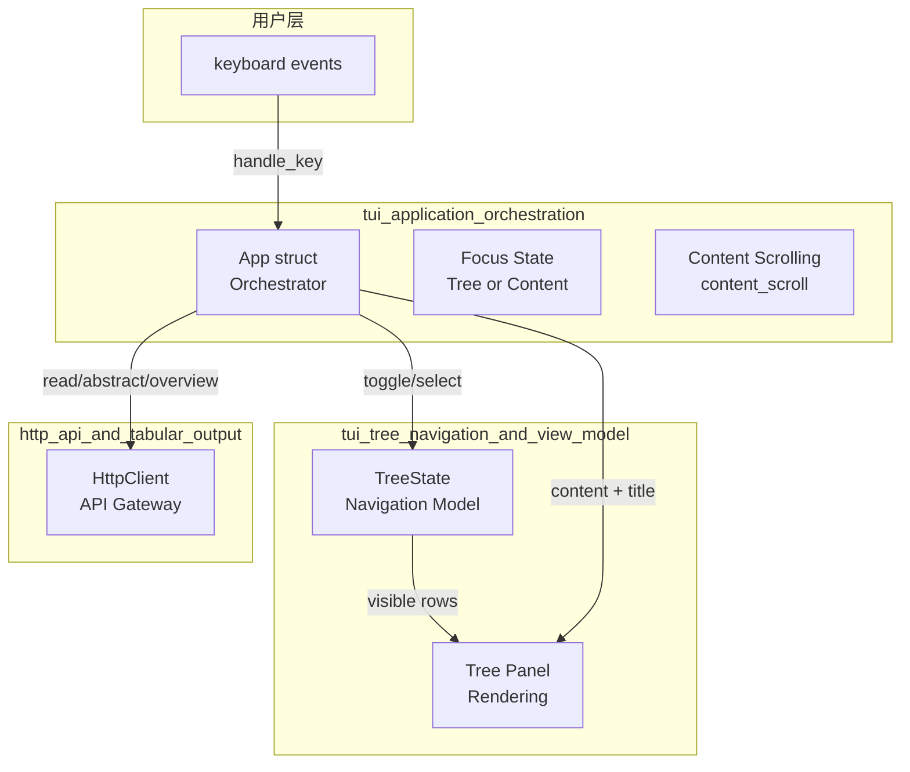

# tui_application_orchestration 模块技术深潜

## 概述

`tui_application_orchestration` 模块是 OpenViking CLI 的核心编排层，它将用户交互、远程 API 调用和终端 UI 渲染这三个看似独立的 concern 编织在一起。想象一下交响乐团的指挥家——`App` 结构体不亲自演奏任何乐器，但它知道何时该让小提琴_section 响起，何时该让铜管_section 跟进，整个 TUI 的用户体验就依赖于这个orchestrator 的协调能力。

这个模块解决的问题看似简单实则复杂：当用户在左侧文件树中浏览并选中某个节点时，右侧内容面板应当立即显示相应的内容。但这就涉及到若干非平凡的决策——是目录还是文件？目录应该显示摘要（abstract）还是概览（overview）？API 调用失败时如何降级？根级别的 scope（如 `viking://resources`）和普通路径的处理方式有何不同？这些正是 `App` 结构体需要 orchestrate 的核心逻辑。

## 架构概览



从架构角度看，`App` 扮演着**中介者（Mediator）**的角色——它不是简单地持有数据和状态，而是主动协调多个子系统的交互。左侧的文件树由 `TreeState` 管理，右侧的内容面板由 `App` 直接控制，而所有与后端的通信都委托给 `HttpClient`。这种设计使得各组件的职责清晰：TreeState 专注于树形数据的组织和导航，HttpClient 专注于网络通信，而 App 专注于将这两者粘合起来并响应用户操作。

## 核心组件解析

### App 结构体

`App` 是整个 TUI 的状态容器和业务逻辑枢纽。理解它的最佳方式是把它想象成一个人——它有眼睛（`focus` 知道当前聚焦哪个面板），有记忆力（`tree` 记住文件树的状态），有双手（`scroll_content_*` 方法操作内容滚动），还有一张嘴（`status_message` 用于显示状态信息）。

```rust
pub struct App {
    pub client: HttpClient,           // 与后端通信的网关
    pub tree: TreeState,              // 左侧文件树的视图模型
    pub focus: Panel,                 // 当前聚焦：Tree 还是 Content
    pub content: String,              // 右侧面板的文本内容
    pub content_title: String,        // 内容面板的标题（通常是 URI）
    pub content_scroll: u16,          // 内容滚动偏移量
    pub content_line_count: u16,      // 内容的总行数（用于边界检查）
    pub should_quit: bool,            // 退出标志
    pub status_message: String,       // 底部状态栏消息
}
```

每个字段都对应着 UI 的一个特定方面。值得注意的是 `content_line_count` 这个字段——它看起来有点冗余，因为我们完全可以动态计算 `content.lines().count()`。但这里蕴含着一个微妙的设计决策：**性能优先于实时性**。在 `load_content_for_selected` 的最后，这个值被一次性计算并缓存起来，而不是在每次渲染时重新计算。对于可能包含数千行的内容文件，这种缓存策略避免了每次 UI 重绘时的重复迭代。

### Panel 枚举

```rust
#[derive(Debug, Clone, Copy, PartialEq)]
pub enum Panel {
    Tree,
    Content,
}
```

这个简单的枚举定义了 TUI 的两个主要交互区域。使用 `Copy` trait 是因为它只是作为一个轻量级的状态标签，在 `toggle_focus` 方法中直接进行模式匹配切换。设计者选择让 `App` 直接持有 `focus` 字段，而不是创建一个独立的 FocusManager，这种**平坦化（flattening）**策略避免了不必要的抽象层级。

## 数据流分析

### 内容加载的完整路径

当用户在左侧树中移动光标选择不同节点时，以下是完整的调用链：

1. **事件捕获**：`event.rs` 中的 `handle_key` 检测到 `j`、`k` 或方向键
2. **状态更新**：调用 `app.tree.move_cursor_up()` 或 `move_cursor_down()` 更新树的光标位置
3. **内容触发**：立即调用 `app.load_content_for_selected().await` 触发内容加载
4. **类型判断**：`load_content_for_selected` 首先获取选中节点的 URI 和类型（目录还是文件）
5. **差异化加载**：
   - 如果是**根级 scope URI**（如 `viking://resources`），显示一个简单的占位提示
   - 如果是**普通目录**，并行调用 `abstract_content` 和 `overview` 两个 API
   - 如果是**文件**，直接调用 `read` API 获取原始内容
6. **结果组装**：目录内容将 abstract 和 overview 用分隔符连接起来
7. **渲染更新**：计算 `content_line_count`，下一次 `terminal.draw` 会显示新内容

这个流程中有个关键的设计点：**使用 `tokio::join!` 并行获取目录的 abstract 和 overview**。这是典型的 I/O 优化——两个 API 调用之间没有依赖关系，等待它们并行完成比串行执行几乎可以节省一倍的等待时间。对于网络延迟敏感的 TUI 应用，这种微优化对用户体验有显著提升。

### 根 Scope 的特殊处理

代码中有一个值得注意的边界情况处理：

```rust
fn is_root_scope_uri(uri: &str) -> bool {
    let stripped = uri.trim_start_matches("viking://").trim_end_matches('/');
    !stripped.is_empty() && !stripped.contains('/')
}
```

这个方法判断一个 URI 是否是顶层的 scope（例如 `viking://resources` 而不是 `viking://resources/some/path`）。为什么需要这个特殊判断？因为对于根级的 scope，后端的 `abstract_content` 和 `overview` API 可能无法正确工作——这些 API 通常是为具体项目或文件设计的，而不是为抽象的概念作用域设计的。所以 `App` 选择了一种防御性的策略：检测到根 scope 时，显示一个静态的帮助信息而不是尝试调用可能失败的 API。

这是一种**优雅降级（Graceful Degradation）**的设计哲学——与其让用户在某个特定场景遇到错误，不如提前识别这个场景并提供一个虽不完美但可用的替代体验。

## 设计决策与权衡

### 决策一：状态存储方式

`App` 选择将树状态（`TreeState`）和内容状态（`content`、`content_scroll` 等）分开存储，而不是创建一个统一的状态对象。这反映了一个权衡：**组合 vs 统一**。

如果采用统一状态，任何状态变化都可能需要重绘整个 UI，代码会更简单但性能可能受损。当前的设计允许 `TreeState` 独立管理其滚动和可见性（通过 `adjust_scroll` 方法），而 `App` 管理内容面板的滚动。这种分离也意味着 `TreeState` 可以在其他上下文中被复用——如果你想在另一个 UI 中使用文件树组件，可以直接复用 `TreeState`。

### 决策二：滚动状态的放置

内容面板的滚动状态（`content_scroll`）放在 `App` 中，而树的滚动状态（`scroll_offset`）放在 `TreeState` 中。这种不一致性可能会让新贡献者感到困惑，但背后有合理的原因：

树的滚动涉及到更复杂的逻辑——需要根据光标位置动态调整可见范围，`adjust_scroll` 方法会同时考虑 `cursor` 和 `scroll_offset`。而内容面板的滚动更简单，只是线性地上下移动。正是因为复杂性不同，才导致了这种"就近管理"的设计决策——哪个组件最了解某个状态，就让哪个组件管理它。

### 决策三：异步初始化的时机

`App::init` 是一个 async 方法，它在 TUI 启动时调用。这是一个**阻塞点**——如果网络响应慢，TUI 会卡住直到初始内容加载完成。

为什么不在后台线程加载？原因有两个：首先，TUI 需要在初始内容加载完成后才能开始渲染有意义的面板；其次，Rust 的 async runtime 在单线程场景下（大多数 TUI 都是）处理后台任务比较复杂。设计者选择了一种更简单但牺牲一定响应性的方案，这是一种**简单性优先于响应性**的取舍。

## 依赖关系分析

### 上游依赖（什么调用这个模块）

- **`run_tui` 函数**（`crates/ov_cli/src/tui/mod.rs`）：这是 TUI 的入口点，它创建 `App` 实例并启动事件循环
- **`event.rs`**：处理键盘事件，调用 `App` 的各种方法（`toggle_focus`、`load_content_for_selected`、滚动方法）
- **`ui.rs`**：渲染时读取 `App` 的状态（`focus`、`content`、`content_title`、`content_scroll`、`tree` 等）

### 下游依赖（这个模块调用什么）

- **`HttpClient`**：用于所有网络通信，包括 `read()`、`abstract_content()`、`overview()` 以及通过 `TreeState` 间接调用的 `ls()`
- **`TreeState`**：管理文件树的数据结构和导航状态

### 关键契约

`App` 与 `HttpClient` 之间的契约很简洁：`App` 传递 URI 字符串，`HttpClient` 返回 `Result<String>`。这种设计使得测试 `App` 变得困难——你无法轻易 mock `HttpClient`。但考虑到这是一个与网络深度耦合的应用，这种耦合被认为是可接受的。

`App` 与 `TreeState` 之间的契约更复杂：`App` 调用 `load_root`、`selected_uri`、`selected_is_dir`、`toggle_expand`，同时依赖 `TreeState` 的公开字段 `nodes`、`visible`、`cursor`、`scroll_offset`。这是一种**紧耦合但高效的**设计——避免了过度抽象带来的性能开销。

## 扩展点与注意事项

### 如何添加新的内容类型

如果未来需要支持新的内容显示格式（例如，显示代码的语法高亮版本），你需要修改 `load_content_for_selected` 方法。新增一个分支判断新类型，然后调用相应的 `HttpClient` 方法，最后在内容组装逻辑中整合。

### 如何修改面板布局

面板的宽高比例硬编码在 `ui.rs` 中（35% 给树，65% 给内容）。如果你想使其可配置，需要将这个比例提取到某个配置结构中，并通过 `App` 传递。目前的设计选择**硬编码**是为了简单——对于一个内部工具来说，可配置性带来的复杂度可能超过其收益。

### 潜在的性能问题

1. **大文件加载**：`read()` API 可能返回非常大的文件内容，这会阻塞 UI 线程。虽然 Rust 的 async 会让出控制权，但如果内容过大，渲染本身就会卡顿。可能的解决方案是限制显示的行数或实现虚拟滚动。
2. **频繁的 API 调用**：每次光标移动都会触发 `load_content_for_selected`，即使内容已经加载过也没有缓存。如果用户快速浏览大量文件，会产生大量请求。添加一个简单的 URI 到内容的缓存可能会有所帮助。
3. **并发问题**：虽然 `App` 是mutably borrowed 的，但 `HttpClient` 是 `Clone` 的，这在技术上允许并发调用。代码中没有对此进行保护，但在单线程的 TUI 事件循环中这不是问题。

### 边缘情况与陷阱

1. **空选择**：当树为空或没有任何选中项时，`load_content_for_selected` 会显示 "(nothing selected)"。这是防御性编程的体现。
2. **API 失败降级**：如果 `abstract_content` 或 `overview` 调用失败，会显示 "(not available)" 而不是崩溃。这种降级策略贯穿整个模块。
3. **滚动边界**：`scroll_content_down` 使用了 saturating_add 和额外的边界检查，确保不会滚动超过内容总行数。这很重要，因为 Rust 的 usize 在下溢时会 panic，而 TUI 应用不应该因为这种边界问题而崩溃。
4. **content_line_count 同步**：这个字段必须在每次 `content` 更新后立即更新。忘记这一点会导致滚动行为异常——用户看到的行数与实际可滚动范围不匹配。

## 相关文档

- [tui_tree_navigation_and_view_model](./tui_tree_navigation_and_view_model.md) - 文件树的底层数据结构和导航逻辑
- [http_api_and_tabular_output](./http_api_and_tabular_output.md) - HttpClient 的详细设计及其与后端 API 的契约
- [cli_bootstrap_and_runtime_context](./cli_bootstrap_and_runtime_context.md) - CLI 的启动流程和配置管理