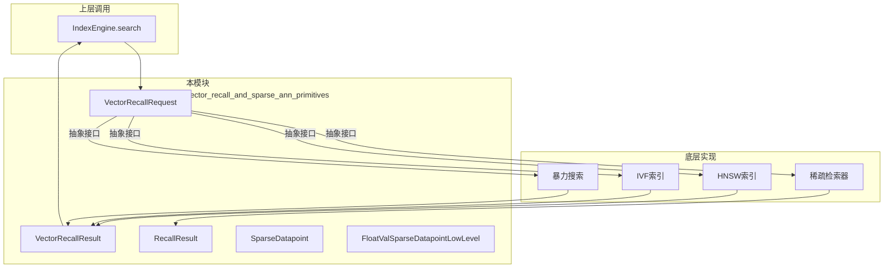

# vector_recall_and_sparse_ann_primitives 模块

## 概述

`vector_recall_and_sparse_ann_primitives` 模块是 OpenViking 向量检索引擎的**底层原语层**，位于原生 C++ 引擎的核心位置。它定义了向量召回（Vector Recall）和稀疏近似最近邻（Sparse ANN）搜索的基本数据结构，为上层的索引引擎提供统一的搜索接口抽象。

**这个模块解决的问题**：在海量向量数据中快速找到与查询向量最相似的 Top-K 个结果。传统的精确搜索需要 $O(N)$ 的线性扫描，当数据规模达到百万级甚至亿级时，这种方法变得不可接受。该模块通过定义标准化的请求/响应结构，使得向量索引层可以采用 HNSW、IVF、PQ 等各类 ANN 算法，而上层调用方无需关心底层实现细节。



## 架构分析

### 核心职责

该模块承担两个核心职责：

1. **向量召回的请求/响应抽象**：定义 `VectorRecallRequest` 和 `VectorRecallResult` 作为向量搜索的标准化接口。这种设计将搜索算法（ ANN 实现）与调用方解耦——上层可以切换不同的索引实现（HNSW、IVF、暴力搜索），而不影响业务逻辑。

2. **稀疏向量的数据结构和工具**：提供 `SparseDatapoint` 和相关工具类，支持稀疏向量（BM25、ElasticSearch 风格的词项权重向量）的存储和检索。这是为**混合检索**（Hybrid Search）场景设计的——在某些搜索场景下，稀疏表示（基于词项匹配）比稠密向量更能捕获精确的关键词匹配需求。

### 数据流

```
SearchRequest (Python/JSON)
        ↓
IndexEngine::search() 
        ↓
VectorRecallRequest (C++ 结构)
        ↓
ANN 索引实现 (HNSW/IVF/BruteForce)
        ↓
VectorRecallResult 或 RecallResult
        ↓
SearchResult (返回给 Python 层)
```

### 依赖关系

| 依赖模块 | 用途 |
|---------|------|
| `search_context_and_fetch_state_models` | `VectorRecallRequest.bitmap` 依赖 `SearchContext` 提供的过滤/排序能力 |
| `scalar_bitmap_and_field_dictionary_structures` | Bitmap 过滤器依赖位图数据结构 |
| `common/json_utils.h` | `RecallResult.merge_dsl_op_extra_json` 依赖 JSON 合并工具 |

## 关键设计决策

### 1. 为什么要同时存在两种结果类型？

观察代码会发现存在两套结果类型：`VectorRecallResult` 和 `RecallResult`。这并非设计冗余，而是刻意为之：

- **`VectorRecallResult`**：轻量级、面向**稠密向量**搜索的简单结果结构，只包含 `labels`（向量ID）和 `scores`（相似度分数）。

- **`RecallResult`**：重量级、面向**稀疏检索**或需要额外元数据的场景，包含：
  - `scores` 和 `labels_u64`：分数和标签
  - `offsets`：用于支持批量结果的偏移量计算
  - `dsl_op_extra_json`：支持将 DSL（Domain Specific Language）操作的额外结果以 JSON 形式附加

**设计权衡**：简单场景用 `VectorRecallResult` 减少内存分配开销；复杂场景（如需要返回额外元数据、批量处理）用 `RecallResult` 获得更多灵活性。

### 2. SparseDatapoint 的设计哲学

`SparseDatapoint` 使用了**紧缩布局（Stride Layout）**而非交错布局（Interleaved Layout）：

```cpp
std::vector<IndexT> indices_;  // 所有非零维度的索引
std::vector<float> values_;    // 对应索引的值
```

这种方式的优势是：
- **缓存友好**：连续的索引访问和连续的值访问
- **与 BM25/ElasticSearch 兼容**：稀疏检索算法通常基于倒排索引，天然适合这种格式

对比方案：如果使用交错布局（`struct {IndexT index; float value;} pairs[]`），每次遍历非零维度时会在 index 和 value 之间来回跳转，不利于 SIMD 优化。

### 3. 指针式视图（SparseDatapointView）

`SparseDatapoint` 提供了 `to_ptr()` 方法返回 `SparseDatapointView`，这是一个**只读视图**：

```cpp
SparseDatapointView to_ptr() const {
  return SparseDatapointView(indices_.data(), values_.data(), 
                             nonzero_entries());
}
```

这种模式（值语义 → 指针视图）的设计意图是：
- 允许在不拷贝数据的情况下，将稀疏向量传给底层检索函数
- 避免在高频率的搜索路径中产生不必要的内存拷贝
- View 对象是轻量级的（只包含指针和长度），复制成本极低

## 组件详解

### VectorRecallRequest

请求结构体，包含：

| 字段 | 类型 | 说明 |
|------|------|------|
| `dense_vector` | `const float*` | 稠密查询向量（可选） |
| `topk` | `uint64_t` | 返回结果数量 |
| `bitmap` | `const Bitmap*` | 候选集过滤器（可选） |
| `sparse_terms` | `const std::vector<std::string>*` | 稀疏查询的词项列表 |
| `sparse_values` | `const std::vector<float>*` | 对应词项的权重 |

**注意**：所有字段都是**可选的**，这支持以下场景：
- 只提供 `dense_vector`：纯向量搜索
- 只提供 `sparse_terms/values`：纯稀疏搜索（BM25 风格）
- 两者都提供：混合搜索（Hybrid Search），系统会融合两种方式的得分

### VectorRecallResult

响应结构体，包含：

| 字段 | 类型 | 说明 |
|------|------|------|
| `labels` | `std::vector<uint64_t>` | 返回的向量 ID 列表 |
| `scores` | `std::vector<float>` | 对应的相似度分数 |

### RecallResult

这是更通用的结果结构，增加了：

| 字段 | 类型 | 说明 |
|------|------|------|
| `labels_u64` | `std::vector<uint64_t>` | 标签列表（与 labels 等价，命名体现类型） |
| `offsets` | `std::vector<uint32_t>` | 批量结果的偏移量 |
| `dsl_op_extra_json` | `JsonDocPtr` | DSL 操作附加的 JSON 结果 |

`swap_offsets_vec` 方法是一个**零拷贝_swap_模式**，允许将内部的 vectors 与外部容器交换所有权，避免拷贝：

```cpp
inline int swap_offsets_vec(std::vector<float>& new_scores_container,
                            std::vector<uint32_t>& new_offsets_container) {
    new_offsets_container.swap(offsets);
    new_scores_container.swap(scores);
    return 0;
}
```

### SparseDatapoint

代表一个稀疏向量（非零维度远少于总维度），提供：
- 值语义和移动语义支持
- `nonzero_entries()` 返回非零维度数
- `to_ptr()` 返回只读视图

## 使用场景与边界情况

### 典型使用流程

```cpp
// 1. 构建请求
VectorRecallRequest req;
req.dense_vector = query_vector.data();
req.topk = 100;
req.bitmap = candidate_bitmap;  // 可选：过滤某些向量

// 2. 调用索引搜索
VectorRecallResult result = index->Search(req);

// 3. 处理结果
for (size_t i = 0; i < result.labels.size(); ++i) {
    printf("Label: %lu, Score: %.4f\n", result.labels[i], result.scores[i]);
}
```

### 边界情况与陷阱

1. **空指针安全**：`VectorRecallRequest` 的指针字段可能为空，调用方必须检查
2. **内存所有权**：`VectorRecallRequest` 不持有指针指向的数据，调用方需保证数据在搜索期间有效
3. **topk 溢出**：如果 topk 大于索引中的向量总数，返回结果数量会少于 topk
4. **稀疏/稠密混合**：当同时提供稠密和稀疏查询时，融合策略由上层算法决定，本模块不负责融合

## 关联文档

- [search_context_and_fetch_state_models](./search_context_and_fetch_state_models.md) — 搜索上下文和状态结果
- [scalar_bitmap_and_field_dictionary_structures](./scalar_bitmap_and_field_dictionary_structures.md) — 位图过滤和字段字典
- [native_bytes_row_schema_and_field_layout](./native_bytes_row_schema_and_field_layout.md) — 底层存储布局
- [native_engine_and_python_bindings_python_bytes_row_bindings](./native-engine-and-python-bindings-python-bytes-row-bindings.md) — Python 绑定层