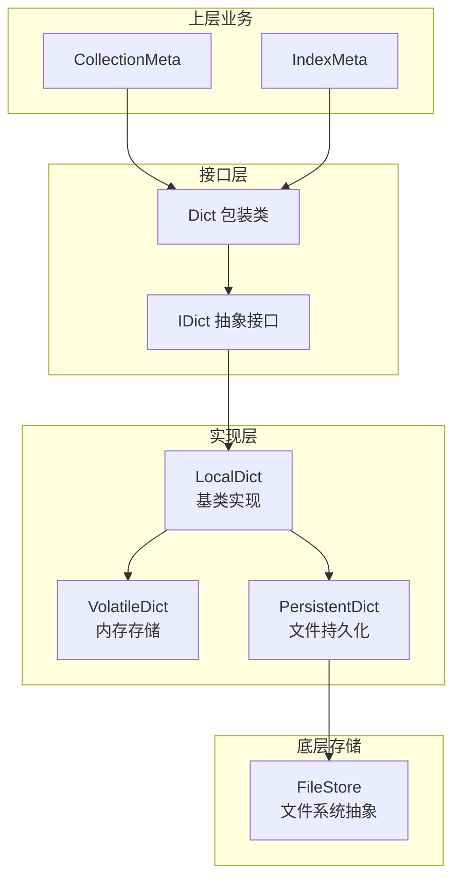

# metadata_dictionary_models 模块技术深度解析

## 概述

`metadata_dictionary_models` 模块是 OpenViking 向量数据库存储层的基础抽象之一，负责为元数据提供统一的键值存储接口。想象一下这个模块的角色：它就像是向量数据库的"配置中心"，负责保存和管理集合（Collection）与索引（Index）的元信息——比如字段定义、索引类型、向量维度等。这些元数据需要被频繁读取，偶尔写入，并且根据使用场景可能需要持久化到磁盘或仅保持在内存中。

该模块的核心价值在于**解耦了存储接口与存储实现**：上层业务逻辑（如 CollectionMeta、IndexMeta）只需要知道它们操作的是一个 IDict，而不需要关心数据是存储在内存中还是磁盘上。这种设计使得单元测试可以使用内存中的 VolatileDict，生产环境则使用 PersistentDict，两者无缝切换。

---

## 架构设计与数据流

### 核心抽象



### 设计模式解析

这个模块采用了**组合优于继承**的思想，通过三层抽象实现存储策略的可插拔：

1. **接口层（IDict）**：定义了字典存储的完整契约，包含六个核心操作。任何实现了 IDict 的类都必须提供这六种能力的具体实现。

2. **包装层（Dict）**：这是一个有趣的设计。它本身不是 IDict 的子类，而是一个包装器，持有 IDict 的实例并将调用委托给它。在 Python 中这种模式相对少见——通常我们会直接使用 IDict 的实现类。这里包装层的存在可能是为了未来扩展（比如添加装饰器模式：日志、缓存、事务等），也可能是为了保持 API 的一致性。

3. **实现层（LocalDict 及其子类）**：
   - **LocalDict**：提供基础的内存字典实现，所有操作都在 Python dict 上进行
   - **VolatileDict**：LocalDict 的直接子类，完全驻留内存，适合测试环境或临时数据
   - **PersistentDict**：继承 LocalDict 并添加了文件持久化能力，每次 update 或 override 后自动序列化到磁盘

---

## 核心组件详解

### IDict 抽象接口

```python
class IDict(ABC):
    @abstractmethod
    def update(self, data: Dict[str, Any]):
        """合并新数据到现有字典"""
        
    @abstractmethod
    def override(self, data: Dict[str, Any]):
        """完全替换字典内容"""
        
    @abstractmethod
    def get(self, key: str, default: Any = None) -> Any:
        """根据键获取值"""
        
    @abstractmethod
    def drop(self):
        """清空字典内容"""
        
    @abstractmethod
    def get_raw_copy(self) -> Dict[str, Any]:
        """获取字典的深拷贝"""
        
    @abstractmethod
    def get_raw(self) -> Dict[str, Any]:
        """获取字典的引用"""
```

**设计意图**：这个接口的有趣之处在于 `update` 与 `override` 的区分。很多键值存储只有单一的"写入"操作，但这里区分了合并与替换两种语义：

- `update`：新数据与现有数据合并，相同键会被覆盖
- `override`：完全丢弃旧数据，用新数据替代

这种设计反映了元数据的典型使用模式：初始创建后可能需要局部更新（如修改某个索引参数），但在某些场景下需要完全重置（如重新构建索引）。

**另一个微妙的设计**：两个获取方法 `get_raw_copy()` 和 `get_raw()` 的区别。`get_raw()` 返回内部字典的引用，意味着调用者可以直接修改底层数据——这是一个潜在的副作用来源。`get_raw_copy()` 则返回深拷贝，保护内部状态不被意外修改。在 IndexMeta 和 CollectionMeta 的实现中，我们可以看到它们在构造时使用 `get_raw()` 获取引用（因为需要保持同步），而在需要导出或传递数据时使用 `get_raw_copy()`（防止外部修改）。

### Dict 包装类

```python
class Dict:
    def __init__(self, idict: IDict):
        assert isinstance(idict, IDict)
        self.__idict = idict
```

这个类的实现非常简洁——它几乎只是透传调用。有意思的是它使用了**名称修饰（name mangling）**将 `__idict` 变成 `_Dict__idict`，提供了一定程度的封装（虽然 Python 的封装机制比较弱）。这种方式暗示设计者希望在未来可能需要扩展 Dict 的行为，而不仅仅是做一个透明代理。

### LocalDict 实现

LocalDict 是所有具体存储实现的基类，它将 IDict 的六个抽象方法实现为基本的字典操作。值得注意的是，它在 `__init__` 中使用 `copy.deepcopy(data)` 来初始化，这意味着即使传入的初始数据被修改，也不会影响到 LocalDict 内部的副本。这是一个防御性拷贝，避免了常见的引用陷阱。

### PersistentDict 的持久化策略

PersistentDict 是最复杂的实现，它将字典内容序列化到文件系统：

```python
def _persist(self):
    bytes_data = json.dumps(self.data).encode()
    self.storage.put(self.path, bytes_data)
```

这里有几个设计要点：

1. **每次修改后立即持久化**：这是一种"立即写回"策略，简单但可能在高频更新场景下有性能问题。对于元数据这种低频更新的场景，这是合理的选择。

2. **依赖 FileStore 的原子写入**：注释中提到"FileStore.put ensures atomic writes"，这意味着底层的 FileStore 负责处理写入的原子性，PersistentDict 本身不需要关心这个问题。

3. **JSON 序列化的取舍**：选择 JSON 意味着人类可读、调试友好，但相比 MessagePack 或 Pickle 等格式，序列化效率不是最优。考虑到元数据通常较小且以字符串为主，这是一个合理的工程取舍。

---

## 依赖分析与数据契约

### 上游依赖：谁调用这个模块

从代码分析来看，这个模块被以下组件使用：

1. **[collection_meta](./vectordb-domain-models-and-service-schemas-domain-models-and-contracts-collection-contracts-and-results.md)**：CollectionMeta 使用 IDict 存储集合级别的元数据（字段定义、向量维度等）
2. **[index_meta](./vectordb-domain-models-and-service-schemas-domain-models-and-contracts-index-domain-models-and-interfaces.md)**：IndexMeta 使用 IDict 存储索引级别的元数据（索引类型、距离度量等）

### 下游依赖：这个模块调用什么

1. **FileStore**：PersistentDict 依赖底层的文件系统抽象来读写数据
2. **json**：用于序列化/反序列化字典数据

### 数据契约

调用者与 IDict 之间的契约非常简洁：

- **输入**：任意可序列化为 JSON 的 Python 字典（键为字符串，值为基本类型或嵌套字典/列表）
- **输出**：同样结构的字典
- **约束**：
  - `update` 和 `override` 不返回任何值
  - `get` 在键不存在时返回默认值
  - `drop` 不返回任何值
  - `get_raw()` 返回的字典是内部引用的直接映射，修改它会直接影响 IDict 内部状态

---

## 设计决策与权衡

### 决策一：使用 ABC 而非 Protocol

代码选择了 `from abc import ABC, abstractmethod` 而不是 `from typing import Protocol`。

**权衡分析**：
- **ABC 的优势**：更明确的类型提示、强制子类实现所有方法、可以通过 `isinstance()` 检查
- **Protocol 的优势**：更灵活、隐式实现接口、duck typing 更自然

选择 ABC 意味着代码更显式，适合需要明确契约的场景。这在大型团队中可能有助于减少"我以为实现了接口但漏了方法"的问题。

### 决策二：update 与 override 的双方法设计

这是一个值得讨论的设计。常见的键值存储通常只有一个写入方法（set 或 put），这里却有两个。

**这种设计的理由**：
- 元数据的更新往往是增量的（如添加一个新字段），而不是全量替换
- 但某些操作（如索引重建）需要完全重置元数据
- 区分两者可以让调用者明确表达意图，也方便实现层面优化（override 可以直接替换，而 update 需要合并）

**潜在问题**：
- 调用者可能混淆两者的语义
- 实现层面需要维护两份逻辑

### 决策三：get_raw 返回可变引用

这是一个容易被忽视的陷阱。`get_raw()` 返回的是内部字典的直接引用而非拷贝。

```python
# 在 CollectionMeta 中
self.inner_meta = self.__idict.get_raw()  # 获取的是引用
```

这意味着如果调用者修改了 `inner_meta`，IDict 内部的数据也会被修改。这在单线程环境下可能是"特性"（避免频繁拷贝），但在线程间共享时是危险的。代码通过私有属性 `__idict`（名称修饰）来减少意外访问，但这只是君子协定。

---

## 常见使用模式与示例

### 模式一：工厂函数创建元数据

```python
from openviking.storage.vectordb.meta.collection_meta import create_collection_meta

# 持久化存储
collection_meta = create_collection_meta(
    path="/data/collections/my_collection/meta.json",
    user_meta={"Fields": [{"FieldName": "text", "FieldType": "string"}]}
)

# 内存存储（测试用）
volatile_meta = create_collection_meta(
    path="",
    user_meta={...}
)
```

工厂函数根据 path 是否为空来决定使用 VolatileDict 还是 PersistentDict，这是一种简洁的依赖注入方式。

### 模式二：元数据的读取-修改-写回

```python
# 读取
current_meta = index_meta.get_build_index_dict()

# 修改
current_meta["VectorIndex"]["IndexType"] = "hnsw"

# 写回（使用 override 完全替换）
index_meta.get_raw_copy()  # 这里应该用正确的方式更新
index_meta.update({"VectorIndex": current_meta["VectorIndex"]})
```

---

## 边缘情况与注意事项

### 1. JSON 序列化限制

PersistentDict 使用 JSON 序列化，这意味着：
- 键必须是字符串
- 值必须是 JSON 可序列化的类型（str, int, float, bool, None, list, dict）
- 如果存储了不支持的类型（如 datetime 对象、自定义类实例），会抛出 `TypeError`

### 2. 并发访问

代码中没有提供任何并发保护。如果多个线程同时修改同一个 PersistentDict：
- 写入操作可能交错，导致文件损坏
- 读取操作可能读到部分写入的数据

在多线程场景下，需要在调用方加锁。

### 3. 空路径的语义

`create_collection_meta(path="", ...)` 和 `create_index_meta(path=None, ...)` 都会创建 VolatileDict。这种"空字符串 vs None"的不一致是一个小的 API 设计瑕疵。

### 4. drop 方法的破坏性

`drop()` 方法会清空字典内容。对于 PersistentDict，它还会删除底层文件。这是一个不可逆的操作，调用者需要谨慎。

---

## 扩展点与未来方向

### 可扩展之处

1. **添加新的 IDict 实现**：例如 RedisDict（Redis 持久化）、S3Dict（对象存储）
2. **在 Dict 包装层添加装饰器**：如缓存、指标收集、事务支持
3. **异步版本**：将同步方法改为异步，支持 asyncio

### 可能的改进

1. 统一空路径的语义（都用 None 或都用空字符串）
2. 考虑使用更高效的序列化格式（如 msgpack）
3. 为 PersistentDict 添加批量写入优化（延迟写回）
4. 添加类型注解（目前使用 `Dict[str, Any]`，可以更具体）

---

## 相关模块参考

- **[collection_contracts_and_results](./vectordb-domain-models-and-service-schemas-domain-models-and-contracts-collection-contracts-and-results.md)**：使用 IDict 存储集合元数据
- **[index_domain_models_and_interfaces](./vectordb-domain-models-and-service-schemas-domain-models-and-contracts-index-domain-models-and-interfaces.md)**：使用 IDict 存储索引元数据
- **[collection_schemas](./storage-core-and-runtime-primitives-storage-schema-and-query-ranges-collection-schemas.md)**：定义存储层的 schema 结构