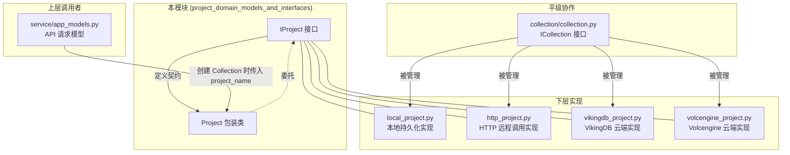

# 项目领域模型与接口 (project_domain_models_and_interfaces)

## 概述

在向量数据库系统中，数据不是孤立存放的——它们按**Collection（集合）**组织，而 Collection 又按**Project（项目）**分组。想象一下：一个 Project 就像一个文件系统中的根目录，Collection 则是其中的子目录，而每条数据文档就是目录中的文件。

本模块定义了 Project 的抽象接口 `IProject` 和具体包装类 `Project`。它解决的问题是：**如何为不同的存储后端（本地磁盘、远程 HTTP 服务、云厂商 VikingDB/Volcengine）提供统一的集合管理体验**。

如果没有这个抽象层，每种后端都会暴露自己独特的 API，调用方代码将充满 `if backend == "local" elif backend == "http"` 这样的分支判断。引入接口层后，上层代码只需面向 `IProject` 编程，无需关心数据实际存储在何处。

---

## 架构设计

### 模块位置与依赖关系



### 核心抽象：命名空间容器

`IProject` 的设计理念非常简单：**它是一个 Collection 的容器，提供命名空间隔离**。

一个 Project 包含以下核心操作：

1. **集合的存在性检查** (`has_collection`) — 避免重复创建
2. **集合的获取** (`get_collection`) — 按名称查找
3. **获取所有集合** (`get_collections`) — 枚举或批量操作
4. **创建集合** (`create_collection`) — 带元数据配置
5. **删除集合** (`drop_collection`) — 不可逆操作
6. **资源释放** (`close`) — 关闭连接、清理缓存

这与文件系统中的目录操作惊人地相似——事实上，`LocalProject` 的实现正是将每个 Collection 存储为磁盘上的一个子目录。

---

## 核心组件详解

### IProject 接口

```python
class IProject(ABC):
    def __init__(self, project_name: str = "default"):
        self.project_name = project_name

    @abstractmethod
    def close(self): ...
    
    @abstractmethod
    def has_collection(self, collection_name: str) -> bool: ...
    
    @abstractmethod
    def get_collection(self, collection_name: str) -> Any: ...
    
    @abstractmethod
    def get_collections(self) -> Dict[str, Any]: ...
    
    @abstractmethod
    def create_collection(self, collection_name: str, collection_meta: Dict[str, Any]) -> Any: ...
    
    @abstractmethod
    def drop_collection(self, collection_name: str): ...
```

**设计意图**：`IProject` 是一个**纯契约定义**。它不包含任何实现逻辑，所有方法都是抽象的。任何类只要继承它并实现这六个方法，就成为合法的 Project 实现。

**为什么是这六个方法？**

- `close()` 是因为 Project 通常会持有资源：数据库连接、文件句柄、内存缓存。显式关闭是资源管理的最佳实践。
- `has_collection()` + `get_collection()` 组合提供了"查询-获取"的标准模式，避免 `get_collection` 返回 None 时无法区分"不存在"和"存在但为空"两种情况（虽然某些实现可能返回 None，但调用方通常先检查存在性）。
- `get_collections()` 支持批量操作和元数据展示场景。
- `create_collection()` 接收 `collection_meta` 字典，这是因为不同后端对集合的配置差异很大（字段定义、向量维度、分片策略等），使用字典可以传递任意结构化配置，保持接口的灵活性。
- `drop_collection()` 是危险操作，文档中特别注明了**不可逆**。

### Project 包装类

```python
class Project:
    def __init__(self, project: IProject):
        assert isinstance(project, IProject), "project must be IProject"
        self.__project = project
    
    # 所有方法都委托给 self.__project
```

**设计意图**：`Project` 是**适配器 + 守护者**的双重角色：

1. **类型守卫**：构造函数中的 `assert isinstance(project, IProject)` 确保任何传入 `Project` 包装的对象都真正实现了接口。这是一种"防御性编程"——如果传入错误类型，在创建时立即失败，而不是在使用过程中出现难以追踪的 `AttributeError`。

2. **委托转发**：所有方法都简单转发给内部封装的 `IProject` 实现，不添加任何额外逻辑。这意味着 `Project` 本身**不是**享元模式或缓存层——它只是一个类型安全的门面。

**为什么需要这层包装？**

考虑一个典型的使用场景：

```python
# 上层代码通常这样写：
project = get_project_backend(...)  # 可能是 LocalProject 或 HttpProject
project = Project(project)          # 包装成统一的 Project

# 后续代码只面向 Project 编程
if project.has_collection("my_collection"):
    coll = project.get_collection("my_collection")
```

如果没有 `Project` 包装类，上层代码需要记住不同返回类型的细节（例如 `LocalProject.get_collection` 返回什么、`HttpProject.get_collection` 返回什么）。有了包装类，返回类型统一为 `Project`，调用方获得了**接口承诺的确定性**。

---

## 数据流分析

### 典型创建流程

```python
# 1. 选择后端并创建实现
local_impl = LocalProject(path="/data/my_project")

# 2. 包装成统一接口
project = Project(local_impl)

# 3. 定义集合元数据
collection_meta = {
    "CollectionName": "documents",
    "Fields": [
        {"FieldName": "id", "FieldType": "String", "IsPrimary": True},
        {"FieldName": "content", "FieldType": "String"},
        {"FieldName": "embedding", "FieldType": "Float", "VectorDimension": 1024}
    ]
}

# 4. 创建集合
collection = project.create_collection("documents", collection_meta)

# 5. 向集合中添加数据
collection.upsert_data([
    {"id": "doc1", "content": "向量检索是...", "embedding": [0.1, 0.2, ...]}
])

# 6. 执行搜索
result = collection.search_by_vector(
    index_name="embedding_idx",
    dense_vector=[0.1, 0.15, ...],
    limit=10
)
```

**数据流向**：

```
调用方代码
    ↓
Project (包装层，类型检查 + 委托)
    ↓
IProject 实现 (LocalProject / HttpProject / etc.)
    ↓
ICollection 实现 (管理向量数据和索引)
    ↓
底层存储 (本地文件系统 / HTTP API / 云服务)
```

### 搜索流程的完整路径

1. **请求发起**：调用方调用 `collection.search_by_vector(dense_vector=[...])`
2. **集合转发**：`Collection` 包装类将请求委托给 `ICollection` 实现
3. **索引定位**：实现类根据 `index_name` 找到对应的向量索引
4. **向量检索**：底层调用 ANN（Approximate Nearest Neighbor）算法执行相似度搜索
5. **结果返回**：封装为 `SearchResult` 返回给调用方

---

## 设计决策与权衡

### 决策一：接口继承 vs 组合

**选择**：使用抽象基类 `IProject` 而非 Protocol（结构化类型）

```python
class IProject(ABC):  # 使用 ABC
```

**权衡**：
- **优点**：ABC 提供显式的抽象方法检查——如果你忘记实现某个方法，在实例化时会立即报错
- **缺点**：Python 的 ABC 是单继承，无法与具体实现类的其他父类共存

如果使用 `Protocol`，则没有这个限制，但缺点是错误只在实际调用时才会暴露。对于像 `IProject` 这样的小型接口，ABC 的"早期失败"特性更有价值。

### 决策二：字典作为元数据格式

`create_collection(collection_name, collection_meta)` 中的 `collection_meta` 是 `Dict[str, Any]`。

**权衡**：
- **灵活性**：不同后端（本地、Volcengine、VikingDB）有不同的集合配置——字段类型、向量维度、分片策略等。字典可以自由地序列化和反序列化，兼容所有后端。
- **类型不安全**：调用方无法在编译时知道哪些字段是必需的，哪些是可选的。文档和约定成为唯一的约束。

这是一个典型的 **"牺牲静态类型安全换取运行时灵活性"** 的决策，在需要支持多种后端存储的系统设计中是常见选择。

### 决策三：默认项目名为 "default"

`IProject.__init__(project_name: str = "default")` 

**权衡**：
- **优点**：简化最常见的单项目场景，用户无需每次都指定项目名
- **缺点**：可能造成命名冲突——如果多个模块各自创建 default 项目，它们会相互覆盖

设计上通过**实例隔离**解决这个问题：每个 `Project` 实例都是独立的对象，即使名称相同也不会共享状态。

### 决策四：包装类 vs 直接返回实现

`Project` 类几乎只是简单转发，不做缓存、不做状态管理。

**权衡**：
- **简洁**：代码量少，容易理解
- **性能**：每次调用都有一次额外的函数调用开销（尽管 Python 中这个开销很小）
- **可测试性**：因为没有内部状态，mock 变得很容易

如果需要性能优化（例如缓存 Collection 实例），可以在 `Project` 层添加缓存逻辑，但当前设计选择了**最小惊讶原则**——让行为可预测。

---

## 使用指南

### 创建 Project 的标准模式

```python
from openviking.storage.vectordb.project.local_project import get_or_create_local_project
from openviking.storage.vectordb.project.project import Project
from openviking.storage.vectordb.project.http_project import get_or_create_http_project

# 本地持久化项目
local_proj = get_or_create_local_project(path="/data/my_project")
project = Project(local_proj)

# 远程 HTTP 项目
http_proj = get_or_create_http_project(host="127.0.0.1", port=5000)
project = Project(http_proj)
```

### 检查与获取集合

```python
# 安全的集合获取模式
if project.has_collection("my_collection"):
    collection = project.get_collection("my_collection")
else:
    collection = project.create_collection("my_collection", meta)
```

### 资源管理

```python
project = Project(get_or_create_local_project(path="/data"))
try:
    # 使用 project 和 collections 进行操作
    coll = project.get_collection("docs")
    result = coll.search_by_vector(...)
finally:
    project.close()  # 显式释放资源
```

或者利用上下文管理器（如果有实现的话），但当前接口不强制要求 `__enter__`/`__exit__`，所以推荐手动调用 `close()`。

---

## 边界情况与注意事项

### 1. drop_collection 是不可逆操作

文档中明确标注了这一点。实现中通常会：

```python
def drop_collection(self, collection_name: str):
    collection = self.collections.remove(collection_name)
    if collection:
        collection.drop()  # 底层会删除所有数据
```

调用方应在执行前确认业务逻辑是否确实需要删除。

### 2. Collection 名称的唯一性

在同一 Project 内，Collection 名称必须唯一。`create_collection` 会检查：

```python
if self.has_collection(collection_name):
    raise ValueError(f"Collection {collection_name} already exists")
```

如果需要"存在则返回，不存在则创建"，使用 `get_or_create_collection` 方法（部分实现提供）。

### 3. 关闭顺序

当 Project 包含多个 Collection 时，关闭顺序很重要：

```python
project.close()  # 会遍历调用所有 Collection 的 close()
```

如果某个 Collection 的关闭失败（例如磁盘满导致 flush 失败），其他 Collection 可能无法正确释放。调用方应做好异常处理。

### 4. 并发安全

`LocalProject` 使用 `ThreadSafeDictManager` 保护集合字典：

```python
self.collections = ThreadSafeDictManager[Collection]()
```

这意味着同一 Project 实例可以在多线程环境中安全使用。但**跨 Project 实例**之间的同步需要上层协调（例如分布式锁）。

### 5. 元数据字典的契约

`collection_meta` 的结构由 [service_api_models_collection_and_index_management](./service-api-models-collection-and-index-management.md) 定义。调用方应查阅该模块了解必需字段。当前设计允许传递任意字典，这既是灵活性也是风险——不匹配的元数据可能在运行时导致后端报错。

---

## 相关模块参考

| 模块 | 关系 | 说明 |
|------|------|------|
| [collection_contracts_and_results](./vectordb-domain-models-and-service-schemas-domain-models-and-contracts-collection-contracts-and-results.md) | 依赖 | Project 管理的核心对象类型 ICollection 和 Collection |
| [service_api_models_collection_and_index_management](./service-api-models-collection-and_index_management.md) | 依赖 | collection_meta 字典的结构定义（CollectionCreateRequest 等） |
| [local_project.py 实现](repo:openviking/storage/vectordb/project/local_project.py) | 实现示例 | 展示如何实现 IProject 接口 |
| [http_project.py 实现](repo:openviking/storage/vectordb/project/http_project.py) | 实现示例 | 远程 HTTP 后端的实现 |
| [storage_schema_and_query_ranges](./storage-schema-and-query-ranges.md) | 平级 | 类似的接口抽象模式（Range, TimeRange） |

---

## 总结

本模块的核心价值在于**定义了一个稳定的契约**，使得向量数据库的调用方无需关心数据存储在本地磁盘、远程服务器还是云端服务。`IProject` 接口是策略模式的具体体现——不同的后端实现可以互换，而上层代码保持不变。

对于新加入的开发者，关键是理解：
1. **Project 是 Collection 的容器**，提供命名空间隔离
2. **IProject 是抽象接口**，具体实现由各后端提供（LocalProject, HttpProject 等）
3. **Project 是包装器**，确保类型安全并提供统一的返回类型
4. **资源管理是显式的**，使用完后必须调用 `close()`

掌握这些要点后，你就可以在任何需要管理向量集合的场景中自如地使用这个接口了。