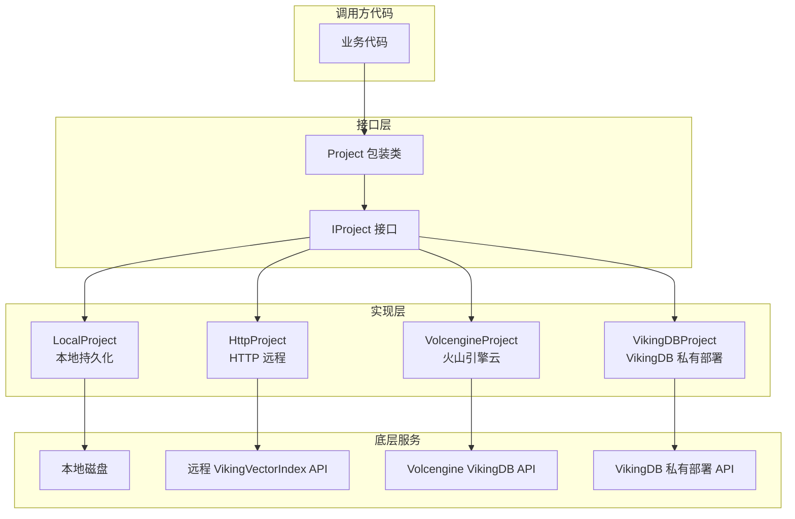

# 项目域模型与接口 (project_domain_models_and_interfaces)

## 模块概述

本模块是 OpenViking 向量数据库存储层的核心抽象层，定义了 **Project（项目）** 这一容器的接口契约与实现。想象一下：如果把整个向量数据库系统比作一座大型图书馆，那么 **Project（项目）** 就是图书馆中的一个个**独立书架**，而 **Collection（集合）** 则是书架上存放的**书籍**。这个模块解决的问题是：如何为多种底层存储后端（本地磁盘、HTTP 远程服务、Volcengine 云服务、VikingDB 私有部署）提供统一的コレクション管理接口，使得上层业务代码无需关心数据究竟存储在哪里。

从架构角度来看，本模块位于 `vectordb_domain_models_and_service_schemas` 的 domain 层，它是连接业务逻辑与底层存储实现的桥梁。通过定义清晰的接口（`IProject`）和包装类（`Project`），它实现了开闭原则 —— 当需要支持新的存储后端时，只需实现 `IProject` 接口，无需修改已有代码。

## 核心抽象：Mental Model

理解这个模块的关键在于把握三个核心概念及其关系：

**Project（项目）** 是最顶层的容器单位，它是一个逻辑命名空间，用于将相关的 Collection 归为一组。一个 Project 可以包含多个 Collection，且每个 Collection 必须属于某个 Project。Project 本身不存储数据，它只是一个组织单位，类似于文件系统中的"目录"。

**Collection（集合）** 是存储实际向量数据的容器，每个 Collection 包含若干 Index（索引）和 Data（数据）。一个 Project 下的多个 Collection 通常代表业务上相关但又需要独立管理的数据集。例如，一个语义搜索系统可能为"用户问答对"、"产品文档"、"技术文章"分别创建不同的 Collection。

**ProjectGroup（项目组）** 是多个 Project 的集合，支持两种模式：volatile（易失）模式和 persistent（持久）模式。在 volatile 模式下，所有 Project 和 Collection 都存储在内存中，进程退出后数据丢失；在 persistent 模式下，数据会持久化到磁盘，进程重启后可以自动加载已有的数据。

这种三层结构的设计借鉴了文件系统层次结构的思路，使得数据的组织和管理既清晰又灵活。调用方只需理解这三层抽象，就能正确使用整个存储系统。

## 架构图与数据流



数据流的关键路径如下：当业务代码调用 `project.create_collection("my_collection", metadata)` 时，请求首先到达 `Project` 包装类，该类进行运行时类型断言确保底层确实是 `IProject` 实现，然后委托给具体的实现类（如 `LocalProject`）。实现类负责与底层存储交互：本地实现写入磁盘，HTTP 实现调用远程 API，云实现调用云服务商 SDK。整个过程中，业务代码完全不感知底层差异，因为它始终通过统一的 `Project` 接口操作。

## 核心组件详解

### IProject 接口

`IProject` 是一个抽象基类（ABC），它定义了所有 Project 实现必须遵守的契约。这个接口的设计遵循了面向对象设计的**接口隔离原则**，只暴露了最核心的五个操作：

```python
class IProject(ABC):
    @abstractmethod
    def close(self): ...
    
    @abstractmethod
    def has_collection(self, collection_name: str) -> bool: ...
    
    @abstractmethod
    def get_collection(self, collection_name: str) -> Any: ...
    
    @abstractmethod
    def get_collections(self) -> Dict[str, Any]: ...
    
    @abstractmethod
    def create_collection(self, collection_name: str, collection_meta: Dict[str, Any]) -> Any: ...
    
    @abstractmethod
    def drop_collection(self, collection_name: str): ...
```

为什么要设计得如此简洁？设计者做了一个权衡：只暴露最必要的操作，复杂操作（如批量创建、事务性操作）留给上层调用者通过组合这些基础操作实现。这种设计保持了接口的稳定性 —— 无论底层存储后端如何变化，这五个操作始终是必需的。如果未来需要添加新操作，可以通过扩展接口或使用装饰器模式来实现，而不必修改已有实现。

### Project 包装类

`Project` 是 `IProject` 的包装类，它本身也实现了 `IProject` 接口，但核心价值在于提供**运行时类型检查**。请注意 `Project` 构造函数中的这行代码：

```python
assert isinstance(project, IProject), "project must be IProject"
```

这个断言的意义是：任何试图创建 `Project` 实例的代码必须在传入一个真正的 `IProject` 实现。这是一种防御性编程实践，它将类型错误的发现时间从"运行时某个操作失败时"提前到"对象创建时"。虽然 Python 的 duck typing 哲学不强调类型检查，但在企业级系统中，这种显式断言可以显著提高错误消息的清晰度，帮助开发者快速定位问题。

值得注意的是，`Project` 类本身**没有**存储任何状态，它的所有方法都直接委托给内部的 `self.__project` 对象。这种设计模式称为**代理模式**，它使得 `Project` 类可以透明地为其包装的 `IProject` 实现添加功能（如日志、缓存、监控），而不需要修改被包装类的代码。

### 四种实现的选择

系统提供了四种 `IProject` 实现，每种针对不同的使用场景：

**LocalProject** 适用于本地开发和测试场景。它支持两种工作模式：当 `path=""` 时创建易失性项目，所有数据存储在内存中，进程退出后数据消失；当 `path` 指定有效路径时创建持久化项目，数据会自动保存到磁盘目录结构中。每个 Collection 对应一个子目录，目录中包含 `collection_meta.json` 元数据文件。这种设计的优势在于简单透明 —— 用户可以直接查看文件系统确认数据是否正确持久化。

**HttpProject** 适用于连接到独立的 VikingVectorIndex 远程服务。初始化时，它会从远程服务加载已有的 Collection 列表，并创建代理对象。这种设计将远程服务的集合当作本地集合一样使用，对上层代码屏蔽了网络通信的细节。

**VolcengineProject** 专门用于连接火山引擎的 VikingDB 云服务。它需要 Access Key、Secret Key 和区域信息来初始化 SDK。创建 Collection 时，它会将元数据转换为火山引擎要求的格式。这种实现体现了适配器模式的思想 —— 将云服务的特定 API 适配为统一的 `IProject` 接口。

**VikingDBProject** 用于连接到私有部署的 VikingDB 服务。与 VolcengineProject 不同，它使用 HTTP API 而非云 SDK，并且有一个特殊的设计决策：`create_collection` 方法直接抛出 `NotImplementedError`，要求 Collection 必须预先在服务端创建好。这是因为私有部署场景下，Collection 的创建通常由运维流程控制，而不是应用代码。

### ThreadSafeDictManager 的角色

每个 Project 实现内部都使用 `ThreadSafeDictManager` 来管理 Collection。`ThreadSafeDictManager` 是一个泛型线程安全字典封装器，它将所有字典操作（get、set、remove、iterate 等）封装在 `RLock` 保护下。选择读写锁（RLock）而非简单锁的原因是：它允许同一线程在已持有锁的情况下重复获取锁，这在遍历集合并可能触发回调的场景中很重要。

这个组件的存在说明了一个隐含的设计假设：**Project 必须是线程安全的**。在多线程应用（如 Flask、Django 等 Web 框架）中，多个请求可能同时访问同一个 Project 实例。如果没有线程安全保护，并发调用 `create_collection` 和 `get_collection` 可能导致字典损坏或状态不一致。

## 依赖分析与数据契约

### 上游依赖（谁调用这个模块）

从模块树结构可以看出，本模块被 `domain_models_and_contracts` 层引用，它为上层的检索、评估等功能提供存储抽象。具体来说：

- **检索模块** (`retrieval_and_evaluation`) 需要通过 Project 获取 Collection，然后执行向量搜索
- **评估模块** (`ragas_evaluation_core`) 需要通过 Project 创建测试数据集的 Collection
- **CLI 工具** (`python_client_and_cli_utils`) 可能使用 LocalProject 进行本地数据管理

上游模块对本模块的期望是：提供同步的、线程安全的集合操作接口；支持 Collection 元数据的传递；错误时抛出明确的异常而非静默失败。

### 下游依赖（这个模块调用谁）

`Project` 实现类依赖以下组件：

- **service/api_fastapi**: `create_collection` 和 `drop_collection` 函数用于 HTTP 项目的后端调用
- **collection 层的各种实现**: `LocalCollection`、`HttpCollection`、`VolcengineCollection`、`VikingDBCollection`
- **ThreadSafeDictManager**: 用于线程安全的集合缓存
- **spdlog**: 通过 C++ 绑定进行日志记录

数据契约方面：Collection 元数据是一个字典 (`Dict[str, Any]`)，它必须包含 `CollectionName` 字段，其他字段取决于底层存储后端的要求。`get_collection` 返回的是 `Collection` 包装类的实例，而非底层的 `ICollection` 实现。

## 设计决策与权衡

### 决策一：接口 vs 抽象基类

选择 `ABC` 而非 Protocol 来定义接口，是经过考虑的。`ABC` 提供了更严格的继承检查，如果某个类忘记实现某个抽象方法，在类定义时就会抛出错误；而 `Protocol` 只在运行时检查方法存在性。对于企业级系统，`ABC` 的早期错误发现能力更有价值，尽管它增加了代码的耦合性（子类必须显式继承）。

### 决策二：包装类的必要性与冗余

表面上看，`Project` 类只是简单代理到 `IProject` 实现，似乎是多余的代码。但这个包装层有几个实际作用：首先，它强制类型检查，在创建时就捕获错误的实现类型；其次，它为未来可能的AOP操作（日志、监控、事务）提供扩展点；第三，它使 API 更友好 —— 调用方只需理解 `Project` 一个类，无需知道背后有四种实现。

### 决策三：volatile vs persistent 的二元选择

Project 支持两种模式的设计反映了一个实用主义考量：开发测试阶段需要快速迭代（volatile 模式），生产环境需要数据持久化（persistent 模式）。但这个设计有一个潜在问题：如果用户先创建 volatile 项目，后续想持久化，没有迁移路径。需要在文档中说明这一限制，或考虑添加 `persist()` 方法。

### 决策四：延迟加载 vs 预加载

`LocalProject` 在初始化时调用 `_load_existing_collections` 扫描磁盘目录，加载所有已有 Collection；而 `VolcengineProject` 和 `HttpProject` 也是在初始化时从远程获取列表。这种预加载策略的优点是后续操作快速（无需每次检查远程），缺点是初始化时间长且占用内存。对于大型系统，可能需要考虑懒加载策略。

## 使用指南与最佳实践

### 基本用法

创建本地持久化项目并操作 Collection：

```python
from openviking.storage.vectordb.project.local_project import LocalProject
from openviking.storage.vectordb.project import Project

# 创建持久化项目
project = Project(LocalProject(path="/data/my_vector_db"))

# 创建 Collection
collection = project.create_collection(
    "documents",
    {
        "Fields": [
            {"FieldName": "id", "FieldType": "String", "IsPrimary": True},
            {"FieldName": "text", "FieldType": "String"},
            {"FieldName": "embedding", "FieldType": "FloatVector", "VectorDim": 768}
        ],
        "Description": "文档向量集合"
    }
)

# 后续获取
collection = project.get_collection("documents")

# 完成后关闭
project.close()
```

### 选择合适的实现

| 场景 | 推荐实现 | 原因 |
|------|----------|------|
| 本地开发调试 | LocalProject (volatile) | 快速启动，无需配置 |
| 数据需要持久化 | LocalProject (persistent) | 简单可靠，磁盘存储 |
| 连接远程服务 | HttpProject | 统一的 REST API |
| 火山引擎云 VikingDB | VolcengineProject | 原生 SDK 支持 |
| VikingDB 私有部署 | VikingDBProject | HTTP API 方式 |

### 避免的常见错误

**错误一：忘记调用 close()**

```python
# 错误写法
project = Project(LocalProject(path="/data/db"))
# ... 使用 collection
# 函数结束，没有关闭，持久化数据可能未刷新

# 正确写法
project = Project(LocalProject(path="/data/db"))
try:
    # ... 使用 collection
finally:
    project.close()

# 或者使用上下文管理器（如果未来添加）
with Project(LocalProject(path="/data/db")) as project:
    # ... 使用 collection
```

**错误二：重复创建同名 Collection**

```python
# 错误写法：会抛出 ValueError
project.create_collection("my_data", meta)
project.create_collection("my_data", meta)  # 重复创建

# 正确写法：先检查
if not project.has_collection("my_data"):
    project.create_collection("my_data", meta)
else:
    collection = project.get_collection("my_data")
```

**错误三：在多线程环境下共享同一 Project 实例但不同步**

虽然 `Project` 内部是线程安全的，但多个线程同时修改 Collection 的数据（如 upsert）时，需要在应用层使用分布式锁或应用级协调。

## 边界情况与已知限制

### 边界情况处理

**Collection 不存在时**：`get_collection` 返回 `None` 而非抛出异常。这是一种宽容的设计，允许调用方用简单的方式检查 Collection 是否存在（`if collection := project.get_collection(name): ...`），但也要求调用方注意空值检查。

**重复创建 Collection**：`LocalProject` 会抛出 `ValueError`，而 `HttpProject` 和 `VolcengineProject` 则返回已有的 Collection 并记录警告。设计者选择让本地实现更严格（因为重复创建通常是编程错误），而远程实现更宽容（因为分布式环境下可能有竞态条件）。这种不一致性需要在文档中说明。

**删除不存在的 Collection**：`drop_collection` 在 Collection 不存在时静默返回，不抛出异常。这符合幂等设计的常见实践 —— 删除操作可以安全地重试。

### 已知限制

`VikingDBProject` 不支持 `create_collection` 方法，调用会抛出 `NotImplementedError`。如果需要通过代码创建 Collection，请使用其他实现。

`Project` 包装类不实现上下文管理器协议（`__enter__`/`__exit__`），需要手动调用 `close()`。这是一个可以改进的点。

当前不支持 Project 级别的批量操作（如批量创建/删除 Collection），如果有此需求，需要在应用层循环调用单个操作。

## 与其他模块的关系

本模块是整个向量数据库存储层的入口点之一，它与以下模块紧密相关：

- **[Collection 合约与结果](vectordb-domain-models-and-service-schemas-collection-contracts-and-results.md)**：Project 管理 Collection，而 Collection 提供具体的数据操作能力
- **[Collection 适配器抽象与后端](vectorization-and-storage-adapters-collection-adapters-abstraction-and-backends.md)**：不同 Collection 实现对应不同的存储后端
- **[Schema 验证与常量](vectordb-domain-models-and-service-schemas-schema-validation-and-constants.md)**：Collection 元数据的验证依赖此模块定义的常量
- **[存储队列与观察者原语](storage-core-and-runtime-primitives-observer-and-queue-processing-primitives.md)**：底层的数据处理和事件通知

如果要扩展本模块支持新的存储后端，需要同时关注上述模块中对应的 Collection 实现。