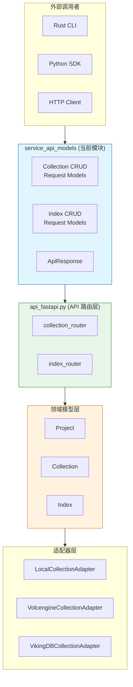

# service_api_models_collection_and_index_management 模块技术文档

## 模块概述

本模块是 VikingDB 向量数据库服务层的**契约定义层**（Contract Definition Layer）。它定义了客户端与服务端之间交互的 API 请求和响应数据结构——换句话说，这是整个系统的"门脸"，所有外部调用者（CLI、HTTP 客户端、其他服务）都必须通过这些 Pydantic 模型与系统进行数据交换。

如果你把 VikingDB 想象成一个餐厅，那么这个模块就像是菜单——它定义了顾客可以点什么菜（请求）、厨房会端出什么（响应），以及这些菜品的规格说明。服务员（FastAPI 路由层）根据菜单接收订单，然后交给厨房（Collection/Index 领域模型）烹饪。

## 架构定位与数据流

### 在系统中的位置



**架构解读**：这个模块扮演的是**"API 契约层"**的角色。如果把整个向量数据库服务想象成一家餐厅，那么：

- **service_api_models** 是**菜单**：定义了顾客可以点什么菜（请求格式）、厨房会端出什么（响应格式）
- **api_fastapi.py** 是**服务员**：接收订单、验证菜单项、传给厨房、端回菜品
- **领域模型** 是**厨房**：真正烹饪的地方，执行数据存储和检索逻辑
- **适配器层** 是**不同的厨房灶台**：有中式灶台（Local）、西式灶台（Volcengine）、特色灶台（VikingDB）

这种分层使得系统可以**解耦**：换一个新灶台（新增后端），不需要修改菜单（API 契约）；改菜单（API 升级），厨房也能继续运营（向后兼容）。

### 数据流动路径

1. **Collection 生命周期**: `CollectionCreateRequest` → API 路由 → `Project.create_collection()` → 领域模型持久化
2. **Index 生命周期**: `IndexCreateRequest` → API 路由 → `Collection.create_index()` → 索引构建
3. **查询流程**: SearchRequest → API 路由 → Collection.search_by_*() → 适配器执行 → SearchResult

## 核心组件详解

### 1. ApiResponse — 统一响应包装器

```python
class ApiResponse(BaseModel):
    code: int                           # 状态码
    message: str                        # 响应消息
    data: Optional[Any]                 # 响应数据载荷
    time_cost: Optional[float]          # 请求耗时 (秒)
```

**设计意图**: 这是一个经典的**包装器模式**（Wrapper Pattern）应用。系统选择将所有响应统一包装在 `ApiResponse` 中，而非为每个端点返回不同的响应结构。这种设计有几个关键考量：

- **一致性**: 客户端开发者只需学习一种响应格式，降低了 SDK 的学习成本
- **可观测性**: `time_cost` 字段使得服务端性能监控变得简单直接
- **错误处理**: 统一的 `code` 字段便于客户端实现统一的错误处理逻辑

**注意**: 这里的 `code` 不是 HTTP 状态码，而是业务错误码（由 `ErrorCode` 枚举定义）。这意味着即使 HTTP 返回 200，业务层仍可能通过 `code != 0` 表示失败。

### 2. Collection CRUD 请求模型

| 模型类 | 用途 | 必填字段 | 可选字段 |
|--------|------|----------|----------|
| `CollectionCreateRequest` | 创建集合 | `CollectionName` | `ProjectName`, `Description`, `Fields`, `Vectorize` |
| `CollectionUpdateRequest` | 更新集合 | `CollectionName` | `ProjectName`, `Description`, `Fields` |
| `CollectionInfoRequest` | 获取集合信息 | `CollectionName` | `ProjectName` |
| `CollectionListRequest` | 列出集合 | - | `ProjectName` |
| `CollectionDropRequest` | 删除集合 | `CollectionName` | `ProjectName` |

**字段命名约定**: 这是一个**重要的设计决策**——Collection 相关的请求使用 **PascalCase**（如 `CollectionName`），而 Data 和 Search 相关的请求使用 **snake_case**（如 `collection_name`）。这种不一致性是有历史原因的：

- Collection/Index API 是**后追加**的，遵循了早期更传统的命名风格
- Data/Search API 是**后来设计**的，采用了更 Pythonic 的 snake_case

新加入的开发者需要特别注意这种不一致，否则在使用 SDK 时可能会遇到字段名匹配的困惑。

### 3. Index 管理请求模型

| 模型类 | 用途 | 关键字段 |
|--------|------|----------|
| `IndexCreateRequest` | 创建索引 | `CollectionName`, `IndexName`, `VectorIndex`, `ScalarIndex` |
| `IndexUpdateRequest` | 更新索引 | `CollectionName`, `IndexName`, `ScalarIndex`, `Description` |
| `IndexInfoRequest` | 获取索引信息 | `CollectionName`, `IndexName` |
| `IndexListRequest` | 列出索引 | `CollectionName` |
| `IndexDropRequest` | 删除索引 | `CollectionName`, `IndexName` |

**VectorIndex 和 ScalarIndex 的设计**: 这两个字段被定义为 `Any` 类型，这意味着它们接受任意字典结构。这种设计的** Trade-off** 是：

- **优点**: 极高的灵活性，允许向后兼容新的索引配置参数，而无需修改模型
- **缺点**: 失去了 Pydantic 的静态类型检查能力，运行时需要依赖验证模块 (`validation.py`) 进行校验

实际的索引配置验证发生在 `api_fastapi.py` 的路由处理函数中，通过调用 `data_utils.convert_dict()` 和后续的验证函数完成。

## 设计决策与权衡

### 1. 请求模型 vs 领域模型：关注点分离

这个模块的请求模型**刻意简单**——它们只是数据容器，不包含任何业务逻辑。这是有意为之的设计：

- **请求模型**: 负责 HTTP 层的契约，接收和验证输入
- **领域模型** (`ICollection`, `IIndex`, `Project`): 负责业务逻辑和数据持久化

这种分离的好处是 API 契约可以独立演进，不受底层存储实现的影响。但这也意味着存在两层之间的**数据转换**——请求模型的数据需要被"翻译"成领域模型可以理解的形式，这发生在 API 路由层（如 `api_fastapi.py` 中的处理函数）。

### 2. 宽松类型（Any）的设计权衡

**核心问题**：为什么 `Fields`、`Vectorize`、`VectorIndex` 这些复杂结构要用 `Any` 类型，而不是像 `validation.py` 那样定义严格的 Pydantic 模型？

**答案**：这是**灵活性与安全性的权衡**，选择灵活性的原因是多方面的：

**向后兼容**：向量数据库领域的索引算法和量化技术发展迅速。假设今天定义了 `VectorIndexConfig`，只支持 `flat` 和 `ivf` 两种索引类型；半年后新增了 `diskann` 算法，就需要修改模型、发布新版本、要求所有 SDK 升级。使用 `Any` 可以让新的索引配置无缝接入，无需修改契约层。

**多后端兼容**：OpenViking 支持 Local、Volcengine、VikingDB Private 等多种后端，不同后端的配置格式存在差异。如果用强类型定义，所有后端都必须适配同一套格式，这限制了后端的差异化能力。`Any` 类型允许后端自行解释配置。

**渐进式验证**：虽然请求层使用 `Any`，但业务层可以通过 `validation.py` 中的严格模型进行二次校验。这形成了**两层验证**：
- **第一层（请求层）**：Pydantic 基础验证（必填字段、类型格式）
- **第二层（业务层）**：`CollectionMetaConfig`、`VectorIndexConfig` 等严格模型深度验证

这种设计的**代价**是错误信息可能在第一层不够精确。例如，"字段格式错误"而非"第5个字段的 Dim 必须是4的倍数"。但这是可以接受的技术债务，因为深度验证会捕获这些错误。

### 3. Optional 字段的宽松策略

几乎所有字段都是 `Optional` 的，即使某些字段在业务上可能是必需的。例如 `CollectionCreateRequest.VectorIndex` 在技术上也是可选的，但如果没有向量索引配置，向量数据将无法被检索。

这种宽松策略的**考量**：
- **渐进式配置**: 允许用户先创建空集合，后续再添加字段和索引
- **降低入门门槛**: 用户不需要在一开始就理解所有配置细节
- **但增加了复杂性**: 调用者需要知道哪些字段在什么情况下是真正必需的

### 4. 响应数据结构的双重性

`ApiResponse.data` 字段被定义为 `Optional[Any]`，这意味着它可以是任何类型——创建操作返回空对象或 ID 列表，查询操作返回数据列表，统计操作返回聚合结果。

这种设计的**潜在风险**:
- 客户端 SDK 难以静态类型化响应数据
- 需要依赖文档或运行时类型检查来理解具体返回什么
- 错误响应和数据响应的 `data` 字段结构完全不同

## 依赖关系分析

### 上游依赖（谁调用这个模块）

| 上游模块 | 调用方式 | 传递的数据 |
|----------|----------|------------|
| `api_fastapi.py` | 导入作为 FastAPI 路由参数类型 | HTTP 请求体 |
| Python SDK 用户代码 | 实例化请求对象并发送给服务端 | 业务数据 |

### 下游依赖（这个模块调用什么）

这个模块是**纯数据模型**，没有直接的下游依赖。它只依赖于 Pydantic 基础库。

### 相邻模块的协作

| 相邻模块 | 协作方式 |
|----------|----------|
| `schema_validation_and_constants` (`validation.py`) | 验证模块对请求中的 `Fields`、`VectorIndex` 等嵌套结构进行深度验证 |
| `domain_models_and_contracts` (`collection.py`, `index.py`) | API 路由层将请求数据转换为领域模型可接受的格式 |
| `collection_adapters_abstraction_and_backends` | 适配器层执行实际的数据操作，但操作的是领域模型而非请求模型 |

## 使用示例与常见模式

### 创建一个 Collection

```python
from openviking.storage.vectordb.service.app_models import (
    CollectionCreateRequest, 
    ApiResponse
)

# 构建请求
request = CollectionCreateRequest(
    CollectionName="my_documents",
    ProjectName="RAG",
    Description="RAG 文档向量存储",
    Fields=[
        {"FieldName": "id", "FieldType": "string", "IsPrimaryKey": True},
        {"FieldName": "text", "FieldType": "text"},
        {"FieldName": "embedding", "FieldType": "vector", "Dim": 1024}
    ],
    Vectorize={
        "dense": {
            "ModelName": "bge-large-zh-v1.5",
            "TextField": "text"
        }
    }
)

# 发送请求 (通过 HTTP 客户端)
response = http_client.post("/CreateVikingdbCollection", json=request.model_dump())
```

### 创建一个 Index

```python
from openviking.storage.vectordb.service.app_models import IndexCreateRequest

request = IndexCreateRequest(
    CollectionName="my_documents",
    IndexName="default",
    VectorIndex={
        "IndexType": "flat_hybrid",
        "Distance": "cosine",
        "Quant": "int8",
        "EnableSparse": True
    },
    ScalarIndex=["category", "created_at"]
)
```

## 边界情况与注意事项

### 1. 命名不一致的坑

如前所述，Collection/Index 操作使用 PascalCase，而 Data/Search 操作使用 snake_case。在编写代码时务必确认你使用的是正确的命名风格：

```python
# 正确 - Collection 操作
request = CollectionCreateRequest(CollectionName="...")

# 正确 - Data 操作  
request = DataUpsertRequest(collection_name="...", fields=[...])

# 错误 - 混用会导致 Pydantic 验证失败
request = CollectionCreateRequest(collection_name="...")  # 找不到这个字段！
```

### 2. Optional 字段的空值处理

许多字段虽然标记为 `Optional`，但在业务逻辑中可能是必需的。例如创建一个向量 Collection 时，`VectorIndex` 如果缺失，后续的数据检索将无法工作。API 路由层会进行一定程度的验证，但最好在客户端也进行前置校验。

### 3. Fields 和 VectorIndex 的 Any 类型

这两个字段接受任意字典结构，这意味着：

- Pydantic 不会检查字段是否合法
- 需要依赖 `validation.py` 中的 `validate_collection_meta_data()` 等函数进行深度验证
- 配置错误通常会在运行时而非编译时被发现

### 4. ProjectName 的默认值

几乎所有请求都包含 `ProjectName` 字段，并且默认值为 `"default"`。这意味着：

- 如果不指定 ProjectName，操作会在默认项目下执行
- 多租户场景下需要确保正确传递 ProjectName
- 误用可能导致跨租户数据操作（虽然业务层应该有额外校验）

### 5. 响应的时间成本字段

`time_cost(second)` 字段使用了 Pydantic 的 `alias` 功能：

```python
time_cost: Optional[float] = Field(None, alias="time_cost(second)")
```

这意味着 JSON 响应中的键是 `time_cost(second)`，但 Python 代码中访问时使用 `time_cost`。如果你直接序列化响应给下游系统，需要注意这个特殊的字段名。

## 相关模块文档

- [vectorization_and_storage_adapters-collection_adapters_abstraction_and_backends](vectorization_and_storage_adapters-collection_adapters_abstraction_and_backends.md) — 了解 Collection 操作的实际执行层
- [vectordb-domain-models-and-service-schemas-domain_models_and_contracts](vectordb-domain-models-and-service-schemas-domain_models_and_contracts.md) — 了解 Collection/Index 的领域模型
- [vectordb-domain-models-and-service-schemas-service_api_models_data_operations](vectordb-domain-models-and-service-schemas-service_api_models_data_operations.md) — 了解 Data 操作的请求模型（使用 snake_case 的那个）
- [vectordb-domain-models-and-service-schemas-service_api_models_search_requests](vectordb-domain-models-and-service-schemas-service_api_models_search_requests.md) — 了解 Search 请求模型