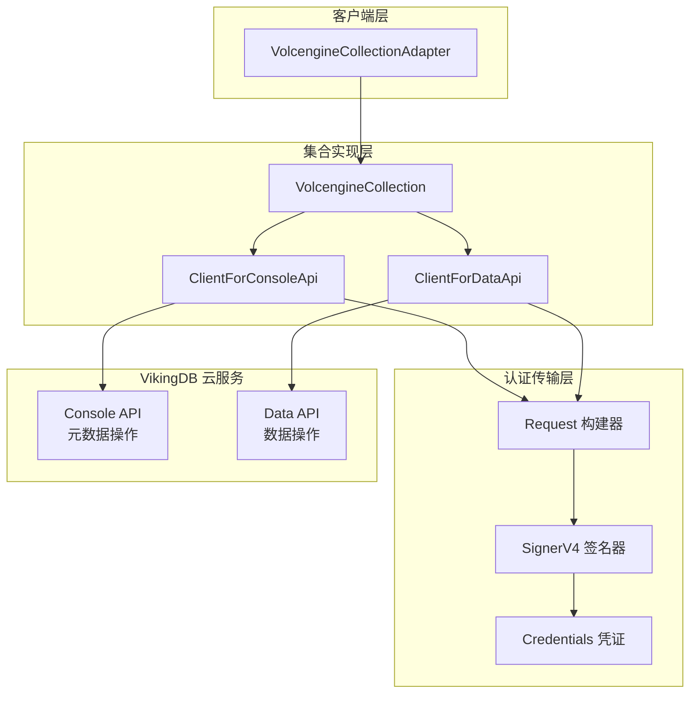

# volcengine_data_api_integration 模块技术深潜

## 模块定位与问题空间

`volcengine_data_api_integration` 模块是 OpenViking 向量存储层与火山引擎（Volcengine）托管的 VikingDB 服务之间的桥梁。它解决的问题是：**如何在云原生环境下，通过标准化的 API 调用来管理向量数据集合、执行向量搜索以及处理数据的持久化**。

想象一下，VikingDB 是一个远程的分布式向量数据库服务，而你的应用运行在完全不同的环境中。这个模块的角色类似于一个「领事馆」——它不仅仅传递数据，更重要的是处理两国之间的「外交协议」：身份认证、请求签名、协议转换。这个模块就是那个处理火山引擎特有认证协议（AWS Signature V4）的领事馆。

该模块的核心价值在于将复杂的云 API 认证细节封装成简洁的 Python 类方法，让上层的 `VolcengineCollection` 无需关心 HTTP 签名的繁琐实现。

## 架构角色与数据流



从数据流的角度来看，当用户调用 `collection.upsert_data(...)` 时，请求经历以下路径：

1. **Adapter 层** ([VolcengineCollectionAdapter](./vectorization-and-storage-adapters.md)) 接收配置并创建 `VolcengineCollection`
2. **Collection 层** ([VolcengineCollection](./storage-core-and-runtime-primitives.md)) 将操作请求路由到对应的 API 客户端
3. **Client 层**（当前模块）负责构建 HTTP 请求、应用 AWS SigV4 签名
4. **网络层** 发送请求到火山引擎的 VikingDB 端点

## 组件深度解析

### ClientForConsoleApi：元数据操作的「政府窗口」

`ClientForConsoleApi` 负责处理所有与集合元数据、索引管理相关的操作。这类操作类似于「政府事务」——创建集合、删除集合、创建索引、列出索引等。它们的特点是：频率相对较低，但对系统结构有根本性影响。

```python
class ClientForConsoleApi:
    _global_host = {
        "cn-beijing": "vikingdb.cn-beijing.volcengineapi.com",
        "cn-shanghai": "vikingdb.cn-shanghai.volcengineapi.com",
        "cn-guangzhou": "vikingdb.cn-guangzhou.volcengineapi.com",
    }
```

**设计意图**：硬编码的区域端点列表反映了火山引擎的服务架构。对于中国境内的服务，用户只能在有限的区域中选择。这种设计选择的好处是简化了配置，代价是缺乏灵活性（无法支持自定义端点或海外区域）。

**核心方法**：

- `prepare_request(method, params=None, data=None)`：构建带有完整 AWS SigV4 签名的请求对象
- `do_req(req_method, req_params=None, req_body=None)`：执行实际的 HTTP 请求

注意到 `ClientForConsoleApi` 不接收 `path` 参数——这是因为 Console API 使用统一的根路径 `/`，所有操作通过 `Action` 查询参数区分。

### ClientForDataApi：数据操作的「业务前台」

`ClientForDataApi` 处理所有的数据操作：向量搜索、数据 upsert、数据获取、删除等。这是「业务前台」，流量大、延迟敏感、需要高吞吐。

```python
class ClientForDataApi:
    _global_host = {
        "cn-beijing": "api-vikingdb.vikingdb.cn-beijing.volces.com",
        "cn-shanghai": "api-vikingdb.vikingdb.cn-shanghai.volces.com",
        "cn-guangzhou": "api-vikingdb.vikingdb.cn-guangzhou.volces.com",
    }
```

**关键设计差异**：

| 特性 | Console API | Data API |
|------|-------------|----------|
| 端点域名 | volcengineapi.com（公网入口） | volces.com（内网/优化入口） |
| 路径 | 固定 `/` | 动态路径（如 `/api/vikingdb/data/search/vector`） |
| 用途 | 元数据管理 | 数据增删改查 |

这种分离是典型的「控制平面/数据平面」架构。Console API 负责「管控」，Data API 负责「运行」，两者解耦使得各自可以独立扩展和优化。

### 认证机制：AWS Signature V4

两个客户端共享相同的认证模式——使用 `SignerV4` 对请求进行签名。这是一个关键的设计决策，需要理解其背后的权衡：

**为什么选择 AWS SigV4 而不是简单的 API Key？**

1. **安全性**：SigV4 使用临时凭证和请求签名，即使请求被截获也无法重放或篡改
2. **标准化**：火山引擎的 API 兼容 AWS 的认证生态，许多现有工具可以直接使用
3. **审计能力**：每个签名请求都可以追溯到具体的 AK/SK 持有者

**实现细节**（`prepare_request` 方法）：

```python
credentials = Credentials(self.ak, self.sk, "vikingdb", self.region)
SignerV4.sign(r, credentials)
```

这里 `service` 参数硬编码为 `"vikingdb"`，表明这是火山引擎特有的服务类型。

### 请求超时与错误处理

```python
DEFAULT_TIMEOUT = 30
r.set_connection_timeout(DEFAULT_TIMEOUT)
r.set_socket_timeout(DEFAULT_TIMEOUT)
```

**设计决策**：30 秒的默认超时是一个务实的选择——对于向量数据库的搜索操作，这个时间足够完成大多数请求，但也不会让客户端无限等待。对于 upsert 操作，可能需要更长的时间，但调用方可以通过重试来处理超时情况。

注意当前实现**不自动重试**，这意味着调用方需要自行处理网络抖动导致的失败。`VolcengineCollection` 层的日志记录会帮助诊断问题，但不会自动恢复。

## 依赖关系与契约

### 上游依赖：谁调用这个模块

这个模块被 [VolcengineCollection](./storage-core-and-runtime-primitives.md) 强依赖。`VolcengineCollection` 在初始化时创建两个客户端实例：

```python
class VolcengineCollection(ICollection):
    def __init__(self, ak, sk, region, host=None, meta_data=None):
        self.console_client = ClientForConsoleApi(ak, sk, region, host)
        self.data_client = ClientForDataApi(ak, sk, region, host)
```

**隐含契约**：

1. **AK/SK 有效性**：客户端假设传入的 AK/SK 是有效的。如果凭证无效，后续的 `do_req` 调用会收到 401 错误
2. **区域存在性**：`_global_host` 字典中必须存在对应的区域键，否则会抛出 `KeyError`
3. **Response 处理**：客户端返回原始的 `requests.Response` 对象，不做状态码检查——这意味着调用方必须检查 `response.status_code`

### 下游依赖：调用什么服务

- **火山引擎 SDK** (`volcengine` 包)：提供 `SignerV4`, `Request`, `Credentials` 类
- **Python requests 库**：执行实际的网络请求

这两个依赖都是外部依赖，`volcengine` 是火山引擎特有的 SDK。

### 并行模式：VikingDB 私有部署客户端

值得注意的是，代码库中存在一个平行的客户端实现：[VikingDBClient](./vectordb-domain-models-and-service-schemas-volcengine-data-api-integration-vikingdb-clients.md)（位于 `vikingdb_clients.py`）。这个实现用于私有化部署场景，它不使用 AWS SigV4 签名，而是使用简单的自定义认证头：

```python
class VikingDBClient:
    def __init__(self, host: str, headers: Optional[Dict[str, str]] = None):
        self.host = host
        self.headers = headers or {}
```

这种「云版本 vs 私有版本」的并行设计是一个常见模式——对于私有部署，认证机制通常更简单（可能是内网信任或预共享密钥）。

## 设计权衡分析

### 1. 薄抽象层 vs 厚抽象层

当前实现是一个「薄抽象层」——它几乎就是 HTTP 客户端的简单包装，没有做请求重试、没有做结果缓存、没有做连接池管理。

**选择的理由**：

- 简单直接，易于调试和理解
- 火山引擎的 SDK 可能已经做了连接复用
- 向量数据库操作本身的状态管理在 Collection 层更合适

**潜在的代价**：

- 每个请求都创建新的 HTTP 连接（虽然 requests 内部有连接池）
- 调用方需要自己处理所有错误情况

### 2. 硬编码端点 vs 配置端点

两个客户端都使用硬编码的区域端点字典。这在火山引擎的背景下是合理的——云服务的区域是有限且预定义的。

**替代方案**：允许用户通过参数传入完整的 host URL。这会增加复杂度（需要验证 URL 格式），但在混合云或测试场景下会更有用。当前设计明确地优先考虑「开箱即用」的简单性。

### 3. 返回原始 Response vs 领域对象

`do_req` 方法返回 `requests.Response` 对象，而不是解析后的数据或领域对象。这是一个**有争议的设计**。

**优点**：

- 灵活性——调用方可以按需解析
- 性能——没有不必要的对象创建

**缺点**：

- 违反「最小惊讶原则」——大多数调用方期望得到数据而非 HTTP 响应对象
- 分散错误处理逻辑——每个调用方都需要检查 `status_code` 和解析 JSON
- 类型提示不明确——返回类型是 `requests.Response`，但实际使用场景需要的是 `Dict[str, Any]`

在 [VolcengineCollection](./storage-core-and-runtime-primitives.md) 层可以看到这个问题的体现——每个调用方都在做同样的模式：

```python
if response.status_code != 200:
    logger.error(f"Request to {action} failed: {response.text}")
    return {}
try:
    result = response.json()
    return result.get("Result", {})
except json.JSONDecodeError:
    return {}
```

这实质上是在每个调用点重复相同的错误处理逻辑。

## 贡献者注意事项

### 新增功能时的注意事项

1. **API 版本管理**：`VIKING_DB_VERSION = "2025-06-09"` 是当前使用的 API 版本。如果 VikingDB 服务端升级 API，可能需要同步更新这个常量。

2. **区域扩展**：如果需要支持新的火山引擎区域，必须在 `_global_host` 字典中添加新的映射。缺少的区域会抛出 `KeyError`。

3. **错误处理一致性**：当前实现对 HTTP 错误的处理是不一致的——有时记录日志后返回空字典，有时抛出异常。贡献者应该明确每种情况的预期行为。

### 潜在改进点

1. **统一的响应解析**：可以在客户端层统一处理响应解析和错误处理，而不是让每个调用方重复逻辑
2. **重试机制**：添加指数退避的重试逻辑来处理临时性网络故障
3. **连接池优化**：如果性能测试显示连接创建是瓶颈，可以考虑复用 HTTP 会话

### 调试技巧

当遇到认证失败或请求错误时：

1. 检查 AK/SK 是否正确——错误的凭证会收到 401 响应
2. 检查区域是否匹配——区域不匹配会收到 403 或 404
3. 启用 requests 的日志：`logging.getLogger("urllib3").setLevel(logging.DEBUG)` 可以看到完整的 HTTP 交互

### 常见陷阱

1. **Host 拼写错误**：注意 `volcengineapi.com` vs `volces.com` 的区别——这是两个不同的端点
2. **超时设置**：30 秒对于大规模数据 upsert 可能不够，需要考虑调整或使用批量操作
3. **路径斜杠**：Data API 的路径必须以 `/` 开头，当前实现会自动处理，但自定义调用时需要注意

## 相关模块参考

- [VolcengineCollection](./storage-core-and-runtime-primitives.md)：使用本模块的集合实现
- [VolcengineCollectionAdapter](./vectorization-and-storage-adapters.md)：配置和创建 VolcengineCollection 的适配器
- [VikingDBClient](./vectordb-domain-models-and-service-schemas-volcengine-data-api-integration-vikingdb-clients.md)：私有部署场景的平行的客户端实现
- [ICollection 接口](./storage-core-and-runtime-primitives.md)：`ICollection` 抽象定义
- [Service API Models](./vectordb-domain-models-and-service-schemas-service-api-models-collection-and-index-management.md)：请求/响应的数据模型定义