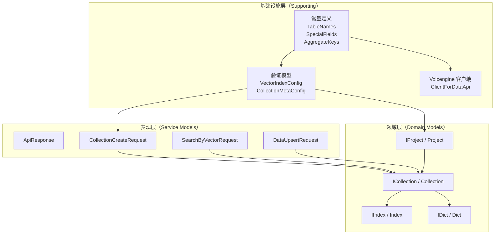
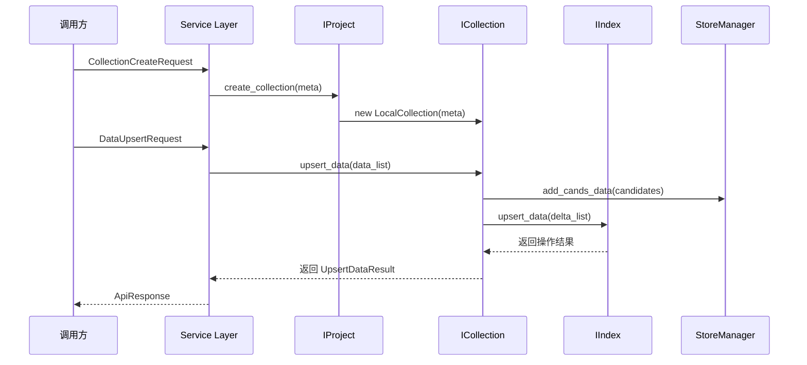
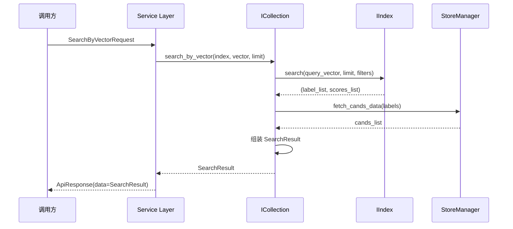

# vectordb_domain_models_and_service_schemas 模块文档

## 模块概述

**vectordb_domain_models_and_service_schemas** 是 OpenViking 系统中向量数据库（VikingDB）功能的核心抽象层。这个模块定义了向量数据库系统的核心概念模型和 API 契约，扮演着**领域模型定义者**和**服务接口规范者**的双重角色。

### 问题空间：为什么需要这个模块？

在构建一个向量数据库系统时，团队面临几个核心挑战：

1. **多后端支持**：系统需要支持本地持久化存储、远程 HTTP API、Volcengine 云服务、VikingDB 私有部署等多种后端。如果每个后端都定义自己的接口，调用方代码将变得混乱且难以维护。

2. **API 边界验证**：作为服务入口，需要对所有传入的请求参数进行严格的类型检查和业务规则验证，防止非法数据进入核心系统。

3. **概念一致性**：向量数据库有自己的领域术语（Project、Collection、Index），这些概念需要被清晰地建模并在整个系统中保持一致。

本模块通过定义**稳定的接口契约**和**强类型的请求/响应模型**来解决这些问题。它是连接上层业务逻辑和下层存储实现的桥梁。

### 核心定位

这个模块在系统架构中处于**承上启下**的位置：

```
┌─────────────────────────────────────────────────────────────────┐
│                     上层业务调用方                               │
│  (CLI 工具、API 路由、Python 客户端)                              │
└────────────────────────────┬────────────────────────────────────┘
                             │ 使用 ICollection, IIndex, IProject
                             ▼
┌─────────────────────────────────────────────────────────────────┐
│           vectordb_domain_models_and_service_schemas            │
│  定义领域接口 + 服务层数据模型 + 验证规则 + 常量                   │
└────────────────────────────┬────────────────────────────────────┘
                             │ 被具体实现类实现
                             ▼
┌─────────────────────────────────────────────────────────────────┐
│                    具体实现层                                    │
│  LocalCollection, VolcengineCollection, HttpCollection 等       │
└─────────────────────────────────────────────────────────────────┘
```

---

## 架构概览

### 核心抽象层次

本模块采用经典的**三层领域模型**结构：



### 关键组件职责

| 组件 | 职责 | 核心价值 |
|------|------|----------|
| **IProject / Project** | 项目容器，管理多个 Collection | 提供命名空间隔离，实现多租户支持 |
| **ICollection / Collection** | 数据集合，类似关系数据库的表 | 管理数据结构和索引，提供统一的数据操作接口 |
| **IIndex / Index** | 索引实例，向量搜索的核心 | 封装 ANN 算法，支持标量过滤和聚合 |
| **IDict / Dict** | 元数据字典 | 存储和管理非结构化配置数据 |
| **Service Models** | API 请求/响应模型 | Pydantic 强类型验证，清晰的错误信息 |
| **Validation Models** | 配置验证模型 | 在数据进入系统前进行严格校验 |
| **Constants** | 常量定义 | 避免魔法字符串，提高可维护性 |

---

## 核心领域模型详解

### 1. Project（项目）- 最顶层容器

**设计意图**：Project 是向量数据库的顶层组织单元，类似于关系数据库中的"数据库"概念。它提供：

- **命名空间隔离**：不同项目的集合相互独立
- **资源管理**：统一管理项目内所有集合的生命周期
- **访问控制边界**：可以作为权限控制的基础单元

**接口契约** (`IProject`):
```python
class IProject(ABC):
    @abstractmethod
    def create_collection(self, collection_name: str, collection_meta: Dict[str, Any]) -> Any
    @abstractmethod
    def get_collection(self, collection_name: str) -> Any
    @abstractmethod
    def drop_collection(self, collection_name: str)
    # ... 其他集合管理方法
```

**关键设计决策**：接口接收 `Dict[str, Any]` 而不是强类型的 CollectionMetaConfig。这是为了保持接口的灵活性——不同的后端实现可能需要不同的元数据格式。但同时，**Service 层会使用 Pydantic 模型进行预先验证**，确保传入的数据符合预期结构。

### 2. Collection（集合）- 数据组织单元

**设计意图**：Collection 是存储数据记录的基本单元，类似于关系数据库的"表"。每个 Collection 有：

- **Schema 定义**：字段名称、类型、是否为Primary Key
- **向量化配置**：如何将原始数据转换为向量
- **多个索引**：可以创建多个不同配置的索引

**核心搜索方法**：Collection 提供了六种搜索模式：
1. `search_by_vector` - 纯向量相似度搜索
2. `search_by_keywords` - 关键词搜索（自动向量化）
3. `search_by_id` - 基于已有文档 ID 查找相似文档
4. `search_by_multimodal` - 多模态搜索（文本+图像+视频）
5. `search_by_random` - 随机采样
6. `search_by_scalar` - 标量字段排序

**为什么需要六种搜索方式？**

这反映了向量数据库在真实场景中的多样性需求：
- 纯向量搜索适合语义匹配
- 关键词搜索适合传统文本检索场景
- ID 搜索用于"找相似文档"功能
- 多模态搜索支持图像/视频检索
- 随机采样用于数据探索
- 标量排序用于"按价格排序"等业务需求

### 3. Index（索引）- 向量搜索核心

**设计意图**：Index 是执行向量相似度搜索的实际执行者。一个 Collection 可以有多个 Index，每个 Index 可以有不同的配置：

- **不同的向量配置**：不同的维度、不同的距离度量
- **不同的索引类型**：flat（精确）、flat_hybrid（混合）
- **不同的量化策略**：int8、float、fix16、PQ

**DeltaRecord 机制**：Index 使用 DeltaRecord 来接收数据变更。DeltaRecord 包含：
- `type`: UPSERT (0) 或 DELETE (1)
- `label`: 记录的唯一标识符
- `vector`: 密集向量
- `sparse_raw_terms` / `sparse_values`: 稀疏向量
- `fields`: 标量字段（JSON 字符串）

**关键设计**：Index 接口接收 `List[DeltaRecord]` 批量处理，这比单条处理有显著的性能优势，因为：
1. 减少函数调用开销
2. 允许批量索引优化
3. 支持事务性批量更新

### 4. Dict（元数据字典）- 轻量级配置存储

**设计意图**：IDict 接口提供了一个简单的键值存储，用于管理非结构化的元数据。与正式的 Collection 不同，它更适合：

- 缓存配置
- 运行时状态
- 简单的键值查询场景

---

## Service 层数据模型

### 请求模型设计原则

所有 Service 层的请求模型都继承自 Pydantic 的 `BaseModel`，这带来了几个关键优势：

1. **自动验证**：字段类型、范围、格式在对象创建时自动验证
2. **清晰的错误信息**：Pydantic 的验证错误包含字段路径，便于定位问题
3. **默认值处理**：减少调用方需要处理的边界情况
4. **文档生成**：Field 的 description 可以自动生成 API 文档

### 模型分类

#### 1. Collection 管理请求
- `CollectionCreateRequest` - 创建集合
- `CollectionUpdateRequest` - 更新集合
- `CollectionInfoRequest` - 获取集合信息
- `CollectionListRequest` - 列出集合
- `CollectionDropRequest` - 删除集合

#### 2. Index 管理请求
- `IndexCreateRequest` - 创建索引
- `IndexUpdateRequest` - 更新索引
- `IndexInfoRequest` - 获取索引信息
- `IndexListRequest` - 列出索引
- `IndexDropRequest` - 删除索引

#### 3. Data 操作请求
- `DataUpsertRequest` - 插入/更新数据
- `DataFetchRequest` - 批量获取数据
- `DataDeleteRequest` - 删除数据

#### 4. Search 请求
- `SearchByVectorRequest` - 向量搜索
- `SearchByKeywordsRequest` - 关键词搜索
- `SearchByIdRequest` - ID 搜索
- `SearchByMultiModalRequest` - 多模态搜索
- `SearchByRandomRequest` - 随机搜索
- `SearchByScalarRequest` - 标量排序

### 响应模型

`ApiResponse` 是统一的响应包装器：
```python
class ApiResponse(BaseModel):
    code: int          # 状态码
    message: str       # 响应消息
    data: Optional[Any] # 响应数据
    time_cost: Optional[float] #耗时（秒）
```

**设计意图**：统一的响应格式便于：
- 前端统一处理错误
- 日志和监控
- 统一的时间追踪

---

## 验证模型与常量

### 验证层级设计

本模块采用**两级验证**策略：

```
调用方 
    ↓
Service 层 Request Model (Pydantic) - 第一次验证
    ↓
Domain 层验证函数 (validate_collection_meta_data) - 第二次验证
    ↓
具体实现层 - 业务逻辑验证
```

这种设计的原因是：
- Request Model 验证关注**格式正确性**（字段存在、类型正确、格式合法）
- Domain 层验证关注**业务规则**（字段组合是否合理、是否存在冲突）

### 关键验证模型

1. **CollectionMetaConfig** - 集合元数据配置
   - 字段定义列表
   - 向量化配置
   - 主键约束验证

2. **IndexMetaConfig** - 索引元数据配置
   - 向量索引类型和距离度量
   - 量化配置
   - 标量索引字段列表

3. **CollectionField** - 字段定义
   - 字段类型枚举（int64, float32, string, vector, sparse_vector 等）
   - 向量维度约束（4-4096，必须是4的倍数）
   - 主键类型限制（只能是 int64 或 string）

### 常量设计

`constants.py` 中定义的常量分为四类：

1. **TableNames** - 存储表标识
   - `CANDIDATES = "C"` - 主数据表
   - `DELTA = "D"` - 增量变更表
   - `TTL = "T"` - 过期时间表

2. **SpecialFields** - 特殊字段名
   - `AUTO_ID` - 自动生成的主键字段名

3. **AggregateKeys** - 聚合操作键名
   - `TOTAL_COUNT_INTERNAL` / `TOTAL_COUNT_EXTERNAL` - 内部和外部的总数键名

4. **IndexFileMarkers** - 索引文件标记
   - `WRITE_DONE = ".write_done"` - 索引写入完成标记

**设计意图**：使用简短的字母（"C", "D", "T"）作为表名，可以减少存储开销，特别是在大量数据场景下。

---

## 设计决策与权衡

### 1. 接口 vs 具体类：抽象分离

**选择**：定义 `IProject`、`ICollection`、`IIndex` 等接口，配合 `Project`、`Collection`、`Index` 包装类

**权衡分析**：
- **优点**：
  - 解耦调用方和实现细节
  - 便于单元测试（可以注入 mock 实现）
  - 支持多后端（Local、HTTP、Volcengine、VikingDB）
- **缺点**：
  - 增加代码跳转成本
  - 包装类带来额外的方法转发
  - 接口变更影响面大

**为什么需要包装类？**
包装类（如 `Collection` 包装 `ICollection`）提供了：
- 资源生命周期管理（`__del__` 中的 close 调用）
- 状态检查（`if self.__collection is None: raise RuntimeError`）
- 统一的错误处理

### 2. 字典 vs 结构化：元数据存储

**选择**：使用 `IDict` 抽象而不是强类型的元数据类

**权衡分析**：
- **优点**：灵活性高，可以存储任意结构
- **缺点**：失去编译时类型检查，运行时错误风险

**实际使用**：在代码中，`IDict` 主要用于存储索引相关的配置数据，这些数据本身是 JSON 结构，使用字典足够灵活。

### 3. Pydantic 验证的开销

**选择**：在 Service 层大量使用 Pydantic 模型

**权衡分析**：
- **优点**：验证逻辑集中，错误信息清晰，支持自动类型转换
- **缺点**：每次请求都有解析开销，对高性能场景有影响

**优化方向**：对于高频路径，可以考虑使用 `model_validate` 的缓存或升级到 Pydantic v2 的性能优化。

### 4. 搜索结果的设计

**选择**：SearchResult 包含 `List[SearchItemResult]`，每个 item 包含 id、fields、score

**权衡分析**：
- **优点**：结构清晰，调用方可以灵活选择需要的字段
- **缺点**：对于简单场景，额外的对象创建有开销

**实际考量**：这种设计支持"仅返回 ID"和"返回所有字段"两种极端情况，兼顾了灵活性和性能。

---

## 数据流与依赖关系

### 核心操作的数据流

#### 1. 创建 Collection 并插入数据



#### 2. 向量搜索



### 模块间依赖

**依赖本模块的模块**：
- `vectorization_and_storage_adapters` - 使用 ICollection、IIndex 接口
- `server_api_contracts` - 可能引用 Service 层模型
- `storage_core_and_runtime_primitives` - 依赖某些常量

**本模块依赖的模块**：
- `openviking.storage.vectordb.store.data` - DeltaRecord 定义
- `openviking.storage.vectordb.utils.id_generator` - ID 生成

---

## 扩展点与注意事项

### 扩展点

1. **新增搜索方式**
   - 在 `ICollection` 中添加新的搜索方法
   - 实现对应的 `SearchByXXXRequest` 模型

2. **新增后端实现**
   - 创建新的类实现 `IProject`、`ICollection`、`IIndex` 接口
   - 可以在 `Project`、`Collection`、`Index` 包装类中使用

3. **新增字段类型**
   - 在 `FieldTypeEnum` 中添加新类型
   - 在验证逻辑中添加对应处理

### 注意事项（Gotchas）

1. **状态检查是隐式的**
   - 调用 `Collection` 的任何方法前，如果 collection 已关闭，会抛出 `RuntimeError("Collection is closed")`
   - 包装类在每次方法调用时都进行状态检查

2. **Index 的 rebuild 是自动的**
   - `LocalCollection` 内部有定时任务检查 `index.need_rebuild()`
   - 如果需要重建，会用新数据重新创建索引
   - 这个过程对调用方透明，但可能占用较多资源

3. **标量搜索实际是向量搜索**
   - 表面上看 `search_by_scalar` 是标量排序
   - 实际上内部将其转换为带有 sorter 的 filter，调用相同的向量搜索接口

4. **TTL 的实现细节**
   - TTL 以纳秒存储在 `expire_ns_ts`
   - 后台任务定期清理过期数据
   - 如果 TTL 设置为 0，表示永不过期

5. **主键类型与 ID 转换**
   - 字符串主键使用 `str_to_uint64` 转换为数字 label
   - 自动生成的 ID 使用 `generate_auto_id`
   - 这意味着主键有长度限制（受 uint64 范围影响）

---

## 子模块文档

本模块包含以下子模块，各有详细的专门文档：

| 子模块 | 核心内容 | 文件名 |
|--------|----------|--------|
| [domain_models_and_contracts](domain_models_and_contracts.md) | IProject、ICollection、IIndex、IDict 接口及包装类 | `domain_models_and_contracts.md` |
| [service_api_models_collection_and_index_management](vectordb-domain-models-and-service-schemas-service-api-models-collection-and-index-management.md) | Collection 和 Index 管理的请求模型 | `vectordb-domain-models-and-service-schemas-service-api-models-collection-and-index-management.md` |
| [service_api_models_data_operations](service_api_models_data_operations.md) | 数据操作请求模型（upsert、fetch、delete） | `service_api_models_data_operations.md` |
| [service_api_models_search_requests](service-api-models-search-requests.md) | 各类搜索请求模型 | `service-api-models-search-requests.md` |
| [schema_validation_and_constants](schema-validation-and-constants.md) | Pydantic 验证模型和常量定义 | `schema-validation-and-constants.md` |
| [volcengine_data_api_integration](volcengine_data_api_integration.md) | Volcengine API 客户端 | `volcengine_data_api_integration.md` |

建议按照上述顺序阅读子模块文档，以建立完整的理解。