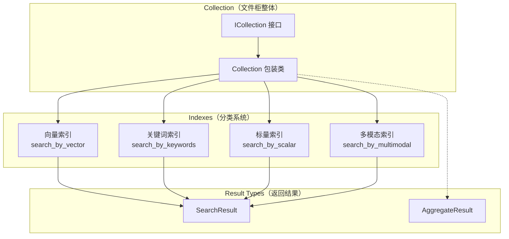
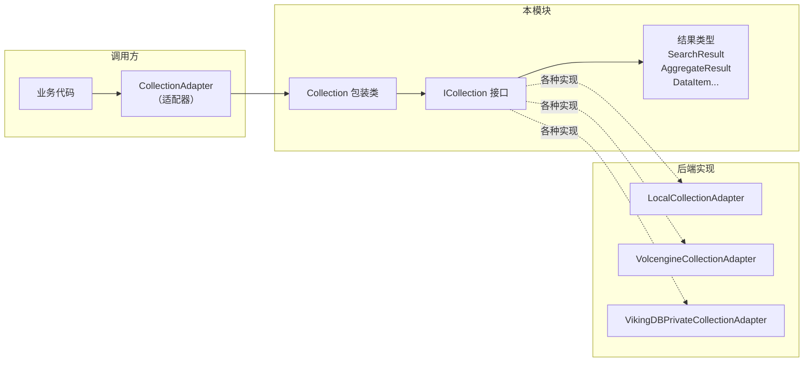
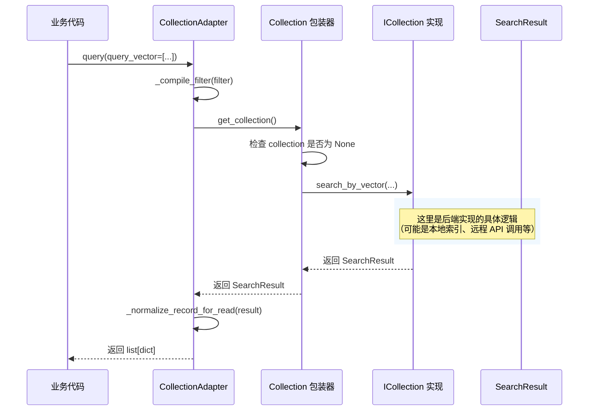

# collection_contracts_and_results 模块

> **一句话概括**：本模块定义了向量数据库集合（Collection）的抽象接口契约和搜索结果的数据结构，是整个向量存储层对外暴露的"门面"。

---

## 1. 为什么存在这个模块？

### 1.1 解决的问题空间

在分布式向量数据库系统中，**Collection（集合）** 是组织向量数据的核心抽象。一个 Collection 类似于关系型数据库中的"表"——它包含一类数据，拥有自己的 schema（模式），可以创建多个索引（Index）来加速不同类型的查询。

但这里有一个关键的设计挑战：**如何让上层的业务代码与底层的存储实现解耦？**

想象一下，你的系统需要支持多种向量数据库后端：
- 本地内存索引（快速，适合小数据量）
- 磁盘持久化索引（支持更大规模）
- 远程向量数据库服务（如火山引擎的 VikingDB）

如果不定义统一的抽象接口，业务代码就会充斥着 `if backend == 'local': ... elif backend == 'remote': ...` 的分支逻辑，代码既难以维护，也难以测试。

**collection_contracts_and_results 模块正是为了解决这个问题**——它定义了一套与具体实现无关的抽象接口（ICollection），让业务代码只需面向接口编程，无需关心底层到底是哪个向量数据库。

### 1.2 设计动机

这个模块的核心设计动机可以归结为三点：

1. **接口与实现分离**：通过 ABC（抽象基类）定义 ICollection，任何实现该接口的类都可以被系统使用
2. **统一的查询语义**：定义六种核心搜索能力（向量搜索、关键词搜索、多模态搜索、按ID搜索、随机采样、标量排序），让调用方使用一致的 API
3. **结果格式标准化**：定义 SearchResult、AggregateResult 等数据结构，确保无论底层是哪个后端，返回给上层的结果格式都是一致的

---

## 2. 思维模型：如何理解这个模块？

### 2.1 核心抽象

把 **ICollection** 想象成**一个配备了多种检索能力的"智能文件柜"**：

- **Collection（集合）** = 文件柜的**整体**
- **Index（索引）** = 文件柜内部的**分类系统**（比如按"主题"建一个索引，按"日期"建另一个索引）
- **Document/Record（文档/记录）** = 文件柜里存放的**每一份文件**



### 2.2 设计模式：接口 + 包装器

本模块采用了**双重抽象**模式：

| 层级 | 类名 | 作用 |
|------|------|------|
| 抽象层 | `ICollection` | 定义"必须做什么"的接口契约 |
| 包装层 | `Collection` | 提供运行时安全保障（空值检查、状态验证） |

这种模式的精妙之处在于：
- `ICollection` 是抽象基类，任何后端实现（如 VolcengineCollection、VikingDBPrivateCollection）都必须继承它并实现所有抽象方法
- `Collection` 是一个**装饰器**（Decorator），它接收一个 `ICollection` 实例，在每个方法调用前检查 `self.__collection is None`，确保不会对已关闭的集合执行操作

```python
# Collection 包装器的核心保护逻辑
def search_by_vector(self, ...):
    if self.__collection is None:
        raise RuntimeError("Collection is closed")  # 防止对已关闭资源的操作
    return self.__collection.search_by_vector(...)
```

---

## 3. 架构概览与数据流

### 3.1 模块在系统中的位置

本模块位于 **vectordb_domain_models_and_service_schemas（向量数据库领域模型与服务 Schema）** 的核心位置，向上对接 `CollectionAdapter`，向下关联具体的后端实现。



### 3.2 数据流：一次典型的搜索请求

当你执行一次向量搜索时，数据是如何流动的？



**关键点**：
1. **CollectionAdapter** 是真正的业务入口，它调用 `Collection`（包装器）
2. **Collection 包装器** 负责运行时安全检查
3. **ICollection 实现** 才是真正执行搜索逻辑的地方（可能是本地内存索引、磁盘索引，或远程 API）
4. 最终返回的 **SearchResult** 被适配器转换为业务友好的字典格式

---

## 4. 核心组件详解

### 4.1 ICollection 接口

`ICollection` 是整个模块的核心——它定义了 Collection 必须提供的所有能力。以下是六大搜索能力的设计考量：

| 方法 | 用途 | 设计意图 |
|------|------|----------|
| `search_by_vector` | 向量相似度搜索 | 最核心的功能，支持稠密向量 + 稀疏向量的混合检索 |
| `search_by_keywords` | 关键词搜索 | 将文本自动向量化后搜索，适合纯文本场景 |
| `search_by_id` | 按已有文档ID搜索相似项 | 利用已有文档的向量，找与它相似的其他文档 |
| `search_by_multimodal` | 多模态搜索 | 同时支持 text/image/video 作为查询输入 |
| `search_by_random` | 随机采样 | 用于"随便看看"、数据预览等场景 |
| `search_by_scalar` | 标量字段排序 | 不做向量相似度，而是按某个数值/字符串字段排序 |

**为什么需要这么多种搜索方式？**

这反映了向量数据库的**多模态检索需求**：
- 单纯用向量搜语义相似（`search_by_vector`）
- 单纯搜关键词精确匹配（`search_by_keywords`）
- 结合两者——混合检索（同时传 `dense_vector` 和 `sparse_vector`）
- 语义+多模态（text + image + video）
- 运营分析场景——按时间/热度排序（`search_by_scalar`）

### 4.2 Collection 包装类

`Collection` 是一个**代理对象（Proxy）**，它：

1. **持有**一个 `ICollection` 实例的引用
2. **在每个方法调用前**检查 `self.__collection is None`，防止对已关闭资源的操作
3. **在析构时**自动调用 `close()` 释放资源

这种设计解决了两个实际问题：
- **空指针安全**：防止在集合被关闭后继续调用方法导致崩溃
- **资源泄漏防护**：`__del__` 方法确保即使忘记手动关闭，资源也会被正确释放

### 4.3 结果数据类型

本模块定义了一套扁平的结果类型，简洁明了：

```python
@dataclass
class SearchResult:
    data: List[SearchItemResult]  # 搜索结果列表

@dataclass
class SearchItemResult:
    id: Any              # 文档主键
    fields: Dict         # 文档字段
    score: float         # 相似度分数

@dataclass
class AggregateResult:
    agg: Dict[str, Any]  # 聚合结果
    op: str              # 操作类型（目前仅支持 "count"）
    field: Optional[str] # 分组字段
```

**设计哲学**：这些结果类型是"传输对象（DTO）"，它们只负责承载数据，不包含任何业务逻辑。解析和转换逻辑由上层的 `CollectionAdapter` 完成。

---

## 5. 设计决策与权衡分析

### 5.1 抽象基类 vs  Protocol

**决策**：使用 `ABC` 定义 `ICollection` 而不是 `Protocol`

**权衡分析**：
- **ABC 的优势**：强制子类实现所有方法，否则在实例化时报错；适合接口有明确契约的场景
- **Protocol 的优势**：更灵活，只检查方法签名是否匹配，不需要继承

**为什么选 ABC？**
本模块的 ICollection 是一个**严格的契约**，所有实现必须提供完整的功能集（搜索、upsert、删除、聚合等）。使用 ABC 可以在**早期**（而不是运行时）发现不完整的实现，避免后端代码部署到生产环境后才发现缺失某个方法。

### 5.2 包装器模式 vs 直接返回接口

**决策**：提供 `Collection` 包装类，而不是让调用方直接使用 `ICollection`

**权衡分析**：
- **直接使用接口**：更简洁，但调用方需要自己做空值检查
- **包装器模式**：增加了一层调用开销，但提供了**防御式编程**保障

**为什么选包装器？**
向量数据库是底层基础设施，上层的 `CollectionAdapter` 可能会被广泛使用。如果每次调用都要检查 `collection is not None`，代码会变得冗长且容易遗漏。包装器把这种检查自动化，相当于为整个系统增加了一层"安全网"。

### 5.3 结果类型 vs 字典返回

**决策**：使用 dataclass 定义结构化的结果类型，而不是直接返回字典

**权衡分析**：
- **字典返回**：灵活，但调用方需要记住每个字段的键名（"data"、"id"、"score"...），容易出现拼写错误
- **Dataclass**：有 IDE 自动补全，类型检查器可以捕获字段访问错误

**为什么选 dataclass？**
对于一个面向**多处调用**的核心接口，类型安全非常重要。使用 `SearchItemResult` 这样的 dataclass，调用方可以用 `item.id`、`item.score` 的方式访问字段，IDE 会实时提示可能的错误。

---

## 6. 子模块说明

本模块是一个**单一文件模块**（仅包含 `collection.py` 和 `result.py`），结构清晰，不需要拆分为子模块。

如果您想深入了解以下相关内容，请参阅：

| 相关主题 | 文档位置 |
|----------|----------|
| 索引接口定义 | [vectordb-domain-models-and-service_schemas-index-domain-models-and-interfaces](vectordb-domain-models-and-service_schemas-index-domain-models-and-interfaces.md) |
| Collection 适配器实现 | [vectorization_and_storage_adapters-collection-adapters-abstraction-and-backends](vectorization_and_storage_adapters-collection-adapters-abstraction-and-backends.md) |
| 服务层 API 模型 | [vectordb-domain-models-and-service_schemas-service-api-models-search-requests](vectordb-domain-models-and-service_schemas-service-api-models-search-requests.md) |

---

## 7. 给新贡献者的注意事项

### 7.1 常见的"坑"

1. **在 Collection 关闭后继续调用方法**
   ```python
   # 错误示例
   coll = adapter.get_collection()
   coll.close()
   coll.search_by_vector(...)  # RuntimeError: Collection is closed
   
   # 正确做法：每次使用前检查
   coll = adapter.get_collection()
   try:
       coll.search_by_vector(...)
   finally:
       coll.close()
   # 或使用 with 语句（如果适配器支持）
   ```

2. **混淆 SearchResult 和 AggregateResult**
   - `SearchResult` 用于搜索操作，返回匹配结果列表
   - `AggregateResult` 用于统计操作（如计数、分组）

3. **忽略 offset 参数的语义**
   - `offset` 是**跳过前 N 条结果**，不是**从第 N 条开始取**
   - 深度分页场景（如 offset=10000）可能导致性能问题，部分后端实现会有特殊限制

### 7.2 扩展点

如果你需要**添加新的搜索能力**（比如按地理位置搜索），应该：

1. 在 `ICollection` 中添加新的抽象方法 `search_by_geo(...)`
2. 在 `Collection` 包装类中添加对应的保护方法
3. 在所有 `ICollection` 实现类中提供具体实现
4. 如有需要，在 `CollectionAdapter` 中添加对应的便捷方法

### 7.3 与其他模块的契约

| 依赖模块 | 依赖内容 |
|----------|----------|
| `IIndex` | `create_index()` 方法返回 `IIndex` 实例 |
| `CollectionAdapter` | 调用 `Collection` 的所有方法进行数据操作 |
| `ResultTypes` | 返回 `SearchResult`、`AggregateResult` 等结构化结果 |

---

## 8. 总结

`collection_contracts_and_results` 模块是 OpenViking 向量数据库层的**门户**——它定义了什么是一个 Collection、Collection 能做什么、以及搜索结果长什么样。

它的设计体现了三个核心原则：
1. **接口先行**：用 ABC 定义严格契约，任何后端实现必须完整实现
2. **安全优先**：包装器模式提供运行时保护，防止对已关闭资源的误操作
3. **类型清晰**：使用 dataclass 而非裸字典，让 IDE 和类型检查器为开发者保驾护航

理解了这个模块，你就掌握了打开整个向量存储层的第一把钥匙。