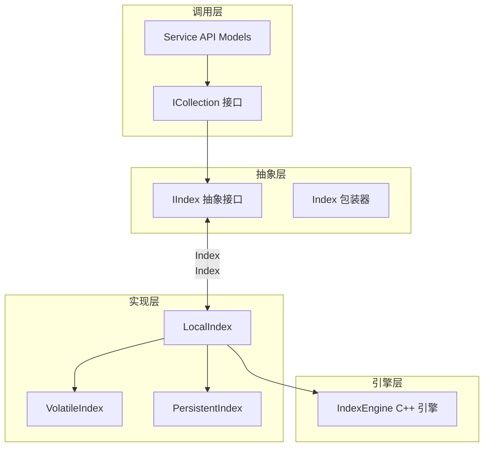

# index_domain_models_and_interfaces 模块技术深度解析

## 模块概述

`index_domain_models_and_interfaces` 模块是 OpenViking 向量数据库存储层的核心抽象层，它定义了对向量索引（Vector Index）进行操作的标准接口。这个模块解决的问题是：**如何为多种不同的索引实现（内存索引、持久化索引、远程索引）提供统一的操作契约，同时保持每个实现能够发挥其特定优势**。

在实际的向量检索系统中，不同的业务场景需要不同的索引特性：有些场景需要极致的搜索性能可以接受数据丢失（如临时分析），有些场景需要数据持久化保证不丢失，还有些场景需要分布式能力处理海量数据。直接让上层业务代码感知这些差异会导致严重的耦合问题。本模块通过定义 `IIndex` 接口和 `Index` 包装器，将索引实现的具体细节隐藏起来，让调用者可以用统一的方式完成向量搜索、数据写入、元数据管理等操作。

## 架构设计

### 核心组件



### 设计模式分析

本模块采用了两个关键的设计模式来实现其目标：

**策略模式（Strategy Pattern）**：通过 `IIndex` 抽象接口，任何实现该接口的类都可以被无缝替换。调用方不需要知道底层是内存索引还是磁盘索引，只需要调用 `search()` 方法即可。这类似于 JDBC 数据库驱动的设计——上层代码使用统一的 JDBC API，底层可以切换到 MySQL、PostgreSQL 或 Oracle 而无需修改业务逻辑。

**装饰器模式（Decorator Pattern）**：`Index` 包装类在 `IIndex` 基础上增加了额外的保护逻辑，例如空值检查、默认值处理等。这类似于 Java 中的 Collections 工具类对 List 接口的包装——提供额外的便利方法而不改变核心接口契约。

## 核心组件详解

### IIndex 抽象基类

`IIndex` 是整个模块的核心抽象，它定义了向量索引必须提供的七项核心能力：

**数据写入能力（upsert_data）**：批量插入或更新数据记录。对于已存在的记录（通过 label 主键标识），会执行更新操作；对于新记录，则执行插入操作。这个设计允许索引支持增量更新场景，而不必每次都重建整个索引。实现时需要保证单条记录级别的原子性，以维护索引一致性。

**数据删除能力（delete_data）**：根据 label 标识符删除记录。值得注意的是，删除操作在不同实现中有不同的语义——内存索引可能直接物理删除，持久化索引则可能采用"墓碑"（tombstone）标记策略，等待后续 compaction 时才真正回收空间。

**向量检索能力（search）**：这是索引最重要的功能——执行向量相似性搜索。方法支持三种检索模式的组合：纯稠密向量检索（dense-only）、纯稀疏向量检索（sparse-only，如 BM25）、以及混合检索（hybrid，如 vector + BM25）。返回结果为 (labels, scores) 元组，按相似度降序排列。filters 参数支持 DSL 风格的标量字段过滤，例如 `{"price": {"gt": 100}, "category": {"in": ["electronics", "books"]}}`。

**聚合统计能力（aggregate）**：对索引中的数据进行统计分析。目前主要支持计数操作（count），可以返回总数量或按某个字段分组后的各组数量。这个功能常用于数据概览、统计报表等场景。

**元数据管理能力（get_meta_data / update）**：获取和更新索引配置信息。元数据包含向量维度、距离度量方式、标量索引配置、描述文本、最后更新时间戳、统计信息等。这些信息对于理解索引状态、监控系统健康至关重要。

**生命周期管理能力（close / drop）**：正确释放索引资源。close 方法会刷新待写入数据、关闭文件句柄、释放内存、停止后台线程；drop 方法则是不可逆的完全删除，释放磁盘空间。两者都需要被正确调用以避免资源泄漏。

**版本与健康检查能力（get_newest_version / need_rebuild）**：对于支持版本化的持久化索引，get_newest_version 返回最新快照的版本标识（通常是纳秒级时间戳）。need_rebuild 方法检查索引是否需要重建——当删除记录积累到一定程度时，重建可以回收空间并提升搜索性能。

### Index 包装类

`Index` 类是对 `IIndex` 实现的外观封装，它提供了以下额外价值：

**空值安全**：在所有方法执行前检查底层索引是否已初始化，避免在未正确初始化时产生难以追踪的空指针异常。如果索引未初始化，所有操作都会抛出明确的 `RuntimeError("Index is not initialized")`。

**可变参数默认值处理**：Python 的可变默认参数是一个常见的陷阱。`Index.search()` 方法通过在方法体内创建新的空容器（`if filters is None: filters = {}`），避免了可变默认参数在多次调用间共享状态的问题。这是一个值得效仿的最佳实践。

**资源生命周期管理**：`close()` 和 `drop()` 方法在执行完底层操作后，会将内部持有的 `IIndex` 引用置为 `None`。这不仅释放了资源，还确保了对象被关闭后无法再次被使用，防止潜在的悬空引用问题。

## 数据流动分析

### DeltaRecord 数据结构

理解数据如何在系统中流转的关键是 `DeltaRecord` 数据结构。这个数据类封装了所有索引操作所需的信息：

```python
@dataclass
class DeltaRecord:
    type: int          # 操作类型：UPSERT=0 或 DELETE=1
    label: int         # 主键标识符
    vector: List[float]           # 稠密向量
    sparse_raw_terms: List[str]   # 稀疏向量词项
    sparse_values: List[float]    # 稀疏向量权重
    fields: str        # JSON 编码的标量字段
    old_fields: str    # 更新前的标量字段（用于一致性检查）
```

这个设计体现了几个重要的考量：首先，将向量数据和标量字段分离允许索引分别优化两类数据的存储和检索；其次，使用 JSON 字符串编码标量字段提供了最大的灵活性——不同的记录可以有不同的字段集合；最后，old_fields 字段支持乐观并发控制，在高并发更新场景下保证数据一致性。

### 完整数据流

以一次典型的搜索请求为例，数据流经以下路径：

1. **HTTP 请求入口**：客户端发送 `SearchByVectorRequest`，包含查询向量、返回数量、过滤条件等参数。

2. **服务层路由**：服务层解析请求，定位到目标 Collection 和 Index。

3. **Collection 层转发**：ICollection.get_index() 根据索引名称获取对应的 IIndex 实现。

4. **Index 层执行**：Index 包装类进行空值检查和参数规范化，然后调用底层 IIndex.search()。

5. **实现层转换**：LocalIndex 将应用层的过滤条件通过 DataProcessor 转换为引擎层兼容的 DSL 格式，同时处理向量归一化（如果配置了 NormalizeVector）。

6. **引擎层计算**：C++ IndexEngine 执行实际的向量相似性搜索，返回标签列表和相似度分数。

7. **结果返回**：结果沿调用栈反向返回，最终到达客户端。

对于写入操作（upsert），流程类似，但数据方向相反：C++ 对象被转换为 DeltaRecord，经过 Python 层处理后送达引擎层执行实际的索引写入。

## 设计决策与权衡

### 接口设计的哲学

IIndex 接口采用"大而全"的设计思路，将所有可能的索引操作都定义为抽象方法。这是一种**面向接口的设计**——接口定义了"能做什么"，而不是"怎么做"。这种设计的好处是：
- 调用方代码与实现解耦，可以透明切换底层实现
- 新增索引类型只需实现接口，无需修改调用方
- 接口契约明确，文档化和测试都更方便

但这也是一种权衡：接口可能会变得臃肿，某些场景下使用成本较高。对于简单场景，可能只需要 search 功能，却要了解所有方法。

### 混合搜索的设计

search 方法同时支持稠密向量和稀疏向量，这并非简单的功能堆砌，而是经过深思熟虑的设计：

在现实世界的搜索场景中，纯语义相似（向量检索）或纯关键词匹配（BM25）往往不能同时满足用户需求。例如用户搜索"苹果手机降价"，向量检索可能返回所有与"苹果"语义相关的商品（苹果水果、苹果电脑），而 BM25 可能无法理解"降价"的语义。通过同时传入 query_vector 和 sparse_raw_terms，系统可以计算 `score = α * vector_score + (1-α) * sparse_score`，其中 α 可通过 SearchWithSparseLogitAlpha 参数配置。这种混合检索策略在工业界被广泛采用，本模块在接口层面就提供了原生支持。

### 标量索引的可选性

scalar_index 参数在 update 方法中是可选的（None 表示不修改），这种设计体现了两阶段配置的思路：第一阶段在创建索引时指定初始的标量索引字段集合；第二阶段在运行时根据查询模式的变化动态调整标量索引。并非所有查询都需要标量过滤，对于纯向量检索场景，标量索引的存在只会增加存储开销和写入延迟，因此允许在运行时选择性地启用或禁用。

### 与引擎层的耦合

虽然 IIndex 在 Python 层定义了抽象接口，但其实现类（如 LocalIndex）直接依赖 C++ 引擎层（IndexEngine）。这种设计有其合理性——C++ 实现能提供更好的性能，特别是在向量计算和内存管理方面。但这也意味着：
- Python 接口的灵活性受限于引擎能力
- 引擎层的任何变更都可能影响 Python 层
- 跨语言调试更加困难

## 依赖关系分析

### 上游依赖

本模块依赖以下核心组件：

| 依赖组件 | 作用 | 依赖原因 |
|---------|------|---------|
| DeltaRecord | 数据传输对象 | 定义索引操作的数据格式 |
| IndexEngine (C++) | 底层索引引擎 | 实际的向量计算和存储实现 |
| DataProcessor | 字段类型转换 | 将应用层数据格式转换为引擎兼容格式 |
| VectorIndexConfig | 索引配置验证 | 定义向量索引的参数和约束 |

### 下游调用者

以下模块调用本模块提供的接口：

| 调用模块 | 调用方式 | 典型场景 |
|---------|---------|---------|
| ICollection | 组合 IIndex 实例 | Collection 管理多个 Index |
| Service API | 通过 ICollection 间接调用 | 处理 HTTP 请求 |
| 检索管道 | 直接调用 Index.search() | 执行向量相似性搜索 |

## 使用指南与最佳实践

### 正确的初始化流程

```python
# 正确：创建 Collection，通过 Collection 创建 Index
collection = collection_manager.get_collection("my_collection")
index = collection.create_index("vector_index", index_meta)

# 错误：直接实例化 IIndex（它是抽象类）
# index = IIndex()  # TypeError: Can't instantiate abstract class

# 错误：直接实例化 Index（需要传入 IIndex 实现）
# index = Index(None)  # RuntimeError: Index is not initialized
```

### 资源管理

始终确保在不需要索引时调用 close 方法：

```python
index = collection.get_index("my_index")
try:
    labels, scores = index.search(query_vector, limit=10)
finally:
    index.close()  # 确保释放资源
```

或者使用上下文管理器（如果后续添加支持）：

```python
with collection.get_index("my_index") as index:
    labels, scores = index.search(query_vector)
# 自动 close
```

### 过滤条件的正确写法

```python
# 推荐：使用明确的操作符
filters = {
    "price": {"gt": 100, "lte": 1000},  # 100 < price <= 1000
    "category": {"in": ["electronics", "books"]},
    "status": {"eq": "active"}
}

# 避免：使用 Python 比较运算符（不会生效）
# filters = {"price": price > 100}  # 错误
```

### 混合检索参数配对

当使用稀疏向量时，必须确保 raw_terms 和 values 成对出现：

```python
# 正确：成对提供
labels, scores = index.search(
    query_vector=query_embedding,
    sparse_raw_terms=["apple", "phone", "discount"],
    sparse_values=[1.0, 0.8, 0.5],
    limit=10
)

# 错误：只提供一个
# labels, scores = index.search(
#     sparse_raw_terms=["apple", "phone"],
#     limit=10
# )  # 可能导致索引失败
```

## 边界情况与陷阱

### 向量维度不匹配

search 方法要求查询向量维度与索引向量维度完全一致。如果不匹配，大多数实现会抛出异常或返回空结果。调试时应检查：

- 索引创建时的 VectorIndex.Dim 配置
- 实际存入数据的向量维度
- 查询时传入的向量维度

### 稀疏向量为空时的行为

当 sparse_raw_terms 为空列表 [] 时，大多数实现会忽略稀疏向量部分。如果希望执行纯稀疏检索，应该完全不传入 query_vector 参数，只传入 sparse_raw_terms。

### 归一化配置的一致性

如果索引配置了 NormalizeVector=True，那么：
- 写入数据时，向量会被自动归一化
- 查询时，查询向量也会被自动归一化

关键问题是：归一化必须同时开启或同时关闭。如果写入时归一化但查询时不归一化，会导致检索结果不正确。本模块通过 IndexEngineProxy 统一处理这个逻辑，但上层调用者需要确保理解这个隐式行为。

### 删除操作的延迟生效

对于持久化索引，delete_data 可能不会立即从物理存储中删除数据，而是标记为"已删除"。这意味着：
- 删除后的 label 可能仍然占用索引空间
- 某些实现可能在删除后短时间内仍能检索到该记录（通过墓碑过滤）
- need_rebuild() 可能返回 True，建议定期重建以回收空间

### 聚合操作的当前限制

aggregate 方法目前只支持计数操作（op="count"）。尝试使用其他聚合操作（如 sum、avg、max）会返回空结果或失败。在使用前应检查返回结果是否包含预期的键。

## 相关文档

如需了解更多上下文，请参阅以下模块文档：

- [collection_contracts_and_results](./vectordb-domain-models-and-service_schemas-collection-contracts-and-results.md) - ICollection 接口和 SearchResult：了解索引如何在 Collection 层面被管理
- [domain_models_and_contracts](./vectordb-domain-models-and-service_schemas-domain_models_and_contracts.md) - 存储层领域模型概览
- [service_api_models_index_management](./vectordb-domain-models-and-service_schemas-service_api_models_index_management.md) - 索引管理的 API 模型定义
- [local_index 实现](./vectordb-domain-models-and-service_schemas-domain_models_and_contracts-local_index.md) - LocalIndex、VolatileIndex、PersistentIndex 的具体实现细节
- [schema_validation_and_constants](./vectordb-domain-models-and-service_schemas-schema_validation_and_constants.md) - VectorIndexConfig、IndexMetaConfig 等配置模型