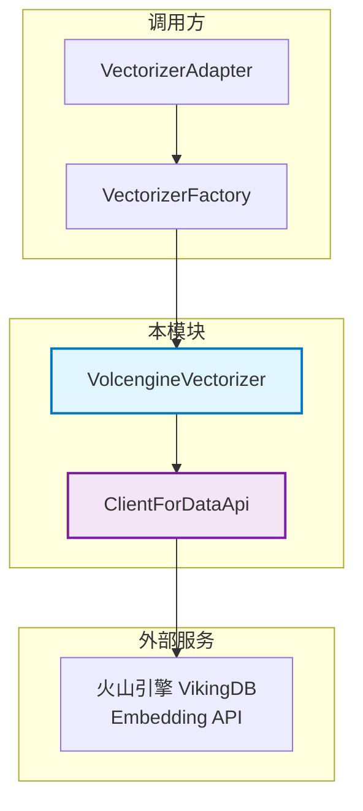

# 火山引擎向量化提供者 (Volcengine Vectorization Provider)

## 概述

在现代向量检索系统中，将文本转换为高维向量 embedding 是整个流程的起点。`volcengine_vectorization_provider` 模块承担着这一关键职责——它作为 OpenViking 存储层与火山引擎 embedding API 之间的桥梁，负责把原始文本转换成可用于向量数据库检索的 dense（密集）和 sparse（稀疏）向量。

**为什么需要这个模块？** 想象一下你的应用收到了用户的一个搜索请求："查找关于 Python 异步编程的技术文章"。在执行向量相似度搜索之前，系统必须先将这段文本转换成机器能理解的数学表示——即一个浮点数数组。这个模块就是完成这个转换的具体实现。它之所以存在，是因为：

1. **异构 API 需要适配层**：火山引擎的 embedding API 使用 AK/SK 签名认证（SignerV4），与常见的 API Key 认证方式不同，需要专门的客户端来构建请求。
2. **混合向量支持**：现代检索系统常常同时使用 dense（语义匹配）和 sparse（关键词匹配）向量，该模块原生支持双模输出。
3. **容错与重试**：网络请求不可避免会遇到瞬时故障，该模块内置指数退避重试机制，保证生产环境的稳定性。

## 架构角色与数据流

从架构角度看，这个模块位于**向量存储基础设施**与**外部 embedding 服务**的交界处。它的位置可以类比为一座桥梁的桥墩—— 一端连接着 OpenViking 的向量数据库集合（collection），另一端连接着火山引擎的 VikingDB embedding 服务。



**核心数据流**：

1. **初始化阶段**：`VectorizerFactory` 根据配置创建 `VolcengineVectorizer` 实例，同时初始化 `ClientForDataApi` 用于处理 AK/SK 签名认证。
2. **向量化请求**：调用方通过 `VectorizerAdapter.vectorize_raw_data()` 发起请求，适配器提取文本字段后调用 `VolcengineVectorizer.vectorize_document()`。
3. **请求构建与发送**：向量器构建符合火山引擎 API 规范的请求体，通过签名客户端发送到远程服务。
4. **响应解析**：服务端返回 JSON 响应后，向量器解析出 dense 向量、sparse 向量和 token 使用信息，封装成 `VectorizeResult` 返回。

## 核心组件详解

### VolcengineVectorizer

这是模块的核心类，继承自 `BaseVectorizer`。它封装了与火山引擎 embedding 服务交互的全部逻辑。

**设计意图**：这个类采用"单一职责"原则——它只关心如何把文本转换成向量，不关心调用方如何组装数据。这种设计使得它既可以直接使用，也可以通过 `VectorizerAdapter` 进行二次封装后使用。

```python
class VolcengineVectorizer(BaseVectorizer):
    def __init__(self, config: Dict[str, Any]):
        # 配置合并：用户配置优先，其次环境变量
        self.full_config = config
        self.ak = self.full_config.get("AK", os.environ.get("VOLC_AK"))
        self.sk = self.full_config.get("SK", os.environ.get("VOLC_SK"))
        self.host = self.full_config.get("Host", os.environ.get("VOLC_HOST"))
        self.region = self.full_config.get("Region", os.environ.get("VOLC_REGION"))
        
        if not self.ak or not self.sk or not self.host or not self.region:
            raise ValueError("AK, SK, Host, Region must set")
```

**配置优先级设计**：代码优先使用传入的 config 参数，只有当参数不存在时才回退到环境变量。这种设计允许在同一进程中使用不同的配置（通过参数覆盖），同时保留通过环境变量配置默认值的便利性。

**关键方法**：

- `vectorize_query(texts)`: 专门用于搜索查询的向量化，内部调用 `vectorize_document` 但使用默认模型配置。
- `vectorize_document(data, dense_model, sparse_model)`: 核心方法，支持指定模型配置。
- `get_dense_vector_dim()`: 获取向量维度，如果配置中未指定，则发送一次测试请求来探测。

### ClientForDataApi

这是一个辅助类，负责构建符合火山引擎 API 规范的 HTTP 请求。

**设计决策——为什么不用 SDK？** 火山引擎提供了 `volcenginesdkarkruntime` SDK（见 `openviking/models/embedder/volcengine_embedders.py` 中的实现），但该模块选择了直接构造请求。这并非重复造轮子，而是因为：

1. **API 端点不同**：VikingDB 的 embedding API (`/api/vikingdb/embedding`) 与 Ark 平台的 embedding API 使用不同的端点和认证方式。
2. **签名方式差异**：VikingDB 使用 SignerV4 进行请求签名，而 Ark SDK 封装的是另一种认证流程。
3. **轻量级需求**：直接使用 `requests` 库比引入完整 SDK 更轻便，减少了依赖复杂性。

```python
def prepare_request(self, method, path, params=None, data=None):
    r = Request()
    r.set_shema("https")
    r.set_method(method)
    # ... 设置超时、头部、路径等
    
    credentials = Credentials(self.ak, self.sk, "vikingdb", self.region)
    SignerV4.sign(r, credentials)  # AK/SK 签名
    return r
```

**请求超时设置**：连接超时和 socket 超时都设置为 10 秒，这是一个平衡点——足够应对大多数网络延迟，又不会让用户在服务不可用时等待太久。

### VectorizeResult

这是向量化操作的结果容器，包含：

- `dense_vectors`: 密集向量列表（`List[List[float]]`）
- `sparse_vectors`: 稀疏向量列表（`List[Dict[str, float]]`，键为词项索引，值为权重）
- `request_id`: 请求追踪 ID，用于调试和问题排查
- `token_usage`: Token 使用统计，用于成本监控

**为什么同时返回 dense 和 sparse？** 这源于混合检索（hybrid search）的需求：
- **Dense 向量**擅长语义匹配——"银行"和"金融机构"虽然字面不同，但向量距离很近。
- **Sparse 向量**擅长精确匹配——搜索"Python 教程"时，文档中出现"Python"和"教程"会获得更高权重。

火山引擎的 API 支持在单次请求中同时返回两种向量，避免了两次网络调用的开销。

## 设计决策与权衡

### 1. 重试策略：指数退避

```python
while retry_count <= self.retry_times:
    try:
        # ... 发送请求
        return self._parse_response(resp_dict, dense_model, sparse_model)
    except (...):
        retry_count += 1
        if retry_count > self.retry_times:
            raise RuntimeError(...)
        # 指数退避：1s, 2s, 4s, 8s...
        delay = self.retry_delay * (2 ** (retry_count - 1))
        time.sleep(delay)
```

**为什么选择指数退避？** 瞬时网络故障通常是间歇性的，一次失败后立即重试往往还会失败。指数退避让每次重试之间的时间间隔翻倍，给服务端恢复的时间。同时设置最大重试次数（默认 3 次），避免无限重试。

### 2. 认证方式：AK/SK 而非 API Key

火山引擎支持两种认证方式：
- **API Key**：简单但功能有限，适合轻量级客户端
- **AK/SK（Access Key / Secret Key）**：需要签名验证，但支持更精细的权限控制

该模块选择 AK/SK 的原因可能是企业级使用场景需要更严格的权限管理。不过这增加了配置复杂度——用户必须获取并妥善保管 AK/SK 对。

### 3. 维度探测：惰性计算

```python
def get_dense_vector_dim(self, dense_model, sparse_model=None):
    if self.dim > 0:
        return self.dim  # 配置指定则直接使用
    # 否则发送测试请求探测
    test_data = [{"text": "volcengine vectorizer health check"}]
    result = self.vectorize_document(test_data, dense_model, sparse_model)
    return len(result.dense_vectors[0]) if result.dense_vectors else 0
```

**设计权衡**：在生产环境中，我们通常知道目标向量维度（因为集合的 schema 是预先定义的）。但某些场景下可能需要动态探测。这里的设计是：配置优先，探测兜底。探测发生在首次调用时，属于惰性计算——如果配置中已指定维度，就完全跳过这一步。

## 依赖关系分析

### 上游调用方

| 调用方 | 期望的契约 |
|--------|------------|
| `VectorizerAdapter` | 调用 `vectorize_document()` 获取 `VectorizeResult` |
| `VectorizerFactory` | 通过 `create(config, ModelType.VOLCENGINE)` 工厂方法创建实例 |

### 下游依赖

| 依赖项 | 作用 |
|--------|------|
| `volcengine.base.Request` | 构建 HTTP 请求对象 |
| `volcengine.auth.SignerV4` | AK/SK 签名验证 |
| `volcengine.Credentials` | 凭证管理 |
| `requests` | 实际发送 HTTP 请求 |
| `BaseVectorizer` (基类) | 定义抽象接口，确保多provider可替换 |

### 数据契约

输入到 `vectorize_document()` 的 `data` 参数必须是字典列表：
```python
data = [{"text": "要向量化的文本"}, {"text": "另一段文本"}]
```

返回的 `VectorizeResult` 包含：
```python
VectorizeResult(
    dense_vectors=[[0.1, 0.2, ...], ...],  # List[List[float]]
    sparse_vectors=[{"10": 0.5, "25": 0.3}, ...],  # List[Dict[str, float]]
    request_id="req_xxx",
    token_usage={"total_tokens": 100, ...}
)
```

## 使用指南

### 基础用法

```python
from openviking.storage.vectordb.vectorize.vectorizer_factory import VectorizerFactory, ModelType
from openviking.storage.vectordb.vectorize.vectorizer import VectorizerAdapter, VectorizeMeta

# 1. 创建向量器实例
config = {
    "AK": "your_access_key",
    "SK": "your_secret_key", 
    "Host": "vikingdb.volces.com",
    "Region": "cn-beijing",
    "DenseModelName": "doubao-embedding",
    "DenseModelVersion": "v1.0",
    "SparseModelName": "bm25",
    "SparseModelVersion": "v1.0",
}
vectorizer = VectorizerFactory.create(config, ModelType.VOLCENGINE)

# 2. 适配器封装（处理字段映射）
vectorize_meta = {
    "Dense": {"ModelName": "doubao-embedding", "Version": "v1.0", "TextField": "content"},
    "Sparse": {"ModelName": "bm25", "Version": "v1.0"}
}
adapter = VectorizerAdapter(vectorizer, vectorize_meta)

# 3. 执行向量化
raw_data = [
    {"content": "Python 异步编程指南", "id": "1"},
    {"content": "Java 集合框架详解", "id": "2"}
]
dense, sparse = adapter.vectorize_raw_data(raw_data)
```

### 环境变量配置

如果你不想在代码中硬编码凭证：

```bash
export VOLC_AK="your_access_key"
export VOLC_SK="your_secret_key"
export VOLC_HOST="vikingdb.volcs.com"
export VOLC_REGION="cn-beijing"
```

```python
# 只需要提供模型配置
config = {
    "DenseModelName": "doubao-embedding",
    "DenseModelVersion": "v1.0",
}
vectorizer = VolcengineVectorizer(config)
```

## 注意事项与陷阱

### 1. 凭证泄漏风险

AK/SK 是敏感凭证，**不要**将其提交到代码仓库。最佳实践是：
- 使用环境变量（代码中已原生支持）
- 使用密钥管理服务（KMS）
- 运行时从配置中心获取

### 2. 向量维度不匹配

如果 `VolcengineVectorizer` 生成的向量维度与向量数据库集合的维度定义不一致，插入数据时会报错。建议：
- 在配置中明确指定 `Dim` 参数
- 或在创建集合前先调用 `get_dense_vector_dim()` 探测

### 3. 空列表处理

`vectorize_document()` 对空列表有明确校验：
```python
if not data:
    raise ValueError("data list cannot be empty")
```
调用方需要注意不要传入空列表，否则会收到 `ValueError`。

### 4. 与 Model 模块 embedder 的区别

OpenViking 中存在两套火山引擎 embedding 实现：
- **本模块** (`volcengine_vectorization_provider`)：使用 VikingDB API + AK/SK 认证
- **models.embedder.volcengine_embedders**：使用 Ark API + API Key 认证

两者面向不同场景：
- 向量存储层（collection 写入）使用本模块
- 通用 LLM 应用（对话、生成）使用 embedder 模块

### 5. 网络超时

请求默认超时时间为 10 秒（连接 + socket），对于大批量向量化任务可能需要调整。如果遇到超时，可以：
- 减少单批次数据量
- 在配置中调整超时参数（如果 API 支持）
- 考虑异步批量处理

## 相关文档

- [向量化和存储适配器](./vectorization-and-storage-adapters.md) - 整体架构概览
- [VectorizerFactory](./vectorizer-factory.md) - 工厂模式与模型类型管理
- [Collection 适配器](./collection-adapters.md) - 与向量数据库的集成
- [Embedder 基类合约](./embedder-base-contracts.md) - 模型层 embedding 接口