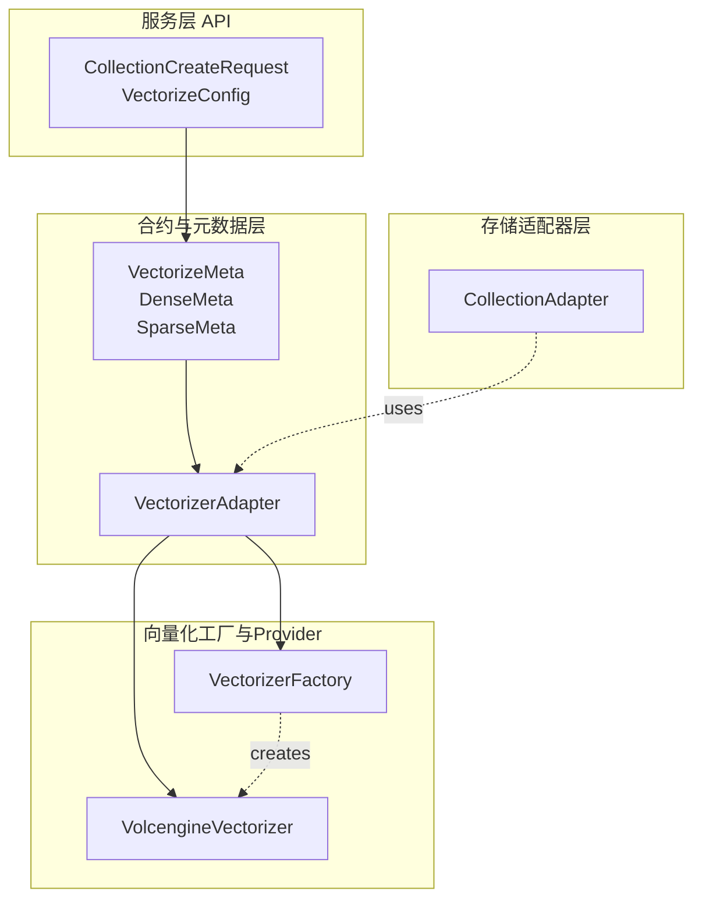

# vectorization_contracts_and_metadata

## 模块概述

`vectorization_contracts_and_metadata` 是向量化系统的"契约层"——它定义了**存储层**与**向量化 provider**之间的接口协议。想象一下一家跨国物流公司：这个模块就像是把货物（原始数据）装进标准集装箱（向量）的规范手册，规定了箱子有多大、装什么类型的货物、以及如何标记。

在 VikingDB 的架构中，当用户创建一个 collection 并配置向量化参数后，系统需要知道：
1. 用什么模型把文本/图片/视频转换成向量？
2. 原始数据的哪个字段对应"文本"，哪个对应"图片"？
3. 向量的维度必须是多大？

这些问题都由本模块回答。它不执行实际的向量化——那是 [vectorizer_factory_and_model_typing](vectorization-contracts-and-metadata-vectorizer-factory-and-model-typing.md) 和 [volcengine_vectorization_provider](vectorization-contracts-and-metadata-volcengine-vectorization-provider.md) 的职责。本模块定义的是**"怎么说"**，而非"怎么做"。

---

## 架构概览



### 数据流动路径

1. **Collection 创建时**：用户通过 API 提交 `CollectionCreateRequest`，其中包含 `VectorizeConfig`（Pydantic 模型，定义在 `service.app_models`）
2. **配置转换**：`VectorizeConfig` 被转换为 `VectorizeMeta`（TypedDict，简单无依赖）——这个转换可能是隐式的，由调用方完成
3. **适配器初始化**：创建 `VectorizerAdapter`，它接收底层 `BaseVectorizer` 实例和 `VectorizeMeta`
4. **数据向量化时**：当 `CollectionAdapter.upsert()` 被调用时，数据通过 `VectorizerAdapter.vectorize_raw_data()` 转换为向量
5. **查询向量化**：搜索时，查询文本通过 `VectorizerAdapter` 的底层向量化方法转换

---

## 核心抽象

### 1. BaseVectorizer — 向量化的抽象基类

```python
class BaseVectorizer(ABC):
    @abstractmethod
    def vectorize_query(self, texts: List[str]) -> VectorizeResult:
        """向量化搜索查询"""
        
    @abstractmethod
    def vectorize_document(
        self, 
        data: List[Any], 
        dense_model: Dict[str, Any], 
        sparse_model: Optional[Dict[str, Any]] = None
    ) -> VectorizeResult:
        """向量化文档/数据"""
```

**设计意图**：把"向量化"这个操作抽象成两个场景：
- **Query 向量化**：用户搜索时，把关键词转成向量
- **Document 向量化**：入库时，把文档转成向量

这两者的区别在于：查询通常很短（一句话），而文档可能很长。不同 provider 可能会对两者做不同的优化。

**为什么是抽象类而非接口协议？**
- Python 没有显式的 interface 关键字，`ABC` 提供了 `isinstance` 检查的能力
- 子类需要继承并实现具体逻辑，所以用抽象类更自然

### 2. VectorizeResult — 向量化结果容器

```python
class VectorizeResult:
    def __init__(
        self,
        dense_vectors: Optional[List[List[float]]] = None,    # 稠密向量
        sparse_vectors: Optional[List[Dict[str, float]]] = None,  # 稀疏向量
        request_id: str = "",
        token_usage: Optional[Dict[str, Any]] = None,
    ):
```

**为什么需要同时支持稠密和稀疏向量？**
- **稠密向量 (Dense)**：经典 embedding，维度固定（如 1024 维），每个维度都是浮点数。语义丰富，但存储成本高。
- **稀疏向量 (Sparse)**：通常是 BM25 之类的词权重表示，维度不固定，用 `{"term": weight}` 字典表示。适合精确匹配，与稠密向量混合使用能兼顾精确性和语义相关性。

**Tradeoff**：同时维护两种向量增加了复杂度，但混合搜索（Hybrid Search）在精度和召回之间取得了更好的平衡。

### 3. VectorizeMeta / DenseMeta / SparseMeta — 配置元数据

这三个 TypedDict 定义了向量化所需的配置：

```python
class DenseMeta(TypedDict, total=False):
    ModelName: str      # 模型名称，如 "text-embedding-3-large"
    Version: str        # 模型版本
    Dim: int           # 向量维度
    TextField: str     # 对应 collection 中的哪个字段是文本
    ImageField: str    # 对应 collection 中的哪个字段是图片
    VideoField: str    # 对应 collection 中的哪个字段是视频
```

**total=False 的含义**：所有字段都是可选的。这是一种务实的设计——不是所有 collection 都会同时使用文本、图片、视频向量化。

**字段映射的设计**：注意 `TextField`、`ImageField`、`VideoField` 是**字符串**（字段名），而非实际的数据。这允许：
- 同一个向量化配置可以适配不同的 collection（只要字段名对应即可）
- 向量化逻辑与具体的数据结构解耦

### 4. VectorizerAdapter — 适配器模式的应用

这是本模块的核心"胶水"代码：

```python
class VectorizerAdapter:
    def __init__(self, vectorizer: Any, vectorize_meta: VectorizeMeta):
        # 从 metadata 中提取字段映射
        self.text_field = dense_meta.get("TextField", "")
        # ...
        
    def vectorize_raw_data(self, raw_data_list: List[Dict[str, Any]]):
        # 把 {"content": "hello", "title": "world"} 
        # 转换为 {"text": "hello"} 
        # —— 即从原始记录中取出配置指定的字段
```

**为什么需要这层适配？**
- 存储层（CollectionAdapter）不知道向量化细节，它只看到"字段名 → 字段值"的字典
- 向量化层（BaseVectorizer 实现）期望的是 `{"text": "...", "image": ...}` 这样的结构
- VectorizerAdapter 就是中间的"翻译"：告诉向量化器"去 raw_data 里找 `TextField` 指定的字段"。

---

## 设计决策与 Tradeoff 分析

### 1. TypedDict vs Pydantic Models

本模块使用 `TypedDict` 而非 `pydantic.BaseModel` 定义配置。

**选择 TypedDict 的理由**：
- **轻量级**：不需要引入 pydantic 的验证开销，配置在传入前已在 service 层验证过
- **类型提示友好**：IDE 能识别结构，更利于维护
- **序列化为 dict**：配置最终要传给向量化 provider，直接用 dict 更方便

**对应的 Pydantic 定义在 `vectordb.utils.validation`**：如 `DenseVectorize`、`SparseVectorize`。这些是 API 层的验证模型，经过验证的配置才会被转换为 TypedDict 传入向量化层。

### 2. 为什么区分 vectorize_query 和 vectorize_document？

表面上这两个方法做的事类似（都是把文本转成向量），但实际场景中：
- **Query 通常很短**：可能只有几个词
- **Document 可能很长**：可能是整篇文章

某些 provider 会针对这两种场景使用不同的模型或预处理逻辑（如 Query 用小的 embedding 模型，Document 用大的）。抽象成两个方法为这种优化留出空间。

### 3. VectorizerAdapter 的存在是必要的吗？

可以argue：直接把字段映射逻辑放到 CollectionAdapter 里不也行吗？

**选择独立适配器的理由**：
1. **单一职责**：CollectionAdapter 负责 CRUD + 索引管理，不应关心向量化细节
2. **可测试性**：可以单独测试向量化逻辑，而不需要启动整个 collection
3. **灵活性**：未来可能需要多个向量化策略（如不同的 adapter 实现），解耦便于扩展

---

## 与其他模块的依赖关系

### 上游依赖（谁调用本模块）

| 模块 | 关系说明 |
|------|----------|
| **collection_adapters** | `CollectionAdapter` 在 upsert/query 时调用 `VectorizerAdapter` 进行向量化 |
| **vectorizer_factory** | 工厂创建 `BaseVectorizer` 实例，包装成 `VectorizerAdapter` |
| **service app_models** | API 层定义 `VectorizeConfig`，转换为 `VectorizeMeta` 传入 |

### 下游依赖（本模块调用谁）

| 模块 | 关系说明 |
|------|----------|
| **向量化 Provider 实现** | `VolcengineVectorizer`、`JinaEmbedder` 等实现 `BaseVectorizer` |

### 关键数据契约

```
CollectionCreateRequest.VectorizeConfig (Pydantic, service层)
         ↓ 验证后转换为
VectorizeMeta (TypedDict, 本模块)
         ↓ 传入
VectorizerAdapter (本模块)
         ↓ 调用
BaseVectorizer.vectorize_document() (具体 provider)
```

---

## 子模块说明

| 子模块 | 职责 | 文档 |
|--------|------|------|
| **vectorizer_factory_and_model_typing** | 向量化的工厂模式实现，ModelType 枚举定义 | [查看](vectorization-contracts-and-metadata-vectorizer-factory-and-model-typing.md) |
| **volcengine_vectorization_provider** | 火山引擎向量化服务的具体实现 | [查看](vectorization-contracts-and-metadata-volcengine-vectorization-provider.md) |

---

## 开发者注意事项

### 1. 字段映射必须与 Collection Schema 匹配

```python
# 创建 collection 时指定
VectorizeConfig(
    Dense=DenseVectorize(ModelName="text-embedding-3", TextField="content")
)

# upsert 的数据必须包含 "content" 字段
adapter.upsert({"content": "hello world", "id": "1"})
```

如果 `TextField` 指定了 "content"，但 upsert 的数据里没有这个字段，`VectorizerAdapter.vectorize_raw_data()` 会静默跳过（返回空列表），导致向量全为 0。

### 2. 维度不匹配会导致写入失败

`VectorizeMeta` 中的 `Dim` 必须在创建 index 时与实际向量维度一致。如果底层向量化模型返回的向量维度与配置不符，存储层会拒绝写入。

### 3. 稀疏向量是可选的

代码中 `sparse_model` 默认是 `None`：

```python
def vectorize_document(self, data, dense_model, sparse_model=None):
```

如果 collection 配置了混合索引（hybrid index），则必须同时提供 `sparse_model`，否则 `EnableSparse=True` 的索引会无法正常工作。

### 4. 向量化是同步的还是异步的？

当前实现是**同步**的。在大规模数据导入场景下，这可能成为瓶颈。如果需要异步处理，需要在调用方（CollectionAdapter 或上层）实现队列和批处理。

### 5. 资源清理

`BaseVectorizer` 实现了 `close()` 方法，但调用方需要显式调用。在长时间运行的服务中，如果没有正确关闭，可能导致连接泄漏。

---

## 常见问题排查

**Q: 向量化后的向量全是 0 向量**
- 检查 `TextField` / `ImageField` / `VideoField` 是否与实际数据的字段名匹配
- 检查 model name 是否正确，provider 是否支持该模型

**Q: 搜索结果不准确**
- 确认 query 向量化和 document 向量化使用的是**同一个模型**
- 检查距离度量（Distance）是否匹配：L2 / IP / Cosine

**Q: 混合搜索效果不如预期**
- 调整 `sparse_weight` 参数，控制稀疏向量在混合检索中的权重
- 检查 `EnableSparse` 是否在 index 和实际数据中都启用