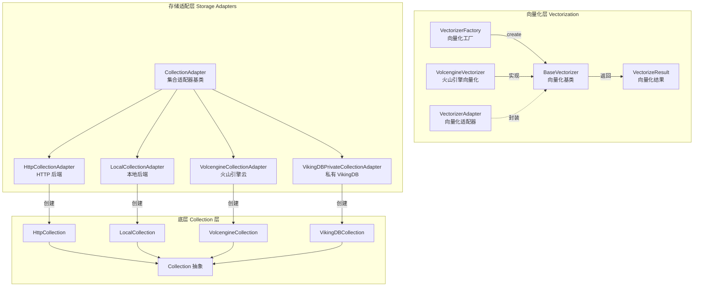

# vectorization_and_storage_adapters 模块详解

## 概述

`vectorization_and_storage_adapters` 是 OpenViking 系统中负责**向量化（Vectorization）**和**向量数据库存储适配**的核心模块。它的设计目标是在语义检索场景中，将原始文本数据转换为高维向量表示（ embeddings），并提供统一的接口来管理不同向量数据库后端的集合（Collection）操作。

### 解决的问题

在传统的关键词检索中，查询与文档的匹配依赖于字面重叠，这种方式无法捕捉语义相关性。例如，搜索"如何修电脑"无法匹配"电脑维修指南"，尽管它们语义相近。向量检索通过将文本映射到高维语义空间来解决这个问题——语义相似的文本在向量空间中距离更近。

然而，向量检索系统面临两个核心挑战：

1. **向量化服务的多样性**：不同的 embedding 模型提供商（OpenAI、Volcengine、Jina 等）有不同的 API 协议、认证方式、参数命名规范。如果每个调用方都直接对接特定提供商的 SDK，就会导致业务逻辑与提供商细节耦合，难以切换模型或扩展新提供商。

2. **向量数据库后端的异构性**：生产环境中可能使用不同的向量数据库——本地开发的轻量级向量库、私有部署的 VikingDB、云托管的 Volcengine VikingDB 等。每个后端有不同的连接方式、索引类型、查询语法。业务代码不应该关心这些底层差异。

本模块通过**适配器模式（Adapter Pattern）**和**工厂模式（Factory Pattern）**分别解决这两个问题，为上层应用提供统一的、面向语义的操作抽象。

## 架构概览



### 核心设计思路

#### 1. 向量化层的"可插拔"架构

想象一下：你的应用是一台电脑，向量化服务是显卡。显卡可以随意更换（NVIDIA、AMD、Intel），但电脑主板的接口（PCIe）是统一的。`VectorizerFactory` 就是这个 PCIe 插槽——它定义了统一的创建接口，而具体的显卡（`VolcengineVectorizer` 等）只是插在上面的配件。

`VectorizerAdapter` 则相当于显卡的散热器——它不改变显卡的工作原理，但确保显卡能在特定的机箱环境（Collection 配置）中正常工作，管理字段映射（比如将用户数据中的 `content` 字段映射到向量化所需的 `text` 字段）。

#### 2. 存储适配层的"统一抽象"

如果你用过 Java 的 JDBC 或 Python 的 DB-API，就会理解这个模式：无论底层是 MySQL、PostgreSQL 还是 SQLite，上层代码都使用相同的 SQL 语句。`CollectionAdapter` 就是向量数据库领域的"SQL 接口"——`query()`、`upsert()`、`delete()` 等方法对所有后端都是一致的。

每个子类（`HttpCollectionAdapter`、`VolcengineCollectionAdapter` 等）负责把统一的操作"翻译"成特定后端的 API 调用。这类似于国际会议的同声传译——发言人的内容（统一接口）是固定的，但翻译（适配器）会根据听众（后端）选择不同的语言。

## 关键设计决策与权衡

### 1. 为什么选择适配器模式而非统一的客户端库？

**备选方案**：创建一个统一的 `VectorDBClient` 类，内部用 `if-elif` 判断后端类型。

**实际选择**：每个后端独立实现 `CollectionAdapter` 子类。

**权衡分析**：
- 适配器模式的代码量更多（每个后端一个类），但符合"开放-封闭原则"——新增后端时无需修改现有代码
- 统一的客户端库在简单场景下更简洁，但后端特性差异大时（本地库没有"远程连接"的概念，私有部署需要特殊认证），if-elif 会膨胀成难以维护的意大利面条
- 本模块的设计选择了**可扩展性**优于**初始简洁性**

### 2. 为什么在 CollectionAdapter 中同时支持"向量搜索"和"标量搜索"？

代码中的 `query()` 方法根据参数不同，会调用三种不同的底层搜索：
- `search_by_vector()`：向量相似度搜索
- `search_by_scalar()`：按字段排序（类似 SQL 的 `ORDER BY`）
- `search_by_random()`：随机采样

**设计意图**：在语义检索系统中，纯向量搜索并非万能。有时候用户明确知道筛选条件（如"只搜索 Python 相关的文档"），这时候标量过滤更高效；而在冷启动场景或探索性分析中，随机采样很有价值。将三种搜索统一在同一个 API 下，避免了调用方在多个方法间抉择。

### 3. 过滤表达式（FilterExpr）的编译时 vs 运行时

`CollectionAdapter` 接收 `FilterExpr` 类型的过滤条件，但在 `query()` 等方法中将其"编译"为后端特定的字典格式（通过 `_compile_filter()`）。这是一个**运行时编译**的设计。

**为什么不是编译时？** `FilterExpr` 是 Python 对象，无法直接传给后端 API，必须转换为各后端能理解的 JSON 结构。如果在构造 `FilterExpr` 时就确定目标后端，会破坏领域模型的通用性。

**代价**：每次查询都要遍历表达式树进行转换，在高频查询场景下有一定性能开销。**权衡点**：牺牲少量性能，换取业务层代码的清晰性和领域模型的可测试性。

### 4. 向量化的重试策略

`VolcengineVectorizer` 使用**指数退避（Exponential Backoff）**进行请求重试：

```python
delay = self.retry_delay * (2 ** (retry_count - 1))
time.sleep(delay)
```

**决策依据**：向量 embedding 调用是网络密集型操作，瞬时失败（网络抖动、服务限流）很常见。指数退避既避免了立即重试导致的"惊群效应"，又通过逐渐增大间隔给服务恢复时间。这是一种在**可靠性**和**服务负载**之间的务实平衡。

## 子模块说明

### 1. 向量化子模块

包含向量转换的核心组件，负责将文本、图片、视频等内容转换为高维向量表示：

- **[vectorization_contracts_and_metadata](vectorization_and_storage_adapters-vectorization_contracts_and_metadata.md)**：向量化元数据定义（DenseMeta、SparseMeta、VectorizerAdapter）
- **[vectorizer_factory_and_model_typing](vectorization_and_storage_adapters-vectorization_contracts_and_metadata-vectorizer_factory_and_model_typing.md)**：向量化工厂与模型类型定义
- **[volcengine_vectorization_provider](vectorization_and_storage_adapters-volcengine_vectorization_provider.md)**：火山引擎向量化服务提供商

### 2. 存储适配器子模块

包含针对不同向量数据库后端的适配实现：

- **[collection_adapter_abstractions](collection_adapters_abstraction_and_backends.md)**：Collection 适配器抽象层与基类实现
- **[local_and_http_collection_backends](local_and_http_collection_backends.md)**：本地和 HTTP 集合后端适配器
- **[volcengine_adapter](vectorization_and_storage_adapters-provider_specific_managed_collection_backends-volcengine_adapter.md)**：火山引擎云 VikingDB 适配器
- **[vikingdb_private_adapter](vikingdb_private_adapter.md)**：私有化部署 VikingDB 适配器

## 依赖关系与数据流

### 上游依赖

本模块为以下模块提供服务：

1. **retrieval_and_evaluation**（检索与评估）：RAG 流程中的向量检索核心依赖本模块的 `CollectionAdapter` 进行相似度搜索
2. **model_providers_embeddings_and_vlm**（模型提供者）：embedding 提供商可能调用本模块进行向量生成
3. **observer_and_queue_processing_primitives**（观察者与队列）：消息队列处理过程中可能触发向量化操作
4. **session_runtime_and_skill_discovery**（会话运行时）：技能发现过程中的语义匹配依赖向量检索

### 下游依赖

本模块依赖以下基础设施：

1. **vectordb.collection**（Collection 层）：各后端的 `Collection` 实现类（`HttpCollection`、`VolcengineCollection` 等）
2. **volcengine 相关 SDK**：火山引擎的签名认证库（`volcengine.auth.SignerV4`）
3. **expr**（过滤表达式）：定义了 `FilterExpr` 类型系统

### 典型数据流

**场景：用户执行一次语义搜索**

```
1. 上层调用 collection_adapter.query(
       query_vector=embeddings, 
       filter=Eq("language", "python"),
       limit=10
   )

2. CollectionAdapter._compile_filter() 将 FilterExpr 编译为后端 DSL：
   {"op": "must", "field": "language", "conds": ["python"]}

3. 根据注入的 Collection 实例（可能是 HttpCollection 或 VolcengineCollection）
   调用对应的 search_by_vector() 方法

4. Collection 层将请求发送到实际的后端服务
   - HttpCollection: HTTP POST 到远程 API
   - VolcengineCollection: 调用火山引擎 DataAPI

5. 后端返回搜索结果，CollectionAdapter._normalize_record_for_read() 
   进行字段规范化（不同后端的字段命名可能不同）

6. 返回统一的 Dict 列表给上层
```

**场景：文档入库时的向量化**

```
1. 上层调用 VectorizerFactory.create(config, ModelType.VOLCENGINE)

2. 获得 VolcengineVectorizer 实例

3. 调用 vectorizer.vectorize_document(data_list, dense_model, sparse_model)

4. VolcengineVectorizer 构建请求体，添加 AK/SK 签名

5. 发送 POST 请求到火山引擎 embedding API

6. 解析响应，返回 VectorizeResult(dense_vectors, sparse_vectors, ...)

7. 上层将向量结果与原始数据一起调用 CollectionAdapter.upsert()
```

## 新贡献者注意事项

### 1. 向量化配置中的字段映射陷阱

`VectorizerAdapter` 负责将用户数据的字段映射到向量化模型所需的字段：

```python
if self.text_field in raw_data:
    data["text"] = raw_data[self.text_field]
```

**常见错误**：配置的 `TextField` 与实际数据键名不匹配，导致向量化失败。确保 Collection 的 `VectorizeMeta` 配置中的字段名与传入数据的键名完全一致。

### 2. Collection 懒加载与生命周期

`CollectionAdapter` 使用**懒加载（Lazy Loading）**模式——`_collection` 属性在第一次访问时才从后端加载。这避免了启动时检查所有后端连接，但可能导致意外的运行时错误。

**最佳实践**：
- 批量操作前使用 `collection_exists()` 检查
- 操作完成后显式调用 `close()` 释放连接
- 在长生命周期对象中使用 try-finally 确保资源释放

### 3. 不同后端的索引类型差异

各后端适配器对索引类型有不同的默认值：

| 后端 | 无稀疏向量 | 有稀疏向量 |
|------|-----------|-----------|
| Local/HTTP | `flat` | `flat_hybrid` |
| Volcengine/VikingDB | `hnsw` | `hnsw_hybrid` |

**注意**：`hnsw` 索引创建后无法更改参数，而 `flat` 索引可以灵活调整。如果需要频繁调整索引参数，应使用本地或 HTTP 后端进行开发调试。

### 4. 过滤表达式中的隐式假设

`CollectionAdapter._compile_filter()` 中对某些操作符有默认行为：

- `Eq`：默认生成 `must`（AND 语义），不是模糊匹配
- `TimeRange`：假设字段类型为时间戳，如果实际是字符串格式会失败

**调试建议**：在复杂查询场景下，先将编译后的 filter DSL 打印出来确认格式正确，再执行查询。

### 5. 向量维度不匹配问题

如果向量化模型返回的向量维度与 Collection 创建时声明的 `Dim` 不一致，upsert 会失败。

**预防措施**：
- 在创建 Collection 前通过 `VolcengineVectorizer.get_dense_vector_dim()` 确认模型输出维度
- 或者在配置中显式指定 `Dim` 参数

### 6. 私有部署的 Collection 预创建约束

`VikingDBPrivateCollectionAdapter` 不支持通过代码创建 Collection：

```python
def _create_backend_collection(self, meta: Dict[str, Any]) -> Collection:
    self._load_existing_collection_if_needed()
    if self._collection is None:
        raise NotImplementedError("private vikingdb collection should be pre-created")
```

**原因**：私有部署环境的 Collection 通常由运维团队通过管理界面预先配置。代码层面只能操作已存在的 Collection。

---

本模块的核心价值在于：**为语义检索系统提供了一个稳定、可扩展的抽象层**，使业务逻辑能够独立于具体的向量服务提供商和数据库后端演进。理解这里的适配器哲学，将帮助你更好地在这个系统中进行功能开发和问题排查。