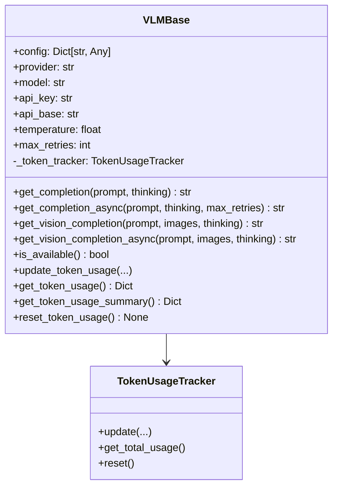
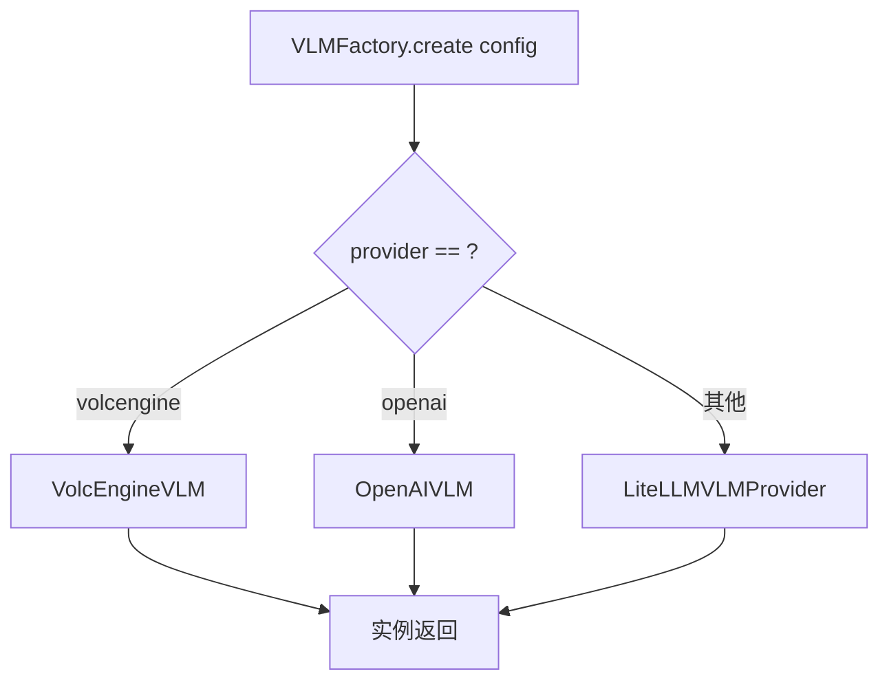
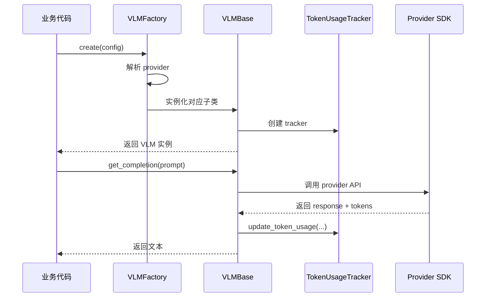

# VLM 抽象基类与工厂方法

> **快速理解**：`vlm_base` 是整个 VLM 抽象层的核心——它定义了所有 VLM 实现必须遵循的接口契约（`VLMBase`），并提供了根据配置动态创建实例的工厂方法（`VLMFactory`）。

## 1. 模块概述

### 1.1 核心职责

| 组件 | 职责 | 相当于 |
|------|------|--------|
| `VLMBase` | 定义 VLM 的抽象接口 | 汽车的"车辆"概念 |
| `VLMFactory` | 根据配置创建 VLM 实例 | 汽车销售顾问 |

### 1.2 设计动机

为什么需要这一层抽象？

**问题**：每个 VLM 提供商的 API 都不同
- OpenAI: `openai.ChatCompletion.create()`
- VolcEngine: 自己的 SDK
- 其他: 通过 LiteLLM 统一调用

**解决方案**：定义统一的接口，让业务代码与具体实现解耦

---

## 2. VLMBase 抽象类

### 2.1 类图与结构



### 2.2 接口方法详解

#### 同步方法 vs 异步方法

```python
# 同步版本 - 适合 CLI 工具
def get_completion(self, prompt: str, thinking: bool = False) -> str:
    """获取文本补全"""
    pass

# 异步版本 - 适合 Web 服务
async def get_completion_async(
    self, prompt: str, thinking: bool = False, max_retries: int = 0
) -> str:
    """异步获取文本补全"""
    pass
```

**设计意图**：
- 同步方法简单直接，用于快速原型和 CLI 工具
- 异步方法支持重试机制（`max_retries` 参数），适合生产环境

#### 文本 vs 视觉

```python
# 纯文本补全
def get_completion(self, prompt: str, thinking: bool = False) -> str:
    pass

# 视觉补全 - 支持多张图片
def get_vision_completion(
    self,
    prompt: str,
    images: List[Union[str, Path, bytes]],
    thinking: bool = False,
) -> str:
    pass
```

**设计意图**：
- 图像支持是 VLM 的核心能力
- `images` 参数支持多种形式：文件路径、URL、原始 bytes

#### thinking 参数

```python
def get_completion(self, prompt: str, thinking: bool = False) -> str:
```

`thinking` 参数用于启用模型的推理能力（如 OpenAI o1 系列）。当设置为 `True` 时，模型会输出思考过程，然后再给出最终答案。

**注意**：不是所有模型都支持此参数，不支持的模型会忽略该参数。

### 2.3 Token 使用追踪

VLMBase 内置了 Token 追踪能力：

```python
# 初始化时创建 tracker
self._token_tracker = TokenUsageTracker()

# 使用方法
vlm.update_token_usage(
    model_name="gpt-4o",
    provider="openai",
    prompt_tokens=100,
    completion_tokens=50
)

# 获取统计
usage = vlm.get_token_usage_summary()
# {
#     "total_prompt_tokens": 100,
#     "total_completion_tokens": 50,
#     "total_tokens": 150,
#     "last_updated": "2026-01-15T10:30:00Z"
# }
```

**实现细节**：
- `TokenUsageTracker` 按 model_name 聚合统计
- 支持重置计数器：`vlm.reset_token_usage()`

---

## 3. VLMFactory 工厂类

### 3.1 创建流程

```python
from openviking.models.vlm.base import VLMFactory

config = {
    "provider": "openai",      # 或 "volcengine"
    "model": "gpt-4o",
    "api_key": "sk-..."
}

vlm = VLMFactory.create(config)  # 返回 VLMBase 子类实例
```

### 3.2 Provider 支持



| Provider | 实现类 | 说明 |
|----------|--------|------|
| `volcengine` | `VolcEngineVLM` | 火山引擎 VLM |
| `openai` | `OpenAIVLM` | OpenAI VLM |
| 其他（默认） | `LiteLLMVLMProvider` | 通过 LiteLLM 调用任意 LLM |

**配置兼容**：
```python
# 以下配置都指向相同 provider
config = {"provider": "openai", ...}
config = {"backend": "openai", ...}  # 别名
config = {}  # 默认 openai
```

### 3.3 获取可用 Providers

```python
providers = VLMFactory.get_available_providers()
# 返回所有已注册的 provider 名称列表
```

---

## 4. 数据流分析

### 4.1 完整调用链路



### 4.2 配置如何流动

```
配置文件 (YAML/JSON)
        ↓
Dict[str, Any] 
        ↓
VLMFactory.create(config)
        ↓
VLMBase.__init__(config)
        ↓
各子类的 SDK 初始化
```

---

## 5. 实现新的 VLM Provider

### 5.1 步骤

```python
from openviking.models.vlm.base import VLMBase
from typing import List, Union
from pathlib import Path

class MyCustomVLM(VLMBase):
    """自定义 VLM Provider"""
    
    def __init__(self, config: dict):
        super().__init__(config)
        # 初始化你的 SDK 客户端
        self._client = MyCustomSDK(config["api_key"], config["api_base"])
    
    def get_completion(self, prompt: str, thinking: bool = False) -> str:
        # 实现同步版本
        response = self._client.complete(
            model=self.model,
            prompt=prompt,
            thinking=thinking
        )
        
        # 更新 token 追踪
        self.update_token_usage(
            model_name=self.model,
            provider=self.provider,
            prompt_tokens=response.usage.prompt_tokens,
            completion_tokens=response.usage.completion_tokens
        )
        
        return response.content
    
    async def get_completion_async(
        self, prompt: str, thinking: bool = False, max_retries: int = 0
    ) -> str:
        # 实现异步版本
        import asyncio
        for attempt in range(max_retries + 1):
            try:
                response = await self._client.acomplete(...)
                # ... 处理响应
                return response.content
            except Exception as e:
                if attempt == max_retries:
                    raise
                await asyncio.sleep(2 ** attempt)  # 指数退避
    
    def get_vision_completion(
        self,
        prompt: str,
        images: List[Union[str, Path, bytes]],
        thinking: bool = False,
    ) -> str:
        # 实现视觉补全
        pass
    
    async def get_vision_completion_async(
        self,
        prompt: str,
        images: List[Union[str, Path, bytes]],
        thinking: bool = False,
    ) -> str:
        # 实现异步视觉补全
        pass
```

### 5.2 注册到工厂

当前需要在 `VLMFactory.create()` 中添加分支：

```python
# openviking/models/vlm/base.py

@staticmethod
def create(config: Dict[str, Any]) -> VLMBase:
    provider = (config.get("provider") or config.get("backend") or "openai").lower()

    if provider == "volcengine":
        from .backends.volcengine_vlm import VolcEngineVLM
        return VolcEngineVLM(config)

    elif provider == "openai":
        from .backends.openai_vlm import OpenAIVLM
        return OpenAIVLM(config)
    
    elif provider == "mycustom":  # <-- 新增
        from .backends.my_custom_vlm import MyCustomVLM
        return MyCustomVLM(config)

    else:
        from .backends.litellm_vlm import LiteLLMVLMProvider
        return LiteLLMVMVLMProvider(config)
```

---

## 6. 常见问题

### 6.1 Provider 未安装依赖

**问题**：`ImportError: No module named 'openai'`

**原因**：动态导入时依赖未安装

**解决**：VLMFactory 使用延迟导入，报错会在实际调用时才触发。确保在运行时代码路径上安装所需依赖。

### 6.2 is_available() 返回 False

**问题**：调用 `vlm.is_available()` 返回 `False`

**原因**：没有设置 `api_key` 或 `api_base`

```python
# 检查配置
vlm = VLMFactory.create(config)
if not vlm.is_available():
    raise ValueError("API key or API base not configured")
```

### 6.3 Token 统计不准确

**问题**：token 计数总是 0

**原因**：具体实现需要调用 `update_token_usage()` 更新 tracker

---

## 7. 相关文档

- **[vlm_abstractions_factory_and_structured_interface](./vlm_abstractions_factory_and_structured_interface.md)** — 父模块概览
- **[vlm_structured_output](./vlm-structured-output.md)** — 结构化输出层
- **[model_providers_embeddings_and_vlm](./model_providers_embeddings_and_vlm.md)** — 包含 Embedder 的父模块