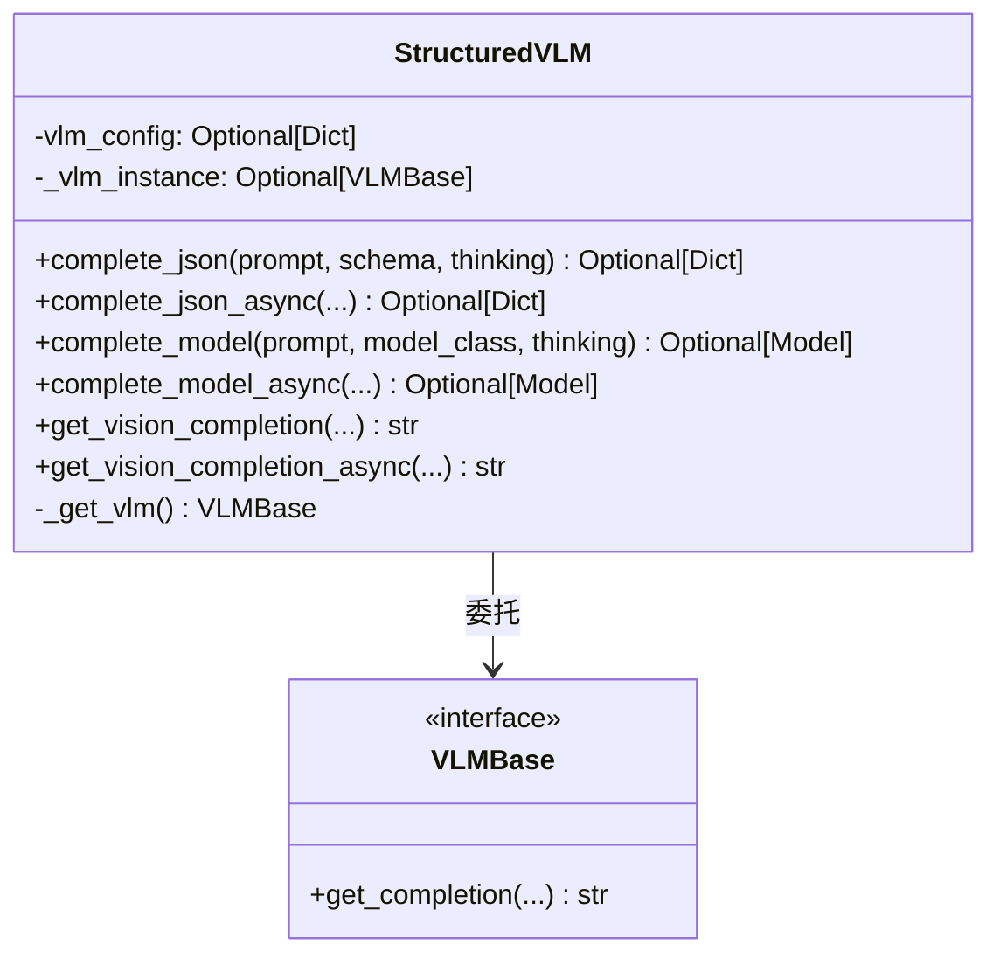
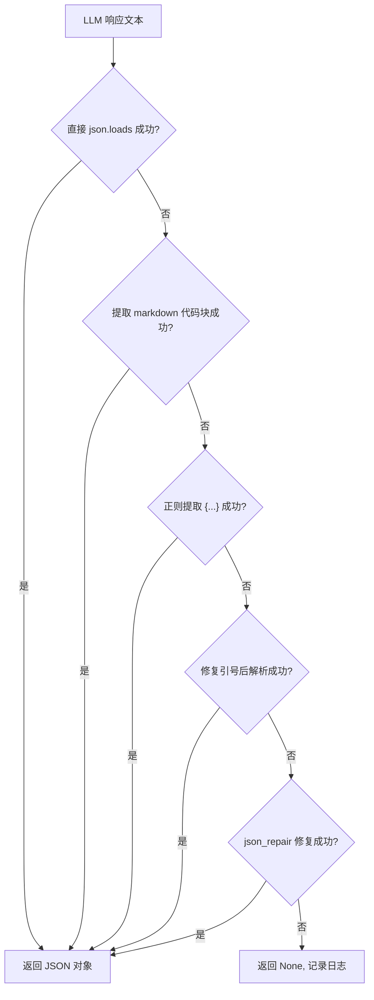

# VLM 结构化输出层

> **快速理解**：`vlm_structured_output` 模块为 VLM 增加了"结构化"能力——它能将 LLM 返回的原始文本自动解析为 JSON 字典或 Pydantic 模型实例。这相当于给 VLM 加了一个"翻译官"，把自由文本翻译成程序可直接使用的数据结构。

## 1. 模块概述

### 1.1 核心组件

| 组件 | 职责 |
|------|------|
| `StructuredVLM` | VLM 的包装器，提供结构化输出方法 |
| `parse_json_from_response()` | JSON 解析核心函数 |
| `parse_json_to_model()` | JSON 到 Pydantic 模型的验证 |
| `get_json_schema_prompt()` | 生成 JSON Schema 提示词 |

### 1.2 为什么需要结构化输出？

LLM 的输出是自由文本，但程序需要结构化数据：

```
❌ 业务代码头痛的问题
LLM: "根据分析，这是一个积极的评价，置信度85%。"
      ↓
业务代码需要: {"sentiment": "positive", "confidence": 0.85}

解析这个字符串很痛苦！
```

```
✅ 使用 StructuredVLM
LLM: "根据分析，这是一个积极的评价，置信度85%。"
      ↓
StructuredVLM.complete_model(..., SentimentAnalysis)
      ↓
业务代码得到: SentimentAnalysis(sentiment="positive", confidence=0.85)
```

---

## 2. StructuredVLM 包装器

### 2.1 类结构



### 2.2 延迟实例化

```python
class StructuredVLM:
    def __init__(self, vlm_config: Optional[Dict[str, Any]] = None):
        self.vlm_config = vlm_config
        self._vlm_instance = None  # 延迟初始化
    
    def _get_vlm(self):
        """延迟加载 VLM 实例"""
        if self._vlm_instance is None:
            from .base import VLMFactory
            config = self.vlm_config or {}
            self._vlm_instance = VLMFactory.create(config)
        return self._vlm_instance
```

**设计意图**：
- 避免在导入模块时加载所有 provider 依赖
- 如果代码路径不涉及 VLM 调用，则不会触发导入
- 适合 CLI 工具场景（很多命令不需要 LLM）

---

## 3. 结构化输出方法

### 3.1 complete_json - 返回字典

```python
def complete_json(
    self,
    prompt: str,
    schema: Optional[Dict[str, Any]] = None,
    thinking: bool = False,
) -> Optional[Dict[str, Any]]:
```

**参数**：
| 参数 | 类型 | 说明 |
|------|------|------|
| `prompt` | str | 用户 prompt |
| `schema` | Optional[Dict] | JSON Schema（可选） |
| `thinking` | bool | 是否启用思考模式 |

**返回值**：
- 成功：解析后的 JSON 字典
- 失败：`None`

**使用示例**：

```python
svlm = StructuredVLM({"provider": "openai", "model": "gpt-4o"})

# 不带 schema（LLM 自由返回 JSON）
result = svlm.complete_json("返回你的姓名和年龄")
# 可能返回: {"name": "张三", "age": 25}

# 带 schema（强制格式）
result = svlm.complete_json(
    "提取用户信息",
    schema={
        "type": "object",
        "properties": {
            "name": {"type": "string"},
            "age": {"type": "integer"}
        },
        "required": ["name", "age"]
    }
)
```

### 3.2 complete_model - 返回 Pydantic 模型（推荐）

```python
def complete_model(
    self,
    prompt: str,
    model_class: Type[T],
    thinking: bool = False,
) -> Optional[T]:
```

**参数**：
| 参数 | 类型 | 说明 |
|------|------|------|
| `prompt` | str | 用户 prompt |
| `model_class` | Type[T] | Pydantic 模型类 |
| `thinking` | bool | 是否启用思考模式 |

**返回值**：
- 成功：Pydantic 模型实例
- 失败：`None`

**使用示例**：

```python
from pydantic import BaseModel

class UserInfo(BaseModel):
    name: str
    email: str
    age: int

svlm = StructuredVLM({"provider": "openai", "model": "gpt-4o"})

# 从文本提取结构化信息
user = svlm.complete_model(
    "从以下文本提取用户信息：张三，28岁，邮箱 zhangsan@example.com",
    UserInfo
)

# user 是 UserInfo 类型
print(user.name)       # "张三"
print(user.email)      # "zhangsan@example.com"
print(user.age)        # 28
```

**优势**：
- 自动生成 JSON Schema
- 验证返回数据是否符合模型定义
- 返回类型是具体的 Pydantic 类，IDE 有完整提示

### 3.3 异步版本

所有方法都有对应的异步版本：

```python
async def complete_json_async(
    self,
    prompt: str,
    schema: Optional[Dict[str, Any]] = None,
    thinking: bool = False,
    max_retries: int = 0,
) -> Optional[Dict[str, Any]]:

async def complete_model_async(
    self,
    prompt: str,
    model_class: Type[T],
    thinking: bool = False,
    max_retries: int = 0,
) -> Optional[T]:
```

---

## 4. JSON 解析核心

### 4.1 parse_json_from_response

这是解析 LLM 响应的核心函数，它实现了**多层 fallback 策略**：

```python
def parse_json_from_response(response: str) -> Optional[Any]:
    """
    多层 JSON 解析策略：
    1. 直接解析
    2. 提取 markdown 代码块
    3. 正则提取 JSON 对象
    4. 修复引号问题
    5. 使用 json_repair 库修复
    """
```

**为什么需要多层策略？**

LLM 的输出格式非常不可控：

```
✅ 格式正确
{"name": "张三", "age": 25}

✅ Markdown 代码块
```json
{"name": "张三", "age": 25}
```

✅ 前后有文字
Here is the result: {"name": "张三", "age": 25}

❌ 单引号（JSON 不允许）
{'name': '张三', 'age': 25}

❌ 尾部逗号
{"name": "张三", "age": 25,}

❌ 无引号键
{name: "张三", age: 25}
```

### 4.2 解析流程图



### 4.3 JSON Schema 提示词

`get_json_schema_prompt` 生成约束 LLM 输出的提示词：

```python
def get_json_schema_prompt(schema: Dict[str, Any], description: str = "") -> str:
    schema_str = json.dumps(schema, ensure_ascii=False, indent=2)
    
    prompt = f"""请输出结果为 JSON 格式。

输出格式要求：
```json
{schema_str}
```
"""
    if description:
        prompt += f"\n{description}\n"
    
    prompt += "\n只输出 JSON，不要其他文字。"
    return prompt
```

**输出示例**：

```python
schema = {"type": "object", "properties": {"name": {"type": "string"}}}
print(get_json_schema_prompt(schema))
```

输出：
```
请输出结果为 JSON 格式。

输出格式要求：
```json
{
  "type": "object",
  "properties": {
    "name": {
      "type": "string"
    }
  }
}
```

只输出 JSON，不要其他文字。
```

---

## 5. 完整使用示例

### 5.1 场景：情感分析

```python
from pydantic import BaseModel
from openviking.models.vlm.llm import StructuredVLM

class SentimentResult(BaseModel):
    sentiment: str  # "positive", "negative", "neutral"
    confidence: float  # 0.0 - 1.0
    keywords: list[str]

svlm = StructuredVLM({"provider": "openai", "model": "gpt-4o"})

# 分析文本
text = """
产品非常好用，界面简洁，操作流畅。
唯一缺点是价格有点贵。
"""

result = svlm.complete_model(
    f"分析以下文本的情感：{text}",
    SentimentResult
)

if result:
    print(f"情感: {result.sentiment}")  # "positive"
    print(f"置信度: {result.confidence}")  # 0.85
    print(f"关键词: {result.keywords}")  # ["好用", "简洁", "贵"]
```

### 5.2 场景：异步批量处理

```python
import asyncio
from pydantic import BaseModel
from openviking.models.vlm.llm import StructuredVLM

class Summary(BaseModel):
    title: str
    bullet_points: list[str]

async def process_document(text: str) -> Summary | None:
    svlm = StructuredVLM({"provider": "openai", "model": "gpt-4o"})
    return await svlm.complete_model_async(
        f"为以下文档生成摘要：{text}",
        Summary
    )

async def main():
    documents = ["doc1...", "doc2...", "doc3..."]
    
    # 并发处理
    tasks = [process_document(doc) for doc in documents]
    results = await asyncio.gather(*tasks)
    
    for r in results:
        if r:
            print(r.title)

asyncio.run(main())
```

---

## 6. 错误处理

### 6.1 常见错误

| 错误场景 | 原因 | 处理方式 |
|----------|------|----------|
| 返回 `None` | JSON 解析失败 | 检查 prompt、添加更多约束 |
| 模型验证失败 | LLM 输出不符合 schema | 使用 `complete_json` 检查原始输出 |
| 网络错误 | API 调用失败 | 使用异步版本 + max_retries |

### 6.2 调试技巧

```python
# 如果 complete_model 返回 None
# 降级到 complete_json 查看原始输出

result = svlm.complete_json(prompt, schema=schema)
print(result)  # 查看原始 JSON

# 如果 JSON 解析成功但模型验证失败
# 可能是 schema 和实际数据不匹配
```

---

## 7. 设计权衡

### 7.1 解析策略的选择

**选择**：多层 fallback 而不是严格模式

**权衡**：
- 优点：鲁棒性强，能处理各种 LLM 输出的"不规范"JSON
- 缺点：可能掩盖真正的问题（如 LLM 完全不按要求输出）

**建议**：生产环境可以记录原始响应，便于调试

### 7.2 Pydantic 验证

**选择**：验证失败返回 `None` 而不是抛出异常

```python
try:
    return model_class.model_validate(response)
except Exception as e:
    logger.warning(f"Model validation failed: {e}")
    return None
```

**权衡**：
- 优点：调用方不需要处理异常，流程更平滑
- 缺点：静默失败，需要调用方检查返回值

---

## 8. 相关文档

- **[vlm_abstractions_factory_and_structured_interface](./vlm_abstractions_factory_and_structured_interface.md)** — 父模块概览
- **[vlm-base](./vlm-base.md)** — VLM 抽象基类
- **[configuration_models_and_singleton](./configuration_models_and_singleton.md)** — 配置管理（与 VLM 配置相关）