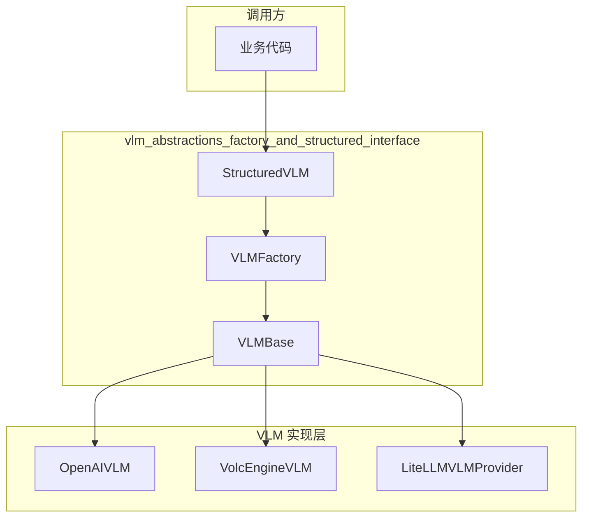
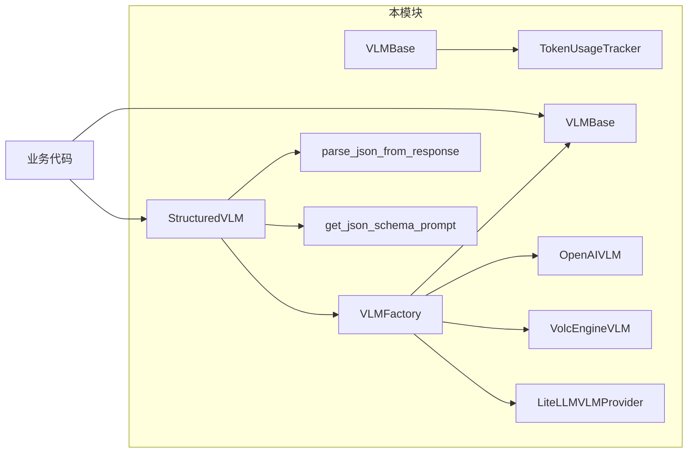

# VLM 抽象层与结构化接口模块

> **快速理解**：本模块是 OpenViking 系统的"模型网关"——它定义了一套统一的接口，让系统能够以统一的方式调用不同的 Vision Language Model（VLM）提供商（OpenAI、VolcEngine 或通过 LiteLLM 调用其他模型），同时提供了结构化输出能力，使 LLM 返回的结果可以直接被解析为 JSON 或 Pydantic 模型。

## 1. 这个模块解决什么问题？

### 1.1 问题背景

在 OpenViking 这样的 AI 系统中，你需要与多种大语言模型提供商交互。每个提供商的 SDK 都有不同的 API 形状：

- **OpenAI** 使用 `openai.ChatCompletion.create()`
- **VolcEngine**（火山引擎）使用自己的 SDK
- **其他模型** 可能通过 LiteLLM 统一调用

如果业务代码直接调用这些 SDK，业务逻辑会与提供商深度耦合。当你想切换模型、增加新提供商、或为同一个请求尝试多个模型时，代码会变得难以维护。

### 1.2 具体问题

```
❌ 直接耦合的问题
业务代码 → OpenAI SDK
业务代码 → VolcEngine SDK  
业务代码 → 其他 SDK

每次增加新提供商，都需要修改业务代码
```

### 1.3 本模块的解决方案

本模块通过**抽象工厂模式**和**适配器模式**解决了这个问题：

1. **VLMBase** — 定义统一的接口契约，所有 VLM 实现都必须遵循
2. **VLMFactory** — 根据配置动态创建正确的 VLM 实例
3. **StructuredVLM** — 在接口之上增加结构化输出能力，处理 JSON 解析和 Pydantic 验证



---

## 2. 核心抽象与心智模型

### 2.1 核心概念

把这个模块想象成**汽车经销商**：

- **VLMBase** 是"汽车"的概念定义——它有轮子、发动机、方向盘，不管是什么品牌的汽车，驾驶方式都是一样的
- **VLMFactory** 是"销售顾问"——你告诉它想要什么配置（config），它给你相应的汽车
- **StructuredVLM** 是"汽车配的导航仪"——不仅能开车，还能把目的地（prompt）转化为结构化的行程规划（JSON/Pydantic）

### 2.2 抽象层次

```
┌─────────────────────────────────────────────────────────────┐
│                    StructuredVLM                            │
│         结构化输出层：JSON 解析、Pydantic 验证               │
├─────────────────────────────────────────────────────────────┤
│                      VLMBase                                │
│            统一接口层：同步/异步、文本/视觉                   │
├─────────────────────────────────────────────────────────────┤
│  OpenAIVLM  │  VolcEngineVLM  │  LiteLLMVLMProvider         │
│           （具体实现层：各提供商的 SDK 封装）                 │
└─────────────────────────────────────────────────────────────┘
```

### 2.3 关键设计决策

#### 决策 1：抽象类 vs 接口

**选择**：使用 `ABC` 抽象类 `VLMBase`

**权衡分析**：
- 接口（Protocol）更灵活，适合duck typing
- 抽象类可以提供默认实现（如 `is_available()`、token tracking 方法）
- 当前选择：抽象类，因为 token usage tracking 是所有实现共用的功能，放在基类中避免重复

#### 决策 2：延迟实例化

**选择**：`StructuredVLM` 使用延迟实例化（lazy initialization）

```python
def _get_vlm(self):
    if self._vlm_instance is None:
        self._vlm_instance = VLMFactory.create(config)
    return self._vlm_instance
```

**权衡分析**：
- 优点：减少启动开销，不需要立即加载所有 provider 的依赖
- 缺点：首次调用有轻微延迟
- 当前选择：延迟实例化适合 CLI 工具等场景，很多命令可能根本不会调用 VLM

#### 决策 3：动态导入 Provider

**选择**：在 `VLMFactory.create()` 中动态导入 provider 类

```python
if provider == "volcengine":
    from .backends.volcengine_vlm import VolcEngineVLM
    return VolcEngineVLM(config)
```

**权衡分析**：
- 优点：避免未安装的依赖导致整个模块无法导入
- 缺点：运行时才知道导入是否成功
- 当前选择：动态导入是 Python 的常见模式，兼容性好

---

## 3. 数据流与依赖分析

### 3.1 典型调用链路

#### 场景 A：简单文本补全

```python
# 1. 创建工厂（配置驱动）
config = {"provider": "openai", "model": "gpt-4o", "api_key": "sk-..."}
vlm = VLMFactory.create(config)

# 2. 调用补全
response = vlm.get_completion("你好，请介绍一下自己")

# 3. 获取 token 使用情况
usage = vlm.get_token_usage_summary()
```

**数据流**：
```
config dict → VLMFactory.create() → VLMBase 实例化
                                     ↓
                              get_completion()
                                     ↓
                              [Provider SDK 调用]
                                     ↓
                              返回文本字符串
```

#### 场景 B：结构化 JSON 输出

```python
from pydantic import BaseModel
from openviking.models.vlm.llm import StructuredVLM

class UserInfo(BaseModel):
    name: str
    age: int
    email: str

svlm = StructuredVlm({"provider": "openai", "model": "gpt-4o"})
user = svlm.complete_model(
    "从以下文本提取用户信息：张三，25岁，邮箱 zhangsan@example.com",
    UserInfo
)
# user 是 UserInfo 实例
```

**数据流**：
```
prompt + schema → StructuredVLM.complete_model()
                         ↓
              VLMBase.get_completion()
                         ↓
              [Provider 返回文本]
                         ↓
              parse_json_from_response()
                         ↓
              Pydantic model_validate()
                         ↓
              返回 Model 实例
```

### 3.2 依赖关系图



### 3.3 关键模块交互

| 组件 | 依赖方 | 被依赖方 | 交互方式 |
|------|--------|----------|----------|
| VLMBase | VLMFactory, 各 Provider 实现 | TokenUsageTracker | 组合（has-a） |
| VLMFactory | 业务代码 | 各 Provider 实现 | 工厂方法 |
| StructuredVLM | 业务代码 | VLMFactory | 委托 |

---

## 4. 设计权衡与 trade-off 分析

### 4.1 灵活性 vs 简洁性

| 方面 | 当前选择 | 替代方案 | 权衡 |
|------|----------|----------|------|
| Provider 注册 | 硬编码 + else 降级 | 插件注册系统 | 当前方案简单，但增加新 provider 需要改工厂方法 |
| 配置格式 | 字典 | 配置类/Pydantic | 字典灵活但无 IDE 提示 |

**建议**：如果 provider 数量快速增长，考虑改为注册表模式。

### 4.2 同步 vs 异步

**当前选择**：同时提供同步和异步接口

```python
def get_completion(self, prompt: str, thinking: bool = False) -> str:
    """同步版本"""

async def get_completion_async(self, prompt: str, thinking: bool = False, max_retries: int = 0) -> str:
    """异步版本"""
```

**权衡分析**：
- 优点：兼容不同场景（CLI 用同步，Web 服务用异步）
- 缺点：实现类需要实现两套方法
- Python 的 `anyio` 或 `httpx` 可以考虑，但当前方案更直观

### 4.3 Token Tracking 的位置

**当前选择**：TokenUsageTracker 作为 VLMBase 的组合对象

**权衡分析**：
- 内置 tracking：所有实现自动获得 tracking 能力
- 独立服务：更灵活但需要显式调用
- 当前方案适合大多数场景，但如果是多租户系统，可能需要更细粒度的 tracking

---

## 5. 扩展点与使用指南

### 5.1 如何添加新的 VLM Provider

```python
# 1. 创建新的 Provider 类，继承 VLMBase
from openviking.models.vlm.base import VLMBase

class MyCustomVLM(VLMBase):
    def get_completion(self, prompt: str, thinking: bool = False) -> str:
        # 实现你的逻辑
        pass
    
    async def get_completion_async(self, prompt: str, thinking: bool = False, max_retries: int = 0) -> str:
        pass
    
    def get_vision_completion(self, prompt: str, images: List, thinking: bool = False) -> str:
        pass
    
    async def get_vision_completion_async(self, prompt: str, images: List, thinking: bool = False) -> str:
        pass

# 2. 在 VLMFactory 中注册
# （当前需要修改工厂方法，未来可改为注册表模式）
```

### 5.2 如何使用结构化输出

```python
from pydantic import BaseModel
from openviking.models.vlm.llm import StructuredVLM

# 方式 1：返回 JSON 字典
svlm = StructuredVLM({"provider": "openai", "model": "gpt-4o"})
result = svlm.complete_json(
    "提取关键信息",
    schema={"type": "object", "properties": {"name": {"type": "string"}}}
)

# 方式 2：返回 Pydantic 模型（推荐）
class Response(BaseModel):
    sentiment: str
    score: float

result = svlm.complete_model("分析这段文字的情感", Response)
```

### 5.3 Token 使用追踪

```python
vlm = VLMFactory.create(config)

# 每次调用后，provider 会返回 token 使用信息
# 你需要手动调用 update_token_usage（由具体实现调用）

usage = vlm.get_token_usage_summary()
print(f"总 Token: {usage['total_tokens']}")
```

---

## 6. 注意事项与陷阱

### 6.1 常见陷阱

| 陷阱 | 描述 | 解决方案 |
|------|------|----------|
| Provider 名称大小写 | `"OpenAI"` vs `"openai"` | 工厂方法会 `.lower()` 转换 |
| API Key 未设置 | `is_available()` 返回 False | 检查 `api_key` 或 `api_base` |
| 异步调用丢失异常 | `get_completion_async` 抛出异常 | 使用 `try/except` 包裹 |
| JSON 解析失败 | LLM 返回格式不标准 | `StructuredVLM` 有多重 fallback |

### 6.2 JSON 解析的 fallback 策略

`parse_json_from_response` 实现了多层 fallback：

1. 直接 `json.loads()` 尝试
2. 提取 markdown 代码块中的 JSON
3. 用正则提取 `{...}` 或 `[...]`
4. 修复引号问题后重试
5. 使用 `json_repair` 库修复

这确保了即使 LLM 返回略微不标准的 JSON，也能成功解析。

### 6.3 thinking 参数

```python
response = vlm.get_completion(prompt, thinking=True)
```

`thinking` 参数控制是否启用模型的"思考"模式（如 OpenAI 的 o1 系列模型）。不同 provider 对这个参数的支持不同，未实现的 provider 会忽略此参数。

### 6.4 配置优先级

```python
provider = (config.get("provider") or config.get("backend") or "openai").lower()
```

优先级：`provider` > `backend` > 默认 `openai`

---

## 7. 相关文档

### 子模块

本模块包含以下子模块，由单独文档详细说明：

| 子模块 | 核心组件 | 职责 |
|--------|----------|------|
| [vlm-base](./vlm-base.md) | `VLMBase`, `VLMFactory` | 抽象基类与工厂模式 |
| [vlm-structured-output](./vlm-structured-output.md) | `StructuredVLM`, `parse_json_from_response` | 结构化输出与 JSON 解析 |

### Token 用量追踪

本模块还包含 Token 用量追踪功能，相关组件在 `vlm-base.md` 的 "2.3 Token 使用追踪" 一节中详细说明：

- **TokenUsageTracker** — 用量追踪器，按模型聚合统计
- **TokenUsage** — 用量统计数据类
- **ModelTokenUsage** — 按模型分类的用量统计

这一功能由 `VLMBase` 组合实现，每个 VLM 实例创建时自动初始化追踪器。

### 相关模块

- **[model_providers_embeddings_and_vlm](./model_providers_embeddings_and_vlm.md)** — 父模块，包含 Embedder 与 VLM
- **[embedder_base_contracts](./model_providers_embeddings_and_vlm-embedder_base_contracts.md)** — Embedder 抽象层，与 VLM 设计模式相似
- **[llm_and_rerank_clients](./llm_and_rerank_clients.md)** — 相关的 LLM 客户端实现

---

## 8. 快速参考

### 核心 API

```python
# 创建 VLM 实例
from openviking.models.vlm.base import VLMFactory, VLMBase

config = {
    "provider": "openai",      # openai, volcengine, 或其他（走 litellm）
    "model": "gpt-4o",
    "api_key": "sk-...",
    "api_base": "https://...",
    "temperature": 0.0,
    "max_retries": 2
}
vlm: VLMBase = VLMFactory.create(config)

# 文本补全
response = vlm.get_completion("你的问题")
async_response = await vlm.get_completion_async("你的问题")

# 视觉补全
vision_response = vlm.get_vision_completion("描述图片", ["image.jpg"])

# 结构化输出
from openviking.models.vlm.llm import StructuredVLM
svlm = StructuredVLM(config)
result = svlm.complete_model("提取信息", YourPydanticModel)
```

### 配置字段

| 字段 | 必填 | 默认值 | 说明 |
|------|------|--------|------|
| `provider` | 否 | `"openai"` | 提供商名称 |
| `model` | 是 | - | 模型名称 |
| `api_key` | 否 | `None` | API Key |
| `api_base` | 否 | `None` | 自定义 API 端点 |
| `temperature` | 否 | `0.0` | 采样温度 |
| `max_retries` | 否 | `2` | 最大重试次数 |