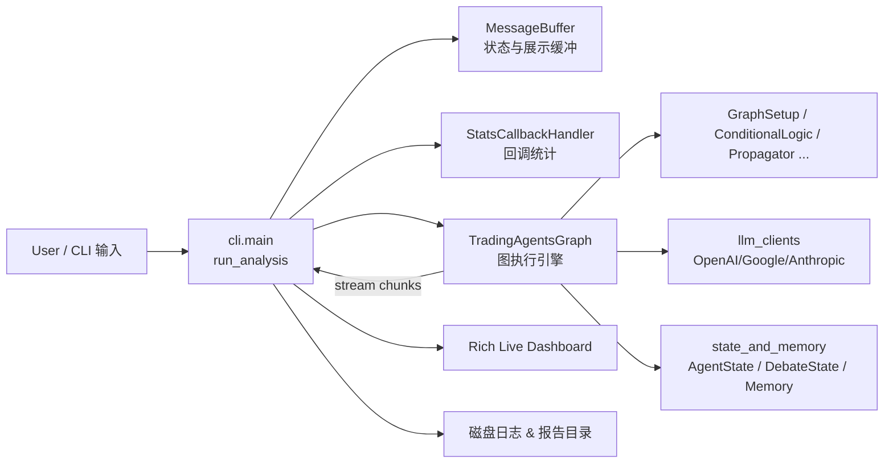
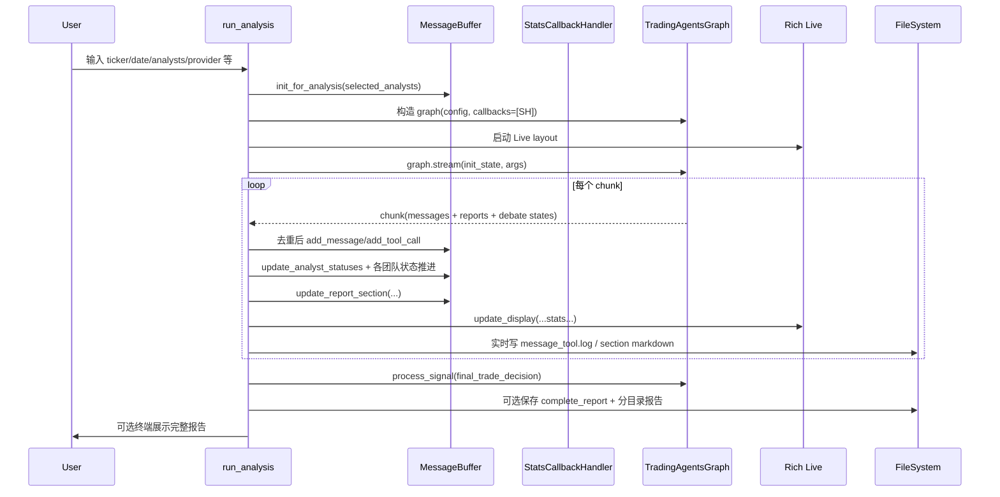
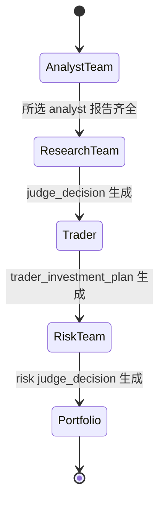

# cli_and_observability 模块文档

## 模块简介与设计目标

`cli_and_observability` 模块是 TradingAgents 系统的“用户交互入口 + 运行时可观测性层”。如果把整个系统看成一条从“用户意图”到“多智能体推理决策”再到“可追溯结果输出”的链路，那么该模块就位于最前端和最外层：它负责采集用户输入、驱动 `TradingAgentsGraph` 执行、实时展示代理协作进度、记录消息与工具调用、统计 LLM/Tool 消耗，并在结束后落盘产出结构化报告。

从职责边界上看，图编排、状态传播、反思迭代等复杂智能体流程由 `graph_orchestration` 模块实现（详见 [graph_orchestration.md](graph_orchestration.md)），模型调用封装由 `llm_clients` 提供（详见 [llm_clients.md](llm_clients.md)），而本模块主要解决“如何让人看见并控制这一切”。因此它不是策略逻辑核心，却是系统可用性、可调试性、可运营性和可审计性的关键。

该模块包含三个核心组件：

- `cli.main.MessageBuffer`：运行中消息、工具调用、Agent 状态与报告片段的缓冲与聚合器。
- `cli.models.AnalystType`：分析师类型枚举，承载 CLI 选项和流程过滤的标准化键。
- `cli.stats_handler.StatsCallbackHandler`：LangChain 回调处理器，用于线程安全地统计 LLM/Tool 调用与 token 用量。

---

## 在整体系统中的位置



这个关系图体现了一个非常重要的架构决策：CLI 不直接参与智能体推理，只消费 `graph.stream(...)` 的流式状态块（chunk），并据此驱动可视化和持久化。这样做的收益是，图逻辑与终端体验解耦，后续替换 CLI（例如 Web UI）时只需复用同样的状态消费模式。

---

## 核心组件详解

## `cli.main.MessageBuffer`

`MessageBuffer` 是 CLI 运行态的“轻量状态仓库”，同时承担事件缓冲、进度状态机、报告聚合器三种角色。其内部维护多个 `deque` 与字典结构，用于在高频流式更新中控制内存与展示行为。

### 1) 结构与字段

`MessageBuffer` 维护以下关键字段：

- `messages: deque[(timestamp, type, content)]`：普通消息（用户、代理、系统、数据控制等）。
- `tool_calls: deque[(timestamp, tool_name, args)]`：工具调用轨迹。
- `agent_status: Dict[str, str]`：各 agent 的状态（`pending | in_progress | completed | error`）。
- `report_sections: Dict[str, Optional[str]]`：报告分段内容，按 section key 存储。
- `current_report`：用于实时 UI 面板展示的“最近更新 section”。
- `final_report`：聚合后的完整 Markdown 文本。
- `selected_analysts`：当前运行选择的分析师集合（小写 key）。
- `_last_message_id`：用于去重 LangChain 消息事件，避免重复追加。

其类级常量（`FIXED_AGENTS`、`ANALYST_MAPPING`、`REPORT_SECTIONS`）定义了流程骨架与“报告完成判定语义”，这是它最关键的设计点。

### 2) 初始化：`init_for_analysis(selected_analysts)`

该方法根据用户选择动态构造本次运行的 agent 集合和报告 section 集合，并清空上次运行残留状态。它会：

1. 规范化分析师 key（统一小写）。
2. 仅为被选中的分析师注入 `agent_status`。
3. 始终注入固定团队（Research/Trading/Risk/Portfolio）。
4. 仅创建与所选分析师相关的报告段落（例如未选 `news` 就不会生成 `news_report`）。
5. 清理消息缓冲、工具缓冲、当前与最终报告、去重 ID。

这意味着同一套 UI 可以适配不同“分析师子图”，而不会展示无关 agent/无效进度。

### 3) 报告完成判定：`get_completed_reports_count()`

该方法不是简单地统计“有文本的 section 数量”，而是采用更严格的双条件：

- section 有内容；
- 对应 `finalizing_agent` 已经 `completed`。

例如风险讨论过程可能多次更新 `final_trade_decision`，但在 `Portfolio Manager` 未完成前，不计入“报告完成”。这避免了把中间态误显示为终态，是 CLI 进度条准确性的关键保障。

### 4) 写入与更新行为

- `add_message(message_type, content)`：追加带时间戳消息。
- `add_tool_call(tool_name, args)`：追加工具调用记录。
- `update_agent_status(agent, status)`：更新代理状态并同步 `current_agent`。
- `update_report_section(section_name, content)`：更新报告 section 并触发 `_update_current_report()`。

`_update_current_report()` 会挑选“最近非空 section”作为当前展示，并调用 `_update_final_report()` 重构汇总报告。由于底层 `dict` 保序，这里实际依赖“插入顺序 + 覆盖更新语义”，在当前实现下可工作，但若未来 section 遍历逻辑改变，可能影响“最近更新 section”判定。

### 5) 最终报告构建：`_update_final_report()`

该方法将多个 section 拼接成 Markdown，分为 Analyst / Research / Trading / Portfolio 决策几大段。它使用 `.get()` 防御缺失 key，能够兼容“部分分析师未启用”或“中途失败未产出”。

---

## `cli.models.AnalystType`

`AnalystType` 是一个 `str + Enum` 的枚举：

- `MARKET = "market"`
- `SOCIAL = "social"`
- `NEWS = "news"`
- `FUNDAMENTALS = "fundamentals"`

虽然代码量很小，但其作用是把 CLI 交互层中的“分析师选择”转化为稳定的、可序列化的、可比较的 key。`run_analysis()` 会用这些值和 `ANALYST_ORDER` 做有序归一化，从而保证图执行顺序与 UI 状态推进一致。

---

## `cli.stats_handler.StatsCallbackHandler`

`StatsCallbackHandler` 继承 `langchain_core.callbacks.BaseCallbackHandler`，提供线程安全统计能力。它通过 `threading.Lock` 保证在并发回调场景下计数一致。

### 1) 统计项

- `llm_calls`：LLM/ChatModel 启动次数。
- `tool_calls`：Tool 启动次数。
- `tokens_in`：输入 token 累积。
- `tokens_out`：输出 token 累积。

### 2) 回调钩子

- `on_llm_start(...)`：普通 LLM 开始时 +1。
- `on_chat_model_start(...)`：聊天模型开始时 +1。
- `on_tool_start(...)`：工具开始时 +1。
- `on_llm_end(response, ...)`：从 `response.generations[0][0].message.usage_metadata` 读取 token，累积 input/output。

这里采用了“尽力提取”策略：若 `generations` 结构不符合预期会直接返回，不抛错。这在跨模型供应商时提高了稳健性，但也意味着某些模型即使实际消耗 token，统计可能显示为 `--`。

### 3) 读取接口

`get_stats()` 返回当前快照字典，并在锁内读取，避免读到中间态。

---

## 主流程：`run_analysis()` 的执行机制

`run_analysis()` 是 CLI 模块的主控函数，串联了配置收集、图执行、实时可视化、文件落盘和结束交互。



该流程的关键是“边流边更新”：每个 chunk 到来都会触发一次状态收敛（消息、tool、agent、report、stats、UI）。因此用户感知上不是一次性输出，而是可追踪的协作过程。

---

## CLI 可视化与交互设计

## 1) 布局：`create_layout()`

布局分三层：

- Header：欢迎信息。
- Main：上半部分（进度 + 消息工具）和下半部分（当前报告）。
- Footer：统计信息（Agents/LLM/Tools/Tokens/Reports/Elapsed）。

## 2) 刷新：`update_display(...)`

`update_display` 会重建并更新三个核心面板：

1. **Progress**：按团队展示 agent 状态；`in_progress` 显示 spinner。
2. **Messages & Tools**：合并消息与工具调用，按时间逆序展示最近 12 条。
3. **Current Report**：展示当前 section 的 Markdown。

Footer 会联合 `MessageBuffer` 与 `StatsCallbackHandler` 计算运行指标。token 显示使用 `format_tokens()`，并在缺失时回退为 `Tokens: --`。

## 3) 用户输入采集：`get_user_selections()`

该函数分步骤询问：ticker、日期、分析师组合、研究深度、LLM provider/backend、thinking agents、provider 特定推理参数。并将结果标准化为统一字典，供后续 config 注入。

其中 provider 分支策略如下：

- `google`：启用 `google_thinking_level`。
- `openai`：启用 `openai_reasoning_effort`。
- 其他 provider：这两项保持 `None`。

---

## 状态推进逻辑（分析师 → 研究 → 交易 → 风控 → 组合）

`run_analysis()` 中存在一套显式状态推进逻辑，与图编排结果松耦合：它不控制图节点执行，只根据 chunk 内容更新 UI 状态。



- `update_analyst_statuses(...)` 按固定顺序 `market -> social -> news -> fundamentals` 检查已选分析师。
- 若某 analyst 已有报告，则标记 `completed` 并写入对应 section。
- 首个“无报告” analyst 标记 `in_progress`，其余 `pending`。
- 当全部 analyst 完成后，自动将 `Bull Researcher` 置为 `in_progress`。

研究、交易、风险阶段则通过 `investment_debate_state`、`trader_investment_plan`、`risk_debate_state` 的字段存在性来触发阶段迁移。

---

## 消息与工具可观测性

## 1) 消息分类

`classify_message_type(message)` 使用 LangChain 消息类型映射：

- `HumanMessage` → `User`（内容为 `Continue` 时标记为 `Control`）。
- `ToolMessage` → `Data`。
- `AIMessage` → `Agent`。
- 其他未知类型 → `System`。

内容抽取由 `extract_content_string(content)` 完成，支持 `str | dict | list` 多形态输入，并使用“空值语义”过滤无效内容，减少噪声日志。

## 2) 工具参数展示

`format_tool_args(args, max_length=80)` 对参数字符串做截断，避免挤爆终端表格。

## 3) 日志与报告实时落盘

在 `run_analysis()` 中，通过装饰器式包装 `message_buffer` 三个方法，实现副作用注入：

- `add_message` 后写入 `message_tool.log`。
- `add_tool_call` 后写入 `message_tool.log`。
- `update_report_section` 后写入 `reports/{section}.md`。

这是一种低侵入策略：不改 `MessageBuffer` 源实现，按运行上下文动态增强持久化行为。

---

## 报告输出机制

模块提供两种报告出口：

1. **终端展示**：`display_complete_report(final_state)` 逐段 Panel + Markdown 渲染，避免一次性大文本截断。
2. **磁盘保存**：`save_report_to_disk(final_state, ticker, save_path)` 输出结构化目录：

```text
<save_path>/
  complete_report.md
  1_analysts/
    market.md
    sentiment.md
    news.md
    fundamentals.md
  2_research/
    bull.md
    bear.md
    manager.md
  3_trading/
    trader.md
  4_risk/
    aggressive.md
    conservative.md
    neutral.md
  5_portfolio/
    decision.md
```

其中每个子文件都来源于 `final_state` 的对应字段，`complete_report.md` 是聚合总览。

---

## 配置与扩展点

## 1) 与图模块的配置桥接

`run_analysis()` 将 CLI 选择注入 `DEFAULT_CONFIG`：

```python
config["max_debate_rounds"] = selections["research_depth"]
config["max_risk_discuss_rounds"] = selections["research_depth"]
config["quick_think_llm"] = selections["shallow_thinker"]
config["deep_think_llm"] = selections["deep_thinker"]
config["backend_url"] = selections["backend_url"]
config["llm_provider"] = selections["llm_provider"].lower()
config["google_thinking_level"] = selections.get("google_thinking_level")
config["openai_reasoning_effort"] = selections.get("openai_reasoning_effort")
```

这让 CLI 成为“运行时配置入口”，而不是硬编码策略源。

## 2) 新增分析师类型的改造面

若要扩展新 analyst（如 `macro`），需要同步更新：

- `AnalystType` 枚举值。
- `MessageBuffer.ANALYST_MAPPING`。
- `MessageBuffer.REPORT_SECTIONS`。
- `ANALYST_ORDER` / `ANALYST_AGENT_NAMES` / `ANALYST_REPORT_MAP`。
- UI 团队分组（`all_teams`）和报告标题映射。

由于多处字典并行维护，建议后续抽象为单一元数据注册表，减少遗漏风险。

## 3) 新增可观测指标

可以在 `StatsCallbackHandler` 添加更多回调统计（如失败率、平均延迟、按模型维度拆分 token），并在 `update_display` footer 中接入展示。

---

## 异常、边界条件与已知限制

## 1) 消息时间排序精度

消息排序目前基于 `%H:%M:%S` 字符串，秒级精度下同秒内多事件顺序可能不稳定。若需要严格时序，建议改为 epoch 毫秒或单调递增序号。

## 2) `_last_message_id` 去重依赖

去重依赖 LangChain message 的 `id` 字段。若某些消息不带 `id` 或重复 `id` 策略变化，可能出现漏记或重复记录。

## 3) token 统计不完整

`on_llm_end` 只从特定结构读取 `usage_metadata`。某些 provider 不返回该字段时，token 会显示 `--`，并非真正“零消耗”。

## 4) 动态 monkey patch 的维护性

`run_analysis()` 通过替换实例方法注入落盘行为，灵活但可读性一般，且调试栈会更深。若后续功能增多，建议迁移为显式事件总线或观察者模式。

## 5) 报告 section 的覆盖语义

部分阶段（如投资/风控辩论）会多次写入同一 section，后写覆盖前写。虽然最终文件保留最新结果，但中间版本仅能在 `message_tool.log` 中追踪，不会保留 diff 历史。

## 6) 首分析师状态设置潜在假设

初始状态使用 `selections['analysts'][0]` 推导首个 in_progress。该列表是否稳定有序取决于 `select_analysts()` 返回实现；后续虽有 `selected_analyst_keys` 归一化，但这里仍有潜在不一致窗口。

---

## 典型使用示例

最小入口调用非常直接：

```bash
python -m cli.main analyze
```

或在代码中：

```python
from cli.main import run_analysis

run_analysis()
```

运行后你会看到：

1. 交互式参数问答；
2. Rich Live 仪表盘实时刷新；
3. 分析结束后可选保存报告；
4. 可选在终端顺序展示完整报告。

---

## 与其他模块文档的关系

本文档聚焦 CLI 交互与可观测性层，不重复图执行细节与状态对象定义。若你需要深入以下主题，请参考：

- 图编排、节点条件流转、信号处理： [graph_orchestration.md](graph_orchestration.md)
- Agent 状态与辩论状态结构： [state_and_memory.md](state_and_memory.md)
- 各 LLM provider 客户端差异与配置： [llm_clients.md](llm_clients.md)

通过这几个文档配合阅读，你可以从“入口交互”一路理解到“图执行内核”和“模型调用落地”的完整路径。
