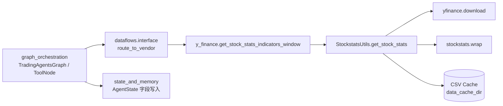
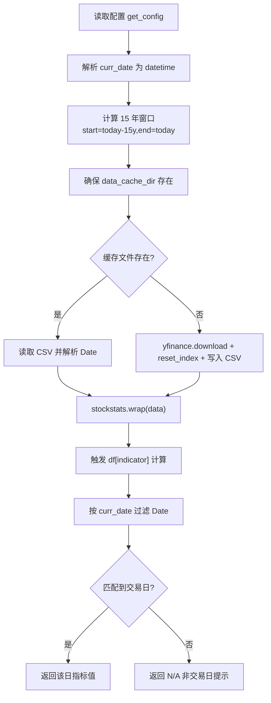
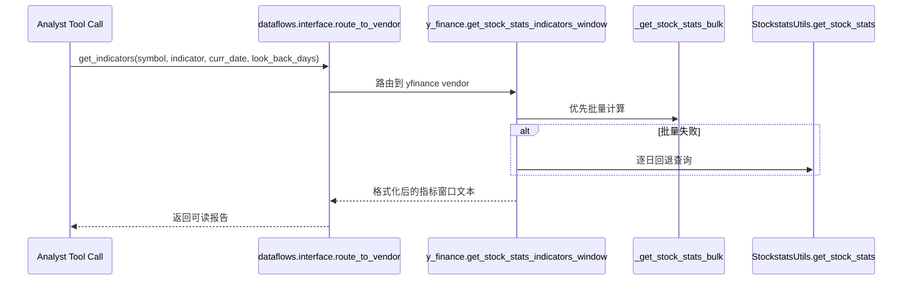
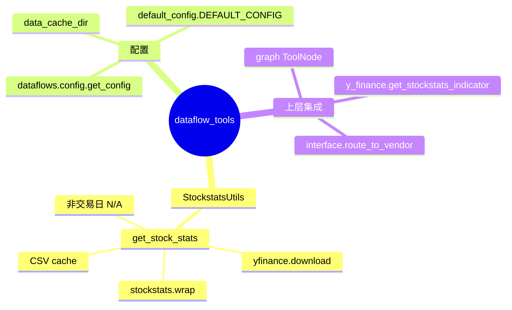

# dataflow_tools 模块文档

`dataflow_tools` 是 TradingAgents 系统中的“市场数据与指标工具层”，负责把原始行情数据转换成可被 Agent 推理链直接消费的结构化信号。在整个系统里，图编排层（见 [graph_orchestration.md](graph_orchestration.md)）不会直接关心 `yfinance`、`stockstats` 等第三方库细节，而是通过工具函数获取“某日期、某指标”的结果；`dataflow_tools` 的价值正是把这类外部数据访问、缓存、格式归一、指标计算封装成稳定接口。

就当前核心组件而言，本模块的关键实现是 `tradingagents.dataflows.stockstats_utils.StockstatsUtils`。它承担“技术指标单点查询”的能力：输入股票代码、指标名、目标交易日，返回该日期对应的指标值或不可用提示。这个能力虽然看起来简单，但它处在系统关键路径上：上游 Analyst 节点会据此构建技术分析报告，下游辩论与交易决策会把该信息作为证据之一，因此其稳定性、性能（缓存）和返回语义都非常重要。

---

## 1. 模块定位与系统关系

从模块树看，`dataflow_tools` 与 `graph_orchestration`、`state_and_memory`、`llm_clients` 形成“工具-编排-推理”协作关系。`dataflow_tools` 不负责状态流转，也不负责模型调用，而是专注于“把外部金融数据变成可解释的文本/数值输入”。



这张图对应的含义是：在运行时，图中的 Analyst 工具节点通常通过 `dataflows.interface` 路由到具体 vendor 实现。对于技术指标场景，`yfinance` 路径会进入 `y_finance.py`，最终在单日查询或回退逻辑中调用 `StockstatsUtils.get_stock_stats`。因此，`StockstatsUtils` 是一个底层能力点，属于“被上层组合调用”的组件。

关于图如何触发工具调用，请参考 [graph_orchestration.md](graph_orchestration.md)；关于状态字段如何承接工具输出，请参考 [state_and_memory.md](state_and_memory.md)。

---

## 2. 设计动机：为什么需要 `StockstatsUtils`

`StockstatsUtils` 的设计目标可以概括为三点。第一，它将“数据下载”和“指标计算”合并在一个可重用入口里，避免每个工具函数都重复写 `yfinance` 请求和 `stockstats` 包装逻辑。第二，它通过本地 CSV 缓存降低重复网络请求开销，尤其适合 Agent 在同一次推理中多次读取同一标的不同指标。第三，它把交易日匹配规则显式化：如果目标日期不是交易日，返回明确提示字符串，而不是沉默失败。

这是一种工程上务实的折中方案：与实时数据库方案相比，它更轻量、部署门槛更低；与“每次都在线拉取”相比，它更可控且成本更低。

---

## 3. 核心组件详解：`StockstatsUtils`

## 3.1 类与方法概览

`StockstatsUtils` 当前包含一个静态方法：

```python
StockstatsUtils.get_stock_stats(symbol: str, indicator: str, curr_date: str)
```

参数语义如下：

- `symbol`：股票代码（例如 `AAPL`、`TSLA`）。
- `indicator`：`stockstats` 兼容的指标表达式（例如 `rsi`、`macd`、`close_50_sma`）。
- `curr_date`：目标日期，格式要求为 `YYYY-mm-dd`。

返回值具有“联合类型”特征：

- 正常命中时返回指标值（常见为数值类型，具体由 pandas/stockstats 计算结果决定）。
- 目标日期非交易日时返回字符串：`"N/A: Not a trading day (weekend or holiday)"`。

这意味着调用方需要处理“数值/字符串”两种返回分支，不能假设恒为 `float`。

---

## 3.2 内部执行流程（逐步解析）

`get_stock_stats` 的内部可拆成 7 个阶段：配置读取、日期窗口计算、缓存目录准备、缓存命中判断、在线下载（若未命中）、指标触发计算、目标日期过滤与返回。



其中有几个关键实现细节：

第一，历史窗口是“相对今天”滚动 15 年，而不是围绕 `curr_date` 动态裁剪。这保证了同一时间段内多个日期查询能够复用同一个缓存文件，但也带来缓存文件名随日期变化的问题（后文会讲）。

第二，`df[indicator]` 这一行并非“普通字段访问”，而是利用 `stockstats` 的惰性计算机制来触发指标生成。如果指标名不合法，这一步会抛出异常。

第三，日期匹配使用的是字符串前缀筛选：`df["Date"].str.startswith(curr_date_str)`。对日级日期格式来说这是可行的，但它依赖 Date 列已规范化为 `YYYY-mm-dd` 字符串。

---

## 3.3 缓存机制与配置行为

`StockstatsUtils` 依赖 `tradingagents.dataflows.config.get_config()` 读取运行配置。默认情况下，配置来自 `tradingagents/default_config.py`，其中 `data_cache_dir` 默认指向：

```python
tradingagents/dataflows/data_cache
```

运行时缓存文件命名规则为：

```text
{symbol}-YFin-data-{start_date}-{end_date}.csv
```

例如（示意）：

```text
AAPL-YFin-data-2011-03-01-2026-03-01.csv
```

这种命名策略的优点是简单直观，缺点是当“今天日期”变化时，`end_date` 会变化，新旧缓存文件不会复用，目录中会逐步累积多份高度重叠数据。若在长周期服务中运行，建议配合定期清理策略。

---

## 4. 与上层工具路由的关系

尽管 `StockstatsUtils` 是本模块核心组件，但在系统中它通常不被直接调用，而是通过 `y_finance.get_stockstats_indicator` / `get_stock_stats_indicators_window` 间接调用，再由 `dataflows.interface.route_to_vendor` 统一路由。



这里体现了一个重要事实：`StockstatsUtils` 在当前工程中既是可独立调用的底层 API，也是上层“批量优先、单点回退”策略的兜底能力。这使其异常行为会被放大到整个技术指标工具链。

---

## 5. 使用方式

## 5.1 直接调用 `StockstatsUtils`

```python
from tradingagents.dataflows.stockstats_utils import StockstatsUtils

value = StockstatsUtils.get_stock_stats(
    symbol="AAPL",
    indicator="rsi",
    curr_date="2025-01-24",
)

print(value)  # 可能是数值，也可能是 "N/A: Not a trading day (weekend or holiday)"
```

## 5.2 通过统一工具接口调用（推荐）

在生产路径中，更推荐让上层调用 `interface` 中的统一工具函数（例如 `get_indicators`），由路由层决定 vendor 与回退策略，而不是业务代码直接依赖某个具体实现。

```python
from tradingagents.dataflows.interface import route_to_vendor

result = route_to_vendor(
    "get_indicators",
    symbol="AAPL",
    indicator="rsi",
    curr_date="2025-01-24",
    look_back_days=7,
)

print(result)  # 文本化窗口指标报告
```

---

## 6. 配置与可扩展性

`StockstatsUtils` 本身只读取 `data_cache_dir`，但它所在数据流体系支持更大范围的 vendor 配置。对于技术指标链路，常见相关配置是：

```python
{
  "data_cache_dir": "./custom_cache",
  "data_vendors": {
    "technical_indicators": "yfinance"  # 或 alpha_vantage，按路由层能力决定
  },
  "tool_vendors": {
    "get_indicators": "yfinance,alpha_vantage"  # 主备顺序
  }
}
```

上面配置由 `dataflows.config.set_config()` 注入后生效。若你在 `TradingAgentsGraph` 初始化时传入自定义 `config`，该配置会在图编排层统一下发（详见 [graph_orchestration.md](graph_orchestration.md)）。

扩展本模块时，建议遵循以下原则：新增实现尽量放在 vendor 适配层（如 `y_finance.py` 或 `alpha_vantage_*.py`），并通过 `interface.py` 注册到 `VENDOR_METHODS`，避免业务调用点直接耦合到底层函数名。

---

## 7. 边界条件、错误处理与运维注意事项

`StockstatsUtils` 当前实现有若干需要特别注意的行为约束。

首先是输入校验。`curr_date` 通过 `pd.to_datetime` 解析，非法日期会抛异常；`indicator` 不在 `stockstats` 支持集合中时，`df[indicator]` 会触发异常。该方法内部没有显式 `try/except` 包装，因此异常会直接向上传播，调用方必须做好兜底。

其次是返回类型不稳定。命中交易日时通常返回数值，非交易日返回固定字符串，这会给后续数值计算带来类型风险。上游若要参与数学运算，应先做类型判断与 `N/A` 处理。

再次是缓存一致性与新鲜度。缓存文件按“今天日期”切片命名，不同日期运行会生成不同文件，可能导致磁盘增长；同时，已存在缓存文件被优先读取，默认不会主动刷新，若数据供应商修订历史数据（拆股、复权变更等）可能出现陈旧值。

另外，`yfinance.download(..., auto_adjust=True)` 会对价格进行复权调整，这会影响某些指标数值（尤其与未复权数据对比时）。如果策略逻辑依赖未复权口径，应在扩展时明确数据口径并统一全链路行为。

最后，方法对“非交易日”只返回统一文案，不区分周末、节假日、停牌或数据缺失等情形。如果业务侧需要更精细诊断，需要在外层增加交易日历或错误分类逻辑。

---

## 8. 已知限制与改进建议

当前实现满足轻量可用，但从可维护性看仍有改进空间。返回类型建议统一为结构化对象（例如 `{"status": "ok|na|error", "value": ...}`），以减少调用方分支复杂度。缓存策略建议引入固定窗口键或 TTL，以避免“每日新文件”累积。异常处理建议在底层加入可观测日志（而不是依赖上层打印），方便定位数据源波动问题。

如果未来要提升性能，可考虑把“单指标单次查询”升级为“同标的多指标批量计算并共享 DataFrame”，避免同一请求链路中重复触发 `stockstats.wrap` 与列计算。

---

## 9. 维护者速查



如果你是首次接手该模块，建议先验证三条路径：缓存命中路径、在线下载路径、非交易日路径。只要这三条路径行为清晰且可重复，`dataflow_tools` 在整体系统中的稳定性通常就有保障。
