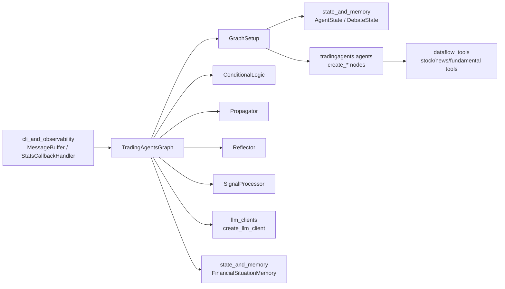
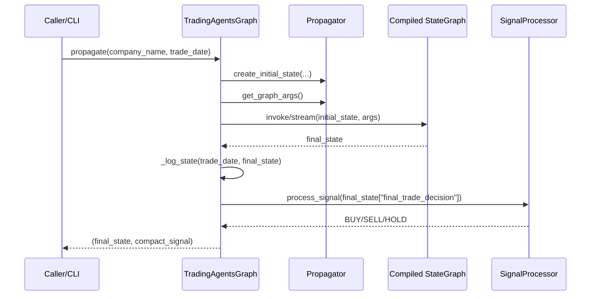
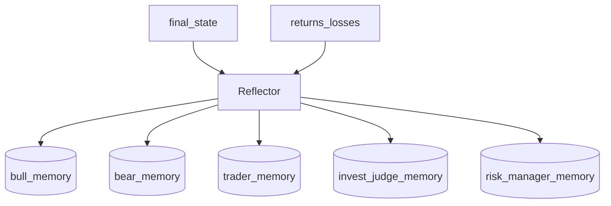
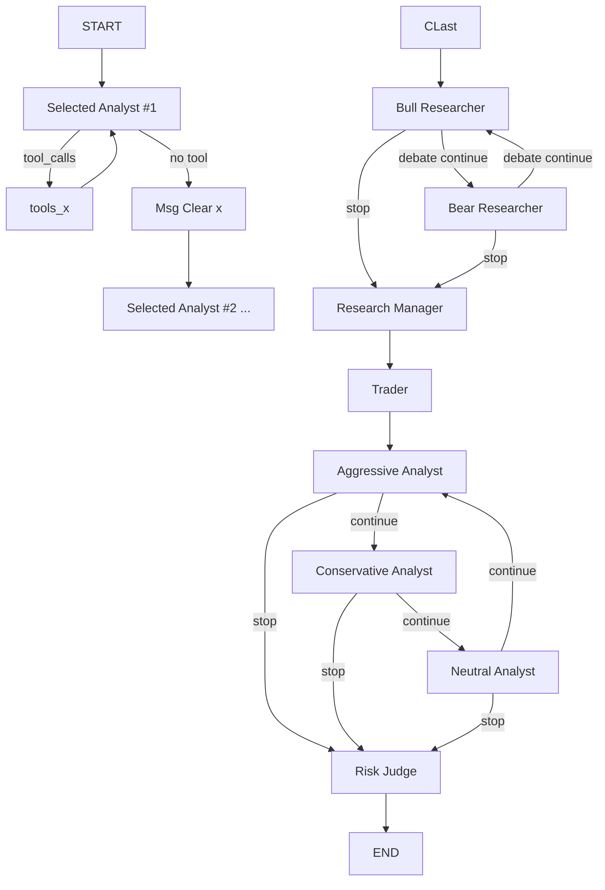
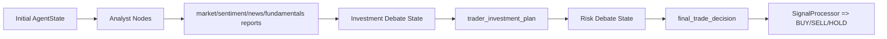
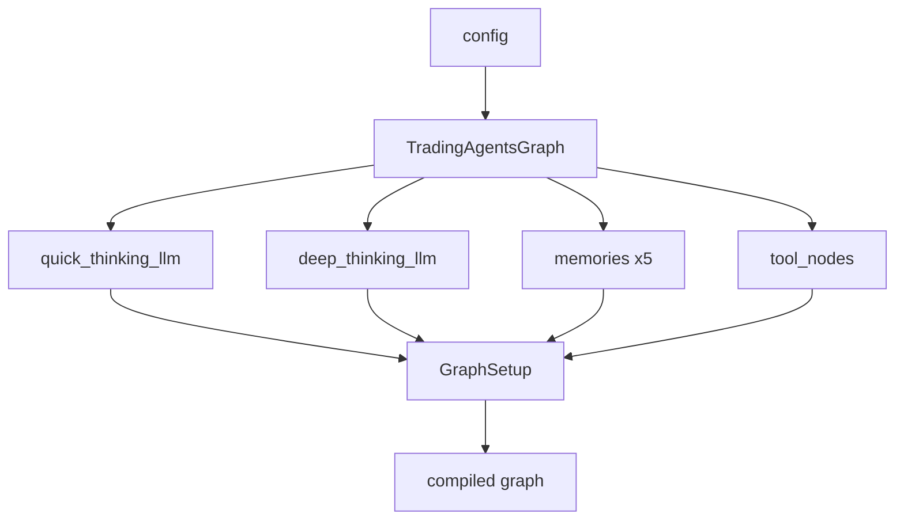

# graph_orchestration 模块文档

`graph_orchestration` 是 TradingAgents 系统的“执行编排层”。如果把整个系统看成一条投资决策流水线：数据采集 → 多角色分析 → 观点辩论 → 风险审议 → 交易输出 → 复盘记忆，那么本模块负责把这些能力组织成一个可执行、可追踪、可扩展的有向状态图（LangGraph）。

它存在的核心价值是把“单个 Agent 的智能”提升为“多 Agent 的协同流程智能”：不仅要让各类 Analyst 产出报告，还要保证它们按照正确顺序调用工具、在合适时机进入辩论与裁决、在轮次上可控地收敛，并将最终输出标准化为 `BUY/SELL/HOLD`。同时，模块还提供了策略日志落盘与事后反思（reflection）机制，把一次执行沉淀为长期可复用的经验记忆。

---

## 1. 模块定位与系统关系

`graph_orchestration` 主要由六个核心组件构成：

- `tradingagents.graph.trading_graph.TradingAgentsGraph`
- `tradingagents.graph.setup.GraphSetup`
- `tradingagents.graph.conditional_logic.ConditionalLogic`
- `tradingagents.graph.propagation.Propagator`
- `tradingagents.graph.reflection.Reflector`
- `tradingagents.graph.signal_processing.SignalProcessor`

从依赖关系上看，它位于系统中间层：向下连接 LLM 客户端与数据工具，向上服务 CLI/策略执行入口。



上图可理解为：`TradingAgentsGraph` 是总控对象，`GraphSetup` 定义图结构，`ConditionalLogic` 决定分支，`Propagator` 决定初始化与运行参数，`Reflector` 负责复盘写入记忆，`SignalProcessor` 负责把自然语言结论收敛为交易信号。

关于状态与记忆结构的字段定义，请参考 [state_and_memory.md](state_and_memory.md)；关于多厂商 LLM 客户端适配，请参考 [llm_clients.md](llm_clients.md)；关于 CLI 回调与统计，请参考 [cli_and_observability.md](cli_and_observability.md)。

---

## 2. 执行生命周期（从一次调用到一次复盘）

### 2.1 主流程

`TradingAgentsGraph.propagate(company_name, trade_date)` 是策略执行入口。它会构造初始状态，驱动 LangGraph 执行，产出最终状态，再通过 `SignalProcessor` 抽取核心交易动作。



这里有两个关键设计点。第一，模块返回的是 `(final_state, processed_signal)`，既保留完整推理上下文，又提供交易系统可直接消费的标准动作。第二，`debug=True` 时采用 `graph.stream` 并打印每步消息，可用于问题定位与 prompt 迭代。

### 2.2 复盘流程

执行后可调用 `reflect_and_remember(returns_losses)` 将收益反馈注入多角色记忆。



这一步不会重跑图，而是基于已有 `curr_state` 做离线反思，因此应保证先调用 `propagate` 再调用 `reflect_and_remember`。

---

## 3. 核心类详解

## 3.1 TradingAgentsGraph

### 职责概述

`TradingAgentsGraph` 是模块外部应直接使用的 façade。它承担配置生效、LLM 实例创建、记忆体装配、工具节点创建、子组件装配、图编译与运行、日志落盘、反思触发和最终信号提炼等职责。

### 构造函数

```python
TradingAgentsGraph(
    selected_analysts=["market", "social", "news", "fundamentals"],
    debug=False,
    config=None,
    callbacks=None,
)
```

参数行为：

- `selected_analysts` 控制启用哪些前置分析链路，且**顺序决定执行顺序**。
- `debug` 决定使用 `stream`（逐步输出）还是 `invoke`（一次完成）。
- `config` 默认走 `DEFAULT_CONFIG`；会传给 `set_config` 与 LLM 创建流程。
- `callbacks` 注入 LLM 构造参数，可与统计/观测组件联动（见 [cli_and_observability.md](cli_and_observability.md)）。

内部关键动作：

1. 调用 `set_config(self.config)`，让 dataflow 层读取统一配置。
2. 创建缓存目录：`{project_dir}/dataflows/data_cache`。
3. 基于 provider 生成额外参数（OpenAI 的 `reasoning_effort`，Google 的 `thinking_level`）。
4. 构建 `deep_thinking_llm` 与 `quick_thinking_llm`。
5. 初始化 5 个角色记忆体（bull/bear/trader/invest_judge/risk_manager）。
6. 创建工具节点（market/social/news/fundamentals）。
7. 组装 `ConditionalLogic`、`GraphSetup`、`Propagator`、`Reflector`、`SignalProcessor`。
8. 编译图：`self.graph = self.graph_setup.setup_graph(selected_analysts)`。

### `_get_provider_kwargs()`

根据 `config["llm_provider"]` 返回 provider 特定参数：

- `google`：可带 `thinking_level`
- `openai`：可带 `reasoning_effort`
- 其他 provider：返回空 dict

这是一个轻量适配层，避免在外部调用处写 provider 分支。

### `_create_tool_nodes()`

将抽象工具方法包装为 `ToolNode`，形成四类可调工具域：

- `market`: `get_stock_data`, `get_indicators`
- `social`: `get_news`
- `news`: `get_news`, `get_global_news`, `get_insider_transactions`
- `fundamentals`: `get_fundamentals`, `get_balance_sheet`, `get_cashflow`, `get_income_statement`

这意味着 Analyst 节点如果在输出中产生 `tool_calls`，图会回到对应工具节点执行，再回到 Analyst 继续思考。

### `propagate(company_name, trade_date)`

该方法是交易日级别的执行函数，返回 `(final_state, processed_signal)`。

关键步骤：

1. `Propagator.create_initial_state` 生成初始 `AgentState`。
2. `Propagator.get_graph_args` 注入 `recursion_limit` 等运行参数。
3. `debug` 分支：
   - `True`: `graph.stream` + `pretty_print` + trace 记录
   - `False`: `graph.invoke`
4. 写入 `self.curr_state` 供复盘使用。
5. `_log_state` 落盘完整状态摘要。
6. 用 `SignalProcessor` 抽取核心动作。

副作用包括：更新对象内部状态（`curr_state`, `ticker`, `log_states_dict`）以及生成 `eval_results/...json` 文件。

### `_log_state(trade_date, final_state)`

把最终状态关键字段保存到：

`eval_results/{ticker}/TradingAgentsStrategy_logs/full_states_log_{trade_date}.json`

日志内容涵盖四类分析报告、投资辩论状态、交易员方案、风险辩论状态与最终交易决策。该日志是后续回测解释与审计追踪的重要数据源。

### `reflect_and_remember(returns_losses)`

对五个角色分别执行反思并写入各自 `FinancialSituationMemory`。该方法假定 `self.curr_state` 已由 `propagate` 设置。

### `process_signal(full_signal)`

只是把工作委托给 `SignalProcessor.process_signal`，用于外部简洁调用。

---

## 3.2 GraphSetup

### 职责概述

`GraphSetup` 的唯一目标是：把“角色节点 + 工具节点 + 条件跳转逻辑”编译为可运行的 `StateGraph`。它把策略流程从业务代码中剥离，使流程结构可独立演化。

### `setup_graph(selected_analysts)`

该方法动态创建节点并连边：

1. 校验 `selected_analysts` 非空，否则抛 `ValueError`。
2. 仅对被选 analyst 创建三类节点：
   - `{Type} Analyst`
   - `tools_{type}`
   - `Msg Clear {Type}`
3. 固定创建辩论与管理节点（Bull/Bear/Research Manager/Trader + 风险三角色 + Risk Judge）。
4. 连接主链路：START → 第一个 Analyst → ... → Bull Researcher。
5. 对 Analyst 节点使用条件边：有工具调用则去 tool node，否则清消息并进入下游。
6. 投资辩论按 `ConditionalLogic.should_continue_debate` 在 Bull/Bear/Research Manager 之间切换。
7. 风险辩论按 `should_continue_risk_analysis` 在 Aggressive/Conservative/Neutral/Risk Judge 之间切换。
8. `Risk Judge -> END`。

架构图如下：



该图体现了一个“线性分析 + 双层辩论环 + 最终裁决”的组合流程。其优点是结构清晰、环路可控、并天然支持裁剪 analyst 子链路。

---

## 3.3 ConditionalLogic

### 职责概述

`ConditionalLogic` 集中管理所有“是否继续”的判定，避免把控制流散落在节点函数里。它的设计非常轻量，但对系统稳定性至关重要。

### 构造参数

```python
ConditionalLogic(max_debate_rounds=1, max_risk_discuss_rounds=1)
```

- `max_debate_rounds`: 投资辩论轮次上限（Bull/Bear 往返）
- `max_risk_discuss_rounds`: 风险辩论轮次上限（3 角色循环）

### Analyst 阶段判定

`should_continue_market/social/news/fundamentals(state)` 的逻辑一致：检查 `state["messages"][-1].tool_calls`。

- 若存在工具调用，返回对应 `tools_*` 节点
- 否则返回 `Msg Clear *` 节点

这使 Analyst 可以在“思考→调用工具→补充思考”间循环，直到不再请求工具。

### 投资辩论判定

`should_continue_debate(state)`：

- 当 `count >= 2 * max_debate_rounds`，转 `Research Manager`
- 否则依据 `current_response` 的说话方前缀在 Bull/Bear 间切换

### 风险辩论判定

`should_continue_risk_analysis(state)`：

- 当 `count >= 3 * max_risk_discuss_rounds`，转 `Risk Judge`
- 否则按 `latest_speaker` 在 Aggressive → Conservative → Neutral → Aggressive 循环

> 注意：注释中有“3 rounds of back-and-forth”字样，但实现是基于 `count` 阈值乘子（2 或 3）进行硬截止，实际语义应以代码为准。

---

## 3.4 Propagator

### 职责概述

`Propagator` 负责“可运行状态”的入口规范化：初始化 `AgentState`，以及输出图运行参数（包括递归限制）。

### `create_initial_state(company_name, trade_date)`

返回 dict 状态，核心字段包括：

- `messages`: 初始 `[("human", company_name)]`
- `company_of_interest`, `trade_date`
- `investment_debate_state`: `history/current_response/count`
- `risk_debate_state`: `history/current_*_response/count`
- 四类报告字段：`market_report`, `fundamentals_report`, `sentiment_report`, `news_report`

这一步定义了流程最小可执行上下文，也是后续所有节点读写的共享状态容器。

### `get_graph_args(callbacks=None)`

返回：

```python
{
  "stream_mode": "values",
  "config": {
      "recursion_limit": self.max_recur_limit,
      # optional callbacks
  }
}
```

`recursion_limit` 是防止异常环路导致无限执行的安全阀。

---

## 3.5 Reflector

### 职责概述

`Reflector` 将“结果反馈”转化为“结构化经验”：给定 `returns_losses` 与当日状态，它调用 LLM 生成复盘文本，并写入对应角色记忆。

### 关键内部方法

`_get_reflection_prompt()` 提供统一系统提示，要求模型完成正确性判断、因素归因、修正建议、经验总结和可检索摘要。

`_extract_current_situation(current_state)` 把四类报告拼接成客观上下文。`_reflect_on_component(...)` 则执行真正的 LLM 调用。

### 角色反思方法

- `reflect_bull_researcher`
- `reflect_bear_researcher`
- `reflect_trader`
- `reflect_invest_judge`
- `reflect_risk_manager`

每个方法都遵循同一模式：抽取该角色的历史/决策 → 调用 `_reflect_on_component` → `memory.add_situations([(situation, result)])`。

这实现了跨回合的策略记忆闭环：执行产生结果，结果反馈优化下一次执行。

---

## 3.6 SignalProcessor

### 职责概述

`SignalProcessor` 负责最后一公里的“语义压缩”：将自然语言版交易结论压缩为标准枚举 `SELL/BUY/HOLD`。它通过一个严格输出约束的 system prompt 调用 `quick_thinking_llm`。

### `process_signal(full_signal)`

输入任意较长文本，返回模型抽取结果字符串。理论上应是三值之一，但由于底层仍是生成式模型，调用方在生产环境中应做二次校验（详见“边界条件与风险”部分）。

---

## 4. 组件间数据与控制流

### 4.1 状态流转视角



状态对象是单一事实来源（single source of truth）。所有节点围绕它增量写入，最终形成可审计的全链路决策上下文。

### 4.2 依赖注入视角



这种构造方式意味着你可以在不改流程代码的前提下替换 LLM provider、调整工具集、或注入新的记忆后端。

---

## 5. 使用与配置指南

### 5.1 基本使用

```python
from tradingagents.graph.trading_graph import TradingAgentsGraph

graph = TradingAgentsGraph(
    selected_analysts=["market", "news", "fundamentals"],
    debug=False,
)

final_state, signal = graph.propagate("AAPL", "2025-01-15")
print(signal)  # BUY / SELL / HOLD

# 当拿到真实收益后，执行复盘
graph.reflect_and_remember(returns_losses="+3.2%")
```

### 5.2 回调与观测

如果你在 CLI 或服务层有统计回调（例如 token/tool 统计），可通过 `callbacks` 传入：

```python
graph = TradingAgentsGraph(
    callbacks=[stats_callback_handler],
)
```

LLM 调用侧会接收到该回调；图运行参数侧如果需要 tool 回调，可扩展 `Propagator.get_graph_args(callbacks=...)` 的调用路径。

### 5.3 Provider 相关配置

典型配置键（由 `TradingAgentsGraph` 消费）：

```python
config = {
    "llm_provider": "openai",         # or google / anthropic (取决于 client 工厂支持)
    "quick_think_llm": "gpt-4o-mini",
    "deep_think_llm": "o3",
    "backend_url": "...",
    "openai_reasoning_effort": "medium",  # openai 专属
    "google_thinking_level": "high",      # google 专属
    "project_dir": "./project_root",
}
```

更完整字段说明请参见 [llm_clients.md](llm_clients.md) 与系统配置文档。

### 5.4 自定义流程（扩展思路）

扩展一个新 Analyst（例如 `macro`）通常需要以下改动：

1. 在 agent 工厂中提供 `create_macro_analyst`。
2. 在 `TradingAgentsGraph._create_tool_nodes` 增加 `"macro": ToolNode([...])`。
3. 在 `ConditionalLogic` 增加 `should_continue_macro`。
4. 在 `GraphSetup.setup_graph` 中加入 `macro` 分支。

关键原则是保持三元结构一致：`Analyst Node` + `tools_*` + `Msg Clear *`。

---

## 6. 边界条件、错误场景与已知限制

`graph_orchestration` 的控制流相对稳健，但在生产化时有几个重要注意点。

首先，`selected_analysts` 为空会直接抛 `ValueError`。这属于显式失败，调用方应在参数层提前校验。其次，`reflect_and_remember` 依赖 `curr_state`，如果在 `propagate` 之前调用，会因空状态导致错误；建议在接口层设置状态机或 guard。

第三，路径写入存在两个根目录来源：初始化阶段创建的是 `config["project_dir"]/dataflows/data_cache`，而 `_log_state` 固定写入相对路径 `eval_results/...`。这在多环境部署（容器工作目录变化）时可能导致日志位置与预期不一致。若你需要严格路径治理，应将日志路径也纳入配置。

第四，`SignalProcessor` 依赖 LLM 提取三值，理论上可能返回非标准文本（如带解释）。目前代码未做正则/枚举兜底，交易执行前建议增加白名单校验与重试策略。

第五，条件逻辑假设 state 中某些字段始终存在且格式正确（例如 `messages[-1].tool_calls`、`risk_debate_state.latest_speaker`）。如果上游节点写入异常，可能触发 KeyError/AttributeError。建议在节点实现中遵守状态契约，并在集成测试中覆盖异常状态。

第六，图中包含循环边，虽然有 `recursion_limit` 防护，但若条件函数长期不收敛会提前触顶并报错。调试时应同时检查：节点是否正确更新 `count`、`latest_speaker`、`current_response` 等控制字段。

---

## 7. 设计取舍与维护建议

本模块采用“流程编排与业务能力分离”的设计：流程由 `GraphSetup + ConditionalLogic` 管，能力由 `agents`、`tools`、`llm_clients`、`memory` 提供。这个分层让维护者可以在不破坏主流程的情况下替换具体角色实现，也可以在不改节点实现的情况下重排流程结构。

维护时建议优先保持两类稳定性：一是**状态契约稳定性**（字段名、类型、语义一致），二是**节点命名稳定性**（条件边返回值必须与节点名精确匹配）。绝大多数流程问题都来自这两类不一致。

---

## 8. 快速排障清单

- 图无法启动：检查 `selected_analysts` 是否为空。
- 运行中断在循环：检查 `count`/`latest_speaker` 是否被节点正确更新，必要时调高 `recursion_limit` 仅用于诊断。
- 没有工具执行：检查 analyst 输出里是否生成了 `tool_calls`。
- 复盘无结果：确认先调用了 `propagate`，并检查 memory 后端写入是否成功。
- 输出信号异常：对 `SignalProcessor` 增加后处理（`upper().strip()` + 枚举校验）。

---

## 9. 相关文档

- 状态与记忆模型： [state_and_memory.md](state_and_memory.md)
- LLM 客户端与 provider 适配： [llm_clients.md](llm_clients.md)
- CLI 与可观测性： [cli_and_observability.md](cli_and_observability.md)
- 数据工具与指标能力： [dataflow_tools.md](dataflow_tools.md)

以上文档应与本文配合阅读：本文聚焦“如何编排”，而这些文档分别解释“状态如何定义、模型如何调用、工具如何取数、运行如何观测”。
