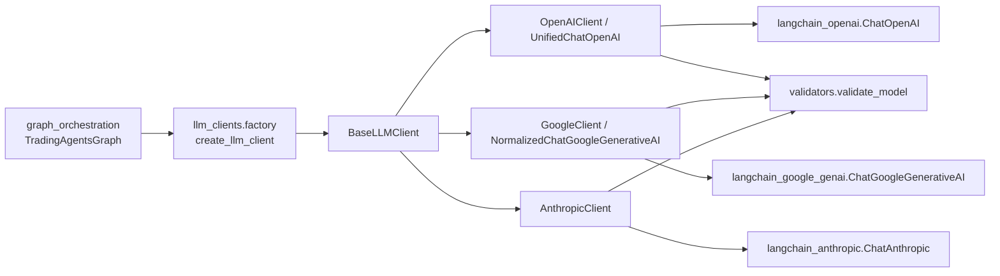
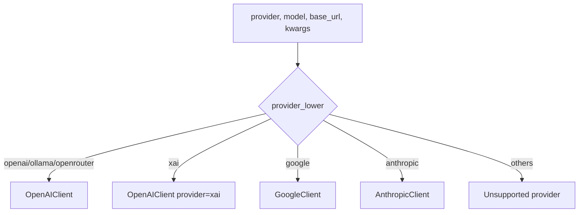
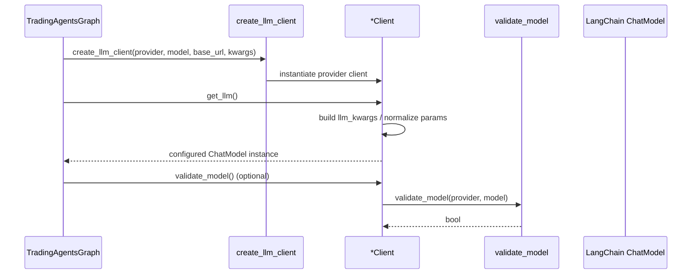
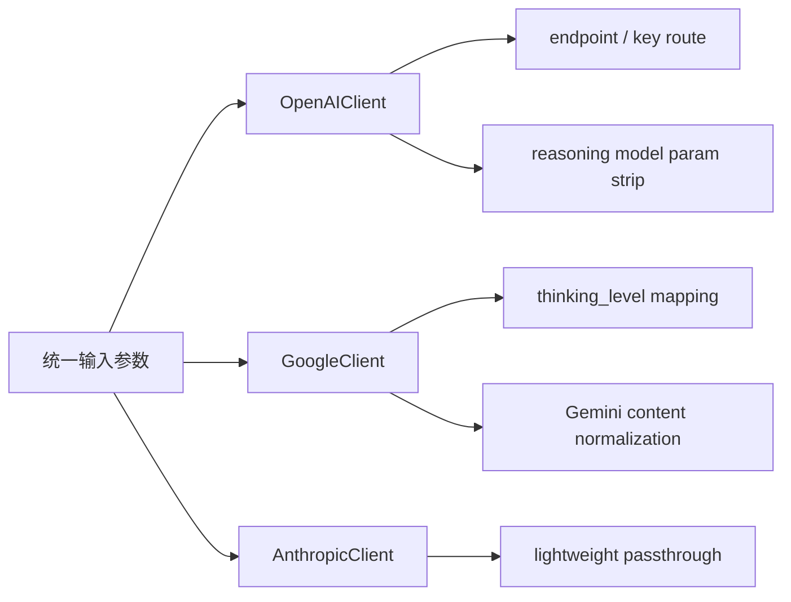

# llm_clients 模块文档

`llm_clients` 是 TradingAgents 系统中的“模型接入适配层”。它的目标不是做策略推理本身，而是把不同 LLM 提供商（OpenAI / Google / Anthropic，以及通过 OpenAI 兼容协议接入的 xAI、OpenRouter、Ollama）统一包装成同一套可调用接口，供上层图编排模块直接使用。

在系统设计上，这一层承担了两个关键职责。第一，它把“provider 差异”隔离在模块内部，避免 `graph_orchestration` 到处写 if/else。第二，它做了少量但非常实用的参数归一化与兼容处理，例如：OpenAI reasoning 系列模型自动移除不支持的采样参数、Gemini 响应内容结构标准化为字符串、`thinking_level` 到 `thinking_budget` 的映射等。换句话说，这个模块是上层业务“稳定调用体验”的前提。

---

## 1. 模块定位与系统关系

从整体系统看，`llm_clients` 位于图编排层与第三方 LLM SDK 之间。上游调用方通常是 `tradingagents.graph.trading_graph.TradingAgentsGraph`，下游是各 provider 的 LangChain ChatModel 实现。



上图体现了“工厂 + 抽象基类 + provider 子类”的典型分层：`create_llm_client` 负责路由，`BaseLLMClient` 定义统一契约，具体子类处理 provider 细节与参数映射。对于图编排模块而言，它只需要拿到 `.get_llm()` 结果，不需要理解各家 SDK 细节。关于上层如何消费这些客户端，可参考 [graph_orchestration.md](graph_orchestration.md)。

---

## 2. 设计动机与核心思路

在多 provider 场景中，最容易失控的是“参数语义不一致”。例如某些模型支持 `temperature`，某些不支持；有的 provider 使用 `thinking_level`，有的使用 `thinking_budget`；有的响应 `content` 是字符串，有的是结构化数组。如果把这些差异散落在业务代码中，维护成本会快速上升。

`llm_clients` 的设计思路是：

- 用 `BaseLLMClient` 强制所有 provider 实现 `get_llm()` 与 `validate_model()`。
- 用 `factory.create_llm_client()` 做统一入口，隐藏实例化细节。
- 在具体子类中做最小必要的“兼容性补丁”（normalization / 参数清洗）。
- 用 `validators` 做模型名白名单校验（但保持对部分 provider 的宽松策略）。

这是一种偏工程稳健性的设计：它不追求统一所有高级参数，而是优先保证“常用路径稳定可用”。

---

## 3. 核心组件详解

## 3.1 `BaseLLMClient`

`tradingagents.llm_clients.base_client.BaseLLMClient` 是一个抽象基类（`ABC`），定义了所有 LLM 客户端的最小公共接口。

```python
class BaseLLMClient(ABC):
    def __init__(self, model: str, base_url: Optional[str] = None, **kwargs)
    def get_llm(self) -> Any
    def validate_model(self) -> bool
```

它在初始化时保存三类信息：

- `model`：模型标识，例如 `gpt-5`、`gemini-2.5-pro`。
- `base_url`：可选自定义 API 地址（例如代理、私有网关）。
- `kwargs`：透传扩展参数（timeout、retries、callbacks、provider 私有参数等）。

`get_llm()` 约定返回“已配置完成”的 LangChain ChatModel 实例；`validate_model()` 约定返回该 client 是否支持当前模型名。由于这是抽象类，直接实例化会失败，必须由子类实现。

从维护角度看，这个类的价值是建立协议：上层可以面向接口编程，而不用知道底层到底是 OpenAI 还是 Google。

---

## 3.2 `OpenAIClient`

`tradingagents.llm_clients.openai_client.OpenAIClient` 负责 OpenAI 生态及 OpenAI-compatible provider（`openai`、`xai`、`openrouter`、`ollama`）。

### 构造与字段

```python
OpenAIClient(
    model: str,
    base_url: Optional[str] = None,
    provider: str = "openai",
    **kwargs,
)
```

其中 `provider` 会被标准化为小写并参与 `get_llm()` 分支逻辑。

### `get_llm()` 行为

该方法首先构造基础参数 `{"model": self.model}`，然后按 provider 注入 endpoint / key：

- `xai`：固定 `base_url = "https://api.x.ai/v1"`，从环境变量读取 `XAI_API_KEY`。
- `openrouter`：固定 `base_url = "https://openrouter.ai/api/v1"`，从 `OPENROUTER_API_KEY` 读取 key。
- `ollama`：固定 `base_url = "http://localhost:11434/v1"`，`api_key="ollama"`（占位，Ollama 通常不鉴权）。
- 其他情况：若用户提供了 `base_url`，则使用该值。

之后它会从 `self.kwargs` 中白名单抽取以下参数透传：

- `timeout`
- `max_retries`
- `reasoning_effort`
- `api_key`
- `callbacks`

最终返回 `UnifiedChatOpenAI(**llm_kwargs)`，而不是直接返回原生 `ChatOpenAI`。这是因为该模块还要处理某些模型参数兼容性（见下一节）。

### `validate_model()` 行为

`validate_model()` 内部调用 `validate_model(self.provider, self.model)`，即按 provider 检查模型名是否在白名单中（或按宽松规则放行）。

---

## 3.3 `UnifiedChatOpenAI`

`tradingagents.llm_clients.openai_client.UnifiedChatOpenAI` 继承自 `langchain_openai.ChatOpenAI`，目标是做“模型参数兼容修正”。

核心逻辑在 `__init__`：如果目标模型被识别为 reasoning 系列（`o1*`、`o3*`、或名称包含 `gpt-5`），会自动删除 `temperature` 与 `top_p`，避免传入不兼容参数导致请求失败。

```python
if self._is_reasoning_model(model):
    kwargs.pop("temperature", None)
    kwargs.pop("top_p", None)
```

判断函数 `_is_reasoning_model(model: str)` 为纯字符串规则，不依赖外部 API，开销很小。

### 为什么这很重要

上层业务代码往往习惯给所有模型传同一组采样参数。如果不做这层清洗，切换到 reasoning 模型时很容易因参数不支持而报错。`UnifiedChatOpenAI` 把这个坑在 client 层一次性兜住了。

---

## 3.4 `GoogleClient`

`tradingagents.llm_clients.google_client.GoogleClient` 用于 Gemini 系列模型，返回的是 `NormalizedChatGoogleGenerativeAI`。

### `get_llm()` 参数构建

初始参数为 `{"model": self.model}`，随后从 `self.kwargs` 透传以下白名单参数：

- `timeout`
- `max_retries`
- `google_api_key`
- `callbacks`

接下来是模块里最关键的 provider 特定映射：`thinking_level`。

- 若模型名包含 `gemini-3`：直接使用 `thinking_level`。
- 特殊修正：`gemini-3-pro` 不支持 `minimal`，会自动降级为 `low`。
- 若不是 `gemini-3`（即走 Gemini 2.5 逻辑）：把 `thinking_level` 映射为 `thinking_budget`。
  - `high -> -1`（dynamic）
  - 其他 -> `0`（基本关闭）

这个映射体现了“统一上层抽象，内部适配差异”的设计策略：上层只需关心 `thinking_level`，不需要理解各代 Gemini API 参数差异。

### `validate_model()`

固定调用 `validate_model("google", self.model)`。

---

## 3.5 `NormalizedChatGoogleGenerativeAI`

该类继承 `ChatGoogleGenerativeAI`，解决 Gemini 新版本响应格式不一致问题。

注释中指出：Gemini 3 可能返回

```python
content = [
  {"type": "text", "text": "..."}
]
```

而系统下游通常期望 `response.content` 是字符串。`_normalize_content()` 会把 list 内容抽取并拼接为单个字符串（以换行连接），然后覆盖 `response.content`。

它通过重写 `invoke()` 在每次调用后执行归一化：

```python
def invoke(self, input, config=None, **kwargs):
    return self._normalize_content(super().invoke(input, config, **kwargs))
```

### 副作用说明

这个实现会“原地修改”返回对象的 `content` 字段。好处是下游无感；代价是如果你想保留原始结构化片段，需要在此层扩展额外字段保存 raw content。

---

## 3.6 `AnthropicClient`

`tradingagents.llm_clients.anthropic_client.AnthropicClient` 是 Claude 模型适配层，结构相对直接。

`get_llm()` 初始参数 `{"model": self.model}`，并白名单透传：

- `timeout`
- `max_retries`
- `api_key`
- `max_tokens`
- `callbacks`

最后返回 `ChatAnthropic(**llm_kwargs)`。

`validate_model()` 调用 `validate_model("anthropic", self.model)`。

这个实现没有像 OpenAI/Google 那样做额外参数重写，说明当前系统中 Anthropic 路径主要依赖 SDK 默认行为。

---

## 3.7 `factory.create_llm_client`

虽然不在你给出的“核心组件列表”中，但它是该模块的实际入口，建议维护者优先理解。

```python
def create_llm_client(provider, model, base_url=None, **kwargs) -> BaseLLMClient
```

路由规则：

- `openai` / `ollama` / `openrouter` -> `OpenAIClient(..., provider=provider_lower)`
- `xai` -> `OpenAIClient(..., provider="xai")`
- `anthropic` -> `AnthropicClient`
- `google` -> `GoogleClient`
- 其他 provider -> 抛出 `ValueError`



这让上层只需一个工厂调用就能完成 provider 选择，降低了图编排代码复杂度。

---

## 3.8 `validators.validate_model`

`validators.py` 提供静态白名单 `VALID_MODELS` 与校验函数 `validate_model(provider, model)`。

关键行为有两点：

1. `ollama` 与 `openrouter` 永远返回 `True`（接受任意模型名）。
2. 若 provider 不在 `VALID_MODELS` 字典中，也返回 `True`（宽松策略）。

只有当 provider 在白名单字典里时，才做严格的 `model in VALID_MODELS[provider]` 判断。

这代表一个明确取舍：该校验更偏“提示与快速失败”，不是硬安全边界。系统可以较容易接入新模型，但也意味着某些拼写错误可能在更晚的请求阶段才暴露。

---

## 4. 模块内部流程与数据流

### 4.1 从配置到可调用 LLM 的路径



在当前代码中，`TradingAgentsGraph` 直接使用 `.get_llm()`，并没有强制在构造阶段调用 `validate_model()`。因此模型名校验是否启用，取决于上层调用约定。

### 4.2 provider 兼容策略总览



这个策略不是“把所有 provider 拉平”，而是“在必要处做最小修正”。其优势是简单、稳定；局限是高级特性仍需要针对 provider 定制。

---

## 5. 使用方式与配置示例

## 5.1 基础用法（推荐通过工厂）

```python
from tradingagents.llm_clients import create_llm_client

client = create_llm_client(
    provider="openai",
    model="gpt-5",
    base_url=None,
    timeout=60,
    max_retries=2,
)

llm = client.get_llm()
response = llm.invoke("Summarize market sentiment for AAPL today.")
print(response.content)
```

## 5.2 Google thinking 配置示例

```python
client = create_llm_client(
    provider="google",
    model="gemini-2.5-pro",
    thinking_level="high",   # 内部会映射到 thinking_budget=-1
    google_api_key="...",
)
llm = client.get_llm()
```

## 5.3 OpenRouter / xAI / Ollama 示例

```python
# OpenRouter
router_client = create_llm_client(
    provider="openrouter",
    model="openai/gpt-4o-mini",
)

# xAI
xai_client = create_llm_client(
    provider="xai",
    model="grok-4",
)

# Ollama (local)
ollama_client = create_llm_client(
    provider="ollama",
    model="qwen2.5:14b",
)
```

这些 provider 通过 `OpenAIClient` 路由，复用 OpenAI-compatible 调用协议。

## 5.4 与图编排模块协同

在 `TradingAgentsGraph` 中，系统会根据配置分别创建 `deep_client` 与 `quick_client`，然后调用 `.get_llm()` 注入图流程。你通常不需要手写这段逻辑，但在调试模型问题时理解这条路径非常关键。细节见 [graph_orchestration.md](graph_orchestration.md)。

---

## 6. 扩展指南：如何新增 provider 或增强能力

如果你要接入新 provider（例如 `azure_openai` 或内部网关），建议遵循以下演进路径。

首先，新增一个继承 `BaseLLMClient` 的子类，实现 `get_llm()` 与 `validate_model()`。其次，在 `factory.create_llm_client()` 中加入 provider 路由分支。最后，根据 provider 差异决定是否需要“输出归一化”或“参数重写”子类（类似 `UnifiedChatOpenAI`、`NormalizedChatGoogleGenerativeAI`）。

实践上，最容易踩坑的是“看起来兼容 OpenAI 协议，但字段行为并不完全一致”。因此建议把不兼容行为封装在 client 层，不要把修补逻辑泄漏到业务层。

---

## 7. 边界条件、错误场景与限制

`llm_clients` 当前实现整体简洁，但仍有一些需要明确的行为边界。

第一，`validate_model()` 不是强制调用，且校验策略偏宽松（未知 provider 默认放行，`ollama/openrouter` 永远放行）。这对快速迭代友好，但对“严格上线前校验”不够。若你需要强校验，建议在配置加载阶段额外做一次强制检查。

第二，`OpenAIClient` 对 `xai/openrouter` 读取环境变量 key，但如果环境变量不存在并不会立即报错，错误可能推迟到第一次 API 调用。生产环境建议在启动时做 key 完整性检查。

第三，`UnifiedChatOpenAI` 仅移除了 `temperature/top_p`，并未覆盖所有潜在不兼容参数。如果上层传入其他 reasoning 模型不支持字段，仍可能在请求阶段失败。

第四，`GoogleClient` 的 `thinking_level -> thinking_budget` 映射较粗（高 vs 非高）。如果未来 Gemini API 细粒度预算策略变化，当前映射可能过于保守，需要按版本更新。

第五，`NormalizedChatGoogleGenerativeAI` 只在 `invoke()` 路径做归一化；若调用方使用其他调用模式（例如某些 batch/stream 接口），可能无法自动获得同等规范化效果。

第六，`BaseLLMClient` 返回类型是 `Any`，对静态类型检查不够友好。这是为了兼容多 SDK，但也意味着 IDE 类型提示能力有限。

---

## 8. 运维与调试建议

当你遇到“同一策略切 provider 后表现异常”时，建议按以下顺序定位：先确认工厂路由是否正确命中目标 client；再检查 `get_llm()` 组装后的关键参数（模型名、base_url、api_key、thinking/reasoning 参数）；最后检查响应对象 `content` 是否已归一化。这个顺序通常能快速区分是“配置问题”、“参数兼容问题”还是“模型语义问题”。

如果你在 CLI 场景使用统计回调（例如 `StatsCallbackHandler`），确保通过 `callbacks` 参数传入 client，使 token/tool 统计能贯穿所有 provider。相关观测组件可参考 [cli_and_observability.md](cli_and_observability.md)。

---

## 9. 与其他模块的边界说明

`llm_clients` 只负责“拿到一个可调用的 LLM 对象并做必要适配”，它不负责：

- 交易流程编排（由 [graph_orchestration.md](graph_orchestration.md) 负责）
- 状态字段定义与记忆检索（由 [state_and_memory.md](state_and_memory.md) 负责）
- 行情/财务数据采集（由 `dataflow_tools` 负责）
- CLI 交互与统计展示（由 `cli_and_observability` 负责）

理解这个边界有助于你在排障时快速定位责任层级，避免在错误模块里做无效修改。

---

## 10. 相关文档

- 图编排与执行主流程： [graph_orchestration.md](graph_orchestration.md)
- 状态结构与记忆系统： [state_and_memory.md](state_and_memory.md)
- CLI 与可观测性： [cli_and_observability.md](cli_and_observability.md)
- 数据工具能力： [dataflow_tools.md](dataflow_tools.md)

建议阅读顺序是：先看 `graph_orchestration` 理解调用上下文，再看本文理解 provider 适配细节，最后结合 state/memory 文档理解完整闭环。
