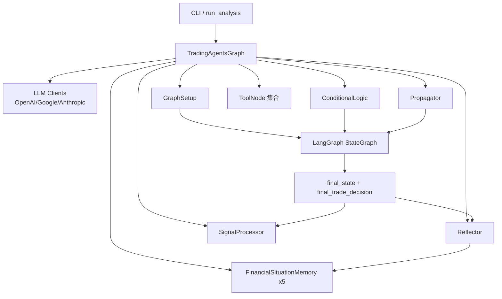
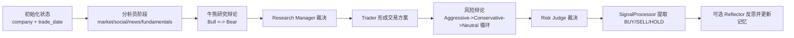
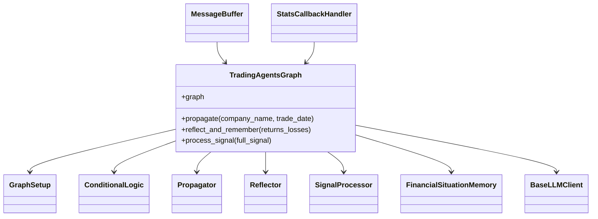

# TradingAgents 模块文档

## 1. 模块概述

`TradingAgents` 是一个以 **多智能体（Multi-Agent）协作** 为核心的金融交易分析框架。它将传统“单模型一次性给结论”的方式，拆解为多个具有明确分工的角色：市场分析员、社媒分析员、新闻分析员、基本面分析员、牛熊研究员、交易员、风险分析员与最终裁决者。每个角色在图工作流（LangGraph）中按顺序或按条件循环推进，最终产出可执行的交易决策。

这个模块存在的核心原因是：真实交易决策通常不是单一信号驱动，而是来自多源信息融合、观点博弈与风险约束。`TradingAgents` 通过图编排把这些过程“显式化”——你可以看到每一步是谁做的、用了什么工具、为什么继续/停止讨论、最后如何落到 BUY/SELL/HOLD。对开发者来说，这种结构比黑盒链路更易调试、审计与扩展。

从工程角度看，该模块还解决了三个常见痛点：

1. **模型与供应商耦合问题**：通过 `BaseLLMClient` 抽象与 OpenAI/Google/Anthropic 客户端实现，实现统一接入与参数归一化。
2. **状态可追踪问题**：通过 `AgentState` / `InvestDebateState` / `RiskDebateState` 明确状态结构，保证每个节点读写有边界。
3. **经验难复用问题**：通过 `FinancialSituationMemory` + `Reflector` 在事后反思中沉淀“情境-建议”记忆，形成轻量经验库。

---

## 2. 架构总览

### 2.1 高层架构图



该架构以 `TradingAgentsGraph` 作为门面（Facade）。它负责组装 LLM、工具节点、条件逻辑、状态初始化器与反思器；`GraphSetup` 负责把这些组件编译成可执行图；CLI 负责用户交互、流式展示与统计。执行结束后，系统既输出交易结论，也可将结果反思后写入记忆，形成下一轮可复用经验。

### 2.2 执行流程图（端到端）



这条流程体现了模块的核心设计思想：先“信息收集”，再“观点对抗”，再“风险约束”，最后“动作提纯”。相比直接让模型输出交易建议，这种流程更稳定，也更利于定位错误来源。

---

## 3. 子模块导航（建议按此顺序阅读）

### 3.1 图编排与核心执行
详见：[graph_orchestration.md](graph_orchestration.md)

该文档覆盖 `TradingAgentsGraph`、`GraphSetup`、`ConditionalLogic`、`Propagator`、`Reflector`、`SignalProcessor`。如果你只读一个文件来理解系统如何跑起来，优先看这里。它解释了图节点如何动态生成（基于所选 analyst）、边如何条件跳转、如何在 debug/非 debug 模式执行，以及如何记录状态日志。

### 3.2 状态与记忆系统
详见：[state_and_memory.md](state_and_memory.md)

该部分解释 `AgentState` 与两类 debate state 的字段语义，以及 `FinancialSituationMemory` 的 BM25 检索机制。重点在于：状态结构决定了节点契约，记忆结构决定了反思可复用程度。扩展新节点时必须先对齐状态字段。

### 3.3 LLM 客户端抽象层
详见：[llm_clients.md](llm_clients.md)

这里介绍 `BaseLLMClient` 与 OpenAI/Google/Anthropic 三类实现，包含参数映射（如 `thinking_level`、`reasoning_effort`）、模型校验与输出归一化（Google 响应 list->string）。当你接入新供应商时，应参考这一层而不是直接改图逻辑。

### 3.4 CLI 与可观测性
详见：[cli_and_observability.md](cli_and_observability.md)

该文档说明 `MessageBuffer` 如何管理进度与报告片段、`StatsCallbackHandler` 如何统计 LLM/Tool 调用与 token。它是调试执行流程、优化成本和改进用户体验的关键入口。

### 3.5 数据流工具（技术指标）
详见：[dataflow_tools.md](dataflow_tools.md)

重点是 `StockstatsUtils.get_stock_stats` 的缓存策略、指标计算触发方式、非交易日返回规则。与图模块相比，这部分更偏数据工程和工具可靠性。

---

## 4. 关键组件关系

### 4.1 组件依赖图



`TradingAgentsGraph` 是依赖汇聚点；其余组件应尽量保持“单一职责”：
- `GraphSetup` 只负责图装配，不负责模型选择。
- `ConditionalLogic` 只负责分支条件，不负责节点计算。
- `Propagator` 只负责初始化状态和执行参数。
- `Reflector` 只负责复盘与记忆写入。
- `SignalProcessor` 只负责决策字符串提纯。

这种分离让你可以单独替换任意环节（例如替换反思策略），而不影响主流程。

---

## 5. 使用与配置指南

### 5.1 最小使用方式（Python）

```python
from tradingagents.graph.trading_graph import TradingAgentsGraph

config = {
    "llm_provider": "openai",
    "quick_think_llm": "gpt-4o-mini",
    "deep_think_llm": "gpt-4o",
    "backend_url": None,
    "max_debate_rounds": 2,
    "max_risk_discuss_rounds": 2,
}

graph = TradingAgentsGraph(
    selected_analysts=["market", "news", "fundamentals"],
    debug=False,
    config=config,
)

final_state, decision = graph.propagate("AAPL", "2025-01-15")
print(decision)  # BUY / SELL / HOLD
```

### 5.2 CLI 使用方式

CLI 会引导你选择：ticker、日期、analysts、研究深度、LLM provider、thinker 模型与 provider-specific 参数。运行过程中：
- 左侧显示 agent 状态流转
- 右侧显示最新报告片段
- 底部显示调用统计（LLM/Tools/Tokens/耗时）

适合日常策略分析、演示与问题定位。

### 5.3 常用配置建议

- **研究深度**：通过 `max_debate_rounds` 与 `max_risk_discuss_rounds` 控制回合数，回合越多成本越高。
- **模型分工**：`quick_think_llm` 给分析员和执行节点，`deep_think_llm` 给裁决类节点（如 Research Manager / Risk Judge）通常更稳。
- **provider 参数**：
  - Google: `google_thinking_level`
  - OpenAI: `openai_reasoning_effort`
- **回调观测**：把 `StatsCallbackHandler` 通过 `callbacks` 传入，可统计成本和调用行为。

---

## 6. 扩展开发指南

### 6.1 新增 Analyst 类型

你需要同时修改三层：
1. `GraphSetup.setup_graph`：增加 analyst 节点、消息清理节点、tool node、边连接逻辑。
2. `ConditionalLogic`：新增 `should_continue_xxx` 方法。
3. CLI：在 `AnalystType`、`MessageBuffer.ANALYST_MAPPING`、报告映射中加入新类型。

如果只改其中一层，常见结果是图可编译但状态展示错误，或 CLI 可选但图中不存在节点。

### 6.2 新增 LLM Provider

建议流程：
1. 继承 `BaseLLMClient` 实现 `get_llm` / `validate_model`。
2. 在工厂函数（`create_llm_client`，见 `llm_clients` 子模块）注册 provider。
3. 如有响应结构差异，像 Google 客户端那样做内容归一化。

### 6.3 替换记忆机制

当前记忆使用 BM25（离线、快、便宜）。若你改为向量检索：
- 保持 `add_situations` / `get_memories` / `clear` 接口不变，降低对上层影响。
- 注意反思文本可能很长，需要考虑存储与召回截断策略。

---

## 7. 边界条件、错误与限制

1. **未选择 analyst 会直接报错**：`GraphSetup.setup_graph` 在 `selected_analysts` 为空时抛 `ValueError`。
2. **状态字段依赖强**：`Reflector` 与条件逻辑大量使用硬编码键名，字段缺失会触发 `KeyError`。
3. **LLM 输出非结构化风险**：`SignalProcessor` 依赖模型严格输出 BUY/SELL/HOLD，需对异常输出做上层兜底。
4. **token 统计并非全量可靠**：`StatsCallbackHandler` 依赖供应商是否返回 `usage_metadata`。
5. **行情日期问题**：`StockstatsUtils` 在非交易日返回 `N/A...` 字符串，调用方要做好类型判断。
6. **回合上限的隐性成本**：回合数线性提高图执行深度与 LLM 成本；在高频运行场景要慎配。

---

## 8. 运维与调试建议

- 开启 `debug=True` 可看到流式 chunk 和消息轨迹，适合定位“卡在哪个节点”。
- 定期检查 `eval_results/<ticker>/TradingAgentsStrategy_logs/` 中的 `full_states_log_*.json`，可回放历史决策上下文。
- 对 CLI 场景，优先观察 `MessageBuffer` 中 agent 状态是否按预期推进；若状态乱序，先查报告字段写入逻辑。

---

## 9. 快速索引

### 9.1 文档交叉引用

- 主文档：`TradingAgents.md`
- 图编排：[`graph_orchestration.md`](graph_orchestration.md)
- 状态与记忆：[`state_and_memory.md`](state_and_memory.md)
- LLM 客户端：[`llm_clients.md`](llm_clients.md)
- CLI 与可观测性：[`cli_and_observability.md`](cli_and_observability.md)
- 数据流工具：[`dataflow_tools.md`](dataflow_tools.md)

### 9.2 代码入口快速索引

- 核心编排入口：`tradingagents.graph.trading_graph.TradingAgentsGraph`
- 图构建：`tradingagents.graph.setup.GraphSetup`
- 分支条件：`tradingagents.graph.conditional_logic.ConditionalLogic`
- 初始状态：`tradingagents.graph.propagation.Propagator`
- 反思记忆：`tradingagents.graph.reflection.Reflector`
- 决策提纯：`tradingagents.graph.signal_processing.SignalProcessor`
- 记忆实现：`tradingagents.agents.utils.memory.FinancialSituationMemory`
- CLI 状态缓冲：`cli.main.MessageBuffer`
- 统计回调：`cli.stats_handler.StatsCallbackHandler`

如果你是首次接手该模块，建议阅读顺序：
`TradingAgents.md` → [graph_orchestration.md](graph_orchestration.md) → [state_and_memory.md](state_and_memory.md) → [llm_clients.md](llm_clients.md) → [cli_and_observability.md](cli_and_observability.md)。
