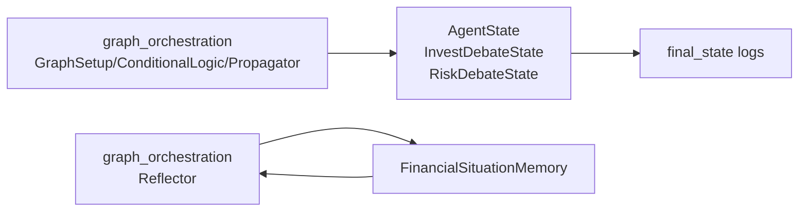
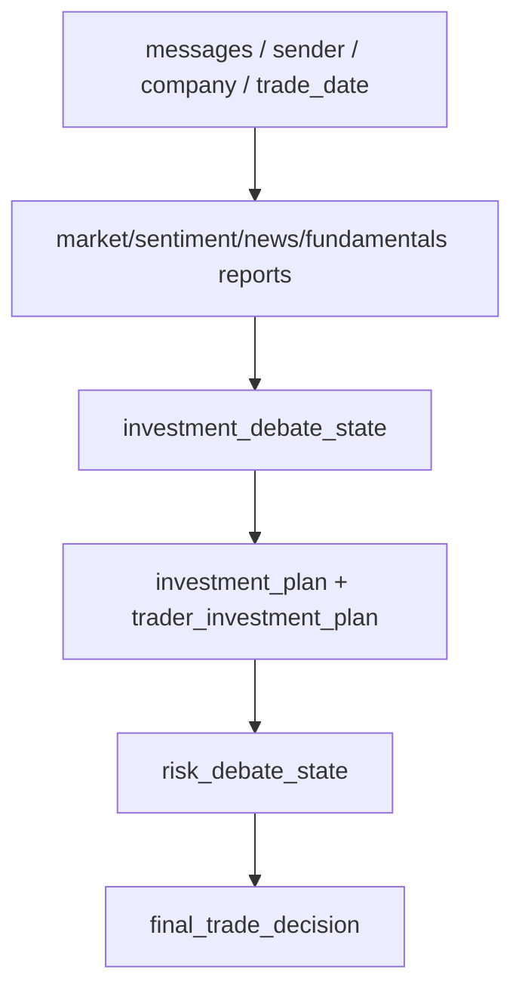
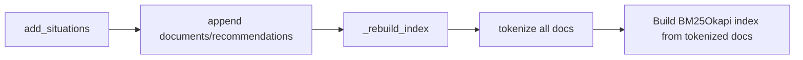
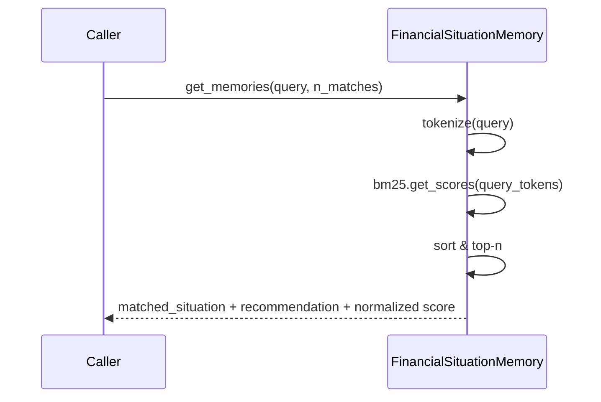
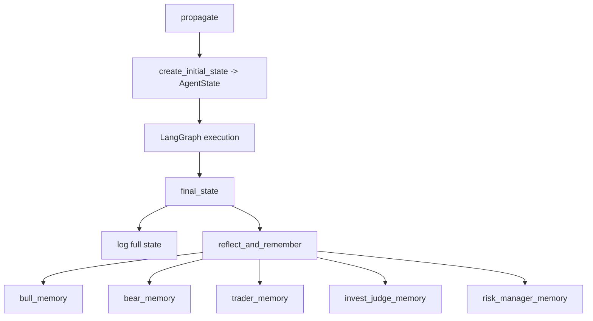

# state_and_memory 模块文档

`state_and_memory` 是 TradingAgents 系统中“状态契约（state contract）+ 经验记忆（memory substrate）”的基础层。它本身不直接执行交易决策，也不直接调用外部行情工具；它的核心价值在于定义多 Agent 协作时**共享数据应该长成什么样**，并提供一个无需向量数据库、可离线运行的轻量检索记忆能力。前者保证图编排模块在跨节点传递信息时语义一致、字段可预期，后者保证系统能够把历史复盘沉淀为可被后续任务复用的策略经验。

从系统分层看，`graph_orchestration` 依赖本模块中定义的 `AgentState` / 辩论子状态来运行 LangGraph 主流程，并依赖 `FinancialSituationMemory` 完成复盘后的经验写入与检索。因此，本模块虽然代码量不大，却是系统稳定性的关键“地基”：状态定义一旦漂移，图中条件路由和节点读写就会出现连锁错误；记忆实现如果行为不稳定，复盘闭环就会退化为一次性输出。

---

## 1. 模块组成与职责边界

本模块包含两个核心文件：

- `tradingagents.agents.utils.agent_states`
- `tradingagents.agents.utils.memory`

前者提供三类状态类型：顶层 `AgentState`、投资辩论子状态 `InvestDebateState`、风险辩论子状态 `RiskDebateState`；后者提供 `FinancialSituationMemory`，使用 BM25 做词法相似度检索。



上图可以理解为两条主线：第一条是“运行时状态主线”，`GraphSetup` 和节点函数围绕 `AgentState` 读写；第二条是“复盘记忆主线”，`Reflector` 根据执行结果写入 `FinancialSituationMemory`，为后续相似情境提供经验检索。

关于图编排执行细节与节点路由，请参考 [graph_orchestration.md](graph_orchestration.md)；本文只聚焦状态和记忆本身。

---

## 2. 设计动机：为什么要把状态和记忆单独抽离

在多 Agent 协同系统里，最常见的问题并不是“模型不聪明”，而是“协同信息不稳定”。例如：某节点以为字段叫 `judge_decision`，另一个节点写成 `decision`；某条件函数需要 `latest_speaker`，但上游从未初始化。将状态结构集中在 `agent_states.py` 中可显著降低这种隐式耦合风险。

另外，很多记忆系统默认依赖 embedding API 和向量库，这在离线环境、成本敏感环境或多 LLM provider 混用环境下会增加维护负担。`FinancialSituationMemory` 选择 BM25 的取舍非常明确：牺牲部分语义召回，换取零外部服务、零 token 开销、可解释分数与部署简洁度。

---

## 3. 状态模型详解（agent_states.py）

## 3.1 `InvestDebateState`

`InvestDebateState` 是投资辩论阶段（Bull vs Bear + 投资裁判）的局部状态容器，类型为 `TypedDict`。它用于承载辩论历史、最新发言、轮次计数及裁判结论。

```python
class InvestDebateState(TypedDict):
    bull_history: str
    bear_history: str
    history: str
    current_response: str
    judge_decision: str
    count: int
```

字段语义应按以下方式理解：

- `bull_history` 与 `bear_history` 分别记录多空角色自己的历史发言轨迹，便于角色内复盘。
- `history` 是汇总后的公共辩论上下文，便于 Manager/Judge 做整体判断。
- `current_response` 用于路由判断当前“最后说话者”是谁（例如以 `Bull...` 前缀）。
- `judge_decision` 存储投资裁判最终裁决文本。
- `count` 是辩论轮次控制字段，`ConditionalLogic.should_continue_debate` 依赖它进行硬截止。

### 运行时注意

这是 `TypedDict`，不是运行时强校验模型（不像 Pydantic）。因此字段缺失通常不会在赋值时自动报错，而会在后续读取时触发 `KeyError`。在扩展节点时，应把“完整初始化 + 字段名一致性”视为强约束。

---

## 3.2 `RiskDebateState`

`RiskDebateState` 是风险讨论阶段（Aggressive / Conservative / Neutral + Risk Judge）的局部状态。

```python
class RiskDebateState(TypedDict):
    aggressive_history: str
    conservative_history: str
    neutral_history: str
    history: str
    latest_speaker: str
    current_aggressive_response: str
    current_conservative_response: str
    current_neutral_response: str
    judge_decision: str
    count: int
```

与投资辩论不同，这里是三方循环，所以除了公共 `history` 外，还需要 `latest_speaker` 来驱动顺序轮转（Aggressive → Conservative → Neutral）。`count` 同样用于上限控制，`ConditionalLogic.should_continue_risk_analysis` 直接读取该值并在达到阈值后转入 `Risk Judge`。

### 运行时注意

`latest_speaker` 是风险辩论路由的关键字段。如果节点没有正确更新它，流程可能错误回跳到默认分支（实现中默认回到 `Aggressive Analyst`），从而造成讨论偏置或无效循环。

---

## 3.3 `AgentState`

`AgentState` 继承 `MessagesState`，是整个策略图的顶层共享状态。它把“会话消息轨迹”与“结构化业务字段”合并，既支持 LangGraph 工具调用范式，也支持下游日志审计和复盘。

```python
class AgentState(MessagesState):
    company_of_interest: str
    trade_date: str
    sender: str

    market_report: str
    sentiment_report: str
    news_report: str
    fundamentals_report: str

    investment_debate_state: InvestDebateState
    investment_plan: str
    trader_investment_plan: str

    risk_debate_state: RiskDebateState
    final_trade_decision: str
```

可以把它分为四个层次：

1. **元信息层**：`company_of_interest`、`trade_date`、`sender`。
2. **研究报告层**：四类 analyst 报告字段。
3. **投资决策层**：`investment_debate_state`、`investment_plan`、`trader_investment_plan`。
4. **风险裁决层**：`risk_debate_state`、`final_trade_decision`。



这个状态拓扑与策略执行顺序一致，因此它既是“数据容器”，也是“流程语义映射”。当你阅读某次 `final_state` 日志时，可以按这个顺序快速定位问题发生在哪个阶段。

### 与 `Propagator` 的契约细节

`Propagator.create_initial_state` 在初始化时只设置部分字段（例如辩论子状态只初始化了最小必要键）。这意味着某些字段需要由后续节点补全。如果节点链路被裁剪或提前终止，直接读取未填字段可能报错。该行为在当前架构中是可接受的，但维护者需要在新增读取逻辑时做空值/缺键防护。

---

## 4. 记忆系统详解（memory.py）

## 4.1 `FinancialSituationMemory` 总览

`FinancialSituationMemory` 是一个面向“市场情境 → 建议文本”的内存检索器。它不做长期持久化，不区分多租户，也不做语义向量；核心流程是：保存样本、重建 BM25 索引、按查询返回 top-n 匹配。

```python
class FinancialSituationMemory:
    def __init__(self, name: str, config: dict = None)
    def add_situations(self, situations_and_advice: List[Tuple[str, str]])
    def get_memories(self, current_situation: str, n_matches: int = 1) -> List[dict]
    def clear(self)
```

在 `TradingAgentsGraph` 中，系统会创建五个实例（bull/bear/trader/invest_judge/risk_manager），分别存放不同角色的复盘经验，避免角色间经验污染。

---

## 4.2 初始化：`__init__(name, config=None)`

构造函数保存 `name`，并初始化三个关键属性：

- `documents: List[str]`：保存历史“情境描述”；
- `recommendations: List[str]`：保存与情境一一对应的建议文本；
- `bm25`：索引对象，初始为 `None`。

`config` 参数目前不参与 BM25 逻辑，仅用于 API 兼容。这是一个重要行为：调用方不要误以为能通过 `config` 调整 tokenization 或 BM25 参数（当前做不到）。

---

## 4.3 分词：`_tokenize(text)`

该方法使用正则 `\b\w+\b` 提取小写 token，属于“空白+标点切分”级别的简化分词。它的优点是轻量、稳定、无需额外依赖；缺点是语言学能力有限，例如：

- 对金融缩写、连字符词、特殊 ticker 的切分可能不理想；
- 对中文文本不友好（更适配英文语料）；
- 不包含词形还原、停用词处理、同义词扩展。

因此，如果你的复盘语料主要是中文，建议在扩展版本中替换 `_tokenize` 实现。

---

## 4.4 索引维护：`_rebuild_index()`

每次新增样本后都会全量重建 BM25 索引：先对所有 `documents` 分词，再构造 `BM25Okapi`。当文档量很小时，这种策略简单且可靠；当记忆规模增长到数万条以上时，全量重建会成为开销热点。



如果未来要扩展到大规模在线学习，建议引入增量索引或外部检索后端。

---

## 4.5 写入：`add_situations(situations_and_advice)`

该方法接受 `(situation, recommendation)` 二元组列表，逐条追加到数组，然后重建索引。它没有做输入去重、长度限制或类型严检，意味着调用方应自行保证数据质量。

典型调用（来自复盘逻辑）：

```python
memory.add_situations([
    (current_market_situation_text, reflection_result_text)
])
```

### 副作用

调用后会改变内存中的全部检索分布，因为 BM25 的 IDF 与文档集合绑定；这意味着即便旧样本不变，新增数据也会影响旧查询排序。

---

## 4.6 检索：`get_memories(current_situation, n_matches=1)`

检索流程是：查询分词 → 计算所有文档 BM25 分数 → 按分数降序取 top-n → 返回结构化结果。

返回格式：

```python
[
  {
    "matched_situation": "...",
    "recommendation": "...",
    "similarity_score": 0.0~1.0
  }
]
```

其中 `similarity_score` 并非 BM25 原始分值，而是以当前查询下的最大分数做归一化。该设计可让不同查询结果在 UI 上更易展示，但要注意：这个分数**不能跨查询直接比较**。



### 边界行为

- 如果还没有文档或索引为空，直接返回 `[]`。
- 如果所有得分都 `<= 0`，归一化分母会被设为 `1`，避免除零。
- 若 `n_matches` 大于文档数，不会报错，返回现有文档数量。

---

## 4.7 清空：`clear()`

`clear` 会重置 `documents`、`recommendations` 并置空索引。该操作不可恢复，常用于测试隔离或策略重置。

---

## 5. 组件关系与系统集成路径

`state_and_memory` 在系统中的位置可以归纳为“运行态契约 + 复盘态存储”。



从这条链路可以看到，本模块并不关心节点 prompt 细节，也不关心具体 LLM provider（OpenAI/Google/Anthropic）；这些职责属于 [graph_orchestration.md](graph_orchestration.md) 和 [llm_clients.md](llm_clients.md)。本模块只定义“承载结果的数据结构”和“如何记住经验”。

---

## 6. 使用说明与示例

## 6.1 直接使用 `FinancialSituationMemory`

```python
from tradingagents.agents.utils.memory import FinancialSituationMemory

mem = FinancialSituationMemory("risk_manager_memory")

mem.add_situations([
    (
        "Rising yields and strong dollar pressure on growth and EM assets",
        "Reduce long-duration growth exposure; hedge FX risk; increase defensive allocation."
    ),
    (
        "Volatility spike with institutional selling in high-beta tech",
        "Lower gross exposure and tighten stop-loss thresholds."
    ),
])

hits = mem.get_memories(
    "Institutional selling increases in tech while rates continue rising",
    n_matches=2,
)

for h in hits:
    print(h["similarity_score"], h["recommendation"])
```

## 6.2 在策略生命周期中的典型用法

在实际系统里，你通常不会手动调用 `add_situations`，而是通过图执行与反思流程自动写入：

```python
from tradingagents.graph.trading_graph import TradingAgentsGraph

graph = TradingAgentsGraph(debug=False)
final_state, signal = graph.propagate("AAPL", "2025-01-15")

# 拿到真实收益后触发复盘，写入五类角色记忆
graph.reflect_and_remember("+2.4%")

# 如需查看某个角色记忆
recs = graph.trader_memory.get_memories(
    final_state["market_report"] + "\n" + final_state["news_report"],
    n_matches=1,
)
```

---

## 7. 可扩展性建议

如果你要扩展本模块，建议优先沿两个方向演进。

第一是“状态强校验化”。当前 `TypedDict` 更偏静态类型提示，运行时约束有限。若系统规模变大，可考虑迁移为 Pydantic model（含默认值、字段验证、序列化策略），减少生产中的缺键错误。

第二是“记忆后端可插拔化”。目前 BM25 很适合小规模离线场景；若要提升语义召回，可抽象 `MemoryBackend` 接口并提供 BM25 / Embedding Vector / Hybrid 检索实现，保留现有 API（`add_situations` / `get_memories`）不变。

---

## 8. 边界条件、错误场景与限制

本模块最常见的问题不是算法异常，而是状态契约偏离。

首先，`Propagator` 初始状态并未填充 `AgentState` 的全部字段；如果某节点/日志逻辑假设字段必然存在，会触发 `KeyError`。解决方式是为每个读取点增加缺省处理，或统一在初始化阶段提供完整默认值。

其次，`ConditionalLogic` 对 `current_response` / `latest_speaker` 的字符串前缀有隐式假设（例如必须以 `Bull`、`Aggressive` 开头）。如果节点 prompt 改写了格式，路由会偏离预期。建议在节点输出中固定 machine-readable 前缀。

第三，`FinancialSituationMemory` 不是线程安全容器。若在并发环境多线程同时写入，`documents` 与 `recommendations` 可能出现竞态。服务化部署时应加锁或使用进程内单线程队列。

第四，BM25 的词法匹配无法可靠处理语义同义改写；它更擅长“词面接近”的场景。因此，记忆命中质量高度依赖你写入的 `situation` 文本是否覆盖关键术语。

第五，`config` 目前在 `FinancialSituationMemory` 中未使用，这可能让调用方误判“配置已生效”。建议在文档和代码中持续明确该行为，或在未来版本实现真实可配置参数。

---

## 9. 维护与排障建议

当你遇到流程异常时，可以先做两步最小定位：先检查 `final_state` 中辩论子状态字段是否齐全，再检查对应角色 memory 中是否确实写入了 `(situation, recommendation)`。如果第一步不完整，问题在节点写状态；如果第一步完整但第二步为空，问题多半在反思调用链或 memory 写入路径。

在回归测试方面，建议至少覆盖三类用例：

- 状态完整性：每条主路径结束后关键字段存在且类型正确。
- 路由可收敛性：`count` 与 `latest_speaker` 更新能使循环在阈值内结束。
- 记忆可用性：写入后可检索、`clear` 后为空、空索引查询不报错。

---

## 10. 相关文档

- 图编排与执行生命周期： [graph_orchestration.md](graph_orchestration.md)
- LLM provider 适配与客户端实现： [llm_clients.md](llm_clients.md)
- CLI 交互与可观测性： [cli_and_observability.md](cli_and_observability.md)
- 数据工具与指标能力： [dataflow_tools.md](dataflow_tools.md)

建议阅读顺序是先看 `graph_orchestration` 再看本文：前者帮助你理解状态在流程中的“何时被写入”，本文帮助你理解状态与记忆“应该被写成什么样”。