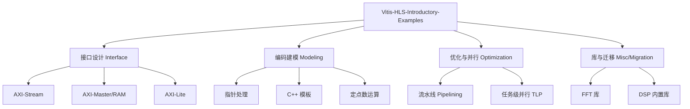

# Vitis-HLS-Introductory-Examples：硬件加速设计的“罗塞塔石碑”

`Vitis-HLS-Introductory-Examples` 模块是一个综合性的参考库，旨在指导开发者如何利用 C/C++ 语言通过 Vitis 高级综合（HLS）技术构建高效的硬件加速器。它不仅仅是一堆代码示例，更是一套将软件思维转化为硬件逻辑的完整方法论。

对于刚加入团队的资深工程师来说，可以将此模块视为硬件设计的“罗塞塔石碑”：它展示了如何将软件中的抽象概念（如结构体、指针、递归模板）翻译成硬件中的物理实体（如 AXI 接口、BRAM 存储、流水线逻辑）。

## 核心架构概览

该模块采用扁平化的案例结构，每个子目录都是一个独立的 HLS 内核（Kernel）示例。虽然它们在逻辑上是独立的，但共同遵循 Vitis HLS 的设计范式。

### 核心组件角色

1.  **内核（Kernels）**：以 `extern "C"` 或特定顶层函数定义的 C++ 函数，是硬件逻辑的入口。
2.  **配置文件（hls_config.cfg / run_hls.tcl）**：定义了硬件约束（时钟、目标芯片）和综合策略。
3.  **测试平台（Testbenches）**：用于验证 C 仿真（csim）和 RTL 协同仿真（cosim）的正确性。

## 关键设计决策与权衡

### 1. 接口协议的选择：Stream vs. Master vs. Lite
在硬件设计中，接口决定了数据吞吐量的上限。
-   **AXI4-Stream (`hls::stream`)**：用于高性能、连续的数据流。它没有地址概念，通过握手协议实现生产者和消费者的解耦。
-   **AXI4-Master (`m_axi`)**：用于随机访问外部存储（如 DDR）。它支持突发传输（Burst），能有效掩盖存储延迟。
-   **AXI4-Lite (`s_axilite`)**：用于低速控制寄存器。它允许主机（Host）配置内核参数或读取状态。

**权衡**：Stream 接口资源占用最少且效率最高，但要求数据必须按序处理；Master 接口最灵活，但逻辑复杂且受限于内存带宽。

### 2. 并行度的提升：流水线 (Pipelining) vs. 展开 (Unrolling)
-   **流水线 (`#pragma HLS PIPELINE`)**：通过重叠执行循环的不同迭代来提高吞吐量。目标是实现起始间隔（II）为 1。
-   **展开 (`#pragma HLS UNROLL`)**：通过复制硬件资源来并行执行循环体。

**权衡**：流水线在不显著增加面积的情况下提高吞吐量；展开则通过消耗更多面积（DSP、LUT）来换取极高的速度。

### 3. 存储架构：数组分区 (Array Partitioning)
为了支持并行访问，HLS 需要将单端口的 BRAM 拆分为多个独立的存储块。
-   **完全分区 (Complete)**：将数组彻底拆分为独立的寄存器。
-   **循环/块分区 (Cyclic/Block)**：将数组拆分为多个较小的存储体。

**权衡**：分区增加了存储带宽，但也极大地增加了多路复用器（Mux）的面积和布线压力。

## 数据流向追踪

以一个典型的存储转发内核为例：
1.  **输入阶段**：数据通过 `m_axi` 接口从外部内存读入。HLS 尝试推断“突发传输”以优化带宽。
2.  **处理阶段**：数据进入 `DATAFLOW` 区域。内部函数通过 `hls::stream` 或乒乓缓冲（Ping-pong Buffer）连接，形成任务级流水线。
3.  **计算阶段**：在循环内部，通过 `PIPELINE` 指令实现指令级并行。
4.  **输出阶段**：计算结果通过 `m_axi` 写回外部内存，或通过 `axis` 发送给下游内核。

## 子模块索引

本模块划分为以下四个核心领域进行详细探讨：

| 子模块 | 职责描述 | 详细文档 |
| :--- | :--- | :--- |
| **接口设计 (interface_design)** | 涵盖 AXI-Stream、AXI-Master、AXI-Lite 以及结构体聚合/分解的实现。 | [接口设计详情](optimization_parallelism-interface_design.md) |
| **编码建模 (coding_modeling)** | 探讨指针算术、C++ 模板硬件化、定点数运算及向量化建模。 | [编码建模详情](coding_modeling.md) |
| **优化与并行 (optimization_parallelism)** | 深入研究循环流水线、任务级并行（TLP）以及数组分区策略。 | [优化并行详情](optimization_parallelism.md) |
| **库与迁移 (libraries_migration)** | 介绍 FFT/DSP 库的使用、RTL 黑盒集成以及从旧版 HLS 迁移的脚本。 | [库与迁移详情](libraries_migration.md) |

## 贡献者指南：避坑指南

-   **隐式契约**：HLS 假设指针不会发生别名（Aliasing）。如果你的代码中存在指针别名，必须使用 `#pragma HLS DEPENDENCE` 显式声明，否则会导致错误的硬件逻辑。
-   **递归限制**：硬件不支持动态递归。所有的递归（如模板递归）必须在编译时可展开。
-   **浮点数陷阱**：虽然支持 `float` 和 `double`，但它们消耗巨大的硬件资源。在可能的情况下，优先使用 `ap_fixed` 定点数。
-   **II=1 的挑战**：如果流水线无法达到 II=1，通常是因为内存端口冲突或长路径组合逻辑。检查数组分区和寄存器平衡。
