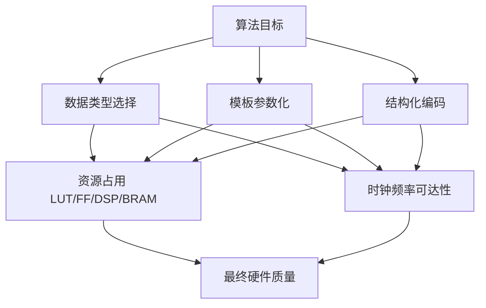
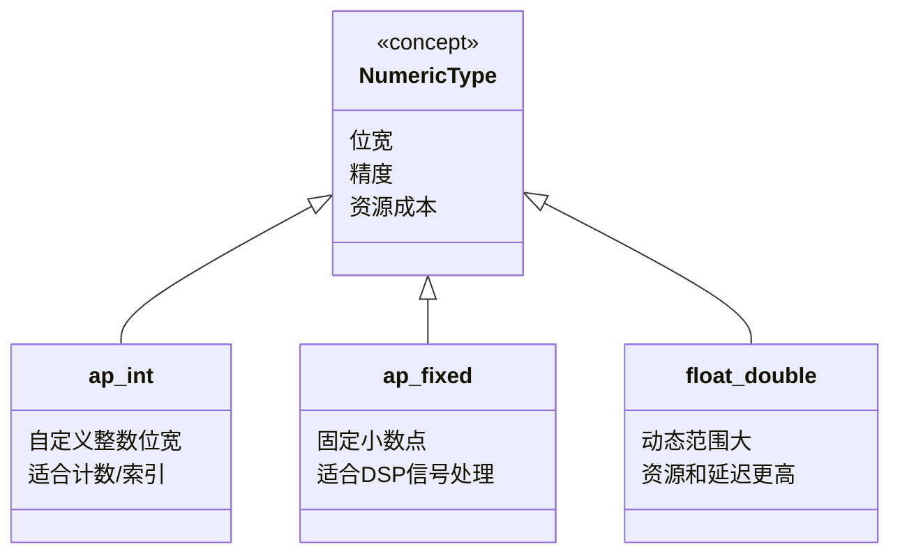
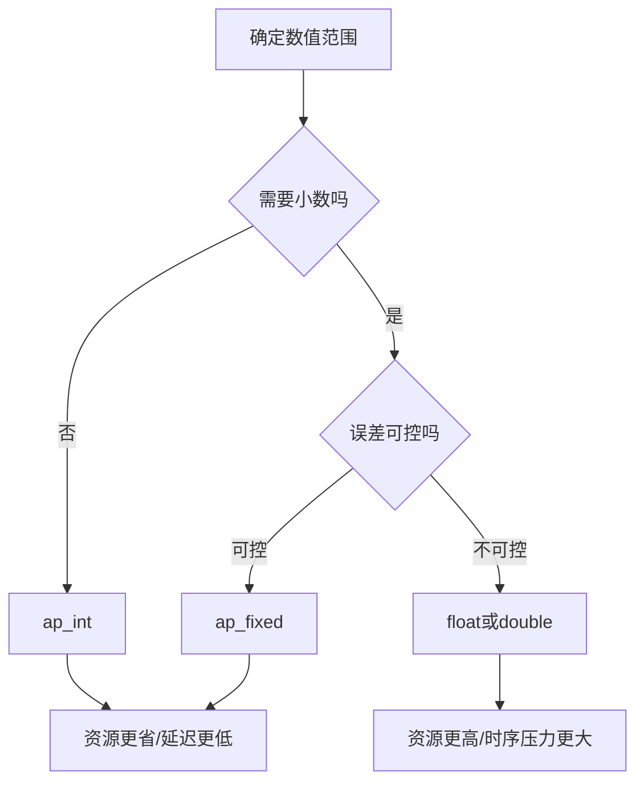
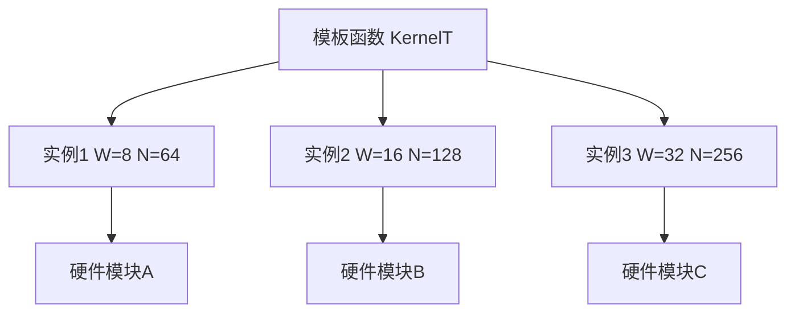
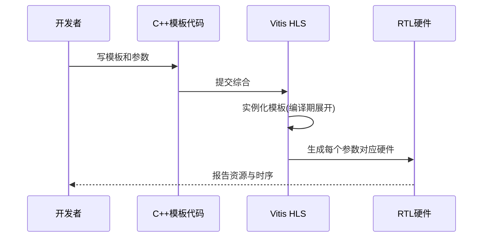
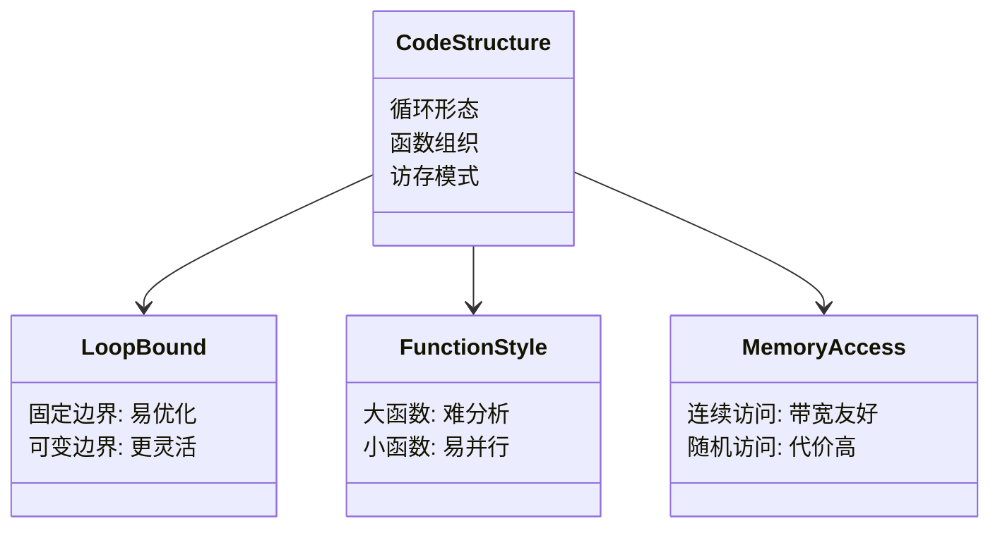
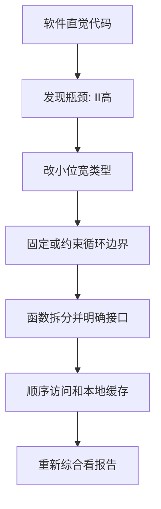
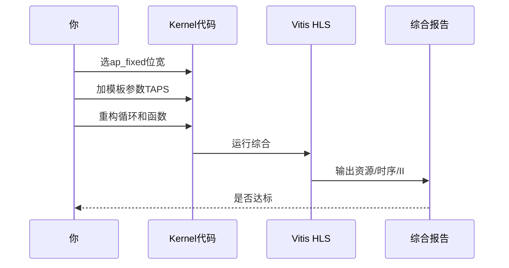

# Chapter 5：Coding patterns that synthesize well（写得好，硬件就长得好）

在前一章我们讲了“并行”。这一章我们讲“写法”。

Imagine 你在搭乐高城堡：图纸一样，但你选的积木大小不同、拼接顺序不同，最后城堡的稳固性和成本会差很多。HLS（高层次综合，意思是把 C/C++ 自动翻成硬件电路）也是这样。

---

## 5.1 先建立总心智模型：你有三个“旋钮”

- **数据类型旋钮**：决定每个数字占多少位（就像决定快递箱大小）。
- **模板旋钮**：决定代码在编译时如何“批量定制”（就像 TypeScript 泛型，但最后会做成实体硬件）。
- **结构旋钮**：决定代码组织方式（循环、函数、数组访问），也就是决定硬件交通路线。

这个图可以理解成“调音台”。  
You can picture this as 音乐制作：旋钮不同，最后音色（硬件质量）就不同。`coding_modeling` 这个模块就是给你这些旋钮的“示例预设”。

---

## 5.2 数据类型：别用“超大号行李箱”装一双袜子

`int`、`float` 在软件里很好用，但在 FPGA 里常常“太宽”或“太贵”。

### 5.2.1 关键类型怎么选

- **`ap_int<W>`**：任意精度整数（你自己指定 W 位宽）。
- **`ap_fixed<W,I>`**：定点数（总位宽 W，其中 I 位是整数位，小数点位置固定）。
- **`float/double`**：浮点数（动态范围大，但硬件代价高）。

Think of it as NumPy 的 `dtype`：`int8`、`int16`、`float32` 选错，性能和内存都会变。

这个关系图的意思很简单：三者都是“数字类型”，但性格完全不同。  
Imagine 你在选车辆：摩托车（轻快）、轿车（平衡）、卡车（强但贵）。

### 5.2.2 精度如何影响资源和时序

LUT（查找表，可以理解为小逻辑积木）、FF（触发器，一位寄存单元）、DSP（专门乘加计算块）、BRAM（片上小内存仓库）都会被类型影响。

这条流程像买相机镜头：先看拍什么，再看预算。  
不是说浮点不能用，而是要“有理由地用”。

---

## 5.3 模板：把“复制粘贴”升级成“自动模具”

模板（template，意思是编译时生成不同版本代码）在 HLS 里非常有价值。

Imagine 一个饼干模具：换个参数，就压出不同形状。  
这很像 React 组件传不同 props，但区别是：HLS 会把每个实例都“实体化成硬件”。

### 5.3.1 模板为什么适合硬件参数化

- 避免手写 `func8/func16/func32` 三份重复代码。
- 编译期就确定参数，硬件没有运行时分支负担。
- 多实例可以做“同算法不同规格”的并行模块。

这个图像工厂流水线：同一条设计图，出三种型号。  
Think of it as Express.js 的 Router 模板化路由规则，但这里输出的是硬件模块，不是 URL 处理函数。

### 5.3.2 “编译期发生了什么”

这段交互说明：模板不是“运行时魔法”，而是“编译时定制”。  
You can picture this as 下单定制家具：尺寸在工厂确定，送到家就是成品。

---

## 5.4 结构化编码：让 HLS 看懂你的“交通图”

同样的算法，结构不同，硬件差别很大。

结构化编码的核心是：让数据依赖清晰、循环边界清晰、访问模式清晰。  
Think of it as 你给施工队画施工图，标注越清楚，返工越少。

### 5.4.1 三个常见结构选择

- **固定循环边界**：循环次数在编译时可知，调度更稳。
- **函数拆分**：每个函数做单一职责，方便 pipeline（流水线：像装配线一样每拍推进）。
- **数组访问规律化**：连续访问更容易做高带宽。

这个图像体检报告：三项指标一起决定“硬件健康”。

### 5.4.2 从“软件风格”改成“HLS风格”

这里的 II（Initiation Interval，启动间隔）可以理解为“装配线每隔几拍接一个新任务”。  
II 越接近 1，吞吐通常越好。

---

## 5.5 一个迷你实战心法（对照 `coding_modeling`）

Imagine 你要做一个简单滤波内核：

1. 先用 `ap_fixed` 做数值预算。  
2. 再用模板参数化 `TAPS`（滤波阶数）。  
3. 最后用结构化循环 + 清晰数组访问写法。  

这个过程像调咖啡配方：豆子（类型）、磨度（模板参数）、萃取流程（结构）要一起调。  
不要一次改十件事，每轮改一个旋钮，最容易定位效果。

---

## 5.6 本章小结（可直接贴工位旁边）

- 数据类型先行：能用 `ap_int/ap_fixed` 就别默认 `float/double`。  
- 模板做参数化：减少重复代码，同时生成可控硬件实例。  
- 结构要“硬件可读”：边界清楚、依赖清楚、访问清楚。  
- 每轮改动后看报告：资源、时序、II 三件套一起看。

下一章我们会讲：**怎么迁移构建流程而不重写算法代码**。  
Think of it as 换了厨房（Vivado HLS / Vitis flow），但你的菜谱（C++ 算法）还能继续用。